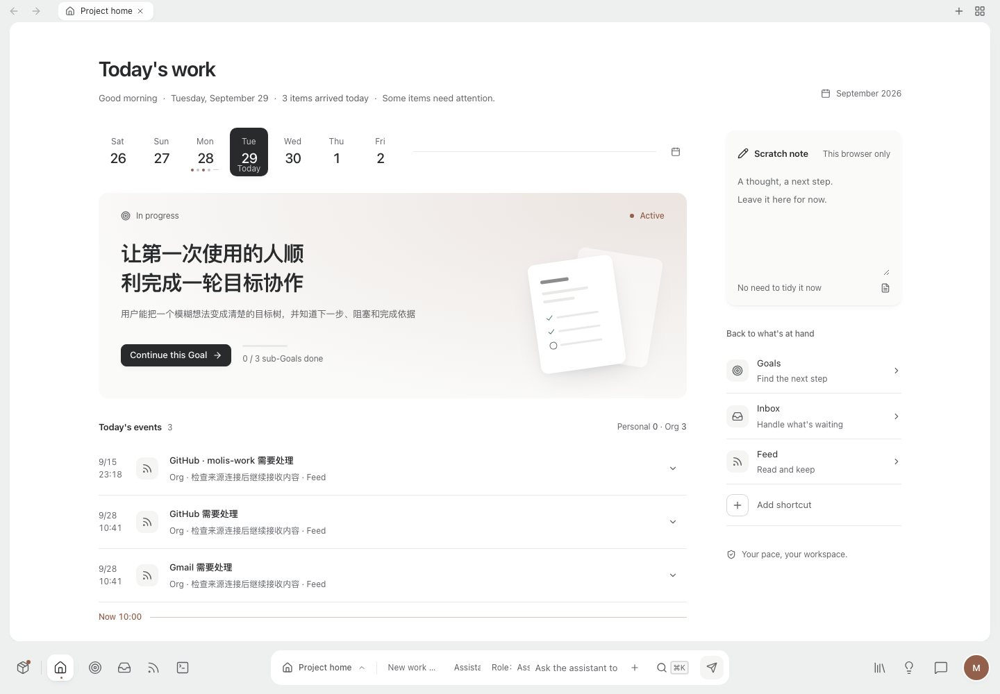
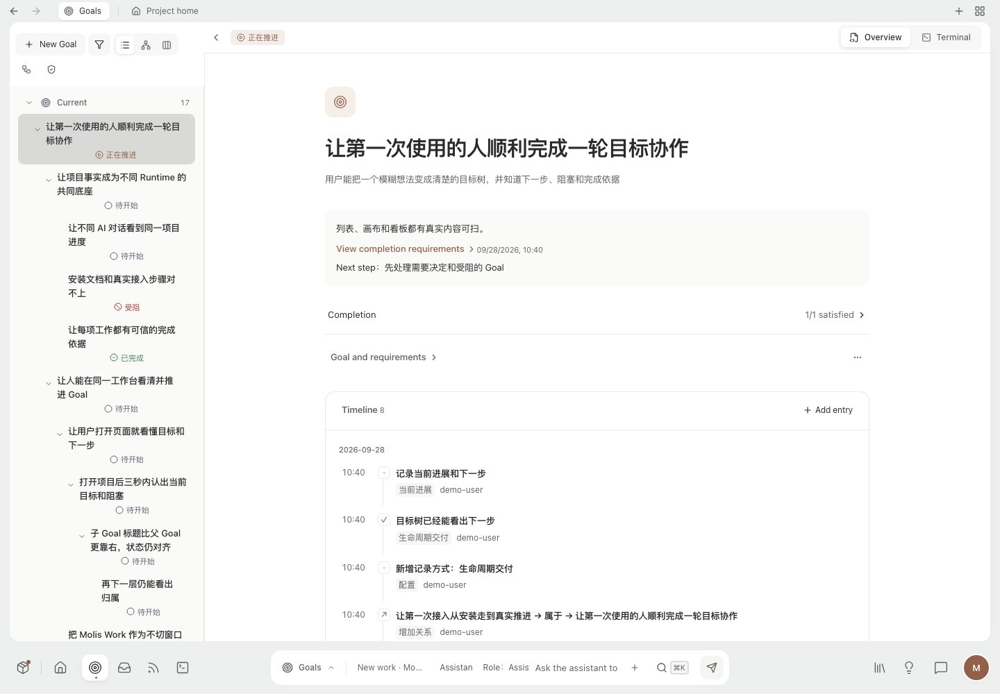
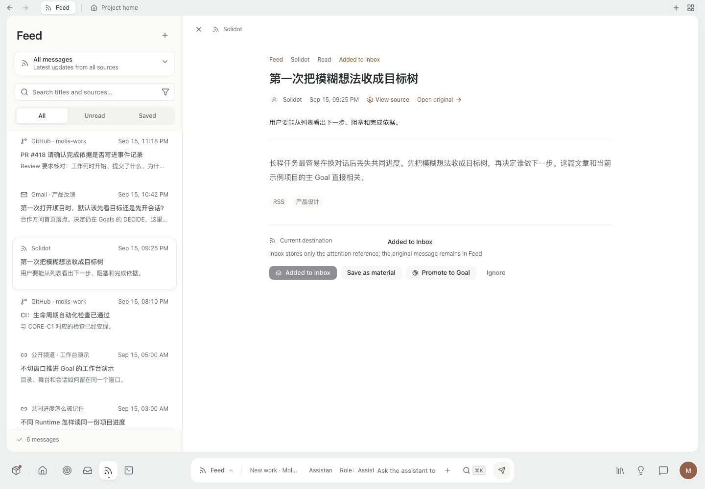
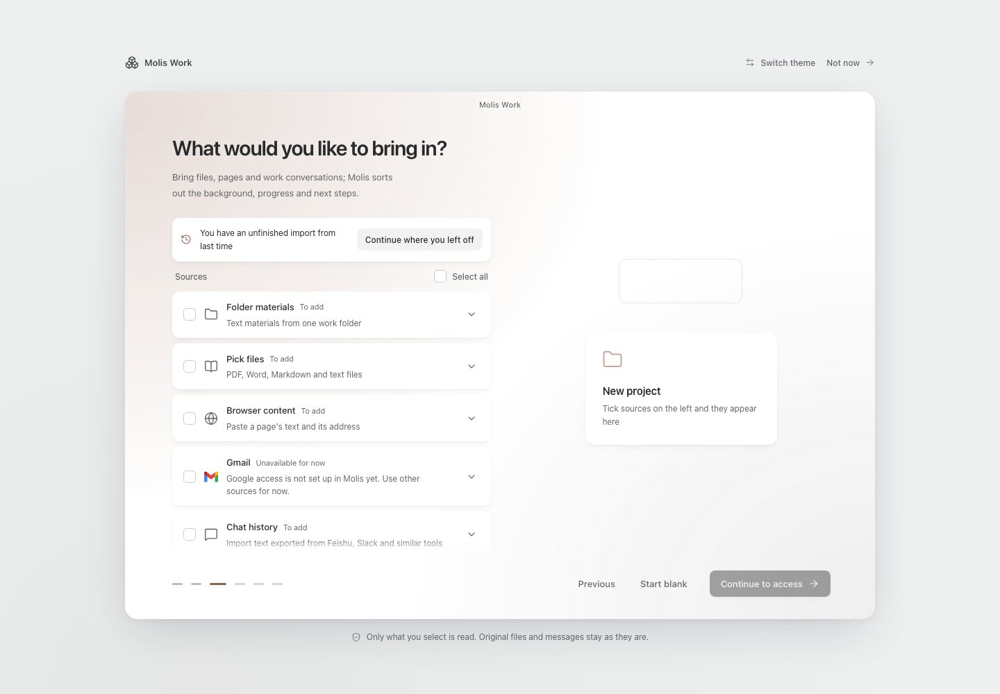
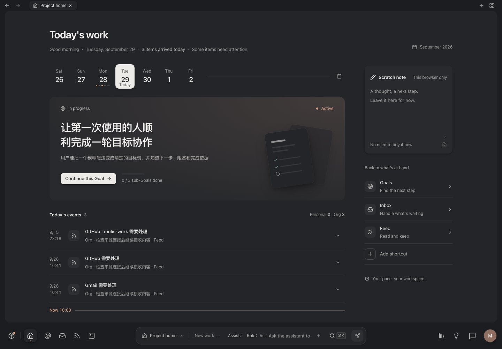
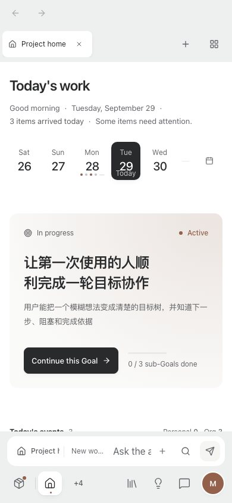

# Molis Work

**English** | [简体中文](README.zh.md)

Molis Work is a local-first work platform: a plugin base with many plugins, where you and the AI Runtimes you use work on the same goals, sessions, feeds, code, documents and calendar, each kept by the plugin that owns it.

The platform is one resident host per Home, a shared action catalog with grants, the plugin runtime, the workbench shell, and one AI runtime. Every project has Goals and can add Sessions, Inbox, Feed, Schedule, Artifacts and the Coding family as needed; personal plugins such as Jelly (calendar and notes), Todo, Pages, 灵光 and Cognia work in every project. Each plugin registers its capabilities once in the action catalog, where pages, the Assistant, workflows and external MCP clients call them as granted.

The Goals plugin is for a boring way long-running work fails: a new Session cannot see the last one, the original outcome drifts as local decisions pile up, and “done” is a sentence with nothing to check. What is missing is not a smarter model. It is one project record every Runtime can read: the accepted Goal, how it was split, what is blocked, and what counts as done.

Molis Work keeps that record locally. Codex, Claude Code, OpenCode, or another connected Harness updates the same Goal. You confirm material changes. You can see how far the work has got without asking the model to recap.

It does not ship a model: you configure models and keys in Settings, and plugins such as Coding, the Assistant, Schedule and the plugin studio run through the Home's one Prologue Runtime. External Harnesses still read and write through MCP; Molis Work does not dispatch work for you.

The longer derivation (WeChat article, link forthcoming): *[placeholder — 公众号文章待发布]*. Draft: [From conversational facts to ledger facts](https://github.com/adeptify/article/blob/main/AI%E9%95%BF%E7%A8%8B%E4%BB%BB%E5%8A%A1-%E4%BB%8E%E5%AF%B9%E8%AF%9D%E6%80%81%E4%BA%8B%E5%AE%9E%E5%88%B0%E8%B4%A6%E6%9C%AC%E6%80%81%E4%BA%8B%E5%AE%9E.md).

## Three ways to use it

Same project, three surfaces.

### Desktop

A native macOS window: focus one Goal, then open a terminal that stays bound to it. Molis Work also has a clickable **status icon in the macOS menu bar**. Click it for the current project, focused Goal, status, and next action.

<p align="center">
  
  
  
</p>

<p align="center">
  <sub><b>Goal workspace</b> · historical Goal-around-the-tree surface, not the current event document &nbsp;·&nbsp; <b>Goal-bound TUI</b> · the terminal belongs to this Goal &nbsp;·&nbsp; <b>Work Capsule</b> · a quick check-in from the macOS status item</sub>
</p>

### Inside a Harness

Open Molis Work in the Harness side browser and keep working in the same window. Narrow: the Goal list. Wider: the current Goal and its TUI.

<p align="center">
  <a href="docs/screenshots/showcase/harness-narrow-en-dark.jpg"></a>
  <a href="docs/screenshots/showcase/harness-runtime-en-dark.jpg"></a>
</p>

<p align="center">
  <sub><b>Narrow</b> · Goal list beside the conversation &nbsp;·&nbsp; <b>Wide</b> · current Goal and a TUI bound to it</sub>
</p>

### Web

The same local project in a browser. Desktop and Web share data under `~/.molis-work`.


These images show the workspace, Goal list, Goal-bound terminal, and macOS status item. They are historical product surfaces, not the current Goal event document. The current Goal opens as a document: title, outcome, the current status callout, requirements and the timeline, whose events expand in place; the terminal is one switch away in the header.

Built-in Runtime recipes cover Codex, Claude Code, OpenCode, Pi Agent, and Grok Build. Other Harnesses can use the same project through Molis Work's MCP server and shared Skill.

### The workbench today

<p align="center">
  
  
</p>
<p align="center">
  
  
</p>
<p align="center">
  
  
</p>
<p align="center">
  <sub>Captured from the current source with demo data. A pearl desk holds one continuous work surface; global navigation and the unified conversation live in the bottom bar. Every page shares one icon set, one type scale, four motion durations and a three-layer Dark mode. Visual spec: <a href="DESIGN.md">DESIGN.md</a>.</sub>
</p>

## Core features

Plain use, and the problem each one is for.

### One base, plugins as you need them

Every project has Goals; add Sessions, Inbox, Feed, Schedule, Artifacts and the Coding family in place from the plugin switcher, while personal plugins such as Jelly, Todo, Pages, 灵光, Cognia and Shelf work in every project. Each plugin's capabilities are registered once in the shared action catalog, where pages, the Assistant, workflows and external MCP clients call them as granted. The sections below are the Goals plugin.

### See the Goal, what is done, and what to do next

Open a Goal. The page should answer three questions without reading the chat: what we are trying to get, what is already done, and what to do next. A parent Goal can record its own integration or acceptance. The number of child Goals does not prove the parent is complete.

### See who depends on whom

The Graph is for when the list is no longer enough. Parent/child describes structure. If B needs A's result, that dependency matters when B is formally completed; B can still record preparation and partial work. When a requirement changes, you can see which downstream work is affected instead of re-explaining the whole tree.

### You confirm material changes

A Runtime can propose new work or a new dependency as a structure proposal and can record a concern that blocks completion. It cannot quietly replace an agreed outcome or weaken its requirements, and it cannot fill in a user identity. Trusted user decisions are recorded in Host Web or the management entry. The Decision Center puts the question, why it matters now, the evidence or the gap, and what each choice changes in one place.

### Keep the terminal on the Goal

Open Codex, Claude Code, or a custom command from a Goal. That terminal stays owned by that Goal — switching Focus later does not silently reassign it, and Molis Work does not auto-send. A parent Goal can still record integration work; it does not become “done” just because its children exist.

On macOS, the same current Goal is also on the **top menu bar**. Click the Molis Work status icon for the project, the focused Goal, its state, and the next action; click away and the panel disappears.

### Treat “done” as something you can check

Completion is not a sentence in chat. Ordinary reports save partial results and sources. Support, counter-evidence, or unknown only update the related requirements; ordinary support does not complete the Goal. An explicit close-out checks the current agreement, real support, and applicable blockers. Recorded is not the same as completion applied. Work can continue with no requirements yet; it cannot claim done.

Requirements can optionally require human acceptance. A Runtime report cannot replace that decision. Completed or cancelled work can explicitly resume with a reason; adding an unrelated note does not silently reopen it.

If something new shows up while you work, attach an ordinary note with **Add entry**. Changes to promises, authorization, or completion requirements go through the event form or a trusted user decision, not a silent rewrite.

### Tell the Runtime how this project should be split

A new intent can be saved without a plan or type, then followed by an ordinary note. Register local types when structured results help. Planning methods are optional: they offer types and default requirements you may adopt. The adopted version and this Goal’s local changes stay; later template edits do not change old meaning. Methods are not a task template and they do not auto-build the tree. A project can combine a work-type method and a domain method. Tree changes are still a proposal you confirm.

### Connect a Runtime on purpose

With no Runtime connected Molis Work is still a full workbench: plugins work as usual and Goals can be advanced by hand. Connect Codex, Claude Code, or another tool only when it should read and advance project work directly. Integration configuration changes are previewed and applied after confirmation; a failed apply rolls back. Ordinary Goal notes and reports follow your existing work authorization. After connecting, open a **new Session** — tools load at Session start.

## Try it in 3 minutes

### macOS Desktop (recommended)

Download the DMG for your Mac from [GitHub Releases](https://github.com/molis-ai/molis-work/releases):

- Apple Silicon (M1/M2/M3/M4…): `macos-arm64`
- Intel Mac: `macos-x64`

Open the DMG, drag Molis Work into Applications, and launch it. Desktop includes Node and the Molis Work Runtime. On first launch it installs Core into `~/.molis-work` and starts the same local workbench, without requiring Node, pnpm, or a repository checkout. App upgrades do not rewrite existing projects or history.

Development builds that are not signed with Developer ID and notarized by Apple still trigger Gatekeeper and require explicit approval in System Settings → Privacy & Security. The release workflow produces signed and notarized artifacts once the repository has the Apple credentials.

### Run from source

You need Node.js 24+, pnpm, and macOS (the persistent Web service currently uses LaunchAgent; other platforms can run Web in the foreground).

```bash
git clone https://github.com/molis-ai/molis-work.git
cd molis-work
pnpm install --frozen-lockfile

# Build and install into ~/.molis-work
pnpm install:local

# macOS: install the persistent Web service
"$HOME/.molis-work/bin/molis-work" service install --home "$HOME/.molis-work" --confirm

# Create a rebuildable demo kept separate from user data
"$HOME/.molis-work/bin/molis-work" demo create --confirm
```

Open `http://127.0.0.1:4173` and enter the demo project. In “Settings → AI & execution tools,” preview and confirm an integration, then **open a new Runtime Session**:

> Use Molis Work to connect to the demo project, open a Goal, and tell me the current judgment, what is already done, the next step, and the completion requirements.

Runtimes read MCP and Skill manifests at Session startup, so a newly connected Runtime needs a new Session.

### One-command start (development)

`Start.sh` in the repository root is the daily entry for a checkout: it first cleans up leftover Molis Work processes (the resident LaunchAgent service, an old Web on port 4173, a running desktop app), installs dependencies and rebuilds when build artifacts are missing or older than the sources, then launches the desktop app — its Web UI is served straight from the freshly built repository `dist`, so a restart picks up your code changes. An interactive terminal gets a step-by-step wizard (pick the target, confirm cleanup, confirm rebuild); scripted runs can skip the wizard with flags.

```bash
./Start.sh              # wizard; starts the desktop app by default
./Start.sh --web        # Web service only, opens the browser
./Start.sh --build      # force a rebuild before starting
./Start.sh --no-clean   # skip cleanup
```

### Build, install, and start macOS Desktop

```bash
# Run the development app from source
pnpm desktop

# Build a DMG and App zip for the current architecture
pnpm desktop:build:macos

# Install the freshly built DMG into ~/Applications and launch it
pnpm desktop:install:macos

# Start the installed app later
pnpm desktop:start:macos
```

Each architecture ships separately because Molis Work's SQLite and PTY native addons must match both the bundled Node runtime and the Mac CPU. The release workflow is currently manual-only (the automatic `v*` tag trigger is paused); it builds Apple Silicon and Intel DMGs separately, and the public Release is published only after signing and notarization succeed. Credentials are read only from GitHub Secrets and never committed to the repository.

## Product boundaries

- Content is stored in local SQLite under the Home (one database per project, and Home-level databases for personal plugins); Molis Work does not bundle a model.
- Opening a page does not bind a Session, start a Runtime, or send a command.
- Runtime integration, terminal launch, and accepted Goal changes require explicit action or confirmation.
- All current work uses event records. A project database has one current schema and is refused, never upgraded in place, at any other version; old Claim/Run/Evidence/Review history, V3 import and old-database upgrades have been removed.
- Molis Work is a plugin base and its plugins: each plugin manages its own facts (Goals manages Goals and their closure); it does not replace a Harness or Agent Orchestration.
- v0.2.0 introduced the event workflow and retired the legacy Runtime write protocol ([release notes](docs/releases/v0.2.0.md)); main has since removed the old-database upgrade path, so a project database at another version is refused and those upgrade steps no longer apply. Public macOS installers remain pending Developer ID signing and Apple notarization.

## Further reading

- [Architecture SSOT and migration ownership](docs/SSOT-MATRIX.md)
- [Install & Maintenance](docs/installation.en.md)
- [Runtime Protocol](docs/runtime.en.md)
- [MCP Integration](docs/mcp.en.md)
- [CLI & Development](docs/cli-and-development.en.md)
- [Runtime Skill](skills/goal-advance/SKILL.md)
- [Plugin 开发 Skill](skills/molis-plugin-dev/SKILL.md)
- [Molis Work Bug Card Ledger (Chinese)](docs/molis-work-bug-cards.md)

## License

MIT, see [LICENSE](LICENSE).
