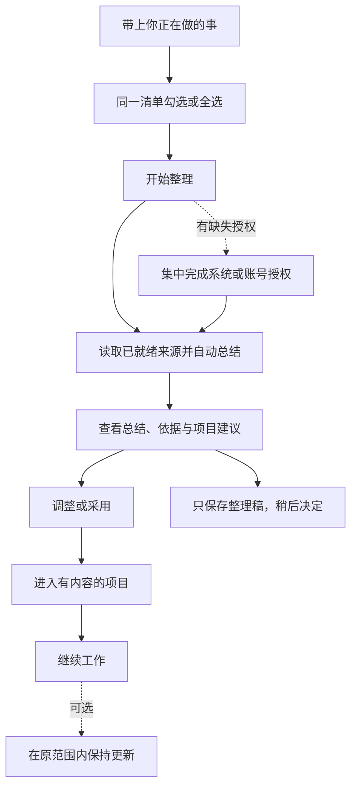

# Molis Work：从已有工作开始的 Onboarding 与项目创建

日期：2026-09-24。状态：修订概念方案，待讨论；未修改产品代码，未运行真实个人数据导入。

已确认方向：面向更广泛的个人工作用户。首次使用的核心是，用户通过一张来源清单直接勾选或全选，统一开始读取所示范围的文件、浏览器内容、邮件或 IM，Molis 自动整理这些材料，形成能继续工作的总结。本文替换此前以创建空文档、默认空项目为主的方案；低门槛开始、可恢复和清楚的数据归属继续保留。

## 1. 产品承诺与首次价值

**把已经发生的工作带进来，Molis 帮你理出头绪，并准备好下一步。**

第一次打开时，用户往往已经有文件、网页、往来邮件和讨论记录。让用户重新填写项目描述，会把梳理和搬运工作又交回给用户。新的主线应当是：

**勾选或全选来源清单 → 一次点击开始整理 → 自动形成带来源的工作总结 → 调整或采用项目建议 → 进入有内容的工作台。**

首次价值是“这些材料已经被理解和组织，我知道现在可以从哪里继续”。选中一个来源就能走完整条流程，不要求接齐文件、浏览器、邮箱和 IM。

总结是核心交付，即使用户暂不建立项目，也能保留整理稿、查看来源、继续补充材料。手动空白创建仍作为次入口，不占据默认主线。

## 2. 首次使用的完整动线

### 第一屏：一张清单，一次开始

把来源选择、默认范围和开始动作合并到同一屏。用户直接勾选需要的内容，或点“全选”，无需逐个进入来源详情再确认返回。

以下为界面示意，来源、账号与可用状态需要按真实探测和授权结果呈现：

> **带上你正在做的事。**  
> 勾选想让 Molis 整理的内容，帮你理清背景、进展和下一步。
>
> □ **全选**
>
> □ **本地文档**　文档文件夹中的支持格式　〔调整〕  
> □ **项目资料**　已知的项目目录　〔调整〕  
> □ **浏览器内容**　当前标签页与书签　〔调整〕  
> □ **邮件**　所选账号 · 最近 30 天　〔调整〕  
> □ **聊天记录**　所选账号可访问的会话 · 最近 30 天　〔调整〕
>
> 本次整理所选范围；AI：当前可用的模型服务。  
> **〔开始整理〕**　〔用示例体验〕　〔空白开始〕

每行带一个可用的默认范围和一行真实连接状态；“调整”展开行内设置，属于可选操作。用户无需逐份挑选文件、逐封勾邮件或逐个勾会话。邮件/聊天最近 30 天是提案默认值，清楚展示并允许批量修改；并非已验证的最优范围。没有已知项目目录时显示“添加目录”，没有账号时显示“待连接”，不伪造已经发现的个人内容。

“全选”选中清单里所有可直接使用或能够在本流程连接的来源，包含各行明确展示的默认范围。它不表示所有磁盘、所有账号或无限历史；尚未支持的来源不可选，并说明原因。全选不覆盖用户已经调整的子范围；取消单项后，父级显示部分选中。只选一个来源也可以直接开始。

清单来自应用已知目录、现有连接和获准读取的来源信息。准备清单不预读私人正文、不偷偷登录；必须授权后才能列出的账号、目录或会话，在该行如实显示待连接。浏览器标签页/书签等也只有实现了相应采集能力才成为可选项。

用户不必先命名项目或写目标。可以补一句“这批资料大致是关于……”，涉及多个主题也可以直接继续。

### 同一次流程中处理缺少的授权

点击 **「开始整理」** 就是对当前清单范围及已说明 AI 处理的统一操作。已就绪来源直接进入读取和总结，Molis 不再弹第二份总确认，也不逐文件、邮件或会话询问。

操作系统目录权限、浏览器采集权限和不同服务商的登录，可能必须由对应系统或服务分别完成，应用里的全选不能替代这些必要授权。产品把它们组织成同一条可恢复队列：只处理缺少的授权，完成一项自动进入下一项，始终保留整张清单；已有可用连接直接复用。同一账号需要多个已选来源时，合并服务支持合并的授权请求，不重复登录。

用户可以跳过某一项，其他已就绪来源照常整理。被拒绝的来源在本轮不自动反复弹窗；结果明确列出未读取部分，随时可以从原位置补连后继续。不能因为清单里只有一项尚未授权就把所有来源都挡住。

清单底部直接显示本次为一次性整理、实际使用的模型服务，以及外部模型会接收所选正文的简短说明。范围细节、附件、格式支持和规模限制按需展开；数量只能来自真实枚举，未读取时不假造统计。

AI 是默认总结链的必要依赖。已有可用模型直接复用；没有时，在同一准备流程完成最短可行配置和检查。可以“先导入，稍后整理”，但必须如实标注总结未完成。模型配置就绪不自动开始发送，仍由统一的开始动作覆盖当前选择与处理方式。

初次不要求用户接入 Codex/Claude CLI。材料总结优先走产品现有文字模型能力，Runtime 只在确有执行需求时出现。

### 第二屏：整理过程中已经可以看到结果

在同一个工作面显示真实阶段与覆盖情况：正在读取哪些来源、哪些已经可读、哪些正在整理、哪些失败或跳过。按完整的小批内容逐步产生初稿，标明“仍在整理”，不把部分读取包装成全部完成。

用户可以查看已读材料、停止剩余读取、只重试失败来源，或先基于成功部分继续。某个账号连接失败不阻止其他已授权来源。离开再回来能恢复批次和整理稿，无需重选全部材料。

大量材料需要明确的数量/体积/模型预算和分批策略。首轮优先处理用户选定的有限范围；如果仅分析了其中一部分，说明分析覆盖与剩余部分，不暗中抽几份却声称读完。

### 第三屏：先展示理解，再让用户采用

结果页回答四个问题：

1. **这里有哪些工作主题？** 给出主题分组及其相关材料，不凭同名词就合并不同客户或项目。
2. **每件事目前是什么情况？** 总结背景、已发生的决定、最近进展和仍不确定之处。
3. **有什么可能需要处理？** 从明确内容中提取未解决问题、待回复、承诺和时间点；AI 推断单独标记为建议。
4. **在 Molis 里怎么继续？** 建议建立哪些项目，或放入哪个已有项目，并给出具体开始动作。

每个重要判断都能打开实际来源，定位到文件段落、网页内容、邮件或消息及其时间。材料中出现相反信息时并列说明，不自动选择一个版本作为最终事实。旧邮件的“请周五回复”不能直接变成今天的待办；有截止日期也必须保留年份、时区或歧义提示。

以下为设计示例，数字和内容均为假设数据：

> **根据你选择的材料，整理出了两件正在推进的工作。**
>
> **秋季产品发布**  
> 发布文案已有一版；时间安排在后续邮件中发生变化；网站截图是否更新尚不明确。  
> 依据：需求文档、邮件往来、选中的发布页面。  
> 建议先做：核对最终发布日期，再整理发布清单。  
> 〔查看依据〕〔修改归类〕〔建立项目〕
>
> **客户方案准备**  
> 已有客户背景与演示草稿；聊天中提到的新需求尚未在方案中找到。  
> 依据：方案文件、选中的讨论记录。  
> 〔查看依据〕〔加入已有项目〕
>
> 还有少量材料未能确定归属，可以先留在资料中。

不要求用户逐句审核总结。用户可改名、合并/拆分主题、排除材料、纠正判断；只对会明显改变项目归属或下一步的歧义提出一两个就近问题。未经确认的“可能要做”保留为建议，不自动成为正式 Goal、已接受承诺或已完成状态。

### 第四屏：进入已经准备好的工作现场

用户采用某项建议后，项目至少带上：

- 一份可编辑、标明生成时间与资料覆盖的工作摘要。
- 选定材料的来源与可读快照/有效引用，保留其原始归属。
- 用户选择保留的待处理建议；只有明确采用为目标的内容进入 Goals。
- 一项明确的继续动作，例如“修改发布文案”“核对待确认事项”或“补充缺少的资料”。

采用可以直接使用建议项目名，允许当场改名；无需回到创建向导重新填一次描述。用户也可以只保存整理稿，或者将其中一部分加入已有项目。

## 3. 后续项目创建与首次流程共用能力

“新建项目”默认提供 **「从已有材料开始」** 和次入口 **「空白开始」**。

已有材料路径复用同一张可勾选/全选的清单、必要授权队列、总结和采用过程，首次使用的品牌介绍不再重复。用户已经有名称时，可以提前填写；只有材料时，由 AI 建议名称与初始摘要。

已有项目提供“补充材料并更新总结”：可以读取新选择的来源，展示这次带来的新事实、变化与未解问题，用户选择如何加入。更新不能覆盖用户已编辑的摘要，也不能把旧总结推断直接写成新的正式约定。

一次性导入完成后，再提供可选的“保持这部分工作更新”：说明来源范围、频率和处理方式。持续更新沿用相同授权范围；新增账号、目录或群聊不自动纳入。自动读和自动总结不包含回复邮件、发 IM、修改原文件或自动执行建议。

## 4. AI 的职责、输入与结果归属

AI 的角色是根据选定证据建立工作上下文，找出相关主题、状态、矛盾、缺口和可行动建议。它不能通过 Onboarding 自行扩大访问范围。

输入包括用户授权的内容快照、来源与时间、明确给出的用途，以及用户在本轮做过的归类纠正。文件和消息中的命令文字都是资料，不能变成运行指令。

输出分为原始材料、整理草稿与项目建议三层。用户采用后，再通过现有内容 owner 建立项目摘要、材料关联或 Goal；生成结束不等于用户已接受所有结论。

使用现有导入、来源与引用能力，不建立另一套通用知识库。Cognia 可承接个人材料和整理草稿；项目仍是正式组织边界。邮件/IM目前的 Feed 路径依赖项目，首次创建前的读取需要补齐临时导入批次与后续归属交接，不能悄悄先造一个虚假项目来绕过。

跨来源总结需要稳定来源标识和版本、时间、正文完整性、原始链接/定位信息；文档、网页、邮件线程与聊天线程先按自己的结构读取，再进行跨来源归类。不能只把标题或摘要拼起来当作已理解全文。

## 5. 读取范围与信任体验

这些约束应表现为少量可理解的产品操作，而非长篇协议：

- 本机文件只读用户选择的范围；排除密钥、隐藏配置和缓存等非工作内容，目录链接不能绕过边界。网页只采集用户选择的内容，登录页或不可读页面如实标记。
- 提供商授权范围和本次产品读取范围分别展示。OAuth 权限较宽时，不声称令牌权限也缩小到了某个标签；应用仍必须在读取入口执行用户选择的过滤。
- 浏览器选项首期可从选中网页/标签组和显式导出开始。书签/历史只有标题与 URL 时，只能用于发现候选；实际正文未获取就不能作内容证据。登录后页面需要用户授权的浏览器采集能力，不导出 Cookie 来绕过。
- 默认只做本次读取。取消/撤销会停止后续读取；已保存副本与已经发出的模型请求分别说明，不能承诺外部已接收内容被撤回。允许删除本地导入批次，并说明已经采用的项目内容如何处理。
- 摘要、来源覆盖、失败/跳过原因始终可看；链接能打开只证明引用存在，重要结论是否受原文支持仍需相应校验和抽查。

## 6. 当前能力与真实缺口

以下为本轮静态源码核对，不代表第三方真实账号与完整新流程已经验证。

| 能力 | 当前依据 | 对本方案的含义 |
| --- | --- | --- |
| 本地材料导入与固定版本 | Cognia 已支持 Markdown/文本目录、预览、导入、来源版本与重试 | 可以复用；PDF/图片目前作为附件保存，不能直接承诺正文分析 |
| 带来源 AI 总结 | Cognia 已支持 1–5 份文本综合、引用草稿、审阅保存，输入总字符有上限 | 小范围首轮已有基础；批量跨来源总结、项目识别和覆盖管理需要新增 |
| 文档格式导入 | Pages 支持 DOCX、Markdown、HTML、TXT 等转换与预览 | 可复用解析能力；需接入统一整理流程，不能假定 Pages 文档已自动进入 Cognia |
| Gmail | 已有 OAuth、邮件正文读取与 Feed 接入 | 可复用连接和读取；本次选择器、时间/线程范围及增量过滤需按新契约核实和补齐 |
| Outlook | 当前 catalog 读取邮件列表与 bodyPreview | 还不足以证明能完整总结所选邮件线程 |
| 飞书 / Lark / Teams IM | 当前 catalog 多为列会话；飞书 CLI 白名单没有消息正文读取接口 | 已连接账号不等于已支持聊天历史总结，需要正文/线程、分页、范围和权限能力 |
| 浏览器内容 | 本轮未发现独立的标签组/书签/历史正文采集链路 | 需要新的采集适配；粘贴链接、导出文件、授权采集应分别定义能力 |
| 从总结建立项目 | 已有纯项目创建、Pages/Goal 等内容能力 | 还需把导入批次、整理稿与项目采用接起来，并处理部分成功与重复请求 |

主要源码依据：`plugins/native/cognia/src/ai.ts`、Cognia README；Pages README；`plugins/official-integrations/gmail/src/provider.ts`；`plugins/official-integrations/catalog/src/catalog.ts`；`apps/local-host/src/feishu-cli.ts`；既有项目创建与 onboarding 路由。

## 7. 落地顺序与验收

先用 **“来源清单勾选 → 一个真实材料目录 → 自动总结 → 调整归类 → 建立有内容的项目 → 重开继续”** 做完整高保真切片，同时覆盖全选/取消部分、行内范围调整、缺少授权队列与部分跳过状态。文件路径能验证核心价值，但不能代替浏览器、邮件和 IM 的完整目标。

随后验证真正的跨来源用例：同一件事的文档、网页、邮件、聊天里分别包含不同信息，摘要应能发现相互补充和冲突，并保留每个判断的实际来源。各适配器按能力分别接入；未接通的来源在产品中如实显示，不用连接器图标冒充可用。

必要验收：

1. 用户可直接勾选或全选后统一开始；默认无需逐项进入详情、逐文件选择或重复确认。只选一个来源也能完成读取、总结、采用与继续，不需要先手工写项目描述。
2. 只能读授权范围；账号权限较宽、分页和目录链接也不能扩大本次读取。
3. 总结能反映选定资料中的真实事实、时间与矛盾；不把建议写成用户承诺，不从未读正文推出结论。
4. 项目保留可编辑摘要及真实来源，用户能从总结回原文，并在重开应用后继续。
5. 模型不可用、授权过期、部分文件失败、大批超限、取消和重启都有明确恢复；重试不重复导入或建项目。全选只覆盖清单显示范围，已有连接不重复授权；跳过或拒绝一个来源不阻塞其他来源，未读取部分在总结覆盖中可见。
6. 几位未参与开发的用户带入自己愿意授权的材料，能够辨认“总结哪里对、哪里不对”，完成一项纠正并开始实际工作。

时间与成本目标应在真实材料测试后设定，先分别测量授权耗时、第一份有用总结出现时间、资料覆盖、采用前纠正量与后续继续使用情况。四类来源的接入数量和“授权成功”都不能单独作为 Onboarding 成功。

尚待具体实现验证：浏览器采集方式与首期支持范围、首个完整 IM 正文适配、批量总结策略、各模型的可用性与成本。它们影响实现顺序和可发布范围，不改变本方案的核心动线。本文为概念方案，生产实现前仍需收敛为 accepted spec。

## 8. 高保真原型

2026-09-24：已按后续要求制作[可交互原型](prototype/README.md)。覆盖一张清单、全选与行内范围、模拟连接失败/恢复、来源关联总结、采用项目、空白创建与后续补充材料。可运行入口为 `http://127.0.0.1:4336/`，启动方法见原型 README。

这一轮完成等级为可交互原型：所有资料、授权和模型均为演示，没有真实读取或生产流程接线。原型的唯一范围见 `specs/molis-work-onboarding-prototype/spec.md`，不代替上文的真实数据验收。
