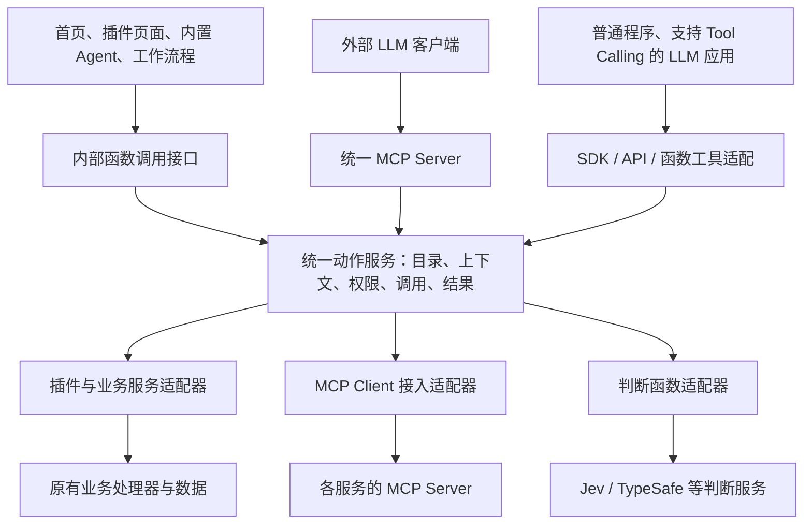

# 统一动作服务：能力接入、函数调用、MCP 与用户流程

状态：执行中。目标为内部完整；2026-09-25 启动全量能力迁移与旧实现清理。

执行授权：实现本规格的完整架构与产品路径，迁移全部存量插件对外、跨模块及工作流程使用的能力，并清理被替代的实现。以实际调用、持久化结果、生命周期及产品实操为验证证据；完成程度为「内部完整」。进度与逐插件盘点见 [migration.md](migration.md)。

2026-09-25 用户补充：各服务的 MCP 属于动作服务的接入范围；支持 Jev 这类结构化判断函数调用；动作服务本身提供 MCP Server，让常规 LLM 客户端也能使用。此前仅围绕首页按钮抽取动作的边界据此扩大。以下定义完整目标；已实现及未实现部分以 migration.md 的证据为准。

2026-09-25 产品层级决定：去掉 Functions 独立插件，将其判断能力归入内置的系统级动作服务；服务入口与 Character、全局设置放在同一个岛。此决定替代此前保留 Functions 独立页面/导航的建议；已纳入全量实施授权。

2026-09-25 基本要求：插件开发时可注册能力，能力发现与配置选项自动生成；工作流程、函数「可用在哪／已用在哪」等场景必须完整、准确。此项属于首期基础合同和验收门槛，不是后续增强。

## 1. 用户只需要理解什么

**看到一件事 → 选择下一步 → 得到结果。**

首页集中呈现事情和可做的下一步。插件提供具体能力。判断规则帮助选择下一步。工作流程把多步处理串起来。用户可以直接使用默认动作，需要重复处理时再配置规则或流程。

动作服务是产品各入口共用的能力底座，统一接入插件、业务服务、外部 MCP 和判断函数。查询内容、获得判断和执行操作都可以调用；首页展示其中适合当前事情的部分。用户也可以在其他支持 MCP 的客户端连接同一个服务，使用自己授权范围内的这些能力。

例子（目标体验）：首页出现一条客户反馈，用户点「加入待办」，得到待办链接；也可以点「整理为文档」，看到处理进度和生成的文档。后者是说明目标结构的示例，不表示现有首页已经具备该能力。

## 2. 当前混乱的具体来源

以下记录启动重构时的问题与代码依据；已迁移部分的当前状态以 migration.md 和本规格后面的实施记录为准。

| 当前事实 | 对产品和维护的影响 | 方案 |
| --- | --- | --- |
| Host 收集插件 behaviors 和 MCP exports，但首页另有固定动作名单及逐项点击分支 | 能力出现在目录中，不代表能从首页使用；新增能力需要多处接线 | 可面向用户执行的动作有完整定义和处理器，界面根据动作描述呈现 |
| Functions 产出建议动作 ID，实际执行散在页面和 Host 中 | 推荐与执行之间缺少共同的输入、结果和可用性约定 | 推荐引用动作定义，执行再次验证并调用同一处理器 |
| 发布函数与启用场景分开，用户需要跨页面理解绑定关系 | 简单的“改变首页建议”被暴露为内部配置过程 | 首页就地配置「下一步建议」，规则库承担复用和高级编辑 |
| Functions 插件是 TypeSafe 判断；工作流程的 Function 是本地模板替换 | 同一个词代表不同机制 | 用户界面区分「判断规则」「模板转换」「AI 整理」「人工交接」 |
| 首页「问问怎么回事」目前只是打开对象；「说一句」提交未传递文本和可靠事件绑定 | 动作文案承诺与实际结果不一致 | 名称对应真实行为；问询完整携带原对象及用户文本进入 Session |
| Actions 目前只有 contract-only 定位；Execution 模块主要读取历史记录 | 容易把规划中的执行层或历史模块当成现成实现 | 明确本次收敛范围；复用可用的注册、权限和插件处理器，按真实用例实现动作协调 |
| 已有对外 LocalMcpServer 汇总平台及插件工具，Agent Host 另有外部 MCP 连接与工具采用路径 | 内部 Agent 接入了某个 MCP，不代表统一服务或外部客户端能使用它 | 外部 MCP 接入与统一能力目录衔接，内部和外部调用共享核心分发 |
| 工作流程 Host 使用 SUPPORTED / BLANK_START 名单并按插件 ID 分发，函数目的地由固定列表生成 | 新插件注册之后仍可能漏出现在配置中；名称能选中也不证明实际调用已接通 | 插件注册能力及实际消费入口，所有目录和选择器从共同合同与运行状态派生 |

代码依据：

- [行为目录](../../apps/local-host/src/behavior-catalog.ts)、[首页白名单](../../packages/contracts/src/modules/functions.ts)、[首页点击处理](../../apps/workbench/src/scripts/client/project-home.ts)。
- [判断触发](../../plugins/native/feed/src/application.ts)、[判断服务](../../modules/functions/src/service.ts)、[判断模型调用](../../modules/functions/src/provider.ts)、[判断结果投影](../../apps/local-host/src/web-view.ts)。
- [工作流程模板转换](../../plugins/native/workflows/src/model.ts)、[Actions 定位](../../docs/modules/actions.md)、[历史 Execution 边界](../../modules/execution/README.md)。
- [现有对外 MCP Server](../../apps/local-host/src/mcp-server.ts)、[MCP 目录](../../apps/local-host/src/mcp-catalog.ts)、[协议适配](../../apps/mcp/src/protocol.ts)、[Agent 外部 MCP 接入](../../horizontal/agent-host/src/adapters/prologue-mcp.ts)。现有协议入口的 resources/list 返回空列表，不能把宣告支持 resources 视为内容已经打通。
- [工作流程手写支持名单与分发](../../apps/local-host/src/workflows-native-plugin-http.ts)、[函数固定目的地](../../packages/contracts/src/modules/functions.ts)。它们是此次必须替换的扩展障碍。

## 3. 架构中的职责



这些是职责边界，不要求各建一个进程或独立部署服务。先在现有本地应用内收敛模块和接口。

### 服务的两面：接入能力，提供调用

对内，动作服务通过适配器使用插件、已有 API、外部 MCP Server 和判断模型。对外，它提供统一函数调用接口及 MCP Server。MCP Client 和 MCP Server 是两个方向的适配，共享中间的目录、权限和执行逻辑。

同一能力只保留一个规范定义和实际处理器映射；不同入口可以有不同可见范围和名称适配。现有内部直接函数调用不必绕一圈 MCP 网络协议。已有对外 MCP Server 逐步改为调用共同核心，不新增另一套业务执行服务。

Host 的既有 typed capability 与新动作服务共用同一个 Kernel registry。项目调用继续使用现有 Runtime 生命周期、串行调用和关闭等待；可信身份与业务 Runtime 由 Host 在调用期间关联，不能放入模型参数。相同插件在不同项目的激活允许复用公开能力 ID/版本，注册实例以可信项目作用域区分；全局与项目同名能力不得互相遮蔽。项目关闭或插件停用时撤回对应实例，其他项目不受影响。旧的内部客户端默认没有额外授权；需要权限的能力必须由 Host 调用方显式提供可信上下文。

### 动作：一项有明确输入和结果的操作

每个可复用能力声明：稳定身份、来源及版本、用户可读名称、适用对象、输入 schema、可用的输出合同、所需权限及处理器。操作可以是查询、判断或写入；界面导航是本地展示能力。能否使用还取决于当前项目启用情况、账号连接、对象状态和权限；不能只检查 manifest 是否声明。

例如「标记已完成」接收待办引用和预期版本，由 Inbox 的业务处理器修改状态，返回更新后的事项引用。「打开消息」返回导航目标，不制造持久任务。「整理为文档」需要明确整理能力与文档写入能力，若涉及多步则由流程组合。

动作目录以已注册且具有执行实现的定义为事实来源。业务校验与数据写入仍由原插件/模块负责。查询可用性只用于展示，执行时必须重新校验。

各服务接入的 MCP 工具，包括列表和查询，都属于统一能力目录。首页按钮是这个目录的场景化呈现，只有具有适用对象及展示定义的能力才成为首页按钮；接入 MCP 不要求每个工具都生成按钮。

### 基本合同：注册一次，自动发现，配置与执行一致

**一个符合 SDK 合同的新插件，应仅通过自身声明和实现完成接入。不得为它修改 Host 支持名单、工作流程分支、首页动作分支、函数场景枚举或 MCP 工具总表。** 全新交互形式可能需要新增通用扩展点；使用已有扩展合同的普通插件不应再增加宿主特判。

插件需要能够贡献两种不同的内容：

| 贡献 | 声明什么 | 必须兑现什么 |
| --- | --- | --- |
| 提供能力 | 稳定 ID、合同版本、名称与说明、输入/输出类型、适用对象、查询/判断/写入性质、作用域与权限、允许的调用入口；需要时声明通用表单/专用界面及结果呈现 | 可调用的 handler 或受控服务适配；所需的业务校验、结果合同和状态查询 |
| 使用能力的场景（消费入口） | 稳定场景 ID、用户可读名称、触发时机、提供的上下文、接受的判断结果类型、如何使用结果、允许推荐或执行的动作范围、配置入口及绑定作用域 | 实际业务触发点读取绑定并调用；结果有真实消费路径；例如新消息到达后使用分类结果，不能只向目录贡献一个标签 |

已发布的用户判断函数也注册为能力；插件及系统场景注册为消费入口。内置功能、可安装插件、生成的插件遵守同一合同。外部 MCP 通过接入适配器贡献已发现工具，不要求用户重复录入工具名和参数；上游没有提供的业务语义不能由系统猜成确定事实。

SDK 提供规范定义、类型辅助和注册入口；manifest 引用同一份定义生成安装时可检查的元数据，运行时兑现对应处理器。开发期检查重复身份、非法 schema、未兑现的能力和场景；激活期再次验证。声明不完整或处理器缺失的贡献不能进入“可调用”目录，给插件开发者明确错误。能力声明不代表实际 grant。

从已经安装的可信声明可以发现暂不可用能力；真正可执行的目录同时结合处理器兑现、生命周期、权限与连接状态。保留现有按需激活机制，发现过程不通过执行业务动作来探测能力。

所有消费方读取同一注册中心及统一上下文解析：能力库、工作流程步骤选择器、函数场景选择器、Character 能力选择、首页动作及 MCP tools/list。各入口依据权限、输入兼容性和用途作有解释的筛选，不各自复制目录或手写名单。搜索和推荐排序不改变完整目录；分页须能遍历全部授权条目，不能用推荐前几项代替完整发现。

### 自动匹配：把「齐」与「准」落实为行为

「齐」是当前作用域内符合条件的注册能力与场景都能被发现，不因插件未写入某个宿主列表而遗漏。「准」是能说明输入是否齐全、结果是否匹配、当前是否可执行；不是每个入口显示全部工具。

工作流程根据前一步输出与下一步输入合同判断兼容性。必填参数必须来自前一步、可信项目上下文或用户显式填写；字段映射由合同生成可选项。能验证兼容才允许直接连线，需要转换时呈现明确转换步骤，缺输入时标为待配置。相同的 JSON 形状不等于同一业务对象：事项引用、文档引用、项目作用域和版本约束都参与匹配。第一版支持范围明确的类型匹配及显式字段映射，未知兼容关系显示待配置，不声称能自动理解任意 schema 的语义。

函数详情区分两个问题：

- **可用在哪**：从已注册消费入口反查输入上下文与判断输出是否兼容，列出全部授权范围内的候选场景、触发时机和实际效果。Choice 选项集合、Score 数值及 Noul 概率分别与消费合同核对，不能因为都是判断函数就允许随处绑定。
- **已用在哪**：从实际保存的绑定反查具体项目、规则、工作流程及 Character 引用，显示启用状态、引用版本和可跳转位置。查看范围仍受权限限制。没有绑定就不能宣称“正在使用”。

使用位置来自统一绑定接口和现有配置 owner 的权威记录。可建立可重建的反查索引，但不让每个页面另外维护一份使用关系。新消费入口须兑现绑定查询与更新合同；删除或改绑应立即反映到反查结果。

例如，新插件声明「评价到达时」消费场景并实现真实触发，同时提供「读取评价」「创建处理单」能力：安装并启用后，能力库可发现两项能力，工作流程可选择兼容步骤，符合合同的判断函数在「可用在哪」看到该场景；绑定后「已用在哪」显示具体项目。收到评价时必须实际调用绑定函数并产生规定效果。仅目录里出现名字不算接入完成。

### 生命周期与配置有效性

文字模型统一读取现有 catalog.models 和连接凭据引用。能力发现只读取模型、连接和密文存在状态，不解锁密钥；执行前才解析原密钥，发送前及返回后重新核对配置与连接。一个调用固定所选供应商和模型，停用、删除、断连或改绑期间返回的结果不得继续提交。Jelly 的明确选择失效时保留引用并报未配置，不自动切换供应商。没有模型目录配置的旧环境/文本密钥入口可作为兼容来源，已有目录记录或明确选择时不能用它绕过停用与撤权。文字补全各消费方共用此解析器和协议适配，不复制新模型目录；既有 Home 必须显式绑定或继承可信 Home 上下文。

灵光完整公开能力迁移：列表、读取、创建、修改、单项/批量丢弃、打开/读取对话和发送消息由插件定义动作并在原项目 Runtime 注册；HTTP 与工作流只转调这些动作，不持有另一份业务实现。项目身份由 Host 的项目路由绑定，旧全局 URL 仅在查验目录中的项目后薄转发；query/body 不得覆盖已绑定项目。批量丢弃先校验全部对象，防止跨项目或缺失对象导致前半批被修改。原数据表、灵光/会话/消息身份不改变。

对话调用先校验项目、会话、关联灵光状态及输入，再带所选灵光和有效对话历史调用既有文字模型；正文和历史是材料，不作为系统授权。模型调用传递取消信号，返回后核对会话/灵光快照，变更或取消时不提交过期结果。一个成功回合原子保存用户和 assistant 消息；错误、空结果、超时不制造成功回复。保留历史 stub 记录并明确标为本地记录，新请求在没有模型时显示连接不可用，不再生成冒充回复的占位消息。UI 发送期间防重复提交，失败保留输入，晚返回不能清空新输入或切换后的会话。自动保存串行执行并携带读取版本，冲突时保留草稿且阻止进入依赖该内容的对话。旧 HTTP 路径不另行实现模型或存储逻辑。灵光的复制正文仍是本地 UI 行为，不强行注册为远程业务能力。

工作流存量内容站迁移：Feed、Inbox、Pages、灵光分别拥有内容列表、读取、接收及可选空白创建的动作实现。共享内容合同只定义输入输出与站点角色，不包含插件 ID 名单。工作流通过统一动作目录发现这些角色、调用同一客户端；Host 只组合存储和服务，不判断目标插件。保存和开始实例时固定能力 ID、版本和提供方，已有仅含插件名的链在首次保存或开始时解析；已固定的引用失效时保留并报错，不换成新版本或另一个提供方。已运行实例在下一次推进前固定全部尚未固定的引用并保存，防止后来注册的同名站点改变运行目标。此迁移保留原链、模板/AI/人工交接及历史数据，不代表任意输入输出的通用能力步骤映射已经完成。后者继续沿用同一工作流存储与动作服务扩展，不另起工作流引擎。

这一迁移须用真实存储验证四个存量内容站的交接，并通过正式 Plugin Runtime 注册未知站点，验证自动发现、实际内容写入、项目隔离、撤回/升级后保留引用。权限由可信入口提供；角色声明不能自行授予权限。内容站协议要求完整 schema 与语义版本，声明形状相似但不兼容的动作不能被当成该协议调用。

安装、激活、停用、卸载、升级、连接/断连、授权变更、规则发布和绑定变更都更新共同目录或使用关系。复用既有运行时事件与连接状态传播，界面刷新和 MCP 重新发现读取一致的事实；协议支持时通知目录变化。无变化通知的外部 MCP 在建立/重建连接及重新发现时刷新，不能承诺跨服务零延迟感知。

编辑器显示的当前状态须区分可使用、需要配置和已失效。在保存/启用配置及实际调用时重新检查版本、权限、输入和作用域，防止编辑途中状态改变后仍写入“可运行”配置。草稿可保留未完成连接，必须明确标记未就绪。

已保存流程或函数绑定引用的能力失效时，保留原引用和具体原因，标记受影响步骤不可执行并提供修复入口；不能悄悄删除引用、换成同名能力或让整个流程看起来仍然有效。重新授权/恢复连接后重新校验；兼容恢复可继续使用，合同不兼容时要求显式修复。已经运行的步骤遵守既有运行与恢复合同，目录更新不改写历史执行结果。

### 外部 MCP 接入

通过已有 MCP Client 能力连接服务，发现工具并保存来源连接、工具名和 schema 版本的映射。规范身份包含连接/服务命名空间，避免同名工具冲突。导入的能力依照项目和调用者授权选择性开放，不能因为本机某个 Agent 已连接就自动向所有外部客户端开放。

调用时选择确定的账号连接，校验当前工具定义及连接状态，再转发到上游。保留上游错误、文本/图片/资源引用和可用的结构化结果；只有上游承诺了输出 schema 才据此验证，不能凭空声称任意 MCP 都有同样强的输出类型。上游支持的能力和限制须透传或给出明确适配说明。

账号凭据由服务端连接层持有；下游客户端的身份与上游账号授权分别校验，不把下游 token 直接当上游凭据。工具描述、只读提示及模型建议都不是授权来源。外部 MCP 接入需防止将本服务重新导入为自身上游造成循环调用。

### 函数调用与 Jev 判断

统一调用概念是 `invoke(能力标识, 输入, 可信调用上下文) → 结果`，同时提供目录查询、能力描述和必要的持久任务状态查询。示例名字仅解释架构，不是本轮冻结的 API。

三类能力使用同一调用形式：查询插件内容；调用已发布判断函数；修改业务对象。普通程序可以直接调用 SDK/API，LLM 应用可以将目录转换为自身的 function/tool schema，由其宿主执行模型提出的调用并将结果回传。仅有聊天文本接口的裸模型不会因此自行连接 MCP。

Jev 官方定义为：输入 state 和有类型的问题，返回 Choice、Score 或 Noul 等结构化判断。现有 Functions 的 TypeSafe provider 已采用相同的 System One 请求形状。方案将这类函数作为一等能力，通过内部调用及 MCP 都可使用；保留选择、概率、置信度和实际可取得的版本/用量信息。函数定义和版本由系统级判断模块维护，可沿用现有 modules/functions 的业务实现；统一目录引用它，不再复制一份规则。该模块的存在不要求保留 Functions 插件。

已发布规则可以得到稳定的可发现描述；数量较多时可通过 list/describe/invoke 按需发现，不要求把所有规则全文塞进模型上下文。发现结果与实际执行应用相同权限。每条规则独立导出 MCP tool 或使用通用 invoke 工具，是协议展示策略，不改变规则和执行事实来源。

“函数调用”在本方案中指有输入输出合同的能力调用，不默认包含运行任意用户 JavaScript。是否提供代码编排运行环境，应另有真实场景再决定。

参考：[Jev 官方介绍](https://docs.typesafe.ai/introduction)。核对日期为 2026-09-25；借鉴调用形态，不绑定某个模型厂商或承诺任意判断结果都正确。

### 对外 MCP Server 与内容访问

复用现有服务入口和已公开工具名称，逐步让 tools/list 与 tools/call 都来自统一目录与调用核心。首个实现闭环使用现有本地传输；需要跨机器接入时再补 HTTP 传输和部署身份，不把部署方式变成新的业务架构。

外部客户端建立自己的可信连接和项目作用域，不要求冒充内置 Runtime Session，也不依赖私有 Session metadata 才能使用内容。一个客户端的项目切换不能改变另一客户端的作用域。查询、判断和写入权限可分别限定，沿用授权范围执行。

“能用这里的内容”包含实际搜索、读取和获取结果，不只列出工具名。首期用稳定查询工具暴露授权内容和来源引用，兼容主要使用 tools 的客户端。MCP resources 在确有读取实现时提供；不能只返回桌面本地文件路径或页面跳转，让外部客户端无法取得内容。大内容通过分页或可授权读取的资源引用返回，富媒体保留相应类型。

外部客户端不必打开首页即可使用服务。首页专用导航不作为外部可执行业务能力；长任务通过运行引用和状态/结果查询表达，不把“已启动”返回成“已完成”。

### 判断：决定推荐什么，不取得执行授权

保留现有 Functions 的选择、概率和评分能力。它接收明确选取的对象内容及规则，返回判断；不隐式读取整个项目，也不自行调用业务动作。

首页的场景策略把判断映射为当前可用动作，并保留规则引用以说明推荐来源。Functions 可继续被其他场景独立调用，不强制所有判断都输出动作。

默认动作由对象类型和状态确定，不需要先配置模型。AI 判断是可选增强；失败时保留可用的基础动作。用户规则造成的推荐应能查看来自哪条规则；不把模型内部推理包装成解释。

### 执行：所有入口得到一致的业务结果

动作服务承担上下文绑定、输入检查、权限检查、处理器调用及结果返回。复用 Kernel 的注册/调用机制、现有 MCP 连接设施和 Plugin Runtime 的身份、生命周期与授权事实；输入输出 schema 等规范元数据补在共同定义上，不建立另一套平行注册体系。

MCP 适配从实时授权目录生成工具，调用时重新读取目录并通过同一核心执行；客户端参数与 `_meta` 不提供身份、项目或权限。对象合同直接导出；标量或数组输入使用 `input` 对象包装，输出使用 `result` 包装，并保留 schema 的局部引用语义。标准客户端可以取得结构化结果和对应文本。别名冲突必须明确失败，不能覆盖另一能力。

判断场景在异步结果返回后重新核对绑定、权限，以及提供方和消费方是否还是同一次注册；升级或重新加载不能把旧结果送入新的实现。公开能力版本与一次运行期注册身份各自承担兼容性和并发检查，不把运行期身份写成用户配置。

导航和即时操作尽量直接返回结果；只有需要跨刷新或重启继续追踪的操作才建立持久运行记录。运行记录引用实际业务结果，不能替代原插件的数据。现有 Actions 文档仅定义个人/外部操作请求，尚未实现；后续须更新其定位或明确下属关系，不能把所有查询、MCP 协议和判断能力都塞进持久 Action Request。不恢复旧 Claim/Run 体系。

已有用户点击或已授权自动规则可触发执行，不为所有写操作一律加确认。权限不足、缺必填信息或具体操作确需额外决定时，返回明确待办项。

外部写入超时且结果不明时，先核对结果再决定重试；长任务恢复遵循处理器实际支持的能力，不能承诺任意操作都可自动重跑。规则版本、对象版本改变后须重新核对建议，不能把旧判断当作当前授权。

### 工作流程与 Agent：组合已有动作

工作流程拥有顺序、分支、人工停点和每次实例进度；插件继续拥有业务对象。流程中的可执行步骤应能说明“对什么做什么”，插件可以作为视觉分组，但不能只选一个插件名就当作步骤定义完整。

现有模板交接保留并明确称为「模板转换」。AI 整理、判断条件和人工交接分别描述各自职责。Functions 可以参与流程的条件判断，模板转换不会因为改名就变成模型调用。

Agent 根据任务上下文选用可用工具；对已纳入动作体系的操作走相同执行入口。Agent 的自由编排和工作流程的预设步骤可以并存，各自保留过程记录。

## 4. 用户流程与可观察状态

### 产品层级：系统岛与项目工作区

这是桌面/浏览器工作台既有视觉体系内的信息架构调整，模式为 Operate。用户进入系统岛是为了管理跨项目可复用的角色、能力与应用设置；回到项目后直接使用这些能力处理工作。

目标结构：

```text
系统岛（同一组固定入口）
  Character     角色如何工作、偏好采用哪些能力
  能力          连接服务、使用/定义能力、对外接入、查看调用
  全局设置      应用偏好、通用模型与运行环境

项目工作区
  项目首页、Feed、Inbox、Pages 等业务插件
  当前项目的能力范围与规则使用情况
```

用户已确定同岛和系统服务层级；服务入口的可见名称暂建议为「能力」，内部架构继续称「动作服务」。保留既有岛式导航的样式、图标与当前项反馈，在 Character/全局设置所在组加入固定宿主入口。当前底部卡片还有市场和账号，它们的位置不在本轮自动重排范围。导航依据见 [immersive-shell](../../apps/workbench/src/immersive-shell.ts)。

系统服务随应用可用，无需安装 Functions、无需进入某个项目才能管理，不参与插件市场的安装/卸载或项目插件开关。可以禁用具体连接、规则和对外暴露范围；不能通过卸载旧插件意外移除系统调用能力。运行时独立于是否打开此管理页面。

**全局管理不等于全局共享数据和权限。** 服务连接、可复用判断定义可在系统层管理；每次调用仍明确绑定调用者、项目、账号和授权范围。跨项目复用的是能力定义，业务内容按原权限隔离。无项目时允许管理定义与连接，执行需要项目内容的操作时明确选择项目。

### 「能力」入口中的四项任务

| 页面 | 用户来做什么 | 核心内容 |
| --- | --- | --- |
| 能力库（默认） | 找到能用的能力，了解输入输出，试用或管理规则 | 按查询/判断/操作筛选，显示来源、可用状态、适用范围；判断函数在这里创建、试跑、发布、查看被哪里使用 |
| 服务连接 | 接入和维护提供能力的服务 | MCP/API/判断模型连接、账号、连接状态、可用工具；复用现有凭据和连接存储 |
| 对外接入 | 让其他 AI 客户端使用能力 | 统一 MCP Server 连接方式、已授权客户端、项目/能力范围、接入测试与撤销 |
| 调用记录 | 找回结果，理解失败，继续未完成工作 | 来源入口、项目、能力、实际结果或持续任务状态；按授权过滤，不创建与业务历史竞争的新事实 |

首页不把服务目录铺成新的仪表盘。能力库以可搜索的目录和选中项详情为主，先回答“这个能力干什么、现在能否使用”；连接配置、类型签名和调用细节按任务进入。内部日志复用现有事实，简单查询/判断可保留必要调用摘要，只有持续任务需要持久运行状态。

Functions 原编辑器作为能力库中「判断能力」的编辑界面继续发挥作用；规则、试跑、版本、使用位置和模型连接都能从同一详情路径到达。删除的是独立插件身份和分散入口，已有判断定义、发布版本、记录及绑定保留。

现有全局设置的 MCP/Connectors 管理逐步归入「服务连接／对外接入」，旧入口跳转到唯一管理页，不保留两份独立配置。共享账号凭据仍只有一个存储 owner。通用模型、Runtime、界面与语言等保留全局设置；能力配置引用相应供应商或账号，避免重复填写 Key。Feed 的来源订阅与捕捉规则仍在具体业务场景中配置，连接账号与订阅内容各有职责。

Character 可选择偏好或允许采用的能力及规则，并引用统一目录；Character 的选择不能扩大项目或调用者权限，也不复制 MCP 账号配置。本轮不要求重写 Character 业务实现或改变其存储。

### 管理入口的状态与交互

- 首次进入：内置能力已能发现；未连接外部服务时给出「连接服务」，不要求先创建判断函数。
- 已连接：按来源查看真实可调用能力，进入详情试用时明确输入、项目和结果；只读与有副作用的试用清楚区分，不另造“试跑”名义绕过权限。
- 断连/缺权限/版本变化：对应能力显示具体原因与修复入口；受影响能力不可调用，其他能力继续可用。
- 判断编辑：草稿、试跑、发布状态明确；项目启用位置可查看，旧版本引用不会被无提示改写。
- 外部接入：先限定授权范围，再生成适合客户端的接入配置；连接成功后可做读取验证，对外撤销与删除上游账号互不冒充。
- 离开系统页后返回原项目工作，保留原工作上下文。窄屏沿现有导航折叠方式保留系统入口；键盘焦点、可访问名称、当前项及错误反馈随正式高保真切片验证。

### 日常使用首页

1. 打开一件事，看到原内容、当前状态和少量下一步；「更多操作」保留其他可用动作。
2. 点击动作。能直接做的就做；缺材料时就地补充；打开类动作进入明确目标。
3. 即时操作显示新状态；耗时操作显示处理中并允许返回其他工作。
4. 完成后给出结果和可打开的位置；失败说明哪个步骤失败及可采取的恢复操作。刷新后仍能找回持久任务的实际状态。
5. 「问问这件事」把对象引用、必要上下文和用户文本交给明确关联的 Session；无关联会话时创建或让现有会话入口按既定规则承接，不能随机打开另一条事件的 Session。

### 调整建议

在首页的「下一步建议」中配置：对哪类事情、按什么判断、推荐哪些动作。提供符合当前场景的规则模板；预览一条真实或示例内容，展示“会推荐什么”。保存启用后明确显示生效范围为当前项目。

底层可以继续保留草稿、发布版本和场景绑定，但普通用户应能完成一次连续的配置操作。复用已发布规则时支持直接选择。系统「能力库」中的判断能力详情管理复用、版本和使用位置，首页配置可进入同一编辑器并返回当前事情。

### 设置自动处理

“推荐给我”与“按规则自动执行”是明确不同的用户选择。首页建议默认只推荐；用户在规则/流程中明确设置自动处理范围、动作和触发条件后才自动执行。现有 Feed 自动入箱行为按原授权保留，迁移不得扩大权限。

用户能看到规则最近处理了哪件事、结果是什么、哪里需要人处理；关闭规则后不再启动新的处理，已开始的操作按其真实取消能力处理。

### 接入服务及外部 LLM

用户连接某个服务的 MCP，选择账号和适用项目，然后能查看其可用查询与操作、缺少的权限和连接状态。首页仍按事情展示少量合适操作；高级能力目录供配置和排障使用。

用户在其他支持 MCP 的客户端连接 Molis 的统一 Server，选择或绑定授权项目后，可以要求“读取这些反馈、判断哪些需跟进、建立待办”。客户端经同一服务依次完成查询、判断和写入，并得到实际事项引用；结果在应用内同样可见。这里是目标用户旅程，不代表各示例接口现已实现。

## 5. 抽取与迁移边界

保留：插件业务数据与处理器、现有 Functions 判断能力、项目身份与权限、Artifact 引用、现有手动操作、已配置规则与历史记录。

替换：Functions 独立插件及其市场/导航/设置入口、首页手写分发的动作定义来源、同一操作的重复适配、与统一目录割裂的 MCP 工具接入/导出、对普通用户暴露的场景绑定配置、Function 同名异义的展示。

Functions 迁移须先让系统模块接管现有编辑、存储、判断和调用入口，再移除插件注册及依赖。旧 function_key、发布版本、项目绑定和判断历史保持可解析；旧 MCP 工具名和页面地址可作兼容转接，转到同一系统实现，不能保留第二套插件执行事实。确认调用方迁移完成后再删除插件包；不是运行卸载流程或删除用户函数库。

必须迁移全部存量插件的对外、跨模块及工作流程能力，无论其是否在当前项目启用或显示。保留插件原有业务数据 owner；无需为了注册能力机械改换其 native/app kind。复用现有运行时，不新增微服务或通用可视化编程引擎。MCP 查询纳入共同调用体系；是否显示为首页按钮另行按场景判断。

实施顺序（阶段结束不代表整体目标完成）：

1. **能力底座与自动发现闭环**：选一个现有内容查询、一个状态修改、一个已发布判断函数及一个真实外部 MCP 工具，建立统一定义与分发；再用一个宿主事先不知道名称的插件验证声明、处理器与消费入口自动注册。工作流程和函数场景选项必须来自同一发现接口。由内部函数调用和现有 MCP Server 调用，核对相同作用域下的输入输出及权限一致。
2. **系统岛产品切片**：先做可交互高保真切片，覆盖系统岛入口、能力详情、判断编辑、服务连接和对外接入的核心路径与关键状态；据此接入真实服务，把 Functions 能力迁入系统层，再移除独立插件入口及重复配置。切片验证后继续范围内工作，不默认新增审批轮次。
3. **首页使用共同能力**：用打开、完成、忽略接入统一调用及结果反馈，再接入判断建议与就地配置。先接通完整路径，再删除对应旧分支；既有函数身份及历史保留。
4. **外部客户端实操**：通过标准 MCP 客户端完成搜索/读取、判断和写入的连续任务，验证无需内置 Session 私有上下文也能正确工作；核对系统入口设置与实际授权一致。
5. **多步与持续运行**：工作流程和内置 Agent 复用同一能力；用一条真实耗时路径确定运行记录与恢复要求，再扩展。

切换以单个动作/场景为单位，每次只有一个执行路径；迁移期用兼容适配复用原处理器，禁止新旧两路同时产生副作用。行为等价且数据兼容时可退回旧入口；新增持久数据的回滚需在实施 spec 中明确，不能删除运行事实来回滚界面。

## 6. 如何证明方案落地

Pages 全量业务迁移沿用原文档库与 Artifact owner：文档查询/编辑、文件夹、模板、导入预览/提交、AI、提取和发布在插件内声明并实现动作，HTTP、工作流内容协议与旧 MCP 名称薄转发。Host 只绑定当前项目、Store、模型与发布端口。导入保留原请求身份及事务；编辑增加 version 条件更新，提取的源文档与新知识页一并提交。AI 返回候选正文，缺模型拒绝，不再生成占位回复；生成前后检查文档版本及取消，旧 MCP translate_new 通过共同 AI 和创建动作组合保留新建语义。现有编辑器仍由用户确认候选后写入。旧公开 MCP 名称保留兼容范围，不保留另一套业务实现。Inbox 生成、项目上下文采纳等跨模块 Pages 消费也列入迁移清单，未转接前不得宣称 Pages 全量完成。跨库发布的部分成功恢复须单独验证，不以同步函数返回代替崩溃恢复证明。

已核对现有目录、判断、执行及工作流程边界。正式验证结果持续记录于 migration.md，不将设计或声明视为完成。

后续实现的验收以用户结果为准：

- 新用户不配置 Functions 就能打开事项、完成和忽略；同一事项从不同入口操作后状态一致。
- 新增一个符合现有展示模式的动作，注册定义和处理器后首页无需新增按动作 ID 分支；专用输入界面允许由插件声明提供。
- 未安装、未启用、权限不足和对象已失效时，查询和执行都遵守当前约束；旧推荐无法绕过执行检查。
- 推荐和自动执行界限清楚；判断失败不触发意外写入，界面仍提供可用操作。
- 真实执行后看到真实结果；导航不伪装执行，启动成功不伪装任务完成。
- 「问问这件事」传递正确文本和对象上下文；长任务刷新后可追踪，部分成功和结果未知不盲目重跑。
- 现有规则、数据与历史在逐项切换后仍可使用；用户看到的 Function 术语不再指代两种相反机制。
- 同一个查询、判断和写入从内部函数接口、内置 Agent、外部 MCP 客户端调用，遵守相同业务合同与授权边界；界面不是服务运行的依赖。
- 外部 MCP 的同名工具不冲突，断连/停用/定义改变会影响实时可用性；上游凭据不出现在工具目录、参数或下游返回中。
- 外部客户端可真正读取授权内容与结果；两个客户端的项目上下文不会相互污染，缺少权限时不能从其他调用入口绕过。
- Jev 类判断保持结构化结果与不确定性；判定成功不等于业务动作已执行，模型结果不替代授权。
- MCP 工具目录、错误及必要内容类型在标准客户端实测；不以 tools/list 成功代替 tools/call 与结果读取验证。
- Functions 从项目插件导航、市场及插件设置中退出；系统服务与 Character、全局设置同岛，未选择项目时仍可管理系统能力。
- 迁移前已有的规则、版本、绑定、判断历史及 MCP 调用继续有效；旧页面跳转到新入口，系统能力不受项目插件开关或旧插件卸载影响。
- 同一账号、MCP 连接和判断配置只在一个管理位置编辑；全局服务入口不会扩大跨项目或外部客户端的数据权限。

**自动注册与发现是首期必须通过的业务验收：**

- 使用宿主未内置 ID 的测试插件，按正式安装/激活路径注册查询、操作与判断消费入口；不修改宿主白名单或任何配置页面代码，即可在能力库、兼容的工作流程选择器、函数「可用在哪」及授权 MCP 目录发现它。测试通过公共接口调用真实 handler，不能只比较 JSON 清单。
- 在工作流程选择该插件能力，完成必要输入映射并运行，验证实际业务结果和后续步骤收到的数据。缺必填输入、业务引用类型不匹配或作用域错误时，不能启用为可运行流程。
- 从函数详情绑定新插件场景，产生一条真实触发事件，验证指定函数版本被调用、结果被消费及「已用在哪」正确；改绑、停用、删除后检查目录、实际触发和反查一致。
- 分别覆盖安装后发现、停用/卸载、断连/恢复、权限撤销、schema 不兼容升级及重启恢复；受影响配置显示准确原因，旧页面不能绕过调用检查，历史引用不会丢失。验证目录多页时没有遗漏授权条目。
- MCP 工具动态增加、移除及两个服务同名工具能被正确发现和调用。来源缺少业务语义时显示所缺配置，不能自动伪造可用场景或输入映射。
- 声明了能力却未提供处理器、场景没有真实消费实现时，正式注册/激活路径给出具名错误；不能“注册成功”后让用户首次运行才发现从未接线。
- SDK、插件开发文档与生成插件模板在正式迁移中同步更新；新插件的验收包含能力注册、发现、场景绑定和真实执行。迁移中的旧插件适配必须明确覆盖范围，不能以新插件样例通过宣称所有旧插件已自动接入。

验证命令：定向包 typecheck/build；`node --import tsx --test --test-concurrency=1 tests/action-service.test.ts` 验核心合同与实际调用；后续按改动增加插件注册、MCP、工作流程及产品实操验证。最终运行受影响包构建、边界检查和相应回归。具体结果记录在 migration.md。

已定产品边界：移除 Functions 独立插件，系统级动作服务与 Character、全局设置同岛；查询、判断、执行和双向 MCP 接入共用底座。暂建议新入口名为「能力」，名称仍可调整。首页是否也允许启动完整流程，以及具体函数签名、MCP 导出粒度和传输部署在实施切片中细化。

### Inbox 存量接线（执行中）

Inbox 的列表、状态修改、文稿结果、文稿生成、判断读取/绑定/执行七项业务 API 共用插件自有定义与处理器。项目 Runtime 打开时注册，HTTP 仅做参数适配与展示失效处理；不再单独构造业务应用。返回 canonical project_id，函数仍保留原存储关联；文稿旧 board_id 分区按下文的唯一归属验证事务迁移，不丢失历史数据或请求身份。

能力发现支持异步读取既有项目安装事实。目录和实际排队执行均检查当前启用状态；Runtime 插件仍由其正式生命周期和权限控制。Web 本地用户由认证后的组合根提供权限，MCP 不因此获得相同授权。Runtime 初始化失败须释放已注册能力及数据库。


Inbox 的判断执行在目录及执行时检查当前绑定、发布兼容性与判断凭据；文稿生成检查当前写作模型配置。缺配置保留能力及原因，不伪装成可运行。写作凭据查找绑定本次 Host 的 Home。输出 schema 明确事项、文稿、生成记录和判断结构，供后续映射与结果消费使用。

### 系统判断能力与无项目调用（执行中）

Functions 插件退场时按职责迁移：纯浏览器编辑器、样式与本地化归 Workbench 的 `functions/`；HTTP 路由与旧 MCP 名称适配归 Local Host；业务、版本、数据和已发布动作继续由 modules/functions 持有。能力库通过 `/capabilities/rules` 进入判断规则编辑，保留 project/desktop 与规则 ID；TypeSafe 连接选择放入服务连接。旧 `/settings/functions` 与 `/api/plugins/functions` 只转到同一系统页面/路由。删除插件 Manifest、市场/导航注册、Workbench contribution、包依赖和冗余 re-export。公开 MCP `molis_work_v1_functions_*` 保留为系统动作别名，不伪装成仍可安装插件。函数旧用途合同的清理与动态绑定编辑仍需跟随 Feed/Home 等消费方全量迁移，不删除存量 scene_id 数据。

系统入口使用 `/capabilities/library|connections|access|history`，沿用现有工作台的中性界面、系统岛和独立设置页布局。能力库采用列表与详情并列，窄屏在列表与详情间推进；搜索、项目范围和类型筛选保留在 URL。详情直接展示动作目录、兼容场景与真实绑定，不复制能力元数据。连接和对外接入复用原配置 owner，判断记录继续读取原 Functions 存储并按选定项目过滤；尚未接入的全量调用历史不得伪装为完整。高保真预览使用同一 renderer 的明确标注示例数据，随后切换真实 Host 目录。此切片不代表 Functions 编辑器、全量权限和存量迁移已经完成。

以现有不可变已发布 FunctionRecord 的 function_key/version 为能力身份，system.functions 来源注册每个已发布规则，草稿不注册。仍由 Functions 模块持有定义、试跑、发布和判断历史；目录在发现及调用前读取真实发布事实并增删注册，不复制持久化目录。动态能力执行检查绑定版本和配置，不能悄悄改用其他版本。

LocalHost 提供无项目动作客户端，和项目客户端共用 Kernel 注册；无项目调用不能伪造项目上下文或调用项目能力，关闭 Host 会等待系统调用并撤销系统注册。旧 Functions MCP list/describe/invoke 保留公开名称作为薄转发，转到同一系统动作注册；开关只控制兼容名称是否启用，实际调用遵守对应动作的逐客户端授权，不能自行附加 functions:invoke 或绕过撤权。

判断执行统一采用现有 TypeSafe 连接绑定。原固定凭据只在没有选择连接时兼容；已选连接失效不得回退。目录读取只检查配置元数据，解密凭据发生在执行；行为候选查询延迟并绑定当前 Home。系统动作向 provider 传递取消 signal，执行历史继续保存在原 Functions 存储。

### 消费场景执行入口（执行中）

判断编辑器的列表、草稿读写、样本、试跑、发布、删除和旧用途查询也注册为系统动作，统一要求 `functions:manage`；试跑另需 `functions:invoke`。Web 用户由组合根授权，旧 MCP 兼容名不取得管理权限。HTTP 只负责路径和参数转换，业务由同一 Host 动作客户端调用原 FunctionsService。试跑使用 Host 的供应商、凭据与取消信号，避免管理页面另建执行实例导致测试和产品配置不一致。凭据选择仍由已有连接 owner 管理。

Host 暴露与动作客户端同作用域的场景客户端：发现兼容场景、查询真实绑定、保存绑定、触发并消费结果。项目生命周期及实时启用策略同时约束函数与消费场景，判断等待期间再次检查，防止停用后仍消费旧结果。

场景的 event_schema 声明触发事件，input_schema 声明提供给判断的上下文；插件 prepare 读取实际对象并生成判断输入与私有消费状态，consume 使用同一状态落地结果。事件对象身份不必塞进只接受 content 的函数参数；模型参数不能伪造消费状态。准备后和判断后都校验绑定与注册实例，失败不产生消费副作用。

触发场景的动作通过 `required_scene` 声明依赖。Host 根据该场景的真实绑定、合同、判断能力与消费方实时状态派生动作可用性，发现和排队执行前使用同一检查；不在 Inbox 中另写 Functions 专属的可用性判定。没有启用绑定或全部绑定不可用时，触发动作说明原因；具体执行仍重新校验所选绑定。

Inbox 继续使用原 function_scene_bindings 数据行，以可空的 action_binding_json 保存通用能力引用、启用状态及修订身份；旧行按原 function_key/version 读取，下一次保存写入同一行。关闭判断保留引用。旧 API 只投影仍启用且可表示为 Functions 的绑定，不伪造其他插件函数的 function_key。判断历史由场景在过期校验后保存，普通直接函数调用仍保存原调用记录。

### 自动入箱判断迁移（执行中）

Feed 的入箱事件通过注入的 `inboxJudgment` 端口触发已注册 `inbox.next` 场景，删除 Feed 内部对该场景的旧 JudgmentPort 调用。队列监听 Attention 模块真实创建事件，覆盖导入参数直接携带 attention 的路径；按事项引用去重，flush 时重新读取提交结果，回滚或已关闭的事项不调用判断。Web 操作、公开来源、连接器同步、定时调度和工作流交接共用该端口；各业务实例保留自己的待处理队列，不把不同请求的待执行事件混放到共享 FeedApplication。可信调用者、canonical project_id 与最小判断权限由组合根绑定，事件参数不能扩大权限。

未配置或已关闭绑定时不启动自动判断；提供方失效时使用位置保留原因。执行中的改绑、撤权、取消和对象变化不保存过期结果。场景可声明失败消费 `failed`：模型调用失败仍需通过相同的绑定、权限、生命周期与对象校验，再由 Inbox 保存 needs_review/error_code 与事件，不把材料入箱成功伪装成失败，也不自动重试模型。准备上下文失败不冒充已完成判断。


Pages 跨模块迁移继续在同一底座完成：新增已解析文档批量保存和文稿生成/历史查询动作，Inbox 仅解析自己的材料并调用 Pages 动作，初始上下文采纳仅准备正文与稳定请求身份。生成仍使用原 page_generations 的快照和状态，以短 Store 操作代替跨模型等待持有数据库；取消/失败保存原失败记录，重试不覆盖已生成后的手工修改。原请求 hash 的合同是调用方已确认意图的稳定标识，不作为授权或来源真实性证明。

组合动作通过 `required_actions` 声明执行必需的能力引用（固定版本，可固定提供方）。同一注册目录递归检查依赖的权限、作用域、连接与生命周期，发现和实际执行均生效；缺失、提供方变化和循环依赖明确不可用。声明只表达调用前提，不扩大授权、不代替实际调用，也不复制处理器或持久目录。Inbox 的文稿结果和生成声明实际 Pages 依赖，避免下游不可用而上游仍显示可运行。条件分支的参数级校验仍由真实执行处理，不声称目录能推断任意业务输入。

旧 board_id 与 canonical project_id 不同时，只有现有项目目录明确证明唯一归属，才能在原 Pages 库事务内迁移整组文档、文件夹、导入请求和生成记录。ID、输入快照、摘要、编辑内容及 Artifact 引用保持，已有精确指向旧项目的 Inbox 链接转为当前项目；不确定归属、请求键冲突或仍在运行的旧生成要拒绝迁移并显示原因，不能自动覆盖或把其他项目数据搬来。旧数据库没有目录证明时也不猜测。迁移不新增第二份文档或历史表；在没有后续写入时可以按同一字段映射反向恢复，已有写入后以原记录为准处理，不删除新内容回滚。

Pages 发布恢复：在原 pages 行保存一次未完成发布的不可变正文、标题、Goal、发布版本、源文档版本和可信发起者，提交后才调用原 Artifact owner。失败后保留快照，重试继续原版本，不能把后续编辑塞进同一版本。Artifact 已存在时按原 owner 读取并核对内容，不重新发布或改变其生命周期；历史旧代码没有快照但 Artifact 已保存的情况也应恢复关联。完成时在文稿库事务内更新 Artifact 引用并清除未完成快照，保留更新后的正文及后续 Goal 编辑。客户端提交 expected_version 防止过期点击/响应丢失后再次发布新版本；旧调用不传该字段时保留每次明确调用新增版本的语义。待恢复状态必须从实际存储显示，界面明确恢复的是上次快照，后续编辑可另存一版。原始快照随项目分区迁移保持不变，不修改已发布内容。验证需实际制造 Artifact 提交成功而 Pages 回写失败、重启、继续编辑、历史无快照及不同调用者的情况。

### Jelly 全量接线（执行中）

Jelly 是 Home 级私有工作区，继续使用原 singleton、revision、history、确认预览及模型 preferences，不按项目复制存储。插件声明各个对外业务能力，覆盖全部 40 类写入（37 类日历/内容命令与 undo、redo、workspace.import）、查询/导出/删除及导入预览、手工拆解与模型整理。每个能力有实际输入合同，不能以任意 command 对象掩盖缺失描述；原命令执行器仍是唯一事务和业务校验 owner。

原 HTTP、旧 13 个 MCP 名称、材料上传/重新读取/来源读取、模型设置及 NDJSON 进度均纳入迁移。材料与模型适配由 Host 注入原实现，业务处理归插件；同一 Home 动作服务用于内部和 MCP 调用，不靠打开 Jelly 页面启动。预览确认、全局版本冲突、素材指纹及引用、长材料完整处理、取消、来源/模型失败和重启恢复保留；手工拆解独立于模型可用性。不得将项目授权自动扩大为 Home 私有数据权限。

模型和材料读取不能占用整个 Home 的串行队列。能力可显式声明 `scheduling: concurrent`，承诺由业务 owner 在短事务内保存、以版本/来源校验处理异步期间的编辑；未声明的能力保留串行行为。Host 只读取已注册定义的调度声明，不相信调用方携带的元数据；并发任务仍受权限、取消、生命周期检查和关闭等待约束。进度使用可信调用上下文中的可选回调，不进入能力输入或替代持久任务记录。Jelly 模型拆解、摘要和材料读取使用并发调度，摘要提交继续验证最新原文与素材指纹。

Jelly 的事项编辑原来发送 `kind`，但创建/修改 owner 忽略该字段，选择日程仍被存为任务。迁移时修复该具体断点：新建、编辑、重复实例及复制保留用户选择的 task/event，未指定仍默认 task，不重解释历史记录。复制入口仅发送可创建字段，不将生成时间和实例身份带入新事项。

Jelly 窄屏实操发现任务行按钮占去大部分正文宽度；将该断点下的区块操作移到正文下方，保留可见操作与触摸尺寸。验证实际输入、计划采纳、任务正文宽度和刷新后的日历结果。

计划预览沿用同一个原生 dialog，关闭进度页的延迟 close 事件不得清除新计划页的 submit/cleanup。打开新视图先清理旧回调；close 仅清理实际已关闭的实例；异步 submit 只能关闭和更新自己对应的版本。浏览器验证主动延后旧 close 事件，再确认计划确实保存。

### Cognia 全量接线（执行中）

Cognia 继续拥有 Home 级知识库、领域/来源、固定资料版本与附件、链接解析、导入预览/回执和审阅草稿。注册列表/搜索/详情/下载、领域/来源管理、手工资料管理、上传及本机目录预览、提交/取消导入、资料整理/问答、草稿读取/保存/归档；HTTP 与旧两个只读 MCP 名称转发共同动作。二进制内容通过动作返回原字节的 Base64 与 MIME/文件名，HTTP 继续以下载附件与 sandbox 响应，不将不可信 HTML/SVG 内联执行。

本机目录扫描使用独立 `cognia:read-local-files` 权限，上传预览不要求该权限；原路径、符号链接和体积边界保留。公共扫描动作供导入与已有上下文采纳消费，不能给外部只读知识库客户端默认授权本机目录。

模型继续使用原 Prologue 有界、无工具会话；能力发现仅读取统一模型/连接元数据，执行才解密凭据，并在调用前及返回后检查选择、连接和撤权。保留明确注入 completion 的测试/嵌入接口，不另建模型目录。整理与问答引用开始时选中的固定资料版本；原资料在等待期间更新不改写草稿证据，也不因此悄悄使用新版本。草稿保存前确认目标领域仍存在，避免领域删除后产生悬空引用。等待期间不占用 Home 串行队列或持有 Store；短事务保存原草稿，确认后才写入知识库。取消、无引用/错误引用及模型失败不保存草稿。

原业务接口的稳定身份与数据表保持。原路由和 MCP 不再持有业务实现；目录扫描从 HTTP 文件移到独立 Host 适配，所有实际消费方逐项迁移。验证实际字节、版本引用、原子导入重试、领域/来源删除、模型等待时修改/删除、授权与 Home 隔离、标准 MCP 和浏览器核心路径。


Cognia 本机模型合同：HTTPS 和显式授权的回环 HTTP 均走同一 Prologue Run/Host；模型目录与启动校验必须一致。此前 SDK 的 HTTPS-only 启动断点已在源码修复并重新打包，Cognia 的临时 HTTP 禁用已移除。缺少模型、停用或连接不可用时，目录和工作台报告当前没有可用模型，后台继续独立校验。正常返回和取消通过真实本机 HTTP/HTTPS Provider 与实际打包 SDK 验证；生成内容为可控测试响应，不代表商业模型质量验收。

Cognia 固定版本选择补齐：列表和详情发起整理时传入所见资料 ID/revision，包括从草稿打开的历史引用；后台按该版本读取。新动作接受 material_refs（ID 与 revision）或旧 material_ids（执行时读取当前版本），两者互斥。旧 HTTP 仍兼容 material_ids；新界面提交明确版本，避免看到 v1 却将 v2 交给模型。已知模型不可用时禁用整理/问答入口并显示实际原因；后台继续独立校验。

本机模型依赖修复（本项已验证）：以消费基线 Prologue a7e785b8 的隔离工作树统一 Model 登记与 Session 启动；实际请求继续由原 Host 的 model/loopback 授权、DNS、重定向与凭据检查控制。Node 与 Rust Host 精确识别回环，127 前缀公网域名不能借此获得 HTTP 许可。当前依赖为 loopback-model.tgz，依赖与锁文件同步；vendor/prologue-sdk/model-loopback.patch 保存未提交的完整源码修改，README 记录基线、构建及验证。实际 Molis 动作、桌面/窄屏生成→审阅→保存→刷新和停用后仍可保存资料已通过；没有注入 completion 替代此 HTTP 路径。原源码 checkout 未修改，未发布 npm 或替换正式安装版。

### Dataset 全量接线（执行中）

Dataset 继续拥有 Home 数据库中按 canonical project_id 分区的表、列/行、版本快照与 Artifact 引用。插件声明列表/读取/新建/编辑/删除、本地加列、显式 AI 拟列名加列、CSV 导入/导出、快照列表/保存/回滚、Artifact 发布。原 12 个 MCP 名称和 HTTP 地址薄转发到同一项目动作客户端；Host 注入可信项目/actor，拒绝 query/body 项目漂移，公开输入不能伪造项目。新 AI 动作另需 model:invoke；本地加列不自动调模型，不把同一个旧名称变成是否扣费不可预测的入口。

原 HTTP 在配置模型后隐式调用模型、旧 MCP 始终本地加列的分叉改为显式选择。界面保留本地操作并提供独立 AI 按钮；缺少可用模型准确禁用 AI。本轮复用共同模型/连接 owner；AI 等待期间不持有 Store 或阻塞项目编辑，开始读取版本、返回重新校验，空响应/失败/取消/并发修改不能加列。

跨入口编辑通过 expected_version 与数据库条件更新避免覆盖；旧调用未提供版本时保持按执行时当前版本修改，界面和新配置应提交读取版本。删除版本与表在原库内事务完成。发布使用原 Artifact 稳定身份，保存固定发布意图并经 Artifact 原 owner 查询恢复；中断后可继续编辑，但恢复发布不得使用新内容替代旧快照。原版本、表 ID、快照及 Artifact 引用保留，不新建业务库。CSV 导入/导出需验证转义、引号和换行的实际数据一致性。

允许修改 Dataset 包、对应合同、Host 注册/HTTP/MCP/Artifact 组合根及相关测试文档；不改其他创作插件业务。验证真实 Host SQLite、不同项目/权限、旧 HTTP/MCP、标准独立 MCP 客户端、模型等待冲突/取消、重启恢复、桌面/窄屏的创建编辑、CSV、版本回滚和发布；构建、类型与相邻创作插件回归。通用工作流字段映射和生产授权仍在系统总范围，不能将本插件接线当作整体完成。


Dataset 工作台保存语义：自动保存串行排队，每次携带已确认版本；等待期间的新编辑保留并继续提交。任何保存失败均保留输入，阻止发布、切表和离开；重新读取是明确丢弃未保存输入的动作。目录刷新不得替换编辑器的已确认版本。执行中的加列/导入/发布/回滚暂时锁定当前界面，其他客户端仍可编辑，服务端版本检查裁决冲突。

CSV 的多行单元格使用可保留换行的控件，已有数字/日期列中无法由原生输入框表示的字符串仍可见且不会被无关编辑清空。窄屏表格在自身容器横向滚动，不能缩成不可读列或被纵向 flex 压扁；顶栏横向滚动不能带偏整个编辑区。发布回写失败后主动读取当前记录，显示固定快照和“恢复发布”，错误提示滚入可见区域。

### Form 全量接线（执行中）

原 Form 的 10 项业务 list/get/create/update/publish/promote/delete/generate/submit/results 与显式 AI 加题共 11 项注册为插件动作；原 HTTP 和 10 个 MCP 名称薄转发，Host 注入可信项目/actor/取消信号。本地 generate 保持追加文本题，不随模型配置变成隐式模型调用；AI 使用共同模型连接，独立授权，读取版本后释放 Store 等待，失败/取消/并发编辑/撤权不加题。原 publish 仍只标记本机发布状态和稳定 share_id，与存成 Artifact 分开；不新增外网公开问卷服务。

保留原 forms/submissions 数据、问卷/题目/选项/答卷身份、share_id 及 Artifact 版本。编辑和发布命令增加 expected_version，旧调用可省略；工作台串行保存，冲突保留输入并阻止后续动作，提供明确重新读取。Artifact 发布沿用固定意图与原 owner 恢复，待恢复时保留后续编辑，删除表及答卷在原库事务完成。

填写时提交预览版本，保存前在同一事务核对当前题目；版本改变拒绝并保留用户答案。新增答卷在原 submissions 行保存 form_version 和 questions_json，结果按提交时题目呈现；旧行字段为 null，不猜测历史题目，显示无快照说明并保留无法匹配的原题号/答案。新客户端发送稳定 request_id，同一次提交的网络恢复返回原答卷，变更答案不得复用原请求；旧调用不提供时仍为一次新提交。题型校验在原业务 owner：必填、选项值、评分及日期有效性，非法答卷不保存；不重写既有答卷。

范围限 Form 包/合同、Host 注册及 HTTP/MCP/Artifact 组合根、对应 UI/测试/文档。验证真实 Host、原 10 个 MCP 名称、标准独立客户端、跨项目/Home/权限、六种题型与历史快照、并发提交/编辑与请求恢复、原子删除、AI 状态和中断发布恢复；桌面/窄屏实操编辑→预览填写→结果→改题后看原答案、明确 AI/本地、冲突和恢复。真实配置模型请求、构建/类型及相邻创作回归。通用工作流/用途配置与生产 MCP 授权仍在总范围，不能以本项完成代替整体。

Form 实操修复：窄屏题目独占一行，题型、必填、排序和删除保留可触摸的独立位置；历史无快照说明使用整段排版。必填警告在实际补全后清除；无写入的输入校验失败允许修改后继续保存，版本冲突仍必须明确重新读取。保存成功清除对应保存错误；发布中断后继续编辑可清除上一条失败提示，但固定快照的待恢复说明必须保留。提交失败不能仅因再次编辑答案就冒充成功。

### PPT 全量接线（执行中）

原 PPT 六项 list/get/create/update/delete/promote 与已有 JSON 导出共七项能力由插件声明，HTTP 和六个旧 MCP 名称薄转发。JSON 导出从原 Store 返回已保存的完整演示稿 JSON 和文件名，浏览器消费同一能力；不是 PPTX 输出。原 presentations 数据、幻灯片身份/顺序/要点/备注、配色、版本与 Artifact 引用保留，业务仍由插件 Store 拥有。输入 schema 明确幻灯片结构，旧省略字段继续使用原默认值，不增加模型或外网服务。

编辑携带 expected_version，原库条件更新；客户端保存串行排队，等待期间的新编辑保留，保存失败阻止发布、导出和离开，明确重读前确认丢弃。幻灯片切换/排序/删除必须保留当前页编辑并保持选择与字段一致。固定 Artifact 发布意图在原行保存，原 owner 查重并恢复，后续编辑不改旧快照，待恢复不能删除。可信项目/actor 由 Host 注入，旧 MCP 仅延续原工具所需授权。

范围为 PPT 包/合同、Host 注册/HTTP/MCP/Artifact 组合根、编辑器和对应文档测试。验证七项实际能力、六个旧名、独立标准 MCP、项目/Home/权限、旧 schema/数据、CAS 和发布恢复；桌面/窄屏完成创建、编辑、切页/排序/删除、配色、JSON 实际下载、并发保存冲突与重启恢复。保留已有 UI 修改，沿用 incumbent 样式，不重做演示稿产品。构建/类型及相邻创作回归通过后记录证据；通用工作流、生产授权与完整生命周期仍在总目标内。

### Images 全量接线（执行中）

插件声明 Home 级生图配置列表/保存/删除及项目级任务列表/启动/读取/取消/删除/图片读取九项能力。配置只保存图片 API 协议、地址、模型与原连接引用；凭据仍由系统连接/SecretStore 管理，不允许动作输入 api_key 另建凭据入口。HTTP 路径薄转发，图片动作返回真实字节的 Base64、MIME 和文件名，HTTP 恢复原图片/下载响应。工作台与标准 MCP 使用同一处理器；项目/身份/权限由调用上下文提供。

原 ImagesService/Store 继续拥有 jobs、request_id、状态、限流和 assets，原配置/任务/文件身份保持。Host 拥有按 Home 的服务生命周期，页面不再直接启停共享服务；同进程不同 Host 关闭不能中断其他持有者。启动后为持久任务，HTTP 请求结束不等于取消；明确取消、Host 最后持有者关闭与真正崩溃恢复沿用原终态，不自动重复扣费。发现不得发出厂商请求，连接可用性基于当前授权事实；所选连接失效不回退旧密钥或本机匿名访问，返回结果前再次核对授权，失效不保存新图片。

跨进程访问复用原 ImagesStore：jobs 增加内部 runner_id，每个执行进程持有独立的 OS 自动释放 SQLite 锁。其他进程可读取、启动和取消任务；恢复只标记确已释放执行锁的任务。原全局锁改为共享读锁，阻止旧版本独占 runner 与新版本混跑；没有 runner_id 的旧 running 记录在排除旧进程后恢复为 interrupted。原库事务同时保护请求去重与 Home 并发上限，取消写入原任务状态，执行进程观察终态并中断等待，关闭只影响自己启动的任务。验证必须包含 Web 与 MCP 同时运行、跨进程相同 request_id、取消和真实进程崩溃，不能用顺序重启代替并用。

范围为 Images 包/合同、Host 服务/注册/HTTP/关闭路径、共享连接端口与相关消费者/测试文档。验证九项真实动作、数据/凭据保留、项目/Home/权限、真实受控 HTTP Provider、任务重试/取消/失败/关闭/重启/撤权、实际图片字节，桌面/窄屏完整生成下载与异常恢复。连接信息与凭据不复制到新目录；通用工作流/生产授权与全平台生命周期仍在总范围。

### Alchemist 全量接线（执行中）

实际业务以 Studio 为准：bootstrap、方向创建/编辑/归档、炼化启动/读取、候选卡片读取/保留/丢弃/恢复、Idea 版本、讨论消息、模型与运行设置、研究计划/启动/查询/取消/事件、正式决策、报告注释、Memory/校准提案、市场来源/运行/报告/机会及 JSON/ZIP 导出。旧演示库仅保留现有读取；旧写入口已 410，不重新开放，也不把演示卡片当作真实研究。每项实际业务由插件声明并复用原 repository/service；公开 HTTP 和 MCP 共用执行路径。原 Studio 每项目数据库、对象版本、任务检查点、事件和材料文件保持身份；模型与搜索继续使用现有 Host 配置/连接 owner。

先修复正式多调用方接入的前置问题：原 JobRunner 的 30 秒租约没有运行中续租，第二个运行时可把仍在执行的任务恢复入队。增加原租约续期和条件写入：执行者保持租约；取消、租约丢失或被其他执行者接管后中止等待，旧执行者不得再保存检查点、业务结果或失败状态。业务写入与归属检查在原数据库同一事务中完成，不增加任务表或并行执行状态。保留已有安全检查点恢复；已发出的模型/研究调用仍依靠原 generating/call_dispatched 标记报告中断，不自动重发付费请求。事件序号与对应任务状态更新同事务，避免多进程恢复、取消和完成造成事件缺失或重复。

该前置修复不代表 Alchemist 已注册。后续必须完成全部业务合同、Host 生命周期、HTTP/SSE/导出消费、标准 MCP、旧演示只读兼容的接线和清理，并验证跨项目、连接失效、输入合同、真实生成/搜索边界、取消/重启/并发、桌面与窄屏用户路径。原有未提交的 UI、方向编辑和探索复用改动继续保留。

业务接线采用插件自有、与传输无关的操作及 Zod 合同；JSON Schema 从同一合同派生，避免另写能力描述造成字段漂移。先抽取方向/炼化/候选卡/Idea、研究/模型设置、任务事件与导出，再依次迁移讨论、决策、校准、市场脉搏和旧演示只读。HTTP 仅做参数映射、状态码和 SSE/下载编码，通过可注入的动作调用口消费；Host 注入 Kernel 客户端，独立 Studio 复用同一操作执行器。事件动作返回原任务事件及游标，SSE 观察该动作；导出返回原文件字节的 base64、文件名和 MIME，不再建导出存储。过渡期间尚未抽取的业务明确记为未迁移，不宣称 Host/MCP 全量接通。验证包含原业务回归、动作与 HTTP 交叉读取、合同拒绝、不重复副作用、断开观察不取消任务及导出字节一致性。

当前已完成 Studio 41 项业务的抽取：`shared/contracts/actions.ts` 是动作元数据和验证合同来源，`services/action-operations.ts`、`workspace-operations.ts`、`conversation-message.ts` 复用原服务及数据库；14 个旧业务路由文件已由仅负责传输的 `api/action-routes.ts` 替代。事件与任务状态在同一 SQLite 读取快照返回，避免 SSE 在末次事件写入前读完事件、随后读到完成状态而漏发终止事件。外部 MCP 测试发现对象联合类型被额外包装，现合同显式声明结果为 object，HTTP、内部函数和 MCP 返回相同字段结构。

生产接线已完成：`MolisWorkLocalHost` 注册 41 项 Studio 与 3 项旧演示只读能力。HTTP 已移除 studios Map/closeAlchemist，统一经 Host Kernel 执行。Host 按 Home/项目共享原运行时、按可信 actor 写入对象及任务；Prologue 复用现有模型/连接 owner 并检查配置变化。标准 MCP 测试现在使用真实 Host，但客户端权限仍由 fixture 显式提供，不能当作生产客户端授权完成。旧演示只保留读取/导出，原 writer、生成器和 route handlers 已删除；全部原有数据、租约和恢复规则保持。插件停用对已运行后台任务的影响、通用参数可用性仍需系统级生命周期治理。

Host 接线实施边界：每个 Home/项目共用原 Studio 运行时，Host 引用持有生命周期，最后一个 owner 释放时才停止后台任务；目录发现不打开业务库、不启动任务。Studio 用每次调用的可信 actor 上下文写入原 actor 字段，新任务在原 job input 中保留发起 actor，重启后后台工作仍使用原身份；旧任务缺少 actor 时保持 actor-local。Prologue 使用该身份，生产模型选择复用现有模型库和连接元数据，不额外依赖 Web 页面或 Desktop catalog。HTTP 只保留参数和流编码，通过 Host Kernel 调用；旧演示只注册读取与导出，并维持旧写入口 410。

### 生产 MCP 的逐客户端动作授权（执行中）

生产新动作入口不再永远使用空 permissions，也不得直接把插件声明转成全局授权。复用 config/mcp-tools.json：旧工具开关保持原语义，新增显式动作授权记录，绑定可信客户端身份、准确项目或 Home、能力 ID/版本和提供方，并保存用户接受的权限集合。没有通配客户端或项目；新版本、提供方替换或新增权限不能继承旧授权。失效记录保留，重新发现及每次实际执行均读取最新状态。动作授权不自动授予其依赖能力。

管理端通过 Host 的只读检查接口读取同一注册表的元数据，不制造执行权限；该接口不放进插件 ActionClient 或 MCP 工具。执行上下文增加准确能力引用范围，旧 allowed_capability_ids 仍兼容，但不能使版本和提供方限制失效。标准 MCP 的新能力通过正式 LocalMcpServer 与持久授权配置验证，包含两个客户端、两个项目、Home 边界、撤权、重启、升级和真实数据结果。旧兼容工具和平台工具的统一授权迁移、授权产品交互及 MCP Client 接入仍须继续，不能把后端接线当作整体完成。

当前新动作生产授权与本机管理 API 已接通，详见迁移清单。管理端只读检查不要求执行权限；启用时校验真实合同和可用性，撤销已消失来源无需重新创建能力。授权检查在 Host 排队后的 Kernel 分发点执行，并核对检查期间注册实例未变化。新动作授权 UI 已接入（见下节）；旧工具权限仍待迁移，不将新入口接线当作全量完成。

### 对外接入的授权界面（新动作路径已接通）

沿用系统岛中现有「对外接入」页面与中性设置样式。首先选择客户端及全局/具体项目，再查看能力名称、用途、来源、版本和真实授权状态；可搜索、筛选已授权或需处理项。页面区分未授权、已授权、已撤销、暂不可用、授权需更新及原能力已失效，不把存储中的 enabled 当成实际可调用。失效记录保持可见并可撤销，版本或权限变化须明确重新授权。默认开放的系统查询也应能按客户端撤销。

同一客户端的所有会话共用该客户端身份的授权，界面明确说明，不误称按会话独立授权。客户端选项来自已有 Runtime 适配信息及已保存授权，可明确填写自定义客户端身份；选项不授予权限。全局能力与项目能力分开配置，切换范围不继承授权。授权前可查看所需权限与能力身份；服务端仍在保存和执行时检查，不由页面猜测或扩大权限。

旧工具开关暂置于明确标注作用于所有客户端的折叠区，保留旧配置；后续迁移完毕时退出，不能把折叠视为代码清理完成。先用明确标注的隔离交互预览验证桌面/窄屏布局，再接真实 Host/授权存储。保存期间阻止重复提交；失败保持原状态，响应丢失时提示刷新确认，不伪称已撤销。验证浏览器授权/撤销/切换/刷新、失效记录、输入和错误，以及同一配置下真实标准 MCP 的读写与拒绝行为。

对外接入范围选择尚未应用时，隐藏旧能力列表并提示先加载；搜索与授权处理器同时拒绝操作，防止可见客户端/项目与实际写入范围不同。恢复到已加载的范围可继续操作，保存期间不能切换范围。

### Artifacts 全量接线（执行中）

范围来自实际入口：版本目录、固定版本选择/读取与 JSON 导出，文件和外部文档导入、来源连接状态，Goal input/output 嵌入，以及 Evidence/普通项目结果引用打开。插件自身声明查询和操作，Host 注入当前项目的原 Artifacts owner、Context Ledger、Evidence reader、可信 actor 与工作区；HTTP、Goal 阅读和标准 MCP 共用这些动作。保持原 Artifact ID、版本、producer、personal scope、正文/引用、metadata 与历史，不把动态 latest 替换固定引用，也不发布 Team 数据。项目成果浏览授权使用 artifacts:read；原 Runtime 受限 PluginArtifactClient 的 artifact:read/write、Manifest type/schema/owner 检查不能被这份用户授权取代。

文件导入和外部抓取分开声明权限，HTTP 保持原文件限制、幂等 key、重用状态码及原 URL。文档导入的凭据使用调用 Host 的 Home 异步上下文，不共享其他 Home 的 OAuth 刷新结果。默认文档来源账号保留原选择规则；尚未迁到显式 connection_id 的部分明确记为后续连接治理，不自动猜账号或授权。发现只读取声明，不能抓文档/解密凭据。

精确文件引用动作仅接受 reference/evidence_id；项目路径由 Host 的现有 workspaceFor 提供，已验证 Evidence 记录的原始工作区优先，不接受模型提供 root。返回原有界读取器的内容及文件名；保留不存在、未验证、路径越界和来源缺失拒绝。Goal 嵌入仅消费原 Ledger 的显式 input/output 关系及固定版本，不从活动记录猜引用。

同步迁移实际网页消费方，删除它们对 owner 的直连读取/导入分发。继续清点 Runtime 的受限 PluginArtifactClient 与发布消费者：它是同步公开接口，后续改为共同执行时必须同时调整其真实消费者并保持 producer/type/schema/owner/grant 校验，不能用一个宽权限 action 包装绕过。此项未闭环前不把 Artifacts 整体标记完成。验证原 HTTP/模块/引用/导入回归、真实 Host/标准 MCP 读写与项目/权限/参数隔离、重复导入与重启，相关真实浏览器路径；不改此轮视觉布局。

八项网页/Goal/文件/生产 MCP 动作现已接通并完成定向工程及浏览器验证，证据见 migration.md。停用成果插件时 Goal 正文仍可读，成果区域解释不可用并保留原关系；重新启用恢复固定引用。正式目录项目沿用安装策略，显式单数据库测试入口沿用其既有配置；文件根目录依次使用 Evidence 原始来源、当前项目工作区或服务启动者明确配置的回退。导入在外部等待后再次检查实时授权、插件状态与取消，Notion 刷新按 Home 隔离。受限 SDK 与其消费者已按下述同步合同接入；显式账号选择和整体服务治理仍未完成。

### 插件成果 SDK 的同步执行约束（已接线并验证）

实际代码确认 Characters.publish 在同步事务内检查角色修订并发布固定内容，不能把现有 PluginArtifactClient、Inputs/Outputs 和消费者一律 Promise 化。保留作者 SDK 的同步合同，在同一 Kernel 注册表增加显式同步处理器及同步调用；同步与异步入口共用提供方、权限、作用域、输入输出校验和生命周期，不维护第二份能力目录或业务实现。未声明同步执行的处理器不能经同步入口启动；异步授权、异步 Host 策略及需要异步场景查询的能力必须拒绝同步调用，不能跳过检查。

成果 SDK 的能力由可信 Host 根据安装实例自动注册，使用 plugin audience，与用户和 MCP 的公共成果浏览/导入能力区分。项目、用户、生产者、签名、允许读写的类型来自 Host 和 Manifest；调用时重新检查 Runtime grant，停止、崩溃或重启不恢复旧客户端权限。注册在插件 start 前完成，启动失败和停止释放。代码迁移覆盖实际 Host 装配及开发入口，不在生产构造临时 ActionService 兜底；测试可显式构造单一 Kernel。内部固定引用图查询仍由数据 owner 负责。验证真实发布/读取、调用路径共用、类型/owner/grant 拒绝、旧客户端撤权、Host 生命周期，以及角色同步事务和原消费者回归。

Host 同步端口仅接受私有 plugin audience 能力，公共能力仍走异步调度。现已覆盖实际 Web/开发入口、Inputs/Outputs 及既有 Characters/Shelf/Coding 消费链；不需要修改作者 publish/read 的同步签名，也没有数据迁移或新存储。当前验证是工程与真实本地 HTTP/标准 MCP 路径；本轮没有视觉改动，未重新宣称浏览器或用户本人验收。统一调用记录及其余插件业务能力仍属于未完成总目标。

### Runtime 插件业务入口与后台启动（执行中）

Files/Git/Diff/Text Stats 当前只有 HTTP 处理器，实例又由 Coding 工作台首次读取时启动。下一步把项目插件组合从界面首次访问中抽离，让同一 Host 的目录与调用入口能启动同一份项目实例，工作台复用它；晚到的模型/PTY 展示端口可接入已有实例，不能因首次从 MCP 发现而把后续 UI 永久降级。启动/发现不得发起模型、网络或文件业务操作，关闭项目须停止实例并撤下能力。

插件作者通过 Host 提供的绑定动作客户端把旧 HTTP 路由转发到自身声明的动作；路由只做参数转换和 HTTP 错误映射，业务处理器只注册一次。客户端不能调用 Manifest 未提供的动作，也不能从请求正文借用身份或扩大权限；外部 MCP 仍使用独立授权上下文。先保留原 SDK 的个人成果 owner 检查，不能将 MCP 调用者偷偷改成启动时用户；涉及个人内容的动作必须准确限制可用性，跨入口的调用身份及发布数据须有实测证据后才宣称迁移完成。


本轮已将项目实例从 `coding-surface` 移到 `project-plugins`；目录和动作入口可先启动，UI 复用同一实例并补入晚到的执行端口。Diff 的固定差异读取/文本比较与 Text Stats 的固定快照统计/文本统计由插件声明并兑现，原 HTTP 仅转发；公共只读动作按原项目绑定读取成果，未增加写入身份转换。嵌入关系从 Web Host 名单迁入 Manifest `ui.embedded_plugins`，页面与动作策略使用同一传递解析，嵌入不等于权限授权。项目关闭逐一撤销实例；单个 stop 失败仍清理其余实例，失败启动清理部分注册。Files/Git 的业务动作与调用者个人成果归属、其他 Runtime 插件、通用场景及 Host 路由名单仍待迁移。

### Files/Git 现有业务入口迁移（执行中）

四个 Files 入口与五个 Git 入口的业务处理器移入各插件 actions；Manifest 自动注册，HTTP 保留路径但只转换参数和结果。查询、浏览选择、固定快照、Git 差异选择、准备审阅、历史读取和结果归档使用同一合同。Files 的目录刷新会同步旧工作区输出失效，不能把这一入口伪装成无副作用的纯读取。原端口、Artifact ID/版本、阅读位置、Git review_id/operation_id、审批与结果恢复保持。

当前 Runtime 的私人存储、成果 SDK 与输出端口绑定启动用户；这轮明确在这些公共动作的可用性中限制同一 owner，并返回可解释原因，禁止 MCP 冒充 web-user。此限制是迁移中的未完成边界，不代表 Files/Git 已完成跨调用者使用；后续需将私人状态/成果发布绑定到真实调用主体，并处理原固定输出与审阅归属。纯查询及外部写入仍需继续闭环，不能以当前可见目录替代全量目标。写入在异步读文件/读审阅之后、同步保存之前，重新检查调用者实时授权、项目启停、Runtime grant 和取消状态；Git 执行继续由现有 Review owner 决定。


Files/Git 的原九个路由现仅作参数转发，业务已移入插件动作。原 HTTP 暂存请求多带的 `side` 由兼容适配器去掉；传入伪造结果字段现在按严格合同拒绝，实际结果仍从 Review owner 读取。内部 Capability 增加独立调用选项 `before_effect` 和处理器 `invocation.beforeEffect()`：JSON 业务输入不带函数；Git 在创建审阅前重查原调用，注册被替换或调用结束后不能继续产生副作用。它不替代审批阶段原有的执行检查。跨主体 SDK/私人状态迁移、页面外 Agent/Git 审阅服务的可用性与生命周期仍待闭环。
### Agent/Git 系统服务生命周期（执行中）

将现有 Agent/Git 装配从 Web 服务移到 LocalHost 拥有的惰性系统服务。同一 Host 的 Web/MCP 入口复用同一审阅队列和执行器；关闭借用 Host 的入口不能关闭共享服务。Home 身份必须一致，Host 关闭只执行一次，旧 ready 引用不能重新启动执行器。发现能力不初始化 Prologue、不读取模型密钥、不启动 CLI。

独立 MCP 可装配同一服务，但当前 Prologue 恢复逻辑会撤回不属于本进程 live 集合的等待，因此必须先保证一个存储目录只有一个活动执行器。使用 OS 自动释放的 SQLite 独占锁保护实际 runtime 生命周期，竞争时明确拒绝且允许稍后重试，不能把另一进程的操作恢复为已中断。该保护是过渡安全边界，不代表跨进程消费闭环；后续须让 Web 与独立 MCP 接入同一执行方，不能以占用错误替代最终功能。已有 Files/Git 外部 actor 归属限制继续记录为未完成。

本步验证真实仓库的无页面审阅准备、复用 Host 后的 Web 审批与原 Git 结果、入口关闭后仍可继续、Host 关闭和再启动恢复，以及两个进程争用/退出后锁释放。注册状态与实际依赖的目录表达继续迁移，不能因服务已注册宣称各消费方都已完成。
### Runtime 插件的宿主依赖检查（执行中）

公共动作的 required_actions 继续检查同一调用者的权限与递归依赖。旧 typed Capability SDK 补充只读 availability 查询，仅检查 Manifest 已声明消费的能力，使用原 Host Kernel 注册表和当前项目身份，不运行 handler、不打开业务运行实例、不授予权限。无法提供检查的嵌入端明确返回不可检查，不能假定可用。

Files/Git 在自己的 handler 绑定中声明实际使用的宿主依赖：浏览设置、文件/Git 读取、审阅准备和结果读取按动作分别检查。目录、实际调用及保存前的既有 checkpoint 共用这些状态；缺失依赖不能先读文件或发布 Artifact。此查询检查注册与同步就绪状态，不替代输入中的工作区授权、连接选择、异步项目策略或既有执行权限验证。Host 私有 typed capability 仍不成为公共 MCP 工具；公共化迁移继续保留在总清单。
### 跨进程动作转发（执行中）

复用已有常驻 Web Host 作为执行方，增加通用的本机动作协议：发现与调用均按项目 ID 从原目录解析，不接收数据库路径、权限数组或任意 actor 覆盖。协议端点只接受经过本机 origin、control token 与一次性键校验的 POST，并校验预期 Home 身份和 Host 实例。客户端只连接数字 loopback 地址，禁止重定向和发送凭据到其他地址。

MCP 本地执行与远端转发共用同一授权组装函数，执行方读取原逐客户端动作授权，在队列分发及业务 checkpoint 再验证。转发不意味着获得管理权限；内部通信凭据不能替代动作 grant。通用协议消费真实注册表，不新增插件/能力白名单。连接中断不得改为本地执行或自动重发写操作；实例变化须重新发现。

先接入生产 Host 端点、通用客户端与标准 MCP 的跨进程实测，再将正式 LocalMcpServer 的连接选择和服务状态收敛到该路径。最终不能保留两套后台执行器竞争同一 SDK 存储。当前 Files/Git 身份归属等待产品选择，转发层不扩大或绕过其既有权限。验证真实持久结果、陌生能力注册、客户端/项目/Home 隔离、撤权和实例变化，明确区分协议接通与完整生产路由切换。

正式 stdio launcher 在明确 Runtime Home 时，将公共动作接到该 Home 的常驻服务；嵌入式 LocalMcpServer 仍可显式使用进程内 Host。远端模式不装配第二个 Agent 执行器。服务离线时仅保留项目上下文工具，并在业务调用返回明确连接错误，不退回本地业务执行。连接更换、Runtime 主体更换或入口关闭会取消原转发请求；执行方在原 checkpoint 观察取消。旧平台及兼容别名的完整转发仍需后续逐项迁移，不把公共动作接通描述为所有旧调用都已远端化。

### 判断 MCP 兼容名称收敛（执行中）

保留 list/describe/invoke 三个旧公开名称及原开关，但名称只映射同一系统动作。目录必须以已授权、实际可用的动作派生旧名称，调用不得自行附加 functions:invoke；明确客户端动作授权、撤权和后端连接状态同时影响新旧名称。原开关不自动迁成所有客户端的写入授权；需要执行的现有客户端通过同一个“对外接入”动作授权继续使用，已有规则、版本、绑定和历史不改动。正式进程的旧名称也经常驻 Host 执行，保留原 JSON 返回合同与业务错误码。模型返回后、历史写入和结果返回前再次检查原调用权限及取消，防止等待期间撤权后仍写入记录。

### 存量 Native MCP 别名（执行中）

Form、Dataset、PPT、Pages、Cognia、Jelly 的原名称保留参数/结果适配，但不再由适配器计算权限或打开另一套业务执行器。Manifest 的兼容 mcp_exports 使用 required_actions 声明精确动作版本；无显式 provider 时指向该插件自身。目录仅展示引用动作全部已授权且实际可用的旧工具，开关不授予动作权限。旧复合工具的全部分支属于其原合同，需具备这些分支及补充读取的完整授权；需要更窄权限的客户端可直接使用新动作。缺合同的旧导出不可当成可执行能力，不能默认授信。

正式进程通过同一 ActionClient 转发每个操作，组合步骤在各次调用重新验证权限。保留 Pages list 的模板、翻译并新建，以及 Jelly 自动读取 revision 后 CAS 的历史语义；删除手工权限 helper 和多余 Host 包装文件。历史适配表仅保存已存在的兼容名称处理器，未知插件动作自动发现，不因没有历史 adapter 阻止插件注册；不让这份表继续成为新插件名单。验证真实持久结果、撤权、新旧入口一致、Home/项目/客户端隔离和复合能力缺授权时拒绝。

### Runtime Web 路由发现（执行中）

移除 Web 入口对 Coding、Files 等固定 ID 的路由白名单。请求是否属于 Runtime 以当前项目 supervisor 的注册事实判断，业务路由仍由 Manifest 和实际 contribution 配对；未知插件和未声明路由不获得执行权。重启、解除隔离及升级使用同一插件身份，不限定内置发布者。已有页面的展示补充不得解释或修改陌生插件返回的同名字段。验证陌生插件通过正式 HTTP 入口调用统一动作、严格输入校验、停用后拒绝、重启恢复，以及未知路由交回后续分发。原静态页面装配测试改为同时检查实际 Runtime 贡献，保留对缺失页面的断言。

### Goals 业务动作迁移（执行中）

先将目标目录、意图创建和便笺注册为 Goals 插件自身的 project 动作，给出完整输入输出 schema。项目/board 与 actor 身份由调用上下文和宿主绑定，业务 JSON 不接收这些权限字段；创建和便笺继续用原 idempotency key、事务和历史记录，不转移数据。旧 typed Capability 仅作可信内部适配，使用同一动作执行，保留原行为与来源语义并拒绝跨 board。精确动作及三项 MCP 兼容名称都通过同一客户端授权和常驻 Host 通道使用，兼容约束见下文。状态与历史查询的后续迁移见下节；事件写入/决策等其余 Goals 能力仍待继续迁移，不能用这部分代表 Goals 全量完成。

验证新旧入口操作同一记录与幂等回执，跨项目和伪造 actor/board 输入拒绝，目录分页及状态准确，权限撤回后不能写入；标准 MCP 客户端实际调用公共动作并在原业务读取端观察到结果。决定、约定和关闭的既有审批合同不随本步迁移改变。

Web 的创建/便笺/首页目录改为显式异步动作调用，HTTP 适配仅规范化旧表单字段和回执。原同步 goalEvents 口不再暴露这三项；Casebook 对这些 Web 调用在 await 完成后记录一次结果或失败，保留 web.goal-events.v1 渠道和原事件引用。禁止以 Promise 当回执或因迁移重复记录。项目、用户和权限由 Host 的绑定 client 供给。目标树事务内部复用 createIntent 属于插件内部实现，不机械改成跨异步动作而破坏原批准事务；目标树对外入口仍需单独迁移。

Goals 的三个旧 MCP 名称继续保留，但目录和调用均依赖对应的精确动作授权及当前项目连接，Runtime/management 不再通过这些名称选择任意数据库或自填作者。兼容参数只含业务字段，结果保留 goal_url 和原 JSON 回执。移除旧分发器中已替代的处理分支；无授权、停用或常驻服务离线时不能退回旧本地路径。其他尚未迁移的管理协议不在本步隐式改变。

客户端授权身份和历史审计作者分开：旧 Runtime 写入口仍由可信 MCP 宿主的 Session 信息生成原 runtime:<client>:<session> 作者，保留原幂等域；权限只按客户端及项目检查，Session 元数据不授予权限。通用动作上下文可携带可信 audit_actor_id，业务 JSON 不接受此字段；跨进程协议仅接受独立的 Runtime Session 元数据，由 Host 根据固定客户端身份推导审计作者，禁止任意作者覆盖。新公共动作原客户端作者语义保持不变，避免改写已经存在的幂等域。新旧入口共享业务 owner 和动作核心，各自原有调用身份仍有效。验证迁移前记录的重试、真实 stdio 调用、拒绝伪造/跨项目/另一客户端借权、撤权和 Session 活动去重；不把这三项视为剩余 Goals MCP 全量完成。

MCP 动作进入 Host 原观察点时，把 Goals 三项映射到已有的 Casebook 观察合同，使用可信项目和审计作者生成请求身份；原同意状态、local-host.capability.v1 渠道及副作用隔离不变。Web 保留自身渠道，typed 适配不重复观察内部调用。新公共 MCP 和旧名称的操作都须在同一执行方记录一次尝试/结果，历史观察数据不搬迁。

### Goals 状态与历史查询（已实现，整体继续）

注册当前状态、单个目录项、顺序事件分页、倒序事件分页、紧凑时间线以及混合历史列表/正文查询。插件持有 schema 和查询实现；Host 只提供原事件 owner、当前项目快照与日志端口。完整声明状态/历史输出，包括可空值、当前决定、约定、要求与动态报告正文，不能把历史文本丢成摘要或用空对象伪装完整输出合同。

原 typed 查询和 Coding 目标读取转调同一动作，项目恢复摘要的目录/焦点补读也复用动作，保留组合查询的队列范围及焦点规则。MCP 的 goal_state/event_list/event_read 变为授权动作的薄别名，去掉重复 schema、旧处理和身份注入列表项。Web 状态、原始事件、混合历史列表/正文都调用动作；混合历史排序、游标和 legacy 正文映射在插件内同步完成，不把一次页面查询拆成多个异步、不一致快照。HTTP 保留原 404/响应结构及 HTML 呈现。

Casebook 观察实际查询边界，Web 和 MCP 各保留原渠道；混合历史查询每次记录一组尝试/结果，内部映射读取不重复记录。验证真实配置、报告、要求、决定、关闭/重开及迁入历史状态的输出，正反向分页和混合历史正文；拒绝伪造 board/跨项目、非法游标、撤权后查询，并核对原 typed/HTTP/MCP 的返回内容。私有同插件事务辅助读取保留；其他写能力、连接摘要的 MCP 授权边界以及其余插件范围继续迁移。

### Goals 工作记录与状态写入（已实现，整体继续）

将配置、批量报告、进展、Concern、请求决定、引用决定、约定修改、收尾和继续九项普通工作操作注册为插件动作；提供完整输入/输出合同，复用上一段的状态/事件 schema。调用者与 board 均由可信 Host 上下文绑定，原审计分类、Session 作者、幂等域、版本比较、批量原子性、引用范围和完成判定留在原业务 owner。进展的 Artifact 来源及 CAS 条件保留，以覆盖 Coding 实际使用。

typed 入口（含 Coding goalProgress.record）、Web 对应九项和旧 MCP 名称均转入共同动作，旧名称只保留参数/错误展示兼容。删除已替代的业务分发、重复 schema、身份注入列表和同步 Web 端口。Casebook 一次实际调用只记一组尝试/结果；失败/部分结果/重试不虚构成功，Session 索引失败不得改变已提交业务回执。

严格区分请求/引用决定与作出用户决定：本段不得把拥有 goals:write 的模型升级成用户，不能让 actor_kind/user_confirmed/authority 参数绕过原审批。recordTrustedDecision 的受保护来源合同仍单独迁移；本段保留这一旧端口并明确列为未完成，而不修改原信任语义。规划库/树/Feed 等其他业务入口继续迁移。

验证配置版本冲突、批量报告失败无部分写入、进展 CAS 和来源、原文/审计作者/重启幂等、真实用户决定引用、Runtime 越权修改拒绝、收尾未成立/成立及显式重开；Web await 记录、正式 stdio 新旧名称及实时撤权。保留原数据和稳定身份，任何旧 fixture 授权调整仅针对明确测试客户端，禁止生产自动授予新动作。

### Goals 进展回执查询收敛（已实现，整体继续）

增加 `goals.progress.receipt`，按当前项目、可信审计作者、目标和幂等键查询原保存回执，不重新写入或生成新的进展。业务输入只含 goal_id/idempotency_key；作者由调用上下文绑定，沿用原幂等域，未找到返回 null。Coding 的 typed 回执入口转调同一动作，保留原返回值与重启恢复行为。标准 MCP 通过精确授权自动发现该查询，无需另设旧名称。

验证真实进展写入后读取、不同调用者/目标及缺失键隔离、伪造作者拒绝、typed 入口停用拒绝、重启保留和标准 MCP 结果。进展 source 是提交者提供的成果引用，不作为独立验证或用户授权；动作说明应准确区分引用格式校验与事务内 Goal 版本比较，不暗示已核实 Artifact 内容。

### Goals 用户决定收敛（已实现，整体继续）

将原 recordTrustedDecision 注册为 `goals.decisions.record`，只允许 user audience、独立 `goals:decide` 权限和 Host 注入的真实用户操作出处。新增通用调用上下文 `user_action` 保存受保护渠道、会话和消息引用，身份仍取可信 caller；业务 schema 不接受 authority/actor/user_confirmed。出处只是审计定位，不能单独授予权限，MCP 网关也不得从请求参数复制此字段。

Web 受保护路由及既有管理 typed 适配器注入原有出处，转入共同 Kernel，再调用原 Governance/Goal 同一事务；保留原决定 ID、承诺基线、幂等域和历史。普通 MCP、Agent、工作流均不能发现或执行这一用户专用动作，仍可请求/引用决定。管理 MCP 的旧名称因承担受保护渠道入口而保留薄转发，其业务 schema 改由 canonical action 派生，不继续维护另一套决定字段或业务分发。

移除 Web 的直接 goalEvents 端口及其同步观察包装，改用共同异步动作观察。验证无用户出处/无专用权限/非用户调用拒绝、业务参数伪造拒绝、原管理与 Web 保存/重试/撤销策略、过期承诺拒绝、Governance 与事件原子性、旧决定引用及重启保留；更新调用者快照，防止等待期间改变出处。其余树/规划等能力继续按原边界迁移。

调用链检查发现旧 PluginCapabilityClient 只检查 Manifest consumes，随后使用不区分消费者的 Host client；因此插件可以声明消费旧决定接口并自填 authority。此次一并收敛这个实际旁路：旧决定 typed 描述声明 host_only，Host 依据已注册定义检查；SDK 强制以 plugin 消费者标记查询/调用，调用参数不能撤掉标记或伪造定义解除限制。这是通用的旧适配入口边界，不增加插件 ID 白名单；普通既有插件消费保持原合同，新能力优先使用完整 Action 上下文。以未知插件声明该旧接口仍被拒绝的真实 Host 测试验证。

### Goals 项目规划收敛

将读取当前方法及项目组合、保存项目方法、采用内置/个人方法、变更影响分析及关系图校验五项注册为 Goals 动作；原 Planning Engine 继续拥有规范化、版本、项目覆盖与图算法。输入不接受 board/actor，可信 Host 绑定项目和作者；保存/采用保留原 user_confirmed 前提，该字段不产生 Goal 可信用户决定。保存没有原幂等合同，不虚构自动重试语义。

Web 项目规划页与对应 API、原 typed 消费及四个旧 MCP 名称转入同一动作。旧 MCP 轻量目录、按 ID 选择、完整正文和 catalog_id 仍由薄展示适配生成，底层只读一次共同规划结果。采用动作由 Host 提供原 Home 规划来源读取端口，在插件内选择并保存，完整保留 instructions、event_types 和 default_requirements；修复旧网页采用时遗漏后两项的问题。清理已替代 schema、分发和作者注入列表项。个人方法库自身的 Home 管理、整页组合内部只读及其全局刷新另行迁移并保留在总清单。

验证项目覆盖与版本、用户未确认拒绝、完整方法及默认事件/要求、采用后真实 Goal 配置、图循环与变更影响、typed/Web/MCP 策略拒绝、原作者、重启和项目隔离。外部 MCP 原四个名称需要精确动作授权，旧工具开关不能代替授权。

本次实操补充：网页复制/编辑方法的表单也会丢掉未展示的 event_types/default_requirements，需随同完整方法复制修复：原配置以转义后的表单数据保留并提交，编辑普通正文不能清空运行配置。采用方法保留原版本规则：首次保存可沿用来源版本，已有项目版本继续递增；不改变原 owner 的版本计算。真实浏览器验证个人复制→项目采用→编辑停用全链路。

实际项目规划库由 settings hub 优先处理，本次同时迁移该真实读取入口，避免仅改后置路由留下授权旁路。其他设置分区原有布局保持。

### Goals 项目长期说明收敛

将长期说明读取、新增及编辑/停用/恢复三项注册为 Goals 项目动作。原 GuidanceCommands 继续拥有内容规范化、去重、容量限制、不可变修订、幂等回执及 Runtime Prompt 前缀；输入移除 board/actor，由可信调用上下文注入。保留原 user_confirmed、精确内容、原因及确认摘要前提，这些字段不能产生 Goal 可信用户决定。

迁移三个旧 MCP 名称、typed capability、Web API 与 settings hub、Work 提示词及 Agent Host 的项目说明消费；MCP 连接摘要已有 typed 消费将使用同一路径，摘要外层客户端授权仍单独审计。旧 MCP handler/schema/switch/身份列表被薄别名替代。Web 保留原响应格式和用户操作文案。内部领域组合仍由原 owner 读取，不递归调用动作。

验证真实新增、重复重试、去重、编辑/停用/恢复与修订原文、原作者和旧回执兼容；无确认、伪造身份、跨项目及撤权不能读写。标准 MCP 与网页真实保存后，项目说明和 Prompt 前缀一致；重启保留。补充 Work/Agent 的实际消费检查，不以注册存在代替执行接通。

Agent 接线中发现项目 Prompt 版本原来只用启用条数：编辑同一条说明后版本不变，与“冻结实际使用的版本”不符。本次改用原 owner 已有的修订数，不增加版本表或摘要系统；无启用说明时仍不注入项目层。验证两次真实 Host 起跑收到不同正文及递增版本。

Web 写入后的列表刷新另需读取权限。若写入已成功而刷新被拒绝，响应仍返回实际保存回执，并以 project_guidance=null/project_guidance_error 说明刷新失败，不能把已保存操作伪报为失败并诱导重复提交；正常响应格式保持。现有网页保留成功回执后重新加载，后续读取继续遵守权限。

### Goals 生命周期收敛

注册当前目标设置、归档状态设置、回收站状态设置及回收站读取四项动作。原 GoalArchiveCommands/BoardCommands 保留完成条件、运行阻塞、关系停用/安全恢复、当前目标清除、事务与幂等回执；输出保留完整 Goal 和各项阻塞/关系结果，不能把 blocked 当成已删除。回收站写入要求明确 user_confirmed，字段不提供可信用户决定权。

Web 的 active/archive/trash、CLI/typed 当前目标及回收站组合、四个旧 MCP 名称转入同一路径。旧回收站工作状态从本次返回结果派生，不能被排队恢复改写；next_action 仅为协议展示。MCP 删除与恢复名称共享同一 trash.set 动作，但由名称固定 trashed 值；模型不能覆盖该值。已迁移名称遵守现有迁移规则：不接受任意数据库、作者或嵌套 payload，需要当前项目精确授权。旧管理 active_goal 的任意 payload 接口撤下，原领域记录和原始回执不改写；CLI 的正式字段合同及幂等继续保留。

验证原作者与旧正式合同回执重放、事务失败无部分关系/当前目标变更、活动工作阻塞、两端回收站关系恢复、完成后归档/恢复、状态查询、重启、权限拒绝和项目隔离；真实 Web/标准 MCP/CLI 使用同一 owner。目标树提案与用户确认、内部页组合另行继续，不能据此宣称 Goals 整体迁完。

生命周期浏览器验证发现直接打开 /goals/CORE 时，旧工作区 WEB 标签恢复会覆盖已请求目标，地址与可见目标不一致。本次一并修复：新导航中的明确目标在恢复标签时优先选中，恢复过程中不得先发起旧目标读取；页面刷新/历史返回沿用原工作区恢复规则。使用两个不同目标的真实浏览器导航及归档/恢复验证，不通过清空用户视图状态规避。

目标树迁移：将 submit/read/check/decide 注册为 Goals 动作，typed、三个普通 MCP 兼容名和 Web 审批共同调用；原提交、检查、审批 owner 继续负责事务、幂等、基线、修订和物化。check 会保存检查记录，属于写操作；提交和检查不能创建正式目标。历史提案保留原读取合同，不能把已退役类型描述成可重新批准。输入输出 schema 由插件提供，移除重复 MCP schema/分发和 Web 转换器。

审批仅对受保护用户入口开放，并将旧 typed 审批标为 host_only。真实用户、操作出处、整组提示及关联提案由 Host 上下文提供，普通模型/工作流/插件不能自报 authority 获权。提交会话由可信上下文注入，经跨进程网关保持，不接受业务参数覆盖；保留原提交哈希与旧回执。验证真实 Host、标准 MCP、Web 的完整提交→检查→审批→目标和关系可见路径，以及权限、跨项目、冲突、回滚、重试和重启。此切片不代表 Goals 其余组合入口或全局 Goal 完成。

目标树 Casebook 兼容记录随迁移接通：新 MCP 和 Web 动作映射至原提案操作合同，typed 保留原观察入口；每次调用仅一组尝试/结果，原请求键与历史作者保持可比较。Web 渠道、修订仍待审批、历史只读和事务回滚分别用真实集成测试验证。

独立关系与项目规则：将关系 list/add/deactivate、规则 history/resolve/save 注册为 Goals 动作。业务输入不包含作者和 board；查询保留全部关系状态及方向、原规则历史，写入沿用原 GoalsModule 的事务、循环检查、重复拒绝、规则合并及旧回执。项目规则保存继续要求明确 user_confirmed；关系界面已明确执行工具须先提案，且三项直接写入原本仅为受保护 Web 用户操作，因此关系 add/deactivate 和 policy.save 维持 user-only、goals:decide 与 Host 用户操作出处校验。普通 MCP/模型只能查询和提交结构提案，不能自填确认绕过该边界。Web 写入只转发业务字段，移除 GoalsHttpContext 剩余 commands 端口；项目设置与选中目标的关系/规则通过对应动作读取。整页原始组合仍按迁移清单后续收敛，不能把本轮称为全量页面迁移。

验证正式 MCP 实际查询/撤权及伪造用户直接写入拒绝、Web 写入和页面读取的实时策略、旧回执、失败原子回滚、关系循环及类型方向、规则对原 resolvePolicy 的实际影响、历史/重启；桌面和窄屏规则保存及关系浏览用真实浏览器确认。

个人规划方法迁移先解决原 owner 的实时读取合同：GoalsPlanningEngine 接受静态数组或同步个人方法读取端口，Host 默认读取自己 Home 的原 Catalog；所有已打开项目在下一次读取/采用时获取当前版本，项目覆盖继续优先。一次事件采用使用同一份个人/项目快照，已保存 Goal config 及项目副本不因模板修改而重写。移除全局保存时关闭所有 Runtime、清除 Feed scheduler 的替代刷新逻辑，并将方法身份/来源/版本纳入页面缓存键。验证两项目同时打开、全局/项目 URL 保存、项目覆盖、事件采用历史、无重启、失败不影响当前版本、重启后读取，以及现有规划浏览器路径。此步骤为后续 Home 共同动作接线的基础；Home 目录/保存仍必须继续迁移，不将实时读取修复当作个人方法整体完成。

Home 个人规划注册两项动作：goals.planning.personal.list/save。合同仍归 Goals；Home provider 为系统服务，无项目即可读取内置/个人目录，复用既有 Catalog 的 PersonalPlanningMethods 保存、规范化、版本及事务。个人保存原本是用户设置入口，保留为 user 专用且要求可信 web/management 出处，普通 MCP 只按明确 Home 授权查询；不因迁移新增模型直接修改所有项目模板的权限。Host 构造即声明能力，平台启动时注入原 Catalog runner（Web/MCP 启动，而非页面访问）；未配置写入 owner 时准确显示不可用，拒绝另建部分 Catalog 或反向依赖桌面包。全局与项目 URL 的个人保存均薄转发同一 Home 动作，页面/API 查询亦然。原无幂等保存仍每次生成新版本，不制造虚假的自动重试语义。验无项目首次保存、双 Home 隔离、被拒绝/缺权限/伪造上下文、正式无项目 MCP 查询和撤权、现有 UI 复制/保存/重载与实时版本采用。

Home 迁移窄屏实测发现，项目规划布局将正文绝对定位，却在手机宽度取消容器最小高度，造成正文区域高度为零。修复窄屏为随内容自然展开的单列布局，详情与概览切换时仅当前内容参与高度计算；保留桌面分栏及原目录滚动。用相同的真实点击旅程验证两种宽度的复制、失败恢复、采用、编辑停用与重载，不能靠脚本点击不可见元素通过。


MCP 连接摘要授权：context_resolve/bind/create_and_bind 的连接事实继续来自原 Catalog，但它们附带的项目说明与目标恢复目录必须使用当前客户端精确授权和同一常驻动作服务，不能通过 Host typed 身份绕过权限或服务离线限制。复用现有 guidance/list/directory 动作和原恢复排序，不新增另一套摘要能力或数据表。先确认/接受已解析的连接，再独立读取授权内容；未授权、停用或服务不可用时连接仍真实返回 bound，缺失内容返回 null 并说明具体错误，不能伪报空项目或诱导再次绑定。仅附加查询失败不得改写绑定、自动开始工作或扩大授权。读取期间连接/主体变化必须拒绝旧结果。验证无授权、局部授权、精确焦点授权、撤权、换项目、独立正式 MCP 进程及常驻服务离线；现有 typed 恢复使用同一组合函数，旧数据和排序不改。

目标正文读取注册 `goals.document.read`：按可信项目与 goal_id 返回原 GoalEventDocumentView（状态、完整混合历史首屏及游标、说明、关系、风险、当前可选规划方法、继续方式和事件类型）。复用原 createGoalEventDocumentView、状态 owner 和历史映射，保留迁入数据、归档/回收站及个人方法实时版本；输出完整 schema，不返回 UI HTML 或新建数据。网页完整页和 fragment 的所选目标正文统一调用该动作，清理 Host 直调事件/规划 owner 及未使用的装饰 helper；整页目录/snapshot/contract 仍按既有范围后续迁移。验证标准 MCP 精确授权与原文、Web 热缓存下撤权、跨项目/缺失目标、旧历史/归档/回收站、个人源更新与不改写 Goal 已采用配置；已有正文浏览器流程保留。

完整项目快照及目标约定读取：新增 `goals.snapshot.read` 与 `goals.contract.read`，按可信项目返回原 BoardSnapshot/GoalContractView。跨模块历史记录仍归原 Goals/Execution/Evidence/Governance owner；schema 明确描述保留的记录和原可扩展历史 payload，不截断旧数据、不将旧审阅当作新审批。原 typed/CLI snapshot 共用新动作并检查 board 匹配，MCP snapshot 旧名只薄转发精确授权的当前项目动作，移除任意数据库参数及本地分发旁路。Web Session handoff 改为等待授权 contract/state 查询再生成交接包；保留原交接内容、会话归属和用户发送确认，读取失败不生成包。整页目录组合尚另行迁移。本段验非空历史/修订/提案/审阅快照与原 owner 一致、当前/旧 Goal contract、CLI 和正式 MCP 新旧名称、撤权和隔离、重启，以及交接创建/发送原路径和拒绝后无部分记录。
