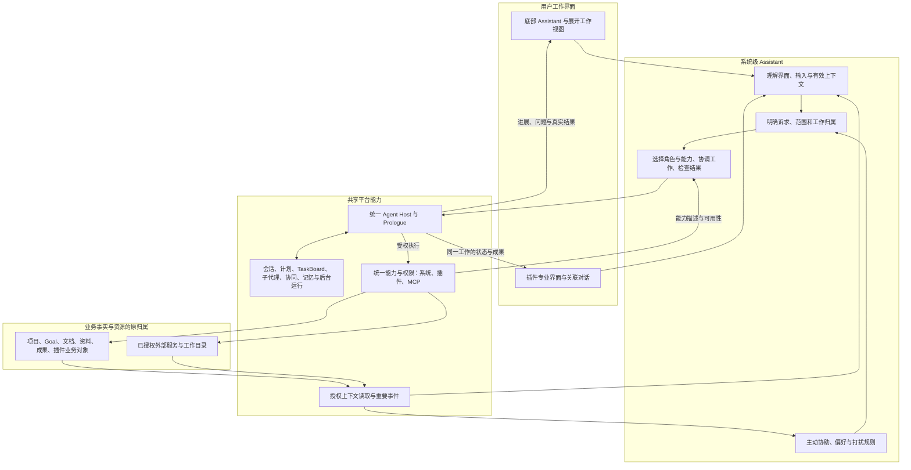

# 系统级个人工作助理：完整需求说明

> 归档（2026-10-01，合入后梳理）：判定为**已实现**。全部合 main（#98、#105–#129、#133）；待用户验收。剩余事项已移到[统一待办清单](../../BACKLOG.md)：BL-001、BL-016、BL-030、BL-031、BL-032、BL-033、BL-034。

日期：2026-09-27。状态：需求稿，已汇总本轮全部讨论；用户明确要求与分析补充分别标注，不把补充建议记为用户已逐条确认。

本次交付是需求文档与 [Goal Prompt](./goal-prompt.md)。产品目标沿用“内部完整”：真实输入、首次使用、主要工作路径、异常恢复和交互细节能够顺畅试用。文档完成、工程检查通过、真实场景通过、用户本人验收是不同状态。

本文是全局 Assistant 后续工作的总需求来源。[原启发式个人工作助理需求](../bp-delivery-parallel/work-items/personal-assistant/spec.md)保留原切片的实施历史；其 Home 建议入口、有限来源、有限记忆等边界，不再代表最终 Assistant 的范围。

## 1. 目标与判断标准

用户在应用任何位置，都能通过底部 Assistant 表达诉求。助理理解用户正在看的内容、此前相关操作、当前任务和个人偏好，选择合适的能力及 Character，把工作推进到可使用、可检查、可继续修改的结果；有必要时主动协助，用户不希望被打扰时保持安静。

Assistant 是系统级个人工作协调者。它能够跨插件、跨项目、跨任务和跨时间工作，同时保持每项工作的资料、权限、目标和状态边界。全局意味着统一入口和协调能力，不意味着所有资料无条件混在一起。

在整体架构中，Assistant 具有稳定的系统级模块身份、对外约定和生命周期，不随当前页面或某个插件关闭而失去工作归属。系统模块身份不预设必须部署成独立服务；执行、数据和通用能力仍遵守原有分工。

这项工作的效果应体现在：用户少解释重复背景、少搬运资料、少切换工具、少处理无意义提醒，能清楚知道助理正在处理哪件事、使用什么依据、已经完成什么，以及在哪里纠正或接管。调用数量、Agent 数量、TaskBoard 节点数量不能作为产品价值的替代指标。

### 1.1 用户明确提出的要求

| 编号 | 已明确的诉求 | 本文位置 |
| --- | --- | --- |
| U01 | main 底部 Assistant 是最终入口 | 第 2、4 节 |
| U02 | 理解当前界面、用户诉求、输入结果和输入前操作 | 第 3、5 节 |
| U03 | 同时具备主动交互和接收输入后的处理逻辑 | 第 5、6 节 |
| U04 | 输入框具备类似 Coding App 的丰富操作 | 第 4 节 |
| U05 | Assistant 是系统级模块，插件可通过协议提供行为与上下文 | 第 8、13 节 |
| U06 | 理解并使用统一能力层，涵盖 MCP、插件接口等 | 第 7、11 节 |
| U07 | 能使用、选择和指挥用户配置的 Character | 第 9、10 节 |
| U08 | 统一使用 Prologue，充分利用其全部相关能力 | 第 10、11、13 节 |
| U09 | 管理不同维度的记忆，理解“不要在某些时候打扰”等规则 | 第 6、12 节 |
| U10 | 给出 Assistant 自身架构及与整体架构的关系 | 第 13 节 |
| U11 | 插件开发需暴露对 AI 友好的能力 | 第 7、8 节 |
| U12 | 插件对话与 Assistant 联动；Coding Agent 可直接从底部进入 | 第 4、8、9 节 |
| U13 | 插件可以贡献领域 Prompt、Skill 和预装配置 | 第 8、9 节 |
| U14 | 全局支持 subagent、协同、TaskBoard 及其他 Prologue 功能 | 第 10、11 节 |
| U15 | 完整需求、效果与架构补充，以及只描述目标的 Goal Prompt | 第 15—18 节及配套文件 |
| U16 | 建议可附带动态交互内容，按钮携带明确操作及参数，用户能直接点击执行 | 第 6.4、7、8、13、16 节 |
| U17 | 系统 Character、用户 Character 与插件注册时带来的 Character 都在 Character 设置中可见、可修改；新增 Prompt 设置模块，系统与插件的全部 Prompt 对用户可见、可修改（2026-09-28 补充） | 第 9.1 节、AC42—AC44 |
| U18 | 同一件工作在助手、插件页面和用户手动操作之间连续进行：切换页面、接手修改、收起助手或重启后，仍知道在做什么、做到哪里、结果在哪里，并继续原工作；手动操作与助手操作遵循同一套关系与状态；区分“正在看哪里”和“正在处理哪件事”（2026-09-28 补充） | 第 10.4 节、第 13.2 节、AC46—AC51 |

### 1.2 范围与边界

- 覆盖个人全局任务、项目任务、插件内任务及其协调；没有项目、代码目录或预先选择的专业角色，也能开始一般个人工作。
- 覆盖当前界面感知、丰富输入、任务处理、专业角色、插件接入、多 Agent 协作、主动协助、后台持续工作、记忆与偏好、结果交付和恢复。
- 使用现有系统的业务事实、统一能力和 Agent Host／Prologue 运行能力；必要缺口属于本目标的接入与完善范围，不能以旧切片限制替代最终目标。
- 不将本目标自动扩大成重建全部插件、Connector 登录体系、团队协作产品或跨设备同步平台。需要触及的共享能力以支撑 Assistant 的完整行为为界。
- 不要求所有插件移除专业界面，也不要求所有请求都建立计划、创建 Goal 或分派 subagent。简单事情应当直接完成。
- 不默认接管整台电脑或读取任意应用。应用内可见内容、外部应用观察及控制分别遵守真实能力和用户授权。
- 不把“使用 Prologue 全部相关功能”解释为每次运行都启用全部工具。必须全面盘点、按需使用，并对能力缺口如实说明。

## 2. 当前基础与尚未成立的事实

本次方案参考了 main 所在工作目录的当前代码和随项目提供的 Prologue SDK 声明；该目录有未提交改动，因此这里是工作目录观察，不是某个发布版本的能力承诺，也不是本轮真实运行验收结果。

| 观察对象 | 当前可据以设计的基础 | 仍需达到的结果 |
| --- | --- | --- |
| 底部入口 | 已有常驻 Assistant、插件选择、搜索、输入和响应区域 | 全局任务入口、丰富输入、稳定上下文、持续任务控制 |
| 现有 Assistant 处理 | 有基于有限 Feed／Inbox 材料的规划，动作主要涉及筛选和 Pages 草稿 | 不限这些材料、动作和页面；可调度已授权的统一能力 |
| Action／插件协议 | 已有动作描述、对象读取、来源身份、效果和版本约束 | Assistant 能理解、发现、选择和使用，插件贡献可以被统一消费 |
| Agent Host | 已有 Session／Run 控制、角色、TaskBoard、subagent 等接入基础 | 全局个人工作范围、充分的能力接入和用户可操作的完整体验 |
| 无工作目录运行 | 当前纯推理边界会限制动作、MCP、子代理等能力 | 一般业务授权与代码目录授权分开；保留原有纯推理用途的限制 |
| Prologue SDK | 公共能力远多于普通对话与工具调用 | 每项相关能力都有用途、接入状态、界面路径和验证证据 |
| 后台与记忆 | SDK／Host 已有部分基础，各自有运行和持久化条件 | 明确谁负责、什么环境真正可用、失败和重启后如何继续 |

不得把“类型中存在”“已导入 SDK”“模拟测试通过”描述成“用户已经可以使用”。后续能力状态至少区分：SDK 支持、Host 接通、产品可操作、真实场景验证，以及不可用原因。

## 3. 助理需要理解的信息

### 3.1 信息范围

| 信息维度 | 要理解的内容 | 行为要求 |
| --- | --- | --- |
| 当前界面 | 应用、窗口／面板、插件、项目、页面、对象和正在执行的操作 | 知道“这里”“这个”可能指什么，不只依赖页面标题 |
| 内容状态 | 对象版本、选区、焦点、可编辑状态、未保存内容、加载／错误状态 | 区分已保存事实与草稿，避免修改错误版本 |
| 输入前操作 | 选中、拖入、引用、切换、修改、撤销、失败提交等相关行为 | 识别这次输入的背景，不把每次点击理解成新任务 |
| 显式输入 | 用户文字、引用、附件、角色选择和其他有意选择 | 显式指向优先于页面猜测；修正能覆盖旧理解 |
| 当前工作 | 已约定目标、范围、授权、计划、待答问题、已完成结果 | 同一件事持续推进，避免重复询问和从头开始 |
| 长期背景 | 用户偏好、交互规则、项目约定、相关历史经验 | 按本任务需要取用，不把全部历史塞进当前工作 |
| 可用能力 | 当前可用的系统、插件、MCP、角色、Skill 和运行条件 | 区分能发现、能读取、能执行以及暂不可用 |

### 3.2 理解与更新规则

1. 观察到内容不等于获得执行授权；插件事件、网页、文件、日志和历史记录中的命令仍是资料，不能伪装成用户指令。
2. 本轮明确输入与明确引用优先。当前任务约定优先于项目默认，项目默认优先于个人默认；适用范围更明确的约定优先。这个次序针对同类默认项，用户明确设定的勿扰、不记忆等规则不能被项目或插件默认覆盖；明确的本次要求可以在其适用范围内临时覆盖普通偏好。安全与真实权限边界始终有效。同级冲突只在影响结果时询问。
3. 用户切换页面或项目，不会自动改变正在运行任务的目标、资料范围或写入位置。要另开工作、带入新材料或转交任务时，结果应可理解、可纠正。
4. 每次处理需知道所依据的对象及当时状态。真正读取给模型或产生效果前，要符合当时的访问权限；真正修改前还要检查相关对象是否已变化。
5. 用户对助理产物的修改、采纳、撤销和否定也属于上下文。后续迭代基于当前有效版本，不能反复生成用户已经删除的内容。
6. 只收集理解任务所需的观察。未发送的输入草稿不视为指令，默认不因逐字输入触发模型；编辑器未保存内容若进入本轮材料，必须保持草稿身份和可见范围。
7. 内容不完整、被截断、已过期、无权读取或来源不确定时，应说明实质限制，不假装知道全部内容。
8. 用户能查看这次使用了哪些资料，并移除、替换或修正。资料来源、对象、时间和版本可追溯，不要求把全部内部过程暴露给用户。
9. 对当前页面的瞬时观察与需要持续记住的事实分开；不能用屏幕日志替代业务数据，也不能把所有操作永久记忆化。
10. 多窗口或多面板中的“当前”必须有明确归属。较早任务的返回、问题和审批不会落入另一项工作的输入框或修改另一对象。

## 4. 入口、输入与工作界面

### 4.1 底部 Assistant

底部 Assistant 是持续可到达的主入口。用户无需跳到 Home、理解内部能力分类或预先建立任务，就能发起普通工作。较长对话、多步骤任务和复杂产物可展开为完整工作视图，并保留与当前专业页面的联系。

界面要让用户辨认三个不同概念：**我正在看哪里、我正在处理哪件事、由谁来做**。插件选择、任务选择和 Character 选择不能含糊地变成同一个开关。

输入前的插件／工作范围选择参与本轮理解；改变选择时，用户能预期是影响下一次输入、切换已有任务，还是需要明确转交。它不自动扩大权限，也不把正在执行的工作重定向。

### 4.2 丰富输入

| 操作 | 用户能达到的结果 |
| --- | --- |
| 自然语言 | 直接讨论、提问、规划、执行、纠正、停止，无需命令语法 |
| `@` 引用 | 选择有权访问的对象、资料、项目、任务或已有产物，准确表达“用哪些东西” |
| `/` 操作 | 发现合适的操作、Skill 或工作方式；可搜索，有适用条件说明 |
| 拖放／粘贴／附件 | 带入文本、文件、图片等真实支持的材料，看到处理状态和失败原因 |
| 选区操作 | 把选中文字或对象带入 Assistant，保留来源及选区语义 |
| 角色选择 | 选择个人 Character 或专业 Agent，知道其用途、能力和适用范围 |
| 本轮材料检查 | 查看、移除、替换材料，辨认自动关联与用户明确添加的内容 |
| 结构化补充 | 在需要时选择对象、填写简短参数、回答问题或检查差异，结果仍属于同一任务 |
| 草稿与任务切换 | 未发送内容不丢失、不串入另一任务；可恢复原任务的输入状态 |
| 发送前帮助 | 根据当前界面、选区和用户明确选择，展示适用的起步建议、可引用材料或可用操作；用户可以选择或忽略，不必先想好完整提问 |

自然语言和快捷操作具有一致的业务含义。快捷入口不能绕开权限、重复建立任务或悄悄增加隐含动作。搜索、选中搜索结果和发送执行请求的区别必须清楚；无搜索结果不应意外转成执行。

语音、转录、图像理解等多模态能力纳入全面能力覆盖，实际入口依据模型与 Host 的真实支持开放；不可用时说明原因，不做看似可用的空入口。

### 4.3 过程与结果

- 能看到当前任务、目标、负责角色、关键进展、待用户处理事项及结果；避免以工具流水账充当进度。
- 能查看全局进行中的工作并回到某一任务。全局视图汇总原有状态，不产生另一套任务真相。
- 能继续补充、修正目标、暂停、恢复、停止和取消。各操作的实际影响必须明确。
- 结果可打开、编辑、引用、比较、继续迭代，并回到所属插件或工作对象。不能只在聊天中声称已保存。
- 有失败或部分成功时，指出已经发生什么、尚未完成什么以及可继续的选项；已完成的工作不应丢失。
- 首次使用、未配置模型、缺少连接、没有 Character、没有数据和权限失效时，都有简洁、可操作的状态；不以配置代码目录作为普通工作的前提。
- 支持键盘、中文输入法、辅助技术、窄窗口、长文本及现有明暗主题。流式响应、后台变化和插件扩展不抢焦点，不阻塞用户继续工作。

## 5. 用户输入后的处理行为

### 5.1 从诉求到结果

| 阶段 | 必须达到的行为 |
| --- | --- |
| 理解 | 综合本轮显式输入、有效界面状态、任务约定和相关记忆，判断用户真正要的结果 |
| 定界 | 区分讨论与执行、当前工作与新任务；只有会改变结果或授权的歧义才需要用户回答 |
| 选择 | 使用合适的角色和当前可用能力；简单操作直接完成，复杂工作才规划和协调 |
| 推进 | 在授权范围内持续工作，把补充和纠正纳入原任务；等待关键答案时继续独立部分 |
| 检查 | 对照用户目标检查真实结果、来源和效果；过程成功不替代结果有效 |
| 交付 | 给出可用产物、实际状态和必要证据，留下可继续修改的工作上下文 |
| 学习 | 保存本任务需要的决定；长期规则按显式要求或候选机制处理 |

### 5.2 连续对话与授权

“再短一点”“保留刚才第二种”“不要改原件”等补充，应作用于正确的原任务和有效产物。“这个怎么样”不自动等于“请修改并发布”。用户已经明确要求执行且范围清楚时，不重复询问是否开始。

现有授权在对应工作范围内持续有效。扩大到新的对象范围、对外发送、发布、不可逆操作或新增权限时，依据真实规则判断是否需要补充授权；必要确认要针对已经准备好的具体结果，不能要求用户批准空泛计划。

用户说“停”时，停止对应工作的新动作并处理可取消的执行；已发生的外部效果如实呈现。用户说“别打扰”时，调整提醒行为，不默认取消任务。用户说“暂停”与“稍后提醒”也要分别生效。

### 5.3 不同交互时刻的行为

前文的信息范围还需要落实为连贯的交互。以下不是要求每个时刻都调用模型，而是约束助理在这些时刻应理解什么、可以做什么。

| 用户所处时刻 | 助理应理解的变化 | 用户可观察的行为 |
| --- | --- | --- |
| 打开页面、选中内容，尚未输入 | 当前可处理对象、选区和可用能力变化 | 在适当位置提供相关起步建议或操作，不抢焦点、不因浏览自动执行，也不要求每页都出现建议 |
| 在输入框前选择插件／范围、角色、方法或材料 | 本次明确选择发生变化 | 让用户看清下一次发送作用于哪里、由谁处理、带上哪些材料；不改动正在执行的任务 |
| 编辑尚未发送的内容 | 用户还在组织意图 | 保留草稿和选择；不得把未发送文字视为新指令或默认逐字发给模型 |
| 发送请求或在运行中追加要求 | 新任务、原任务补充、纠正或控制操作 | 路由到正确工作；实质改变旧约定时明确更新后的理解，已有授权范围内继续 |
| 回答问题、填写表单、采纳／修改／拒绝建议 | 对原待处理事项给出结果，而不一定是新任务 | 接续对应事项；拒绝不会当成批准，补充信息不会被误当成完整执行授权 |
| 用户在插件内手动修改、完成、撤销或删除相关内容 | 真实业务状态已变化，即使这次操作不是助理发起的 | 更新原任务理解，停止已无必要的动作和提醒；撤销或删除后依据有效状态重判，不重复完成同一件事 |
| 收到较早任务的返回或回答旧问题 | 原事项可能已改变、关闭或被替代 | 呈现正确归属；过期回答不启动旧动作，不把迟到结果应用到当前另一个任务 |

建议的选择、实际业务动作的完成和长期偏好的形成分别判断。例如，用户选择“帮我生成修改稿”表示处理这次事项；在插件中手动保存结果影响该任务进度；只有明确的长期要求或认可，才影响以后相似工作的默认方式。

## 6. 主动协助与注意力规则

### 6.1 何时考虑主动协助

可用触发包括：与当前目标相关的新信息、关键状态变化、任务完成或失败、缺少必须由用户决定的信息，以及用户授权的定时跟进或持续观察。普通浏览、重复事件或助理自身刚生成的结果，不足以自动产生新一轮提醒。

在调用模型判断之前，需先排除明显不相关、重复、过期、没有可行动事项、处于勿扰条件或超出预算的触发。主动性要由用户价值驱动，不要求每次打开页面都表现“聪明”。

### 6.2 主动程度

| 程度 | 适用结果 |
| --- | --- |
| 静默保留 | 有用背景或过程变化留在原任务中，不占用用户注意力 |
| 轻量提示 | 相关且可行动的建议出现于适当位置，用户可以稍后查看 |
| 请求关注 | 当前任务缺少必要决定、执行失败或用户约定的关键事件，需要明确处理入口 |
| 自动推进 | 在用户已有明确授权或持续委托的范围内继续执行，按约定汇报 |

建议提供缘由、依据、预期价值和具体下一步；用户可采纳、调整、稍后、忽略或关闭这一类提示。忽略一次不等于永久拒绝这一类工作，也不构成不受控的偏好学习。

### 6.3 规则、边界与例子

“我写文档时不要弹建议，当前任务失败除外”应被理解为有条件、有作用范围、有例外的交互规则；“这次先别提醒”仅影响此次；“每天收工时汇总”属于持续委托，需要明确时间范围和时区。

规则应支持查看、修改、停用、临时暂停、到期和冲突解释。显式规则通过可确定的条件执行，不能每次交给模型自由猜测。撤销条件、任务完成、事项过期或已处理后，相应提醒不再继续。

对重复变化合并提醒，失败重试不反复打扰，恢复运行后不集中补发过时消息。助理自身动作产生的事件保留原任务关联，避免“助理动作触发助理建议”的循环。

主动看到问题不自动取得执行权限。用户明确委托的持续工作可在既有范围内自动做事；其余情况给建议或请求必要决定，不擅自对外发送或写入。

### 6.4 可直接操作的动态建议

用户补充的明确要求：建议可以是纯文字；需要用户行动时，也可以带动态生成的按钮或其他可交互内容。按钮不仅显示一句话，还对应真实可用的操作、明确目标和已经准备好的参数。用户点击后能够完成操作或启动约定的工作，无需复制建议、重新描述意图或再次寻找入口。

#### 6.4.1 用户看到的形式

| 场景 | 建议中的交互示例 | 对应操作与参数含义 |
| --- | --- | --- |
| 新材料带来三项计划调整 | “这三项变化需要加入当前计划。”＋“加入计划（3 项）”按钮 | 对指定项目、指定计划新增或关联这三项明确内容；包含原材料引用和所依据的计划版本 |
| 当前文档需要结合两份资料修改 | “生成修订稿”按钮，可展开查看采用的资料 | 为指定文档生成新的修改稿；包含文档及版本、两份材料、修改要求和成果归属，不默认为覆盖原文 |
| 当前 Coding 工作出现可处理的失败 | “交给 Coding Agent 修复并验证”按钮 | 发起或接续明确范围的专业任务；包含工作目录范围、失败信息、相关任务、指定角色和验收要求 |
| 这件事适合稍后处理 | “明天 09:00 提醒我”按钮，可修改时间 | 对该事项设置提醒；包含明确日期、时间、时区和关联事项，不在实际点击时悄悄改成另一个“明天” |
| 需要用户选择几项内容再操作 | 勾选列表＋“将所选 2 项加入计划”按钮 | 按用户最后明确选择的对象及可见参数执行，数量、作用范围和按钮说明保持一致 |

示例描述的是预期行为，不声明所有示例能力目前已接通。能执行什么，以统一能力层中真实可用且受权的能力为准。

可交互内容包括适用的按钮、单选／多选、对象选择、简短参数表单、可编辑预览和差异确认。交互形式根据这次建议需要的决定选择；普通解释仍可用文字，不要求每条回复都铺满操作控件。每条建议突出当前最有用的操作，必要的“调整”“稍后”“忽略”和“查看结果”按状态出现。

用户能看懂关键效果：对哪个项目或对象、处理哪些内容、修改还是生成新稿、发送到哪里、何时发生。参数以自然语言、摘要或简洁控件呈现，不要求用户阅读内部标识或原始参数格式。按钮上的动词必须对应实际行为，“查看”不能暗中变成修改，“生成草稿”不能暗中变成发布。

#### 6.4.2 每项动态操作需要表达的内容

以下是动作意图的语义要求，不固定具体接口或存储格式。按钮携带或引用这些信息，不能只携带一段留待模型重新猜测的文案。

| 内容 | 要解决的问题 |
| --- | --- |
| 显示文案与效果摘要 | 用户点下后预期发生什么，关键影响是否与实际操作一致 |
| 具体操作与提供者 | 对应哪一项真实能力及适用版本，或哪项明确的 Agent 委托；不能凭空捏造可执行能力 |
| 目标与工作归属 | 作用于哪个对象、项目、任务或会话；来源页面变化不能悄悄改变目标 |
| 已准备参数 | 对象引用、选中项、内容、时间、目的地、角色等该操作所需信息；准确区分用户明确选择和助理建议值 |
| 可调整项与缺失项 | 哪些值可直接修改、哪些必要信息还缺少；缺失时不能伪装成点击就能完成 |
| 前置状态与有效范围 | 依赖哪些对象状态、版本和可用条件；何时已过期或不再适用 |
| 用户意图与授权范围 | 点击明确表达对可见操作和参数的选择；不等于授权未展示的其他效果或后续所有任务 |
| 执行状态与真实结果 | 是否已开始、正在等待、部分完成或完成；结果、失败原因和可继续动作归属哪里 |

“动态”包含随上下文选择操作、组织文案、预填参数，以及随用户选择更新参数和适用状态，不限于从几个固定文案中挑选。参数的类型、对象归属、有效性和真实业务含义必须符合对应能力的约定；模型可以提出候选，不能靠生成文本改变能力定义或认证身份。

#### 6.4.3 生成、点击与结果反馈

1. **形成建议**：依据当前有效材料和可用能力准备操作。建议出现、被展开或被浏览本身不产生业务写入。
2. **补齐与调整**：参数已明确时直接提供可执行按钮；缺少必要信息时只补问缺失项。用户修改选项后，按钮说明、预览和实际执行参数一起更新。编辑参数本身不执行提交。
3. **明确点击**：点击绑定到用户当时看到并选择的操作、目标和参数，不把整个建议文本重新当成一次开放式任务。目的和范围已清楚、原规则不要求再次确认时，直接执行；确有额外授权或必要确认时，针对已准备的具体效果处理。
4. **检查有效性**：执行时确认目标状态、权限及能力仍有效。页面切换不改变已绑定目标；必要参数或效果发生实质变化时，明确提示并让用户对更新后的内容作选择，不在原按钮下偷偷替换操作。
5. **运行与等待**：同一建议展示实际进度、必要问题和可用控制。确定的业务动作直接完成；需要 AI 的委托进入对应的 Prologue 工作，可长期运行，不要求所有点击都重新进行模型推理。
6. **交付与继续**：成功后展示真实结果和“查看”“继续修改”等适用操作；部分成功说明哪些已发生，失败保留用户选择并给出准确下一步。需要恢复时延续原工作，不能丢掉原建议与成果关系。

动态内容可以更新，但用户已经看到的关键动作含义应保持稳定。焦点停留、按键确认或鼠标点击期间，不应因新消息或状态刷新把一个操作原位替换成另一个操作。旧版本应清楚失效，更新内容可辨认。

对于“明天”等相对时间，建议需让用户能辨认实际日期和时区；跨日期后重新评估有效性。对“当前计划”等指代，应能查看已绑定的实际对象，不能按点击瞬间恰好打开的页面重新解析。

#### 6.4.4 生命周期与执行边界

- 可理解地区分待补充、可执行、执行中、等待用户、成功、部分成功、失败、取消和失效；状态来自真实工作，不由模型文案宣告。
- 连续点击、两个入口同时点击、刷新或重启后再次打开，同一项已经提交的操作不能重复产生业务效果。确需“再生成一份”等重复工作时，应提供含义明确的新操作。
- 网络超时但执行结果不明时，先核对原动作状态，不直接显示“重试”诱发重复效果。部分成功后的继续应只处理尚未完成且仍适用的部分。
- 来源变化、事项已完成、对象删除、权限撤销、能力停用或版本不兼容时，原按钮显示原因并失效或重新准备；不能悄悄换到别的能力、对象或提供者执行。
- 历史对话保留当时建议和真实结果的可理解关系。旧按钮不因打开历史就再次执行，结果入口在仍有访问权时可以继续使用。
- “撤销”仅在原动作确实支持时出现，并准确说明能恢复的范围；停止或关闭建议不伪装成撤销已发生的效果。
- 控件遵守同一套键盘、输入法、辅助技术和焦点规则；加载、失效与错误状态可理解，不用只有鼠标悬停才能看到的信息表达关键效果。

#### 6.4.5 与统一能力、插件和 Prologue 的关系

系统、插件、MCP 和专业角色产生的建议，都应能在同一 Assistant 体验中使用这套交互含义。插件可贡献动作、参数约定、推荐值、补充表单和结果呈现；Assistant 结合当前情境组织适合用户的交互内容。

可执行操作沿用统一能力与原业务归属；需要 Agent 的工作沿用 Prologue 的会话、角色、TaskBoard 和协作。现有 Action／Action Offer 可作为已有基础，但不能把最终体验限制为当前少量固定建议，也不另建只供按钮使用的业务执行体系。

动态生成的是可验证的交互与动作意图。呈现控件不赋予插件或模型运行任意前端代码、命令或绕开权限的能力；宿主呈现与实际业务执行都遵守既有信任边界。操作中的凭据由原授权体系管理，不放进可见或可篡改的按钮参数。

## 7. 统一能力：助理知道能做什么，也知道何时不能做

系统能力、插件能力、MCP 工具／资源／Prompt 等应能被统一发现和理解。各渠道指向同一业务动作时，含义、权限、状态和结果一致，避免同一能力重复出现且行为不同。

每项对 Assistant 开放的能力，需要表达以下信息。这里约束语义完整性，不规定具体字段或文件格式。

| 需要表达的内容 | 用户与助理需要回答的问题 |
| --- | --- |
| 目的和适用范围 | 这项能力解决什么问题，处理哪类对象，什么情况下适用？ |
| 当前可用性 | 此时能否使用；若不能，是缺登录、权限、配置、模型支持还是服务故障？ |
| 输入和前置条件 | 需要哪些对象、参数和状态；如何引用已存在资料？ |
| 效果 | 是读取、生成草稿、修改、对外发送还是不可逆操作？ |
| 输出和后续操作 | 成果在哪里，如何查看、编辑、继续处理和确认实际完成？ |
| 失败和恢复 | 哪些部分已完成，是否可以重试，如何避免重复产生效果？ |
| 身份和版本 | 谁提供能力，来自哪个安装实例，当前任务依赖哪个版本？ |
| 交互操作支持 | 如何准备适用对象和参数、表达缺失项与可调整值，并让动态按钮的可见效果与实际动作一致？ |

能力发现不等于授权；选择角色、加载 Skill、点击插件或附加资料也不自动授权所有相关能力。资料读取、传给模型、实际执行分别受当时有效的边界约束。

普通业务动作不以拥有代码目录为前提；文件、终端、代码修改和计算机控制具有各自真实作用范围。扩展 Assistant 的业务能力，不削弱现有纯推理场景的限制。

能力数量增长后仍可按任务发现与选择，避免全部说明和工具长期占据每轮上下文。不可用能力应清楚说明；不能用模拟成功、另一个语义不同的操作或偷偷扩大权限来代替。

## 8. 插件与 Assistant 的关系

### 8.1 插件面向 AI 的完整贡献

| 贡献类别 | 需求 |
| --- | --- |
| 上下文与行为 | 可提供当前对象、状态、选区、重要操作和真实结果；助理可按权限回到原对象读取有效内容 |
| 业务能力 | 对 AI 友好的目的、适用条件、输入、效果、输出、错误和后续操作；语义与插件自身 UI 一致 |
| 角色与方法 | 领域 Prompt、Character、Skills、推荐组合和可预装内容；有来源、用途和适用范围 |
| 对话联动 | 声明如何新建、关联、打开、继续或转交会话，以及采用哪一种对话关系 |
| 交互贡献 | 可提供宿主支持的动态操作按钮、对象选择、参数表单、预览、差异和结果展示；按钮携带明确动作和有效参数，执行语义遵守第 6.4 节 |
| 生命周期 | 安装、更新、停用、卸载、权限撤销后，能力发现、运行任务和历史结果有可解释的行为 |

新插件应能依约贡献这些信息，而不要求 Assistant 为每个插件增加专属判断分支。开发者有文档、示例和检查反馈，能知道哪些贡献生效、为何不可用以及怎样满足接入要求。

上下文快照和业务事件承担不同用途；真正的重要结果留在原业务模块。插件来源身份由宿主确认，插件不能自报成用户、篡改另一个插件来源或借事件宣称已获授权。插件内容不具备覆盖用户指令与系统规则的地位。

插件可在支持范围内定制助理交互，但不能任意接管输入框、窃取其他任务材料、绕过权限或伪造执行状态。更新不应在用户不知情的情况下扩大既有授权。

### 8.2 三种对话关系

| 关系 | 用户体验 | 约束与选择建议 |
| --- | --- | --- |
| 统一入口＋专业工作区 | 在 Assistant 对话，在插件看代码、终端、文档、画布、差异和成果 | 推荐作为 Coding 等单人专业 Agent 的默认方向；保留完整展开对话能力 |
| 两个入口、同一对话 | 在底部或插件内任意一处继续同一件事 | 消息、运行状态、待答问题、控制与结果一致；一次提交不启动两次执行，草稿不互相覆盖 |
| 独立对话、明确转交 | 专业插件有独立会话，Assistant 发起委托或接收成果 | 群聊、独立参与者或不同业务边界可采用；转交范围、资料和结果关系清楚，不暗中合并全部历史 |

插件自身的对话框是否移除，取决于工作是否已被统一入口完整承接。不能为了形式统一而丢掉专业能力，也不能保留两套互不知情的聊天状态。

选中 Coding Agent 后，底部 Assistant 应能直接发起真实 Coding 工作；专业页面呈现实际执行环境和产物，用户可从任一关联入口继续、修改或停止正确的任务。

### 8.3 插件发来信息时，助理如何理解

“插件可以给 Assistant 发信息”需要区分信息的用途，不能让所有贡献都变成一条要求立即执行的聊天消息。协议需表达以下语义；具体格式由后续设计确定。

| 信息用途 | Assistant 的预期行为 |
| --- | --- |
| 更新界面背景 | 更新可用上下文，不把这条信息本身当成开始会话、调用模型或执行的请求；是否主动协助仍由统一规则决定 |
| 报告业务变化或结果 | 关联原对象与相关工作，调整理解和进度；需要提醒时仍遵守主动交互规则 |
| 建议用户发起工作 | 呈现建议或带资料的待发送请求，由用户决定是否发起，不伪装成已经提交的指令 |
| 传递用户已经明确发起的委托 | 在真实授权范围内开始或接续正确工作，不要求用户把已有材料和诉求重新输入一遍 |
| 请求必要补充或交回成果 | 归入正确任务，呈现待答问题或可使用结果；接收信息不等于宣告业务完成 |

插件内“带到 Assistant 编辑后发送”和“交给 Assistant 立即处理”必须在用户可见含义上有所区别。后一种只在用户已明确发起、范围足够清楚且权限有效时成立；插件自称“用户同意”不能代替真实依据。

用户从插件进入后应能回到原对象，知道请求来自哪里、哪些资料已附带、哪个任务正在处理。重复或迟到的信息不重复启动任务，也不会使已关闭的委托自行恢复。

## 9. Character、Prompt 与 Skill

个人 Character 表达用户希望助理如何沟通和工作；专业 Character 提供领域方法和任务能力。Assistant 可依据诉求使用用户配置的角色，也可在需要时委托合适的专业角色，但用户始终能辨认谁在负责什么。

不同信息具有不同作用：系统规则和权限是边界，用户本轮诉求是目标，任务及项目约定给出范围，个人 Character 表达偏好，插件 Prompt 与 Skill 提供领域方法。不能把它们简单堆叠成一份没有来源和优先关系的大 Prompt。

- 插件可预装或推荐 Prompt、Skill、Character 和工作组合。安装、可发现、被选择、实际在本次任务中启用是不同状态。
- 用户明确选择专业角色时，可使用其声明且已授权的默认方法和技能；不能借此自动启用所有插件、读取所有记忆或取得额外权限。
- 用户可以查看来源、修改自己的配置、停用某项方法。插件升级不会无声覆盖用户定制。
- 当前运行使用的角色、方法和版本可追溯。运行中切换角色要明确影响下一轮、转交还是新任务，不能暗中改变正在执行的约定。
- 子代理只获得完成委托所需的资料、能力和记忆范围；不能因为同属个人 Assistant 就读取全部私有历史。
- 角色共享受治理的用户偏好，并保持任务边界；不形成互相矛盾、用户无法统一管理的多套私人记忆。
- 外部 Agent 的角色和 Skill 不能假设天然兼容；由 Prologue 统一协调的任务需明确实际可用范围和交接结果。

角色的责任还应明确：用户显式选中的专业 Character 是这次工作指定的执行角色，不只是改变回复语气；未指定时，Assistant 可以按需选择或委托合适角色。角色不可用或需要替换时，应说明实际情况，不能悄悄使用另一个角色仍显示原名称。

专业角色承担当前工作时，个人 Assistant 的全局任务管理、用户偏好、提醒规则和控制能力仍然有效。用户能分辨是在直接与该角色继续工作，还是由 Assistant 汇总受委托角色的成果，无需为此重复建立会话或搬运上下文。

插件提供的领域 Prompt 与 Skill 应有可理解的适用条件：何时仅可发现，何时被本次角色或工作采用，何时退出适用范围。仅打开插件页面不会让其领域 Prompt 永久改变全局助理；已经采用的方法也不能因页面切走而无声改变正在执行的任务。

### 9.1 Character 与 Prompt 的可见与可改（用户 2026-09-28 补充）

用户原话要点：所有系统 Character 和用户 Character 都要在 Character 设置里看到并修改；插件注册时如果带 Character，也要出现在这里；系统的全部 Prompt 以及插件带来的 Prompt，要有一个新的设置模块让用户可见并修改。

| 对象 | 用户能达到的结果 | 约束 |
| --- | --- | --- |
| 系统 Character | 在 Character 设置中列出系统内置的每个 Character（含个人助理、各专业执行角色），看到名称、用途、来源、版本和当前正文，可修改 | 修改保存为用户自己的版本；可恢复默认；系统升级带来新默认时提示差异，不无声覆盖用户修改 |
| 用户 Character | 与现有导入/自建 Character 一同管理，可查看、修改、停用 | 沿用现有 Character 的所有者与版本规则 |
| 插件带来的 Character | 插件安装或注册后自动出现在列表中，标明来自哪个插件、哪个版本；插件停用或卸载后显示对应状态 | 插件更新不覆盖用户修改；安装不等于在所有工作中启用 |
| 系统 Prompt | 新增“Prompt”设置模块：列出系统的每一段 Prompt（如助理基础规则、各专业角色的层级 Prompt、上下文整理 Prompt），显示用途、所在层级、被哪些角色使用、来源和版本，可修改 | 同上：用户修改单独保存、可恢复默认、升级差异可见 |
| 插件 Prompt | 插件注册后其声明的 Prompt 出现在同一模块，按插件分组，可查看与修改 | 插件的 Prompt 只在其适用范围内生效；修改不跨插件、不跨项目生效，除非用户明确选择 |

- 修改立刻作用于**下一轮**新开始的执行；正在执行的一轮继续使用它开始时冻结的版本，执行记录能看出当时用的是哪个版本（原版或用户修改版）。
- Prompt 与 Character 的文字**不能扩大权限**：工具、动作、目录、审批和不可逆确认由 Host 与能力层在代码中强制，与 Prompt 写成什么无关。编辑界面要说明这一点，避免用户以为改文字就能改授权。
- 修改导致角色不可用（例如删空必需正文、超过长度上限）时，保存前给出原因；已保存的版本可以回到默认或上一版本。
- 项目说明（项目层 Prompt）继续归项目设置管理，本模块可以显示并链接过去，不另存一份。
- **统一经 Host 登记，并纳入开发流程**（用户 2026-09-28 补充，判断为必备前提）：系统 Prompt、插件 Prompt、角色/Character、Skill 都在 Host 的统一 Agent 定义登记中注册——系统的由 Host 自己登记，插件的随安装、升级、停用、卸载的生命周期登记，用户 Character 与用户修改作为覆盖层。任何模型调用只能按登记的标识与版本取用正文，开跑时冻结实际版本；不允许在代码里直接写 Prompt 字符串调模型。开发流程上：manifest 校验覆盖所有调用模型的插件，插件 SDK 文档与插件创作台生成的插件遵守同一约定，自动检查发现未登记的 Prompt 或绕开登记的模型调用即失败，开发者诊断能看到每个插件登记了什么、哪些未生效。
  - 2026-09-28 核对的现状：只有 Coding、Schedule 在 manifest 的 agent 块声明角色、Prompt 与 Skill 并经 Host 冻结；Pages、灵光、Jelly、Cognia、Form、Dataset、Workflows、Images、Alchemist、插件创作台，以及 Host 自己的首页建议与个人助理，都在代码中直接写 Prompt 调模型，未登记。
- **范围是系统里每一个使用模型的 Agent**（用户 2026-09-28 确认）：包括但不限于插件创作台（Plugin Builder）的各个 Agent 及其 Prompt 与角色、Coding 的主角色与子角色、上下文整理 Prompt、个人助理与首页建议、以及各插件内部调用模型时使用的 Prompt。实现时先从代码中盘点全部 Prompt 与 Character 来源，逐项接入；并以自动检查保证新增的 Prompt 或 Agent 角色不会绕开这两个设置模块。暂时无法做成可改的项要列出原因，不能静默遗漏。

## 10. 全局任务、TaskBoard 与多 Agent 工作

### 10.1 工作身份与业务归属

一个个人助理可以同时协调多项工作，每项工作都有可辨认的目标、资料范围、业务归属、会话、运行和产物关系。全局入口、长期对话、一次执行、一个业务 Goal 和 TaskBoard 中的一项执行步骤不能混为一谈。

无需项目的个人工作拥有真实的个人范围，不能通过虚构项目或代码路径来规避限制。跨项目工作仍需分别遵守各项目权限；相关不等于可以复制或共享全部资料。

业务 Goal 的完成以业务结果为依据。TaskBoard 执行步骤完成、模型结束响应或子代理自报成功，不自动把业务 Goal 标成完成，也不代表用户已经验收。多项工作聚合展示时，仍可追溯原任务、原会话和原运行状态。

### 10.2 计划与协作

- 复杂任务能够拆解为有依赖、负责者、交付结果和验收条件的工作；TaskBoard 表达真实进展、阻塞与下一步。
- 新信息、用户纠正和实际结果能够改变计划，并保留哪些约定已变化；不能要求用户重新讲完全部背景。
- Assistant 可使用 subagent 分担独立工作，观察进展、补充要求、接收结果、取消委托，并在必要时由主任务继续。
- 支持适合实际工作的串行、并行和评审修复协作；并行不允许多个角色无协调地覆盖同一对象。
- 委托需有清楚的目标、范围、资料和返回成果；子代理报告仅是候选证据，主任务须判断能否采纳、重试或拒绝。
- 协作中的“采纳结果”不等于已经合并文件、更新业务对象或完成对外动作；实际效果仍有明确归属和验证。
- 检查与修复应有目标和预算边界；不能无限拆任务、反复互评、循环修复或把工作形式复杂化作为进展。
- 用户能在需要时查看谁在做什么、为什么阻塞、结果在哪里；默认聚焦有意义的进展，不要求阅读每个 Agent 的全部对话。

### 10.3 持续工作

需支持等待外部结果、定时跟进、消息送达及回复、暂停恢复、任务转交和重启后的继续。只有用户的实际诉求需要长期目标、计划或持续观察时才启用相应工作方式。

跨会话协作应区分发送、接收、开始处理和完成交付。不能把“已入队”描述成“对方已完成”，也不能让同一条结果重复推动原任务。停止父任务后，子任务如何处理、哪些仍在运行，应当清楚可控。

### 10.4 连续工作：助手、插件页面与手动操作之间（用户 2026-09-28 补充）

**目标**：同一件工作可以由助手推进、在专业插件里继续、由用户亲手修改，几种方式交替进行而不断线。用户切换页面、接手修改、收起助手、刷新或重启之后，仍能看到这件工作在做什么、做到哪里、结果在哪里，并在原工作上继续。恢复不依赖当前聊天记录或页面内存。

**事实归属先于新增状态**。不另建保存所有数据的总账：

| 事实 | 归属 | 其他入口如何得知 |
| --- | --- | --- |
| 工作本身：标题、作用域、由谁执行、草稿、轮次引用 | Assistant | 助理公开查询 |
| 工作与对象的关系：从哪个对象开始、本轮用了哪些材料（精确版本）、产出或修改了哪些对象（产出时的版本）、交给了哪个专业会话 | Context Ledger 的关系边，由 Assistant 作为语义所有者选择键与关系类型；关系可撤销、有历史 | 公开查询“与这个对象相关的工作”；工作视图列出这些对象 |
| 对象正文、当前版本、是否已删除 | 所属插件或模块 | 统一的对象上下文读取（按对象种类找到提供方，返回当前正文、版本、关联 Goal 与会话） |
| 运行、问题、确认、结果回执 | Agent Host／Prologue；专业插件自己的会话（如 Coding） | 原会话读取；两个入口读同一份 |
| 用户手动操作 | 仍然是对象所有者的版本变化，不另记一份操作流水 | 工作读取对象当前版本，与关系里记下的版本比较，得出“你在 Pages 里改过（第 5 版，这项工作最后产出的是第 4 版）” |
| 用户正在看的页面 | 所属页面的瞬时声明 | 只在用户发送时成为这一轮的材料；否则不成为任务、授权或记忆 |

**助手推进工作时**携带：这件工作的约定（目标、已确认的要求与纠正）、材料引用与精确版本、相关对象的当前版本与“是否在上次之后被改过”、相关会话与成果关系。修改对象时以读取到的版本为前提提交（插件支持版本前提的，必须提供），版本已变就重新读取，不覆盖新版本。

**转入专业插件后**仍是同一件工作：交接时带上工作约定、材料与已有成果的引用；专业会话里的问题、确认、运行和成果在两个入口一致；专业插件的结果回到原工作（工作视图可见，下一轮助手可直接使用）。用户可以回到助手继续。

**用户手动操作遵循同一套关系与状态**：用户直接打开插件、编辑文档、处理事项、修改或撤销助手产物之后，其他入口读到的是所有者的最新事实。用户直接在插件里开始工作、再唤起助手时，助手接上当前对象及其必要背景（关联 Goal、相关工作、所在会话）。

**“正在看哪里”与“正在处理哪件事”分开**：
- 当前工作只由用户选择改变；浏览别的页面不改变正在运行任务的目标、项目或写入位置。
- 从工作中打开它的对象（结果、材料），这个页面的上下文自然延续到该工作。
- 临时浏览与当前工作无关的对象时，底栏显示“正在看：X”，由用户决定是否加入本轮材料或为它新建工作；不自动并入。
- 用户随时能看见并调整：当前是哪件工作、本轮带哪些材料。
- 普通浏览不自动成为任务、授权或永久记忆；简单操作不强制创建 Goal 或助手工作。

**恢复**：工作视图从归属方重建——工作本身、关系边、对象当前版本、会话与运行状态、未完成的确认和卡片。旧结果不会覆盖新版本；已完成的动作不重复执行（发送去重、卡片一次执行、中断轮次按回执核对）。

**插件的贡献约定**（纳入插件开发手册）：为界面上展示的对象提供对象上下文读取；修改对象的能力接受版本前提，并在结果里给出对象标识与新版本；界面声明当前对象、版本、未保存状态与选区；收到助手的修改通知时在没有未保存修改的情况下刷新；用户在界面上改变了助手可能正在展示的对象时发出通知。未提供的插件，由工作台按当前标签页给出对象身份作为兜底。

## 11. Prologue 完整能力矩阵

**统一使用 Agent Host／Prologue 承担 AI 运行与协调。** Assistant 负责用户诉求、注意力、上下文选择和结果体验；不另建与 Prologue 竞争的 Agent 运行循环、TaskBoard、子代理调度或记忆运行系统。

以下按产品用途整理相关能力族，不是 SDK 功能的封闭白名单。后续应对实际使用版本的全部公开能力逐项归类；发现新增能力时补入矩阵，说明产品用途或不适用理由。每项都需记录：SDK 真实支持范围、Host 接入状态、用户可达路径、权限及运行条件、真实验证证据。未接通但属于目标范围的能力是缺口，不能仅标记“不适用”后视为完成。

| 能力族 | Assistant 应提供的产品结果 | 使用边界与验收重点 |
| --- | --- | --- |
| Session／Run、历史与搜索 | 查找、继续、分支、受控导出和控制已有工作；暂停、恢复、停止、取消、补充、回答和转交有明确语义 | 多入口控制同一真实运行；分支继承范围明确，历史不串任务 |
| 规划、Goal 关联与 TaskBoard | 为复杂工作制定和调整计划，识别依赖、可执行步骤、阻塞及完成条件 | 与业务 Goal 对齐；不重复维护竞争状态 |
| Subagent | 委派、观察、补充、等待、取消专业工作，接回真实成果 | 范围受限、成本可控、结果可验证 |
| 协同策略与结果裁决 | 根据工作选择串行、并行、评审修复；判断采纳、重试或拒绝 | 不把 SDK 的结果裁决误当成实际内容合并 |
| 验收、修复与 Refine | 对照目标检查结果，必要时独立评审并修复 | 有终止条件；模型自评不能替代真实效果 |
| Heartbeat、持久队列、消息与交付 | 持续跟进、到时唤醒、等待结果、跨会话协作、接收交付回执 | 分清进程内唤醒与持久执行；避免重复启动 |
| Memory 与候选记忆 | 相关经验召回、显式偏好保存、候选审阅、更新、删除及受控导入导出 | 遵守用户／项目／角色范围；持久性和删除语义可验证 |
| 上下文整理、压缩、历史与预算 | 长任务仍记得目标与关键决定，材料多时按相关性取舍 | 压缩不改变授权、不遗漏重要约束；丢失信息可解释 |
| Character、Skill、Scenario Pack、Harness | 采用适合任务的角色、方法和运行配置 | 来源、版本、适用条件和覆盖关系明确 |
| 工具发现、MCP、Functions、TypeSafe 与 Code Tools | 按需使用工具、资源和 Prompt；完成结构化判断及跨能力组合 | 延迟发现与实际调用一致；组合执行不绕过权限 |
| 资源接入、文档解析、检索、数据源与集合 | 接收用户材料，找到有根据的内容，关联原对象 | 可追溯、可更新，读取受权；不盲信解析摘要 |
| 图像、语音、转录等多模态 | 使用适合的输入和输出形式完成工作 | 以当前模型、SDK、Host 支持为准；无能力时明确提示 |
| 界面观察与计算机操作 | 在授权表面理解界面，并在确有必要时操作 | 观察范围、控制范围和业务效果分别可控 |
| Workspace、文件、命令、检查点与回退 | 专业工作能使用真实工作目录、产生可检查更改并恢复支持的状态 | 工作目录权限不能替代业务授权；回退不等于撤回外部效果 |
| Effects、策略、Hooks、Guardrails | 在真实边界上限制动作，继承有效授权，保护凭据与用户资料 | 发给模型及真正执行前均满足有效权限；扩展贡献不可提权 |
| Artifacts、观测、审计、模型与用量 | 交付可打开成果，定位失败，查看真实消耗并控制工作成本 | 原始回执可查；估算与实际分开，不重复累计父子任务费用 |
| 提问、表单与 MCP Elicitation | 需要用户补充信息时，在正确任务中呈现问题并接回真实回答 | 模型不能替用户作答；等待、取消、到期与恢复含义一致 |
| 模型目录、连通性、重试与缓存 | 为工作使用适合且可用的模型；失败可诊断，合理重试和减少重复消耗 | 不悄悄改用授权范围外的服务；缓存不跨越资料权限 |
| 插件贡献与安装生命周期 | 理解 SDK 的工具、Skill、MCP、Hook、Policy 等贡献，并与产品插件约定对齐 | 沿用产品原有安装与授权事实，不另建竞争的插件市场 |
| 作用域数据、集合、迁移与资源生命周期 | 正确保存和恢复运行所需资料，管理派生成果及其来源变化 | 原业务模块继续持有业务事实；不以 SDK 通用存储复制另一份业务主数据 |
| Runtime／Host 装配与恢复 | 知道当前实际装配、版本、宿主能力和运行状态；启动、关闭及异常后状态可信 | 能力报告不能自称已隔离或已持久化；支持的回放与诊断以真实记录为依据 |

当前需特别明确的适配边界：SDK Memory 现有作用域包含 user、app、character、session，不能把项目标签当成真实项目隔离；现有 TaskBoard 接入偏向确认计划后的 Coding 工作，不能假定已覆盖全局动态规划；协同返回采纳结论不等于自动提交产物；Heartbeat 依赖活进程，持久队列跨重启继续还依赖实际执行宿主。

能力受环境限制时，可以清楚说明限制和补齐依赖，但不能用静默降级或模拟结果通过本来要求真实完成的验收。

## 12. 记忆、偏好与交互规则

### 12.1 不同维度的记忆

这些是不同的记忆语义，不要求用户面对六套独立设置。用户应有一个连贯的“记忆与偏好”管理入口，能按范围、来源和用途查看。

| 维度 | 例子 | 生命周期和边界 |
| --- | --- | --- |
| 即时工作状态 | 当前选区、正在编辑、输入框所选范围 | 随界面变化，短期有效；不默认永久保存 |
| 任务记忆 | 目标、约束、选择、用户纠正、进展、未解决问题 | 服务本任务的持续工作；结束后按保留策略处理 |
| 项目背景 | 术语、约定、相关 Goal、有效资料与业务事实 | 以原项目数据为准，遵守项目权限和版本 |
| 个人偏好 | 语言、表达方式、默认 Character、常用输出形式 | 用户明确设定或认可后长期适用，可覆盖和撤销 |
| 交互规则 | 写文档时不弹建议、某类失败可提醒、暂缓到周五 | 条件、范围、例外、时限明确，可确定地执行 |
| 经验与情节 | 某次工作采用的方法、结果、失败原因和有用经验 | 有来源、适用情境和有效期，不能替代当前事实 |

### 12.2 写入与使用

- 一次操作首先是事件，不天然成为长期偏好。只有对继续工作有意义的结果或决定进入任务记忆。
- “以后都这样”是明确的长期偏好要求，应按明确范围保存并告知生效范围，无需机械再确认一次；“这次这样”只作用于本次。
- 从行为推断的长期偏好应是待认可的候选，不能因为用户忽略一次建议、偶然选择一次角色就永久改变行为。SDK 的候选抽取与用户认可边界要保留。
- 记忆要有来源、适用范围、时间、当前有效性；推断与用户原话分开。新的明确要求能修正旧记忆。
- 召回以相关性、当前权限、时效和适用情境为依据；不把全部记忆和全部 Character 历史无条件发给模型。
- 用户可询问“为什么这样做”“你记住了什么”，并查看、修改、停用、删除、要求不记住某类内容；必要时可受控导出或迁移。
- 删除或失效后，不应继续通过摘要、索引、缓存或子代理返回把该内容当作有效记忆召回。历史会话、业务成果与记忆是不同对象，删除影响需如实说明。
- 原资料撤权或变化时，相关记忆的可用性重新判断；独立合法保留的业务成果不能被笼统误删，撤权资料也不能借“记忆”绕开限制。
- 私人记忆不会因为参与团队项目而自动共享；不同项目、用户及授权角色之间的范围隔离可验证。凭据和秘密不进入长期记忆。

### 12.3 典型解释

用户说“我写方案时别打断，除非是正在做的事失败了”：系统保存的是有例外的交互规则，而不是一句模糊摘要。用户下一次明确说“这次实时告诉我进展”，本次指令可以覆盖普通提醒默认；本次结束后长期规则仍保持原状。

用户把生成稿中的一段删掉：当前任务需要记住这次修改，后续不能擅自补回；仅凭这一操作，不推断用户永久讨厌这类内容。

### 12.4 按维度控制记忆

统一管理入口不等于只有一个“记忆开／关”开关。用户需要在有意义的维度和范围内分别控制记忆；具体呈现保持简洁，不要求所有类别都套用相同设置。

| 控制对象 | 应能表达的要求 |
| --- | --- |
| 新记忆形成 | 允许记住明确偏好，但不从本项目操作中提炼长期经验；本次内容不形成长期记忆 |
| 已有记忆使用 | 某条或某类记忆暂不用于当前任务；停用召回与删除原记录含义不同 |
| 主动协助中的使用 | 允许在用户主动询问时使用某类背景，但不据此主动提醒或发起持续观察 |
| 适用范围与保留 | 区分个人默认、项目、任务，以及确有必要的插件／角色例外；知道何时到期、哪些工作受影响 |

更窄的禁用范围不能因为换 Character 或重新打开插件而失效；适用中的明确禁用规则不能被普通默认设置覆盖。系统应能说明当前实际生效的规则，而不让用户猜测多个设置谁优先。

关闭长期学习，不应使当前任务突然忘记必要的对话和明确约束；本次“不形成长期记忆”也不等于删除业务成果或保证会话记录不保存。长期记忆、任务上下文、会话记录和原业务数据的保留影响需分别说清楚；若用户明确要求不保存，应据真实可提供的范围处理，不作超出能力的承诺。

## 13. Assistant 架构及与整体架构的关系

### 13.1 整体关系图

图中表示职责和信息关系，不规定必须新建同名服务，也不要求把直接读取全部改成事件通信。

底部界面是入口，Assistant 是系统职责，Prologue 是统一运行基础，统一能力层连接实际业务。插件既提供专业工作空间，也贡献可理解的资料、能力和方法。现有 Module／Horizontal／Plugin／App 的分工继续成立。

### 13.2 唯一事实来源

| 对象 | 事实归属与 Assistant 的责任 |
| --- | --- |
| 项目、业务 Goal、文档、插件业务记录 | 原业务模块持有；Assistant 引用、读取并经原有受权能力修改 |
| Session、Run、TaskBoard、子代理和执行状态 | Agent Host／Prologue 持有；Assistant 呈现与协调，避免建立另一套竞争状态 |
| 业务 Goal 与 SDK Goal | 明确对应关系及各自职责；业务是否完成以业务验收为准，不能让两个系统各自宣布完成 |
| 原始产物与 SDK Artifact | 文件、文档或正式成果有明确归属；运行产物与正式成果建立可追溯关系，不能同名复制后各自更新 |
| 当前界面观察 | 所属界面提供瞬时状态，重要变化关联原对象；不保存全量屏幕流水作为业务事实 |
| 建议与动态交互操作 | Assistant 持有建议与本次动作意图的关系；能力定义、授权、执行回执和业务结果沿用原归属，同一操作在各入口状态一致 |
| 记忆与交互规则 | Assistant 定义产品语义和用户管理方式，复用 Prologue 记忆能力及现有偏好归属；明确持久化责任，不复制多个记忆主库 |
| 角色、Skill 和插件配置 | 沿用现有配置与安装来源；运行记录本次实际采用的版本和范围 |
| 定时与后台运行 | 现有 Schedule 表达用户时间意图，Prologue／Host 承担相应运行；一次委托只有一条有效调度关系 |
| 用量与执行回执 | 从原运行和原动作记录汇总；全局视图不重复计费、不把估计伪装成实际值 |
| 工作与对象、材料、成果、专业会话的关系 | Context Ledger 关系边，Assistant 作为语义所有者写入；对象内容与版本仍归所有者，关系只记引用与当时的版本（第 10.4 节） |
| 用户手动修改 | 对象所有者的版本变化本身；不另存操作流水，工作通过版本比较得知 |

引用跨越作用域时，需要有效访问关系；关联一个项目或对象不自动授权其全部内容。上下文整理与摘要不改变原资料权限。

### 13.3 系统边界

- Assistant 的产品职责包括理解诉求、选择相关信息、管理注意力、协调角色与成果，以及向用户解释结果；运行和业务执行复用现有能力。
- 插件和 MCP 可贡献能力与材料，不能通过自己的 Prompt、事件或返回值覆盖系统权限或用户明确指令。
- 业务动作、模型请求、文件／命令操作和界面控制，在各自真实边界上受控；不把所有授权压缩成一个“拥有工作目录”判断。
- 多入口、多窗口可以观察同一工作，但提交、答题、停止和修改的归属一致。竞争操作需得到确定的结果，不能重复执行或使用过期授权。
- 能力与资料生命周期必须能影响正在等待或恢复的任务。升级、禁用、卸载、撤权后，不能继续调用旧能力或读取失效内容。
- 新需求涉及共享层扩展时，以现有架构归属为依据；不能为赶通一条 Assistant 路径而形成新的模型出口、执行目录或事实主库。

### 13.4 旧能力的承接

保留原有有价值的建议、用户决定、稍后处理和偏好设置；Home 启发式建议成为全局 Assistant 的一种来源与主动协助方式。底部入口承担最终个人助理身份。

原对话、任务、资料引用和产物应仍可到达。旧偏好只有在含义明确时转换到相应范围，不能把一次“忽略”升级成永久规则。切换期间避免双重提醒、重复运行和两个入口显示矛盾状态。

接入或升级失败时，已有正式业务数据和成果不应被破坏；受影响功能可停用并说明原因，仍可使用的原工作路径和结果应保留。回退能力要明确覆盖范围，不声称能撤销已经发生的外部效果。

## 14. 异常、后台、权限与成本

### 14.1 需要恢复的状态

待理解、等待资料、等待用户、执行中、已暂停、部分完成、失败、完成和取消，应有符合现有运行语义的清楚表达。这些是用户可观察状态，不要求新增一套与原 Session／Run 竞争的状态定义。

| 情况 | 需求 |
| --- | --- |
| 模型、网络或插件不可用 | 保留用户输入和已完成工作，解释实际问题；独立可做部分可以继续 |
| 超时但可能已产生效果 | 核对原业务结果或回执后决定后续处理；不能盲目重试造成重复发送或写入 |
| 用户编辑或对象版本变化 | 尊重当前有效内容；重新判断或给出差异，不覆盖用户新修改 |
| 权限／来源／角色失效 | 在后续读取、模型外发和动作前生效；说明影响范围，不能靠旧摘要绕过 |
| 子代理失败或失联 | 主任务可看到实际状态，决定重试、接管或终止；保留可用成果 |
| 用户停止或取消 | 阻止可阻止的新效果，处理相关子任务；不能把已发生效果伪装成已撤销 |
| 多窗口同时操作 | 正确识别原任务和最新状态；一次授权、答题或提交不会被重复消费 |
| 重启或进程中断 | 找回原任务、运行、计划、子任务、待答问题和结果；不伪装仍在执行 |
| 插件更新或卸载 | 能识别旧任务依赖，兼容时继续，不兼容时明确阻塞；历史结果仍可辨认 |
| 低质量结果 | 能纠正、继续修订或转为人工处理；不能以工具调用成功结束任务 |

### 14.2 后台承诺

用户应能知道工作是在当前进程内持续、由真实后台执行器继续，还是需要恢复应用才能执行。窗口关闭、应用退出、电脑休眠、离线和服务器不可用的区别需要据实际环境说明，不能笼统承诺“后台一直工作”。

需要持久持续的委托，必须有真实可用的执行条件；仅有持久队列或 Heartbeat 名称不能作为证据。时间意图包含时区、一次性或重复、有效期，以及错过时间后的处理；过期任务不补做无意义动作。

暂停、恢复或重新启动时应避免两个执行器同时接管同一项工作。对外效果的去重和恢复依靠原业务事实，不能仅依赖通知是否显示过。

### 14.3 资源与可解释性

用户可了解和约束必要的时间、用量、花费和并行程度。超出边界时保留结果并说明下一步，不无限自我唤醒或循环修复。用量不确定时标明估算，不能用单个 Runtime 的有限记录冒充完整账单。

诊断信息足以解释为什么使用某项资料、选择某个角色、发出某条提醒，以及工作失败在哪一步；同时不泄漏密钥、越权正文或其他人的私有信息。普通用户无需理解工具协议也能采取下一步操作。

检查点和回退只承诺实际支持的对象。恢复文件版本不代表撤回邮件、外部发布、命令效果或已被其他人看到的内容。

## 15. 从效果与架构层面建议补充的要求

前文已经把保证完整体验所需的行为纳入需求稿。下表单独说明哪些是根据讨论推导的补充，避免误记成用户逐条提出的功能。这些补充建议作为后续完整目标的验收要求；具体实现方式仍开放，不由本文预先固定。

| 编号 | 性质 | 补充内容与理由 | 对应要求 |
| --- | --- | --- | --- |
| A01 | 效果 | 把“少解释、少搬运、能得到可用结果”作为评估目标；避免只衡量 Agent 活跃度 | 第 1、16 节 |
| A02 | 效果 | 首次使用和缺配置也有可理解路径；普通工作不依赖 Coding 环境 | 第 4、7 节 |
| A03 | 效果 | 明确当前页面、当前任务和执行角色；搜索、选中与执行行为可预期 | 第 3、4 节 |
| A04 | 效果 | 全局管理注意力，跨插件合并相关提醒；勿扰、暂停和停止各自生效 | 第 6、14 节 |
| A05 | 效果 | 输出质量包含依据正确、符合诉求、可使用和可修订；用户纠正进入后续工作 | 第 5、12、16 节 |
| A06 | 效果 | 草稿、焦点、键盘、输入法、辅助技术、窄窗口和失败恢复属于完整体验 | 第 4、14 节 |
| A07 | 架构 | 个人工作范围与项目范围都是真实作用域；“全局”不变成数据混合或虚构项目 | 第 7、10、13 节 |
| A08 | 架构 | 界面、对话、运行、TaskBoard 与业务 Goal 各有身份和事实归属 | 第 8、10、13 节 |
| A09 | 效果与架构 | 多任务资源冲突有可理解的优先关系，紧急补充不会引发失控抢占或互相覆盖 | 本节下文、第 10、14 节 |
| A10 | 架构 | 权限与对象版本在实际使用时仍有效，等待期间撤权同样生效 | 第 3、7、14 节 |
| A11 | 架构 | 记忆、摘要、引用与派生成果具有明确失效关系，删除不被旧上下文复活 | 第 11—14 节 |
| A12 | 架构 | 插件和角色升级后能继续或明确阻塞旧任务；不悄悄换版本、改授权 | 第 8、9、13、14 节 |
| A13 | 架构 | 后台执行、时间意图、队列与恢复分工清楚，一次委托不被重复启动 | 第 10、13、14 节 |
| A14 | 架构 | 盘点 Prologue 全部相关能力，分别证明 SDK、Host、用户体验和真实效果 | 第 2、11、16 节 |
| A15 | 生态效果 | 插件开发者有接入指引和诊断反馈；新插件无需 Assistant 硬编码即可使用 | 第 7、8、16 节 |

多任务优先关系应尊重用户明确的紧急程度、截止时间和已有承诺。用户能调整、暂缓或停止工作；同一资源发生竞争时，需要明确串行、等待或请求决定的结果。新任务不应偷偷饿死长期任务，也不能因为“更重要”就越过权限或覆盖他人修改。具体排序方式不在需求层固定。

这些补充中，作用域、事实归属、对话关系和权限边界会直接影响后续架构选择，宜在实现前明确；提醒频率、视觉展开方式等可通过真实使用调整。两类问题不应混在一起变成一轮笼统确认。

## 16. 验收：证明完整工作，而不是只证明功能存在

### 16.1 真实场景

| 编号 | 场景 | 可观察的通过条件 |
| --- | --- | --- |
| AC01 | 首次使用，无项目、无代码目录 | 底部可开始个人工作；缺少必要配置时有准确下一步，已有成果和输入不丢失 |
| AC02 | 选中文档片段后要求改写 | 正确使用选区及来源；未保存内容保持草稿身份，生成结果可查看和编辑 |
| AC03 | 拖入材料、改变插件选择，再发送 | 理解用户最终选定的范围和材料；输入前操作有用但不被当作独立授权 |
| AC04 | 修改产物后说“再短一点” | 作用于当前有效版本，保留用户修改和明确约束，不重复生成已否定内容 |
| AC05 | 执行中切换页面、项目或窗口 | 原任务目标和写入位置不变；新输入、迟到结果、待答问题都归属正确 |
| AC06 | 同时处理几件工作 | 资料不串用，可切换和恢复各自草稿；共享资源冲突有清楚结果 |
| AC07 | 搜索、`@`、`/`、附件、表单 | 能发现并选择真实可用内容；取消或只搜索不产生意外执行，快捷与自然语言含义一致 |
| AC08 | 讨论方案与明确执行请求 | 讨论不会擅自写入；明确授权后能够持续执行，必要确认只针对真实缺失的决定 |
| AC09 | 资料插件 → 文档工作 → Coding 工作 | 经统一入口使用实际跨插件能力，结果可回到原对象，权限和来源始终可辨认 |
| AC10 | 选择 Coding Agent | 可以从底部完成真实 Coding 委托，专业工作区显示实际过程和产物，用户能继续或停止 |
| AC11 | Assistant 与插件保留两个对话入口 | 同一任务的消息、问题、控制和结果一致；同时操作不造成重复运行或草稿覆盖 |
| AC12 | 插件使用独立对话 | 转交资料、范围和结果可辨认，原历史不被默认合并，参与者和权限边界保持 |
| AC13 | 接入一个未做专属适配的新插件 | 按约定贡献上下文、能力、角色／Skill 和交互即可被正确使用；缺贡献时有准确诊断 |
| AC14 | 用户选择／修改 Character 或 Skill | 本次实际角色和方法可查；更新不无声覆盖用户配置，子代理只得到委托所需范围 |
| AC15 | 复杂任务使用 TaskBoard 和 subagent | 依赖与实际进度一致，可调整、等待、取消和接管；真实成果支持主任务的完成判断 |
| AC16 | 评审发现问题后修复 | 能据明确问题修正并重新检查，预算和终止条件有效，不陷入无限协作循环 |
| AC17 | 新资料值得关注，另有重复无关事件 | 提示有根据且可行动；无关、重复和过期事件不制造打扰，也不触发自循环 |
| AC18 | “写文档时不要提醒，当前任务失败除外” | 在匹配条件下保持安静，例外可提醒；本次临时覆盖结束后长期规则仍正确 |
| AC19 | 忽略一次、明确长期偏好、修正和忘记 | 一次忽略不变永久规则；长期要求正确生效；删除／失效内容不继续被召回 |
| AC20 | 同一角色处理不同项目或团队资料 | 私人记忆、项目内容和历史不会因角色相同而越权共享；解释所用资料有依据 |
| AC21 | 等待中资料更新或撤权 | 后续模型外发和动作遵守最新有效权限；不覆写新版本，不借缓存绕过撤权 |
| AC22 | 动作超时、网络中断、部分成功 | 准确呈现已发生效果，核对后恢复，重复提交或重试不产生重复业务效果 |
| AC23 | 重启、子代理中断和未回答问题 | 能恢复原工作关系和可用结果，问题仍可正确处理，不显示不存在的执行 |
| AC24 | 持续委托、错过时间、关闭窗口或离线 | 在真实支持环境中持续执行；其余情况准确显示限制，恢复后不重复启动或补发过时提醒 |
| AC25 | 插件／MCP 停用、升级、卸载 | 新调用按当前状态受限；旧任务兼容则继续，不兼容则明确说明；结果可辨认 |
| AC26 | 超预算、主动停止、回退请求 | 遵守资源与停止边界，保留成果；回退只声称覆盖实际可恢复的效果 |
| AC27 | 键盘、中文输入法、窄窗口、明暗主题 | 主路径可操作，输入不误发、焦点不被抢、长内容与异常状态可读 |
| AC28 | Prologue 能力全面核对 | 实际版本的公开能力均有归类和用途／不适用理由；相关能力有接入和真实使用证据，未完成项明确保留 |
| AC29 | 尚未输入时选中内容，再改变输入框前的选项 | 适用建议和本轮范围可理解；用户不选择、不发送就不启动执行，正在运行的任务不受重定向 |
| AC30 | 回答表单、拒绝建议，随后提交一个过期问题的答案 | 有效回答接续对应事项，拒绝不变批准；过期回答不恢复旧动作或影响另一个任务 |
| AC31 | 用户在插件内手动完成、修改、撤销相关操作 | 助理根据真实结果更新原任务，停止多余动作与提醒；不把手动操作自动固化为长期偏好 |
| AC32 | 插件依次提供背景、建议、明确委托和返回结果 | 分别表现为上下文更新、待用户发起、受权处理和结果关联，不一律转为立即执行的消息 |
| AC33 | 直接选择专业 Character，与未指定角色时的委托 | 指定角色真实负责，委托来源可辨认；角色不可用不冒名替换，插件方法不污染其他任务 |
| AC34 | 分别关闭经验学习、停用某类召回、限制主动使用 | 各项设置按范围独立生效，当前任务仍记得必要约束；换角色或插件不绕过禁用，保留与删除影响准确 |
| AC35 | 针对当前材料动态生成“加入计划（3 项）” | 操作、指定计划、三项内容和所依据状态已明确绑定；一次点击产生相符的真实结果，无需用户重输要求 |
| AC36 | 修改勾选项或补齐提醒时间后点击 | 只询问必要缺失项，显示摘要与最终参数一致；修改参数本身不提交，明确点击才产生对应效果 |
| AC37 | 建议出现后切换项目、跨日期或更新目标对象 | 目标不随当前页面漂移；相对时间已明确解析；原条件不成立时提示失效或重新准备，不悄悄替换动作 |
| AC38 | 双击、跨入口点击、刷新后再次点击旧按钮 | 同一提交不重复产生业务效果；主动再次执行通过明确的新操作表达，历史按钮与原结果关系可查 |
| AC39 | 建议引用不存在、被停用或已撤权的能力，或参数无效 | 不呈现伪可执行操作；说明实际限制，不能改用其他能力或让动态内容越过原授权边界 |
| AC40 | 点击发起长任务后出现等待、部分成功或超时 | 原建议能显示真实进度、问题和结果；恢复时保留有效工作，未知结果先核对，继续不重复已完成效果 |
| AC41 | 系统、插件、MCP 或 Character 提供交互建议 | 动作和参数含义一致，使用统一执行与状态；键盘可操作，焦点稳定，控件不因刷新变成另一项操作 |
| AC42 | 打开 Character 设置 | 系统 Character、用户 Character 和已注册插件带来的 Character 全部列出，来源与版本可辨；修改系统或插件 Character 后，下一轮真实执行使用修改版，可恢复默认 |
| AC43 | 安装或注册一个带 Character 与 Prompt 的新插件，之后升级它 | 其 Character 与 Prompt 自动出现在对应设置中；升级不覆盖用户修改，新旧默认差异可见；停用或卸载后状态正确 |
| AC46 | 助手根据材料生成文档 → 用户在 Pages 手动修改 → 回到同一工作要求继续 | 工作显示该文档已被用户修改及当前版本；助手先读取当前版本再改，保留用户的手动修改，以当前版本为前提提交；工作的成果关系更新到新版本 |
| AC47 | 用户直接在插件里开始工作（如打开并编辑一篇文档或一个 Coding 会话）→ 再唤起助手 | 助手接上当前对象、版本与必要背景（关联 Goal、相关工作、所在会话）；无需用户重复说明；未保存内容标为草稿 |
| AC48 | 底栏与专业插件交替操作同一工作 | 问题、确认、运行与成果在两个入口一致，归属同一工作；任一入口的操作另一入口即时可见；不重复运行 |
| AC49 | 切换页面、收起助手、刷新或重启后 | 工作列表与工作视图从归属方恢复：在做什么、做到哪里、结果在哪里（含对象当前版本）；旧结果不覆盖新版本；已完成动作不重复执行 |
| AC50 | 在一件运行中的工作期间浏览与之无关的页面 | 工作的目标、项目与写入位置不变；无关页面只以“正在看”显示，由用户决定是否加入；从工作打开的对象自然延续上下文；浏览不成为任务、授权或记忆 |
| AC51 | 一个助手工作交给专业插件（Coding）继续，再回到助手 | 交接带上约定、材料与成果引用；专业会话的结果回到原工作并可被下一轮助手使用；整个过程是同一件工作 |
| AC45 | 新增或修改一个会调用模型的插件（手写或由插件创作台生成） | 其 Prompt、角色、Skill 必须经 Host 登记才能被调用；未登记的 Prompt 或绕开登记的模型调用在自动检查中失败；开发者诊断显示登记内容与未生效原因 |
| AC44 | 打开 Prompt 设置，修改一段系统 Prompt 和一段插件 Prompt（含插件创作台 Agent 的 Prompt） | 全部系统与插件 Prompt 可见（用途、层级、使用者、来源、版本）；修改在下一轮生效且执行记录可查实际版本；修改不改变任何权限；可恢复默认；盘点清单与代码中的实际来源一致，无遗漏 |

### 16.2 效果评价

针对代表性真实工作，比较用户手动操作与使用 Assistant 时的完成情况：背景重复次数、资料搬运与界面切换、必要与多余提问、误解后的修正成本、主动提示的相关性，以及最终成果能否直接进入下一步工作。

评估结果至少区分：依据是否正确、是否满足明确约束、是否真正完成业务效果、是否容易继续修改、打扰是否适当。不能只根据语言流畅度或一次模型打分验收。

具体耗时、延迟、提醒频率和成本目标需要依据现有产品基线与真实试用确定；本稿不编造未经测量的百分比或 SLA。越权读取、写错对象、重复外部效果、把模拟结果报成真实完成等问题，不能用平均体验分抵消。

### 16.3 验证证据与完成等级

- **工程通过**：涉及的契约、状态、权限、并发、失效与恢复约束有针对性检查；模拟模型和局部测试只能支持其覆盖的工程结论。
- **真实场景通过**：在实际 Host、实际 Prologue、真实模型与可用能力上走通适用场景，检查输入、过程、产物、持久状态及真实效果。使用已授权或无隐私材料，不为验证擅自连接私人账号。
- **内部完整**：主路径、首次使用、关键异常与恢复、专业入口联动和交互细节均有实际证据；必需场景缺失时不能降成演示后宣称达标。
- **用户验收**：记录用户实际试用及反馈；不能由 Agent、模拟测试或截图代签。

后续实施沿用仓库实际检查命令，并在本需求下记录所用命令和场景证据。本轮只写需求文档，不固定尚未确定的实现文件、测试命令或自动化方案。未运行、无法验证与明确不适用分别标注。

## 17. 待细化项与默认判断

本稿已经可以作为完整目标的需求输入，以下事项不阻碍需求交付，也不要求为每个默认值单独停工询问。

| 待细化项 | 本稿采用的判断 |
| --- | --- |
| 哪些插件保留自己的对话框 | Coding 推荐统一入口＋专业工作区；其他插件按参与者、专业交互和已有价值选择第 8 节三种关系 |
| 记忆保留时间、提醒冷却时间 | 应有清楚、可调整的默认值；优先少打扰和范围明确，以真实使用确定具体时长 |
| 模型、成本与并行上限 | 沿用用户配置及真实可用条件；新增默认值需透明，不编造已认可的费用上限 |
| 关闭应用后的持续工作环境 | 据实际 Host 能力声明；若目标场景需要完整后台工作，该执行条件属于要补齐的依赖 |
| SDK 当前未完整支持的作用域或能力 | 明确缺口及其原归属，补齐必要适配；不能用不安全的标签隔离或假能力代替 |
| 支持的模型与多模态组合 | 按真实能力显示；无法支持的组合明确不可用，不能据部分组合成功泛化为全部支持 |
| 老数据、角色和插件的兼容范围 | 保留有效数据与可到达结果；含义不明确的迁移不静默扩大授权或偏好 |

未来新决定应更新本文相应要求，避免另外维护互相冲突的“完整方案”。阶段性交付可以有明确缺口，但不能静默降低本目标的完成等级。

## 18. 依据与交付关系

需求来源为本任务完整讨论，覆盖映射见第 1.1 节；分析补充见第 15 节。配套 [Goal Prompt](./goal-prompt.md)是可独立使用的目标描述，包含预期结果与验收边界，不规定实现步骤。

二次核对（2026-09-27）：此前讨论的主要方向均已有对应，但五处行为要求过于概括，现已补全：发送前的场景帮助、用户回答与手动操作后的接续、插件信息的用途区别、显式角色与受委托角色的责任、分维度记忆控制。补充位于第 4.2、5.3、8.3、9、12.4 节，对应 AC29—AC34，并同步到 Goal Prompt；这些是原诉求的行为细化，不另增一套架构或实施流程。

用户后续明确补充：建议可以携带动态交互内容，按钮包含具体操作与可直接使用的参数。已作为 U16 纳入第 6.4 节，并同步统一能力、插件贡献、事实归属及 AC35—AC41；Goal Prompt 保留对应的用户效果要求，不规定具体实现。

用户 2026-09-28 再次补充：系统、用户与插件带来的 Character 都在 Character 设置中可见可改；新增 Prompt 设置模块，系统与插件的全部 Prompt 可见可改。作为 U17 纳入第 9.1 节与 AC42—AC44，并同步到 Goal Prompt。

以下为本次核对 main 工作目录时的主要实现参照，仅支持“当前基础”的观察，不代表全部目标已实现。链接指向本机被检查的位置；代码后续变化时，应重新核对与决定有关的事实。

| 参照 | 用途 |
| --- | --- |
| [系统架构](../../../docs/system/ARCHITECTURE.md) | 原模块、横向能力、插件与应用的职责边界 |
| [主界面](../../../apps/workbench/src/immersive-shell.ts)、[Assistant 交互](../../../apps/workbench/src/scripts/client/assistant-island.ts)、[现有处理](../../../apps/local-host/src/assistant/assistant-http.ts) | 底部入口及当前有限处理范围 |
| [共享动作](../../../packages/contracts/src/platform/actions.ts)、[对象读取](../../../packages/contracts/src/platform/action-subjects.ts)、[插件事件](../../../packages/contracts/src/platform/plugin-events.ts) | 统一能力、来源、权限及上下文的现有基础 |
| [动作建议](../../../packages/contracts/src/platform/action-offers.ts) | 已有动作引用与完整参数的表达基础；不等同完整动态交互体验已实现 |
| [上下文引用](../../../packages/contracts/src/modules/context-ledger.ts) | 资料引用、范围与原对象的关系 |
| [Agent Host 契约](../../../packages/contracts/src/services/agent-host.ts)、[当前 Host](../../../horizontal/agent-host/src/index.ts) | 会话、运行、角色、权限及无工作目录边界 |
| [TaskBoard 接入](../../../horizontal/agent-host/src/adapters/prologue-taskboard.ts)、[子代理接入](../../../horizontal/agent-host/src/adapters/prologue-subagents.ts) | 已有运行事实与尚需完善的产品接入 |
| [定时运行](../../../apps/local-host/src/schedule-runtime.ts) | 已有时间意图和运行关系，避免重复调度 |
| [SDK 版本来源](../../../vendor/prologue-sdk/README.md)、[公共导出](../../../horizontal/agent-host/node_modules/@prologue/sdk/dist/index.d.ts)、[Runtime](../../../horizontal/agent-host/node_modules/@prologue/sdk/dist/composition/core/runtime.d.ts)、[Memory](../../../horizontal/agent-host/node_modules/@prologue/sdk/dist/memory/core/memory.d.ts) | Prologue 实际能力与限制，不将 SDK 支持等同产品完成 |

用户 2026-09-28 第三次补充：同一件工作在助手、插件页面和用户手动操作之间连续进行，恢复不依赖聊天记录或页面内存；事实继续由现有模块拥有，优先复用 Context Ledger、现有工作记录与公开查询/事件，只补必要的关联、变更感知与恢复协议；区分“正在看哪里”和“正在处理哪件事”；尽可能覆盖官方插件并纳入开发手册。作为 U18 纳入第 10.4 节、第 13.2 节与 AC46—AC51。
