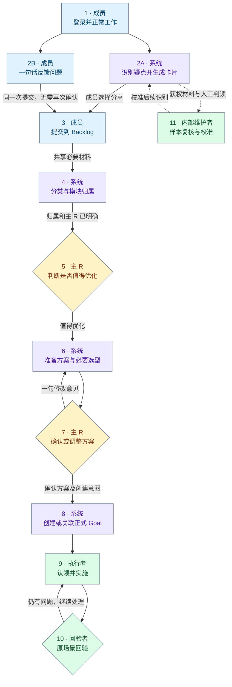

# Casebook 插件：产品流程与 Molis Work 前置能力

更新日期：2026-09-20。文档定位：Molis Work 仓库内的 Casebook 产品流程与宿主依赖概览，供各模块开发者了解正在推进的插件和接入要求。本文描述目标设计和已核对的能力基线，不是功能完成、任务指派或上线声明；详细实施与验收清单继续由 Casebook 仓库维护。

阅读方式：先看产品与编号流程，再按后文的能力清单定位相关模块。Casebook 保持独立插件仓库；Molis Work 提供公共宿主能力，本文不指定个人开发任务，也不预设必须新建服务。

## Casebook 是什么

**Casebook 是 Molis Work 内的产品改进插件，把“使用时哪里不顺”变成团队能判断、有人接手、结果可追踪的改进工作。** 它既接收系统发现的疑点，也接收成员主动反馈；两条入口汇合到同一份改进 Backlog。Casebook 判断问题分类与模块归属，团队全员能看所有模块的 Backlog；对应模块主 R 决定值得优化后，系统自动准备优化方案和必要的选型比较，主 R 确认或调整后进入正式 Goal、修复与回验。

我们希望解决的是：问题散落在聊天里、反馈成本高、相似问题难以汇总、反馈之后没有后续。成员不需要填写完整 Bug 报告，也不用替 AI 判断技术根因。**人先判断“值不值得优化”；系统自动给出“建议怎么改、为什么这样改、有什么取舍、怎么验收”；人确认或调整，不从空白开始写方案。**

### 完整流程图与编号

**图中编号与下一节逐行对应，2A / 2B 是两条入口，不是必须连续完成的两步。** 颜色按承担工作的角色区分，节点同时标明角色，不能只靠颜色识别：

- 蓝色：成员操作，包括进入、反馈和分享。
- 紫色：系统自动处理，包括识别、归属、方案与 Goal 交接。
- 橙色：模块主 R 的判断与方案决定。
- 绿色：团队执行、回验与内部校准。

实线表示单个问题的推进；虚线表示内部校准对后续识别的反馈，不是每条问题必经的审批。“全员”指同一内部团队，未提交的个人疑点不进入共享池。

为保持主线可读，未继续推进、等待与失败的处理写在对应编号的说明中：步骤 3 未提交不共享，步骤 4 未明确归属则保留待处理，步骤 5 需补充/不优化不进入方案准备，步骤 10 回验通过才记录改善结论。步骤 11 是旁路校准，不阻塞任何单条改进。

### 每一步解决什么问题、实际发生什么

| 编号 | 核心步骤（与图同名） | 解决什么问题 | 实际动作、结果与边界 |
|---|---|---|---|
| 1 | 登录并正常工作 | 避免多一套账号和额外写使用日志 | 复用 Molis Work 登录，启用插件时明确追踪/模型范围，随后继续原项目工作；登录不等于开放全部私人材料。 |
| 2A | 识别疑点并生成卡片 | 让成员不用自己发现、整理所有问题 | 系统根据意图、操作、结果和额外代价生成个人卡片，解释值得查的理由及未知；建议排查与暂存线索分区，两者都可提交。未收到事实、分析失败和未推荐分别展示，不是每次操作都出卡。 |
| 2B | 一句话反馈问题 | 系统漏看或未接入时，成员仍能低成本反馈 | 一句话描述困难，截图可选；不强制模块、复现步骤、证据或方案，不等待 AI 通过。填完后直接完成步骤 3 的提交，不再多点一次确认。 |
| 3 | 提交到 Backlog | 把个人线索转成全团队可跟进的共同事项 | 系统卡点“加入 Backlog”，人工反馈点“提交到 Backlog”；展示目标团队、团队全员可见和必要共享材料。未提交留在个人侧；提交是“值得查”，不是技术事实背书。失败保留输入，重试不重复。 |
| 4 | 分类与模块归属 | 避免成员自己懂架构、四处找负责人 | Casebook 分别判断困难类型与责任模块，依据清楚时自动归属；不明确时保留待归属/待配置主 R，事项不丢失。主 R 来自正式配置，AI 不任命；有权人可纠正，跨模块确定牵头。归属不是根因认定。 |
| 5 | 判断是否值得优化 | 让是否投入优化由负责的人判断，而非自动认定 Bug | 全员看所有模块并补充，当前牵头模块主 R 决定需补充、值得优化或不优化。需补充只问影响判断的缺口，在原事项继续；不优化保留理由，不算修复。记录操作者与对象版本，暂不要求写方案。 |
| 6 | 准备方案与必要选型 | 避免“决定要改”之后，仍让人从空白写方案 | 系统自动给出建议改法、依据、收益、工作量/依赖、风险和回验方式；有实质取舍才比较备选并推荐，不编工期。依据不足先给最小排查建议；失败可在原事项重试，原决定保留。 |
| 7 | 确认或调整方案 | 保留人的取舍权，又不增加逐字段填写与重复审批 | 当前主 R 直接采用、选备选或说一句修改意见，系统更新；手动调整可选。确认绑定看过的方案版本及创建意图，不能拿旧确认批准新内容。若已有适用方案，步骤 5 与 7 可一次完成，不强制两次点击。 |
| 8 | 创建或关联正式 Goal | 避免人工搬运方案、重复建任务及另起一套工作状态 | 系统带入问题、来源、选定方案和验收条件，在指定改进项目创建/关联一个 Goal；只有值得优化但未确认方案时不交接。重复点击/响应丢失先核对，已有 Goal 不因改派重建；相似事项由人确认关联，不自动视为同根因。 |
| 9 | 认领并实施 | 让评审结论真正有人接手，不停留在问题池 | 成员在正式 Goal 认领、排查或实施；主 R 不必亲自执行。负责人及进展归 Molis Work，Casebook 只回显，不另维护一套任务状态。 |
| 10 | 原场景回验 | 区分“代码写了”和“原来的困难真的改善了” | 在对应版本重走原场景，未改善继续处理；通过后记录结果与边界，回显到原问题。只完成排查不能算修好；已结束 Goal 后出现新问题，走正式继续/变更，不自动重开。 |
| 11 | 样本复核与校准 | 找出系统漏报、误报、误分或表达不清，持续改进识别 | 内部维护者在获权范围抽查系统判断、主动反馈、未推荐过程及适用回验结果，再校准与回归。此步旁路进行，不要求普通成员标注，不等待单条问题修完才开始；不自动训练/发布，也不把未提交/不优化当作无摩擦。 |

### 用户最终看到的产品

- **成员侧**：个人疑点卡片、轻量反馈入口；可浏览全部模块的共享 Backlog，也能筛选“我提交的”看后续。项目与检查范围在管理入口，不要求阅读技术日志。
- **主 R 侧**：同一份 Backlog 中查看“我负责的模块”，先判断是否值得优化，再看自动准备的方案/取舍并确认或调整；必要时纠正归属或转交。待归属事项另有筛选，不再新建问题池或方案中心。
- **执行侧**：继续在 Molis Work 正式 Goal 中认领和推进；修复与回验结果回到原问题。

Casebook 的 Backlog 管“哪些问题值得优化、准备采用什么方案”，Molis Work 原生 Inbox 管“当前需要我关注什么”，正式 Goal 管“谁来做、做到哪里、结果如何”。**发现疑点、提交评审、值得优化、方案已确认、完成修复、回验通过是不同事实，不互相冒充。** 首版不包含无人审批的自动改代码或自动发布。

## Molis Work 需要提供的前置能力

以下是插件消费的能力清单，不是对某位开发者的任务指派，也不表示必须新增对应服务。优先复用 Molis Work 的正式公共能力；具体接线、真实缺口和最小补充方式按模块现状确认。

**Casebook 自己负责**：获权事实的消费与整理、摩擦识别、分类/模块归属判断、优化方案与选型建议、卡片和 Backlog 业务、插件侧适配。**Molis Work 提供**：可信身份与权限、宿主运行和公开事实/模型能力、团队共享承载，以及正式 Goal 的交接与工作状态。方案生成器、分类器和 Casebook 评审页面不属于登录或团队基础模块的交付范围。

### 登录与团队协作：重点依赖

表中的 D 编号只用于本文对照，不是已发布的 API 名称。模块列表示相关能力领域，不指定个人负责人。

| 编号与能力 | 相关模块 | 对应流程 | 能力具备的标准 |
|---|---|---|---|
| D1 · 统一登录与可信身份 | Auth、Molis Work 身份接入、插件 Host | 1，及后续所有获权操作 | 已登录用户直接进入插件，不另登 GitHub；宿主提供稳定用户/团队身份和会话状态，同一人跨设备一致，不把凭据交给插件。退出、过期和撤权后旧身份不能继续访问/写入。 |
| D2 · 模块目录、主 R 与权限 | 团队配置、权限执行层 | 3–8 | 提供模块稳定 ID、名称、职责、状态、当前主 R 及配置版本；同团队全员读所有模块的已共享 Backlog，只有当前牵头模块主 R 决定优化与采用方案。归属维护权限独立，AI 不授予权限；换主 R、改派或离队后服务端重新验权。 |
| D3 · 团队共享与动作留痕 | 团队数据承载、附件/共享能力 | 3–8、10 | 问题、合法共享依据/截图、归属、方案和评审版本跨设备一致，不依赖提交人的电脑在线。记录谁在何时对哪个版本作了什么决定及理由；重试不重复、并发不静默覆盖，跨团队隔离，撤回/删除传播到共享材料。 |
| D4 · 正式 Goal 交接与协作 | Goals、团队工作协作 | 8–10 | 接收当前主 R 对具体方案及创建意图的可信确认，在指定团队项目创建/关联一个 Goal 并可核对结果；重复请求不重复建。成员能认领/转交，负责人、进展与结果跨设备一致，并发认领有明确结果；插件能读回状态。 |

共同边界：全员可见只覆盖已经合法分享的必要材料，不开放私人经历或源项目全文；有 Backlog 阅读权不等于有源项目读取权。D2 提供可信配置与可执行的权限依据，Casebook 按它实现业务判断和受保护写入，不复制一份负责人真相，也不能只在 UI 隐藏按钮。D3 是公共共享承载，不等于平台要实现 Casebook 的问题结构和评审页面。D4 不另建任务系统，正式 Goal 的状态仍归 Goals。

### 其他宿主前置能力：由 Casebook 侧接入与适配

这些同样是插件运行的前置条件，但不扩成登录/团队模块的开发任务；列在这里是为了让各模块开发时能看到消费关系。H 编号也只是本文索引。

| 编号与能力 | 相关模块 | 对应流程 | 最小消费边界 |
|---|---|---|---|
| H1 · 插件安装、生命周期与界面接入 | Plugin SDK / Runtime、Workbench / UI Host | 1–10 | 正式入口、权限声明、启停、路由/页面贡献及受控调用可用；停用后不继续采集/分析，不复制独立站登录外壳。 |
| H2 · 操作事实及必要背景 | 各业务模块、Workbench、Work / Runtime | 2A、4、6、11 | 提供获权、可关联、有版本和覆盖范围的事实及必要背景；可增量读取/恢复，未观测明确为未知。Casebook 不直读内部数据库；H2 不可用仍能走人工反馈 2B。 |
| H3 · 获权的模型运行 | Agent Host / 模型 Runtime | 2A、4、6、11 | 在允许范围内运行分析/方案准备，能识别成功、失败、取消并控制重试与预算；Casebook 管理分析/方案逻辑，不自建第二套模型管理或扩大数据范围。 |
| H4 · 插件隔离的持久存储 | Host / 插件存储 | 2A、4、6，及恢复过程 | 私人材料、游标、分析及待处理请求跨重启保留，支持明确的原子更新/冲突处理；不能用空存储替身冒充。私人状态不等于 D3 的团队共享记录。 |

人工提交可以先在 D1–D3 与插件入口就绪时贯通，不等待自动识别完备；系统识别依赖 H2/H3，自动方案依赖 H3 和足够背景，跨设备领取/回验依赖 D4。接口字段、源码存在、生产可调用、Casebook 联调通过和真实用户验收是不同状态。

### 已核对基础与待核实缺口

最近一次源码核对记录为 Molis Work `3acd20a`、Auth `b35e2d9`；以下不是本轮实时运行检测，也不代表后续提交没有变化。接入时以模块当前公开合同与实际调用为准。

| 能力 | 已核对基础 / 未确认项 | 接入时需要核实的内容 |
|---|---|---|
| D1 · 登录身份 | Auth 已有登录、团队与权限检查基础 | Molis Work 到插件的可信身份接线、跨设备身份一致及退出/撤权行为 |
| D2 · 模块主 R | 尚未验证可调用的模块目录/主 R 配置入口 | 权威目录、职责/负责人及变更读取、归属维护权限和服务端评审权限执行 |
| D3 · 团队共享 | Casebook 已有本地保存/评审；上述 Molis Work 基线未提供已验证的完整团队共享接线 | 可用的最小持久共享承载、动作历史、附件访问、并发与删除传播；本地 JSON 和登录本身不满足这一项 |
| D4 · 正式 Goal | 已有创建与状态读取基础 | 插件可信交接、结果核对、团队认领/转交及跨设备一致性，不能把基础接口存在当成团队闭环已通 |
| H1–H4 · 其他宿主能力 | 已有 SDK / Runtime / Agent Host 等基础；Casebook 所需的具体事实覆盖、模型路径与真实私人存储仍须逐项验 | 由 Casebook 按公开能力接入；不因某条宿主路径已接线就宣称所有插件能力可用，发现缺口时记录具体消费失败和提供模块 |

各模块的接入记录只需补充：**可调用入口与版本、已有/待接线/确有缺口、消费限制、验证证据**。能力所有权以 Molis Work 正式模块定义为准；实现可小于本文的示例形态，但不能省掉对应用户场景。

## 如何判断这些依赖已接通

用两台或以上设备，覆盖普通成员和不同模块主 R，沿同一套编号走通：

- **1–3**：单次登录，两种来源都能形成可提交材料；人工反馈不等待自动分析，提交后同团队全员可见。
- **4–7**：归属可追溯，只有对应主 R 能决定；值得优化后自动出方案，另一设备可看到同版方案并确认。
- **8–10**：确认后只创建/关联一个正式 Goal，成员认领推进，原问题回显正式进展及真实回验结果。
- **异常路径**：待归属、换主 R、旧权限/旧方案确认、并发、断线恢复与跨团队访问有正确结果。不能只用全局管理员验证一次。

上述验证检查宿主能力与协作链路；识别效果、归属与方案质量、卡片是否好懂由 Casebook 另行验证。步骤 11 通过获权样本逐步校准，不用 Mock、历史样本数量或接口返回成功冒充效果验收。

## 后续开发放在哪里

本阶段沿用 Casebook 独立仓库方案：**Casebook 的能力在 Casebook 仓库开发，插件在 Molis Work 里运行与验收。** 仓库位置与用户入口是两件事，不因保留独立仓库而保留第二套登录、独立站外壳或手动同步流程。

| 要改的内容 | 开发与维护位置 | 边界 |
|---|---|---|
| 摩擦识别、样本校准、分类与模块归属建议、卡片、轻量反馈、改进 Backlog、自动方案、插件侧 UI 与适配 | `molis-ai/goalboard-casebook` | 插件业务只维护一份实现；通过正式 SDK / 公共能力访问宿主，不复制宿主事实或权限系统。 |
| 插件装配与宿主接线、公开事实出口、可信身份注入、团队权限与共享承载、Goal 交接 | `molis-ai/molis-work` 的对应 owner | 优先复用已有能力，仅补经过消费验证的缺口；不把 Casebook 分析器和 Backlog 业务复制进宿主。独立 Auth 的能力仍按其正式合同对接。 |
| 面向 Molis Work 开发者的产品流程与前置依赖 | 本文 `specs/casebook-plugin/spec.md` | 让宿主各模块能找到消费方要求；不能在本文重新定义模块所有权或宣称尚未提供的 API 已可用。 |

现有 [Plugin 开发说明](../../docs/platform/PLUGIN-DEVELOPMENT.md)已经给出仓库外作者项目通过 SDK 运行的路径，但该样例主要验证 polling Integration，**不能据此认定 Casebook 这种带页面和评审流程的插件已能完整安装和运行**。接入时仍需验证目标插件类型、UI / Host 调用、持久化、启停与发布方式；缺口按 H1–H4 处理，不用 iframe 包装旧站冒充完成。

日常改进的顺序是：在 Casebook 改能力并做定向验证，用明确版本的插件和 Molis Work 做真实联调；若失败来自宿主缺少公共能力，再在 Molis Work 对应模块补充并验证。最终验收必须从 Molis Work 登录、进入插件、提交与评审、Goal 交接一路走通，不能只验收旧独立页面。

本次只收录文档与索引，不新建 `plugins/native/casebook` 占位包、不注册可用插件，也不迁移现有代码或数据。若后续确认需要随主应用内置发布，且现有独立包接入无法满足实际交付，再单独评估是否迁入 monorepo；迁移应有唯一写入源、版本和数据兼容、回退及真实验收，不长期保留两份实现。

## 文档归属与参考

- 本文是 Molis Work 仓库中 Casebook 产品流程与宿主依赖的维护入口。Casebook 仓库的原 Memo 是起草来源，不再作为另一份独立更新的宿主概览；本文不复制完整实施清单，也不替代各模块的正式合同。
- 详细实现目标、接入边界和验收清单仍在 [Casebook 仓库](https://github.com/molis-ai/goalboard-casebook)的 `docs/Molis-Work-插件化实施方案.md`、`docs/Molis-Work-插件接入契约.md`、`docs/Molis-Work-插件化验收清单.md` 中维护。跨仓库发布时应对齐文档版本，避免概览与详细约定不一致。
- 已核对基线参考：[Molis Work 能力表](https://github.com/molis-ai/molis-work/blob/3acd20a94f6ea0874f39f34c5b4d79d3921dd7ad/docs/SSOT-MATRIX.md)、[Auth 接入合同](https://github.com/molis-ai/auth/blob/b35e2d92f0ed03c4fe0bf73826ce90dfff2a9921/docs/login-integration.md)。

产品流程或宿主依赖发生变化时更新本文，并核对 Casebook 详细方案的一致性；具体接口与完成状态仍以相关模块的正式合同和验证记录为准。文档收录不改变任何能力的实现或验收状态。
