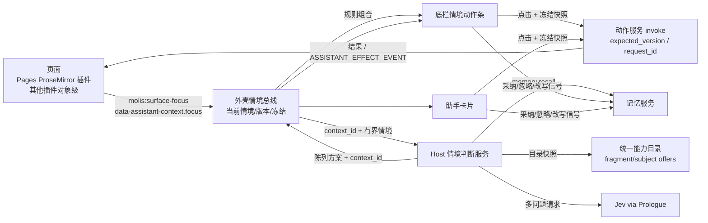

# 情境驱动的动态交互：唯一 spec

> 状态：进行中（2026-09-30 开工），当前阶段 P0（spec 与高保真切片）。目标与推进方式见 [goal-prompt.md](goal-prompt.md)。
> 分支：`feature/contextual-interaction`，从 origin/main fa27207a 开出。
> 相关线：记忆（`feature/memory-system`，会话 [9c322a]）· 底栏与助手面板（`claude/determined-stonebraker-06644e`，会话 [3c6203]）· 页面动线与状态暂存（`claude/page-interaction-flow-redesign-49fe35`，会话 [47c510]）· 系统级助理（`feature/system-assistant`，会话 [a806f0]）。

## 1. 体验目标

用户操作内容时，界面自然给出此刻最合适的工具、建议和下一步：

- **主内容区**提供情境，预览和结果尽量在原位置出现；
- **底栏**给出稳定、可快速点击的动作组合；
- **助手**负责解释、选项、预览、比较和结果，输入框随时可用于说得更具体。

判断由 Jev 这类判断模型结合现有模型能力完成。判断结果决定底栏和助手出现什么、按什么顺序、如何分组、突出哪一项。动作只来自统一能力目录，只有用户明确操作才执行。

完整需求见 goal-prompt。本 spec 只写落地设计。

## 2. 现状（均已对照代码核对）

| 部分 | 事实 | 对本需求的意义 |
| --- | --- | --- |
| 主内容区 | 原生插件页与外壳在同一文档里渲染；`tab-workspace` 会给分屏窗格或条目标签放 iframe（`iframe[data-pane-tab]`） | 情境声明要能跨 frame 转发 |
| Pages 编辑器 | ProseMirror（`plugins/native/pages/src/editor-browser.ts`）。有文字选区、块选区（`NodeSelection`、`blockSpanFromRange`、块手柄），文档带 `version`，`pages.update` 支持 `expected_version` | 已能表达“词 / 句 / 段 / 块 / 多块”，也有防覆盖的基础 |
| Pages AI | 写作菜单固定 16 项（`openAi`），结果先作为候选，确认后写入。**但写入时用的是“当下”的选区**（`replaceSelectionText(view, …)`）：等待期间换了选区，结果就会落到别处 | 这正是需求点名的错配，本线要修 |
| 界面上下文协议（助理分支） | 页面根元素带 `data-assistant-context`（插件、对象及版本、是否未保存、草稿、starters），已有 10 个插件接入；发送时捕获选中文字（有长度上限）；还有 `ASSISTANT_EFFECT_EVENT` 和 `ASSISTANT_SURFACE_CHANGED_EVENT` 两个事件 | 本线在它上面扩展出细粒度、持续更新的情境，不另建一套 |
| 底栏与助手（面板改版第二期，已约定） | `.bar-start` 插件切换器与 Dock；`.bar-center [data-assistant-island]` 输入框与芯片，面板在它上方；`AssistantCard` 带精确能力和准备好的参数，状态有确认、执行、忽略、失效后重新准备；页面消息用 `molis:assistant-message` | 挂载点与事件见 §6.3 |
| 统一动作服务 | 目录项（`ActionView`）有对象类型、受众、权限、实时可用性。subject offers 负责准备完整参数但不执行；插件静态声明 `subject_offer_choices`，作为 Jev 的有限选项（key 不超过 64 字符）；判断场景（`home.dock`）绑定时会核对完整选项集 | 候选动作的来源和校验机制都已存在 |
| 可用动作（节选） | Pages：`ai`（只出候选）、`update`、`generate`、`extract`、`promote`。Goals：`create`、`tree.submit`、`relations.add`、`planning.impact`、`planning.graph.check`、`progress.record`。另有灵光、系统搜索、助理开新工作等 | 各场景的第一批候选；以实际登记为准 |
| 模型 | Jev 经 TypeSafe SystemOne 调用，走 Prologue 推理（`typesafe-prologue.ts`，超时 30 秒）。**一次请求可以带多个问题**（choice / score / noul），choice 返回所有选项的概率和置信度。生成类调用经 `completeText` 走 Prologue。Prologue 的 `createFunctionEngine`、`packContext`、`screenInbound` 可以直接用 | 一次判断就能同时得到排序、意图和是否打扰（§5.2） |
| 页面位置（动线线，未合并） | 每个窗格有历史栈；离开插件页时节点移进池里（隐藏、不销毁），EditorView 和 `state.selection` 都保留，但 DOM 选区和焦点会丢，回来时要显式 `view.focus()` 或 dispatch 一次 setSelection。分屏窗格是 iframe，最多保留 4 个隐藏 frame。刷新后只重开插件页里点开的那条记录，编辑器选区不跨刷新。已加 document 事件 `molis-work:place-changed` {paneId, place, previous}，只在焦点窗格的位置真正变化时派发 | 位置一变就作废当前判断；回到页面时由情境提供者恢复 DOM 选区和情境；被卸掉的 frame 与刷新都视为新情境 |
| 记忆（记忆线） | 将提供 `memory.recall`（按情境读偏好和约定）和界面信号上报 | 作为判断输入；忽略和采纳的信号交给它 |

## 3. 交互设计

### 3.1 三块分工

| 区域 | 职责 | 稳定规则 |
| --- | --- | --- |
| 主内容区 | 声明情境；预览在原位置出现（差异高亮、候选文字、将要创建的条目轮廓）；执行后结果在原位置落地 | 点击底栏或助手时，选区保持高亮（用 decoration 保留，不依赖焦点） |
| 底栏情境动作条（输入框正上方） | 最多 3 个主动作，加上“更多”；“更多”里按意图分组，小标题样式与插件切换器一致；常驻“全部操作”入口，内容从目录派生，不依赖判断 | 位置固定；鼠标悬停或键盘焦点所在的按钮不移动；输入中不重排；变化只淡入（`--dur-250`），不做布局动画 |
| 助手 | 用 `AssistantCard` 呈现建议、选项、预览、比较和结果，同时出现在左栏“还等你处理”里；输入框随时可以接着说，自然语言调整作用于同一情境 | 只有判断认为值得时才主动出现（§5.2 的 `speak_up`）；不抢焦点 |

### 3.2 情境

- **粒度**：页面 → 对象 → 局部（词、句、段、块、多块、多对象）。
- **动作**：浏览、选择、编辑、比较、完成。
- **组合方式**：同一选区类型，会因内容语义（观点、计划、数据、术语）、所在位置（标题路径、周围内容）、当前目标和近期工作而得到不同组合。

### 3.3 代表场景（切片和验收覆盖）

| # | 情境 | 可能的组合（示例，不是固定菜单） | 候选来源 |
| --- | --- | --- | --- |
| S1 | 选中一个观点 | 找依据（系统搜索加已关联材料）· 提反例 · 展开讨论（交给助理并带上这段） | 搜索、助理、Pages `ai` |
| S2 | 选中一段计划 | 拆解步骤 · 关联目标 · 识别依赖 | Goals `tree.submit` / `relations.add` / `planning.graph.check` |
| S3 | 选中两段内容或多份材料 | 比较（比较卡）· 建立联系 · 提炼 · 合并成新稿 | Pages `generate`、关联服务、助理 |
| S4 | 正在编辑 | 局部改写建议、可比较的版本、就地修改预览；采纳后按版本写入 | Pages `ai` 加 `update(expected_version)` |
| S5 | 完成一个步骤或推进目标 | 下一步工具、相关材料、记录进展 | Goals `progress.record`、事件、相关对象 |
| S6 | 同一类型选区、不同语义或任务（例如同样是一段话，在周报里和在研究笔记里） | 组合与重点不同 | 同上，由判断决定 |
| S7（探索） | 选中一个术语 | 解释 · 统一用词 · 查找出现处 | Pages `ai`、查找 |
| S8（探索） | 选中表格 | 转为数据集 · 画图 · 核对数字 | Dataset 等插件，以登记为准 |

### 3.4 稳定与可预测

- **两层响应**：
  - 即时层：选区稳定 350ms 内，按规则从目录派生基础组合（不经模型），先放上去；
  - 判断层：Jev 结果回来后，只改顺序、重点和分组，遵守 §3.1 的不移动规则。
- **情境版本**：`context_id = hash(窗格, 对象 id + 版本, 选区锚点 + 文字摘要, 目标, 活动)`。每次判断请求都带上它；结果回来时如果不等于当前值，就丢弃，不渲染。位置变化（`place-changed`）、切换对象、切换目标都会让它变化。
- **冻结快照**：点击底栏或助手元素时，先冻结当时的情境（对象、版本、选区锚点、文字），之后的预览和执行都用这份快照。编辑器用 ProseMirror 的 Mapping 跟踪锚点；如果选区文字已经变了，就标“已失效”并提供“按现在的内容重新准备”，不作用到别处。
- **不重复**：同一情境下被忽略的动作降权；同一动作不会同时作为底栏和助手的主推荐。
- **缓存**：相同 `context_id` 直接复用最近一次判断；编辑时只对停下来的段落重新判断。

## 4. 上下文流转



### 4.1 情境声明（页面 → 外壳）

在 `AssistantSurfaceContext` 上增加 `focus` 字段，并在变化时派发 `molis:surface-focus`；iframe 里的窗格用 postMessage 转发给外壳：

```ts
interface SurfaceFocus {
  context_id: string;                 // 页面生成；情境一变就换
  activity: "browsing" | "selecting" | "editing" | "comparing" | "completed";
  granularity: "page" | "object" | "word" | "range" | "block" | "blocks" | "objects";
  object: AssistantObjectRef;         // 带版本
  targets: Array<{
    kind: "text_range" | "block" | "object";
    anchor?: number; head?: number;   // 只对该版本有效
    role?: "heading" | "paragraph" | "list" | "task" | "table" | "quote" | "code";
    text: string;                     // 有上限，超出标 truncated
    truncated?: boolean;
  }>;
  surroundings?: { heading_path: string[]; before?: string; after?: string }; // 各不超过 300 字
  unsaved?: boolean;
}
```

Pages 用一个 ProseMirror 插件的 view update 维护它；其他插件第一期只声明对象级情境。这套约定写进插件开发手册。

### 4.2 采集边界

- **只取**：
  - 选中内容，不超过 2000 字，超出截断并标注；
  - 标题路径和前后文；
  - 对象的标题、类型、版本；
  - 关联 Goal 的标题和状态；
  - 近期工作：最近 3 个动作的名称，不含正文；
  - 记忆召回的偏好和约定，不超过 5 条。
- **不取**：整篇文档、其他对象的正文、未授权插件的数据、只对本人可见的来源（例如 Shelf 剪贴板）。
- **处理**：先用 `redactText` 去掉形似秘密的内容；再用 `screenInbound` 检查，像是在下指令的文字只作为数据放在引用块里，并在回执里标出。
- **不留痕**：选中而未执行时，不写任何业务记录；判断记录只保存 `context_id`、输入摘要哈希、选项和结果，不保存正文。

## 5. 模型输入与输出

### 5.1 候选集：来自统一能力目录

- **新增“片段 offers”协议**，沿用 subject offers 的做法：
  - 插件声明 `defineFragmentOffersAction(capabilityId, fragmentKinds, title, permissions, choices)`，其中静态的 `choices` 包括 offer_id、标题、**意图**、目标动作和版本；
  - 查询时输入片段（文字、块角色、对象引用和版本），返回准备好的完整参数；查询不执行任何写入；
  - Host 从授权目录快照中派生候选，并检查可用性。
- **意图分组**由声明决定，模型不能自造：理解、质疑、展开、组织、关联、改写、比较与合并、记录、推进。
- **平台通用候选**：“就这段问助手”（开新工作并带上材料）、“找依据”（系统搜索）。它们同样是目录里的动作。
- **规则预筛**：按片段类型、对象类型、权限和可用性筛到不超过 16 个，再交给判断。

### 5.2 判断：Jev 一次请求带多个问题

- **state**：有上限的结构化文本，分为用户动作、对象、选中内容、周围内容、目标、近期工作、偏好与约定几节，全部标为数据。
- **questions**：

  | key | 类型 | 选项 | 用于 |
  | --- | --- | --- | --- |
  | `next` | choice | 候选 offer 的 key（≤16） | 概率用于排序；top-1 的概率和置信度决定重点 |
  | `intent` | choice | 意图类别 | 分组和“更多”的排序；助手卡片的主题 |
  | `surface` | choice | none / suggest / options / preview / compare | 助手用什么形式参与 |
  | `speak_up` | noul | 是 / 否 | 助手是否主动出现（否则只改变底栏） |

- **确定性的陈列策略**把判断输出变成界面，因此“判断真正影响界面”，同时界面仍然稳定、可测：
  - 底栏主动作：`P(next) ≥ τ1` 的前 3 个；
  - 重点：top-1 满足 `P ≥ τ2` 且置信度 `≥ c`；
  - “更多”：其余候选按声明的意图分组，组的顺序按 `P(intent)`；
  - 助手：`speak_up ≥ τ3` 且 `surface ≠ none` 时，按该形式为最可能的意图出一张卡。
- 阈值在切片里用真实 Jev 调出来，写进决策记录。

### 5.3 生成：只在点击之后

- 预览、改写、比较的内容，只在用户点击后生成：
  - 改写和续写用 `pages.ai`；
  - 比较、提炼用 Prologue 有限函数，输出类型化结构，例如比较输出 `{common[], differences[], conflicts[]}`。
- 第一期不做预取。

### 5.4 Jev 与普通模型的评估

- **做法**：在切片里准备约 30 个带标注的情境（覆盖 S1–S8，同一类型选区有多种语义），用离线回放比较三种方案的延迟（p50、p95）和“合理组合”命中率：
  - Jev 多问题；
  - 普通模型经 Prologue 有限函数；
  - 纯规则。
- **兜底链**：Jev → 规则。普通模型只在评估证明明显更好且延迟可接受时才加入。
- 评估结论写进决策记录。

## 6. 组件边界

### 6.1 组件与归属

| 组件 | 职责 | 归属 |
| --- | --- | --- |
| 页面情境提供者 | Pages 的 ProseMirror 插件；其他插件的对象级声明 | 本线；约定写进插件手册 |
| 外壳情境总线（workbench client，新文件） | 汇总当前情境，维护版本，冻结快照，跨 frame 转发，响应 `place-changed` | 本线 |
| Host 情境判断服务（`apps/local-host/src/contextual/`，逻辑放 horizontal 包） | 派生候选、采集、筛查、打包、调用 Jev、陈列策略、缓存、取消 | 本线 |
| 底栏情境动作条 | 容器与事件由面板线加；内容与交互由本线提供 | 面板线 + 本线 |
| 助手卡片 | 沿用 `AssistantCard`；本线提供卡片数据和动作 | 面板线 / 助理线 + 本线 |
| 执行 | 统一动作服务 invoke | 已有 |
| 记忆 | `memory.recall`、界面信号上报 | 记忆线 |
| 页面位置与暂存 | 窗格历史、表面池、`place-changed` | 动线线 |

### 6.2 合同落点

- `packages/contracts/src/platform/action-fragments.ts`：片段 offers 的定义；
- `packages/contracts/src/services/contextual.ts`：`SurfaceFocus`、判断请求与结果、陈列方案；
- 事件名常量与 `ASSISTANT_*` 放在一起，第一期先放在本线的合同文件里，合并时再归位。

### 6.3 与面板改版线约定的挂载点（2026-09-30）

- **底栏**：容器 `[data-assistant-context-actions]`，位置在输入框正上方（原建议条的位置）。事件 `molis:assistant-context-actions`，内容为 `{source, object, actions: [{id, capability_id, title, primary?}]}`，按 `molis:assistant-message` 的规矩清洗。点击时发 `molis:assistant-context-action-chosen`，或者走“开新工作并带上这张卡”。“更多”按意图分组，小标题样式与插件切换器一致；容器是否原生支持分组，看过切片后再定。真实接入前先通知面板线，由它加容器；在那之前不放空容器。
- **助手**：预览和比较不另开区域，做成对话里的卡片（比较就是一张多选项的卡），同时出现在左栏“还等你处理”里。

## 7. 动作执行边界

- **浏览和选择**：只触发片段 offers 查询（不写）和判断，不写任何业务记录。
- **点击后分三类**：
  - 纯生成（不写）：直接出结果卡；
  - 可撤回的就地修改（例如替换选中文字）：先在原位置显示差异预览，点“应用”后用 `update(expected_version)` 写入，并提供撤销；
  - 其他写入（创建 Goal、建立关联、新建文档等）：先出参数可见、可修改的预览卡，确认后执行。沿用助理授权“写入逐次按参数确认”；已有的授权规则可以省掉这一步。
- **防重与防错**：每次点击生成 `request_id`，重复点击不会重复执行。执行前 Host 重新核对授权、对象版本和冻结快照；对不上就标失效，提供重新准备。
- **结果反馈**：原位置刷新（页面收到 `ASSISTANT_EFFECT_EVENT` 后重读，保留未保存的编辑）；卡片显示结果、打开入口和撤销（动作支持撤销时）。
- **不依赖判断的入口**：“全部操作”列出当前片段或对象可用的全部动作；原有编辑器菜单（包括写作菜单）继续可用。

## 8. 失败与恢复

| 情况 | 行为 |
| --- | --- |
| Jev 未配置、失败 | 保持规则组合；动作条上有一个不打扰的状态点，说明“按规则排列”；“全部操作”可用 |
| 判断慢或超时 | 先用规则组合；判断超过渲染预算（先定 1.5 秒，切片里调整）后，晚到的结果仍按 `context_id` 检查是否适用，适用时才按不移动规则更新；上限 30 秒后取消 |
| 快速切换选区 | 旧请求用 AbortSignal 取消；晚到的结果按 `context_id` 丢弃 |
| 目录变化或撤权 | 下一次判断用新快照；执行前重新核对，不可用就说明原因 |
| 对象已变或已删 | 映射锚点；文字变了就标失效并提供重新准备；删除后卡片显示“已不存在” |
| 执行失败或结果未确认 | 卡片显示实际状态；不自动重试写入；“结果未确认”需人核对后重新执行 |
| 记忆不可用 | 不带偏好继续判断，并在回执里说明 |

## 9. 高保真可交互切片（P0）

- **形态**：独立预览（`scripts/preview-contextual-interaction.mts`，加上 launch.json 预览项）。
  - 真实部分：Pages 编辑器（ProseMirror）和设计系统；
  - 复刻部分：底栏和助手按面板改版第二期的结构复刻，页面上标注“外壳为复刻”。
- **内容**：逼真的项目，包括 Q4 计划文档（含计划段落和观点段落）、一篇研究笔记、两份竞品材料，以及关联的 Goal 树。
- **哪些是真的**：情境感知与版本、冻结快照、陈列策略、片段 offers（在切片内实现 Pages 的几项）、`pages.ai` 预览（有模型时）、所有稳定规则。
- **判断可切换**：真实 Jev（有 Key 时，在进程内读取）/ 录制回放 / 纯规则。页面上显示当前用的是哪一种。
- **模拟（标明）**：外壳、跨插件动作的执行（Goals 创建等落到切片内的替身）、记忆（替身）。
- **走查剧本**：
  - S1–S6；
  - 快速切换选区；
  - 注入 3 秒延迟的慢判断；
  - 判断失败；
  - 打字过程中结果到达；
  - 点击底栏后选区保持；
  - 文档在预览期间被改动。
- **产出**：截图或录屏、延迟数据、30 个情境的离线回放结果、用户试用反馈。据此修订 spec，再进入 P1。

## 10. 分期

| 期 | 内容 | 依赖 |
| --- | --- | --- |
| P0 | spec + 高保真切片 + Jev 评估 | 无 |
| P1 | 情境协议、片段 offers 合同、Host 判断服务真实接入；Pages 情境提供者；修复写作菜单写错选区的问题；底栏和助手挂载 | 面板线第二期提交；动线线的 `place-changed` |
| P2 | Goals、灵光、Feed、Dataset 等的片段 / 对象 offers；多对象情境 | P1 |
| P3 | 记忆召回和界面信号闭环 | 记忆线 M1 合同 |
| P4 | 全量验证与打磨：多种宽度、深色、键盘、读屏、失败注入 | 全部 |

## 11. 验收标准

- **AC-C01**：同一类型选区（例如一段话），在不同语义和任务情境下，底栏组合、重点和助手形式有意义地不同（用 S6 的成对样例和真实 Jev 证明，并附判断回执）。
- **AC-C02**：S1–S5 各自完整走通“选择 → 界面变化 → 选择操作 → 预览或执行 → 结果反馈”，作用对象和版本正确，结果在原位置可见。
- **AC-C03**：快速切换选区（间隔小于判断延迟）时，界面从不显示上一个选区的判断结果（有 `context_id` 丢弃记录）。
- **AC-C04**：点击底栏或助手元素后，编辑器选区和高亮保持；执行作用于点击时冻结的选区。等待期间用户改了选区，结果不会落到新选区（修复写作菜单现有的问题）。
- **AC-C05**：预览期间文档被改动时，应用会被拦下并提示重新准备，不会覆盖用户的新修改。
- **AC-C06**：重复点击同一动作只执行一次。
- **AC-C07**：鼠标悬停或键盘焦点所在的动作，不因判断到达而移动；输入中不重排。
- **AC-C08**：Jev 未配置、失败、超时时，规则组合和“全部操作”可用，原有编辑器菜单不受影响。
- **AC-C09**：选中未执行时不产生任何业务写入；只有明确点击或已有授权才写入。写入前参数可见。
- **AC-C10**：发给模型的上下文在 §4.2 的边界内，敏感形状已去除（有回执可查）。
- **AC-C11**：候选动作全部来自统一能力目录；撤权或停用插件后，对应候选消失，执行也被拒绝。
- **AC-C12**：有记忆时，偏好和约定会影响判断（例如“周报风险在前”），关闭记忆后不再影响。
- **AC-C13**：在 1440、1024、800、390 宽度和深色下，用真实浏览器走通关键状态；键盘可以打开和选择情境动作；读屏能礼貌地播报变化。
- **AC-C14**：工程验证、真实场景验证（真实 Jev 与模型）和用户本人的体验认可分别记录；模拟和未验证的部分如实写明。

## 12. 决策记录

| 日期 | 决定 | 来源 |
| --- | --- | --- |
| 2026-09-30 | 与记忆系统分成两条线并行；本线只通过 `memory.*` 使用记忆 | 用户 |
| 2026-09-30 | 底栏挂在输入框上方的情境动作条，助手用对话卡片加左栏“还等你处理”；分组放进“更多” | 与面板线约定 |
| 2026-09-30 | 判断采用“Jev 多问题 + 确定性陈列策略”，而不是让模型直接生成布局，保证稳定可测；是否换成普通模型由 §5.4 的评估决定 | 按推荐 |
| 2026-09-30 | 候选动作只来自目录；新增片段 offers 协议，沿用 subject offers 的有限选项与校验 | 按推荐 |

## 13. 进度与证据

- 2026-09-30：摸底完成（§2），spec 初稿完成。与面板线、动线线、助理线、记忆线对齐了边界和挂载点。下一步：P0 切片。

## 14. 待定

- 容器是否原生支持分组：看过切片后与面板线一起定。
- 渲染预算（1.5 秒）和阈值 τ：用真实 Jev 的延迟数据确定。
- 其他插件的片段 offers 第一批名单：P2 开始前按真实动作列出。
