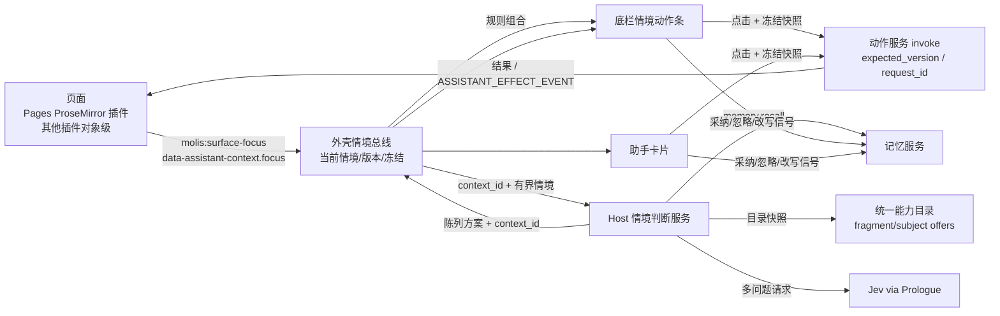

# 情境驱动的动态交互：唯一 spec

> 状态：进行中（2026-09-30 开工）。P0 完成（待用户试用）；P1 真实接入完成，Pages 已在真实工作台接通（§13.2），合并排在最后、直接对 main 开 PR；下一步 P2。目标与推进方式见 [goal-prompt.md](goal-prompt.md)。
> 分支：`feature/contextual-interaction`，从 origin/main fa27207a 开出。
> 相关线：记忆（`feature/memory-system`，会话 [9c322a]）· 底栏与助手面板（`claude/determined-stonebraker-06644e`，会话 [3c6203]）· 页面动线与状态暂存（`claude/page-interaction-flow-redesign-49fe35`，会话 [47c510]）· 系统级助理（`feature/system-assistant`，会话 [a806f0]）。

## 1. 体验目标

用户操作内容时，界面自然给出此刻最合适的工具、建议和下一步：

- **主内容区**提供情境，预览和结果尽量在原位置出现；
- **底栏**给出稳定、可快速点击的动作组合；
- **助手**负责解释、选项、预览、比较和结果，输入框随时可用于说得更具体。

判断由 Jev 这类判断模型结合现有模型能力完成。判断结果决定底栏和助手出现什么、按什么顺序、如何分组、突出哪一项。动作只来自统一能力目录，只有用户明确操作才执行。

完整需求见 goal-prompt。本 spec 只写落地设计。

## 2. 现状（均已对照代码核对）

| 部分 | 事实 | 对本需求的意义 |
| --- | --- | --- |
| 主内容区 | 原生插件页与外壳在同一文档里渲染；`tab-workspace` 会给分屏窗格或条目标签放 iframe（`iframe[data-pane-tab]`） | 情境声明要能跨 frame 转发 |
| Pages 编辑器 | ProseMirror（`plugins/native/pages/src/editor-browser.ts`）。有文字选区、块选区（`NodeSelection`、`blockSpanFromRange`、块手柄），文档带 `version`，`pages.update` 支持 `expected_version` | 已能表达“词 / 句 / 段 / 块 / 多块”，也有防覆盖的基础 |
| Pages AI | 写作菜单固定 16 项（`openAi`），结果先作为候选，确认后写入。**但写入时用的是“当下”的选区**（`replaceSelectionText(view, …)`）：等待期间换了选区，结果就会落到别处 | 这正是需求点名的错配，本线要修 |
| 界面上下文协议（助理分支） | 页面根元素带 `data-assistant-context`（插件、对象及版本、是否未保存、草稿、starters），已有 10 个插件接入；发送时捕获选中文字（有长度上限）；还有 `ASSISTANT_EFFECT_EVENT` 和 `ASSISTANT_SURFACE_CHANGED_EVENT` 两个事件 | 本线在它上面扩展出细粒度、持续更新的情境，不另建一套 |
| 底栏与助手（面板改版第二期，已约定） | `.bar-start` 插件切换器与 Dock；`.bar-center [data-assistant-island]` 输入框与芯片，面板在它上方；`AssistantCard` 带精确能力和准备好的参数，状态有确认、执行、忽略、失效后重新准备；页面消息用 `molis:assistant-message` | 挂载点与事件见 §6.3 |
| 统一动作服务 | 目录项（`ActionView`）有对象类型、受众、权限、实时可用性。subject offers 负责准备完整参数但不执行；插件静态声明 `subject_offer_choices`，作为 Jev 的有限选项（key 不超过 64 字符）；判断场景（`home.dock`）绑定时会核对完整选项集 | 候选动作的来源和校验机制都已存在 |
| 可用动作（节选） | Pages：`ai`（只出候选）、`update`、`generate`、`extract`、`promote`。Goals：`create`、`tree.submit`、`relations.add`、`planning.impact`、`planning.graph.check`、`progress.record`。另有灵光、系统搜索、助理开新工作等 | 各场景的第一批候选；以实际登记为准 |
| 模型 | Jev 经 TypeSafe SystemOne 调用，走 Prologue 推理（`typesafe-prologue.ts`，超时 30 秒）。**一次请求可以带多个问题**（choice / score / noul），choice 返回所有选项的概率和置信度。生成类调用经 `completeText` 走 Prologue。Prologue 的 `createFunctionEngine`、`packContext`、`screenInbound` 可以直接用 | 一次判断就能同时得到排序、意图和是否打扰（§5.2） |
| 页面位置（动线线，未合并） | 每个窗格有历史栈；离开插件页时节点移进池里（隐藏、不销毁），EditorView 和 `state.selection` 都保留，但 DOM 选区和焦点会丢，回来时要显式 `view.focus()` 或 dispatch 一次 setSelection。分屏窗格是 iframe，最多保留 4 个隐藏 frame。刷新后只重开插件页里点开的那条记录，编辑器选区不跨刷新。已加 document 事件 `molis-work:place-changed` {paneId, place, previous}，只在焦点窗格的位置真正变化时派发 | 位置一变就作废当前判断；回到页面时由情境提供者恢复 DOM 选区和情境；被卸掉的 frame 与刷新都视为新情境 |
| 记忆（记忆线） | 将提供 `memory.recall`（按情境读偏好和约定）和界面信号上报 | 作为判断输入；忽略和采纳的信号交给它 |

### 2.1 逐插件检查：内容能否被读取与交互（2026-09-30）

**方法**
- **基线**：面板改版分支 `claude/determined-stonebraker-06644e` 22513b2c（即真实接入要用的基线：助理分支 + 面板第二期）。在只读工作树里全量构建，用隔离 Home 启动真实应用，在设置里建示例项目。
- **Host 读取**：`scripts/contextual-slice/read-audit.mts`，在进程内走真实动作目录：
  - 给每个插件加进项目；
  - 能用简单字段新建的就用它自己的新建动作建一条，Jelly、Schedule、Alchemist 按各自格式另建；
  - 用各插件的搜索来源（`*.search.entries`）列出对象，再用它的 `*.subject.read` 读取正文。
- **界面交互**：`scripts/contextual-slice/plugin-audit.mts`，用无头 Chrome 连真实应用，对每个插件的样例对象：
  - 走全局搜索的真实路径（项目内 `/api/search/query` → `/api/search/open` → 工作台地址参数）打开它；
  - 检查当前插件界面有没有用 `data-assistant-context` 声明这个对象（对象 id 是否一致）、正文能否真实选中。
- **证据**：`evidence/plugin-read-audit-2026-09-30.json`、`evidence/plugin-open-audit-2026-09-30.json`。

**结果**（✓ 可以；✗ 不行；— 不适用；？ 待复核）

| 插件 | Host 列出并读取正文 | 打开后声明当前对象 | 正文可选中 | 片段动作（选中一段能做什么） |
| --- | --- | --- | --- | --- |
| Pages | ✓ | ✓ | ✓（编辑器，本线已接情境感知） | ✓（本线，13 项） |
| 灵光 | ✓ | ✓ | ✓ | ✗ |
| Cognia | ✓（项目与个人空间） | ✓ | ✓ | ✗ |
| Dataset | ✓ | ✓ | ✓ | ✗ |
| Form | ✓ | ✓ | ✓ | ✗ |
| PPT | ✓ | ✓ | ✓ | ✗ |
| Schedule | ✓ | ✓ | ✓ | ✗ |
| Shelf | ✓ | ✓ | ✓ | ✗ |
| Todo | ✓ | ✓ | ✓ | ✗ |
| Coding | ✓ | ✓ | ✓ | ✗ |
| Goals | ✓ | ✗（画布与文档界面都没有声明） | ✓ | ✗ |
| Feed | ✓ | ✗ | ✓ | ✗ |
| Inbox | ✓ | ✗ | ✓ | ✗ |
| Characters | ✓ | ✗ | ✓ | ✗ |
| Artifacts | ✓（他人的个人成果按权限拒绝读取） | ✗ | ？ | ✗ |
| Sessions | ✓ | ✗ | ？（终端内容） | ✗ |
| Workflows | ✓ | ✗ | ？（流程画布） | ✗ |
| Jelly | ✓（笔记） | ？ | ？ | ✗ |
| Alchemist | ✗：“方向”对象被列出，但没有对应的读取动作；个人空间列对象报“请选择项目” | —（只在页面级声明） | — | ✗ |
| Images | 有读取动作，但对象要模型生成后才有，本次未验证；个人空间列对象报“请选择项目” | — | — | ✗ |
| Experiments | ✗：没有读取动作 | 页面级声明 | ✓ | ✗ |
| Files / Git / Diff / Text-stats / 插件创作台 / 市场 | —（工具类，没有对象读取） | — | — | — |

**结论**
- “能被读取”在 Host 层面已经基本具备：18 类对象可以列出并读到正文。缺口是 Alchemist 的“方向”、Experiments，以及 Images / Alchemist 个人空间的列举。
- “能交互”目前只有 Pages 做到了选区级别（本线）。另外 10 个插件在打开对象后会声明是哪个对象：情境层可以拿到“对象 + 选中的文字”，但还没有任何片段动作可推荐，所以现在只能交给助理处理。Goals、Feed、Inbox 这几个核心插件连对象声明都没有。
- 标“？”的几项（Artifacts、Sessions、Workflows、Jelly）：搜索打开后没有检测到可选正文，可能是内容画在画布或终端里，也可能是打开路径没有生效。P2 开始前逐个人工复核。
- 附带观察（不属本线，已记下待转交）：Artifacts 的搜索来源会列出当前用户无权读取的个人成果（读取时被正确拒绝）；Images、Alchemist 的个人空间来源在状态里显示为不可用。

## 3. 交互设计

### 3.1 三块分工

| 区域 | 职责 | 稳定规则 |
| --- | --- | --- |
| 主内容区 | 声明情境；预览在原位置出现（差异高亮、候选文字、将要创建的条目轮廓）；执行后结果在原位置落地 | 点击底栏或助手时，选区保持高亮（用 decoration 保留，不依赖焦点） |
| 底栏情境动作条（输入框正上方） | 最多 3 个主动作，加上“更多”；“更多”里按意图分组，小标题样式与插件切换器一致；常驻“全部操作”入口，内容从目录派生，不依赖判断 | 位置固定；鼠标悬停或键盘焦点所在的按钮不移动；输入中不重排；变化只淡入（`--dur-250`），不做布局动画 |
| 助手 | 用 `AssistantCard` 呈现建议、选项、预览、比较和结果，同时出现在左栏“还等你处理”里；输入框随时可以接着说，自然语言调整作用于同一情境 | 只有判断认为值得时才主动出现（§5.2 的 `speak_up`）；不抢焦点 |

### 3.2 情境

- **粒度**：页面 → 对象 → 局部（词、句、段、块、多块、多对象）。
- **动作**：浏览、选择、编辑、比较、完成。
- **组合方式**：同一选区类型，会因内容语义（观点、计划、数据、术语）、所在位置（标题路径、周围内容）、当前目标和近期工作而得到不同组合。

### 3.3 代表场景（切片和验收覆盖）

| # | 情境 | 可能的组合（示例，不是固定菜单） | 候选来源 |
| --- | --- | --- | --- |
| S1 | 选中一个观点 | 找依据（系统搜索加已关联材料）· 提反例 · 展开讨论（交给助理并带上这段） | 搜索、助理、Pages `ai` |
| S2 | 选中一段计划 | 拆解步骤 · 关联目标 · 识别依赖 | Goals `tree.submit` / `relations.add` / `planning.graph.check` |
| S3 | 选中两段内容或多份材料 | 比较（比较卡）· 建立联系 · 提炼 · 合并成新稿 | Pages `generate`、关联服务、助理 |
| S4 | 正在编辑 | 局部改写建议、可比较的版本、就地修改预览；采纳后按版本写入 | Pages `ai` 加 `update(expected_version)` |
| S5 | 完成一个步骤或推进目标 | 下一步工具、相关材料、记录进展 | Goals `progress.record`、事件、相关对象 |
| S6 | 同一类型选区、不同语义或任务（例如同样是一段话，在周报里和在研究笔记里） | 组合与重点不同 | 同上，由判断决定 |
| S7（探索） | 选中一个术语 | 解释 · 统一用词 · 查找出现处 | Pages `ai`、查找 |
| S8（探索） | 选中表格 | 转为数据集 · 画图 · 核对数字 | Dataset 等插件，以登记为准 |

### 3.4 稳定与可预测

- **两层响应**：
  - 即时层：选区稳定 350ms 内，按规则从目录派生基础组合（不经模型），先放上去；
  - 判断层：Jev 结果回来后，只改顺序、重点和分组，遵守 §3.1 的不移动规则。
- **情境版本**：`context_id = hash(窗格, 对象 id + 版本, 选区锚点 + 文字摘要, 目标, 活动)`。每次判断请求都带上它；结果回来时如果不等于当前值，就丢弃，不渲染。位置变化（`place-changed`）、切换对象、切换目标都会让它变化。
- **冻结快照**：点击底栏或助手元素时，先冻结当时的情境（对象、版本、选区锚点、文字），之后的预览和执行都用这份快照。编辑器用 ProseMirror 的 Mapping 跟踪锚点；如果选区文字已经变了，就标“已失效”并提供“按现在的内容重新准备”，不作用到别处。
- **不重复**：同一情境下被忽略的动作降权；同一动作不会同时作为底栏和助手的主推荐。
- **缓存**：相同 `context_id` 直接复用最近一次判断；编辑时只对停下来的段落重新判断。

## 4. 上下文流转



### 4.1 情境声明（页面 → 外壳）

在 `AssistantSurfaceContext` 上增加 `focus` 字段，并在变化时派发 `molis:surface-focus`；iframe 里的窗格用 postMessage 转发给外壳：

```ts
interface SurfaceFocus {
  context_id: string;                 // 页面生成；情境一变就换
  activity: "browsing" | "selecting" | "editing" | "comparing" | "completed";
  granularity: "page" | "object" | "word" | "range" | "block" | "blocks" | "objects";
  object: AssistantObjectRef;         // 带版本
  targets: Array<{
    kind: "text_range" | "block" | "object";
    anchor?: number; head?: number;   // 只对该版本有效
    role?: "heading" | "paragraph" | "list" | "task" | "table" | "quote" | "code";
    text: string;                     // 有上限，超出标 truncated
    truncated?: boolean;
  }>;
  surroundings?: { heading_path: string[]; before?: string; after?: string }; // 各不超过 300 字
  unsaved?: boolean;
}
```

Pages 用一个 ProseMirror 插件的 view update 维护它；其他插件第一期只声明对象级情境。这套约定写进插件开发手册。

### 4.2 采集边界

- **只取**：
  - 选中内容，不超过 2000 字，超出截断并标注；
  - 标题路径和前后文；
  - 对象的标题、类型、版本；
  - 关联 Goal 的标题和状态；
  - 近期工作：最近 3 个动作的名称，不含正文；
  - 记忆召回的偏好和约定，不超过 5 条。
- **不取**：整篇文档、其他对象的正文、未授权插件的数据、只对本人可见的来源（例如 Shelf 剪贴板）。
- **处理**：先用 `redactText` 去掉形似秘密的内容；再用 `screenInbound` 检查，像是在下指令的文字只作为数据放在引用块里，并在回执里标出。
- **不留痕**：选中而未执行时，不写任何业务记录；判断记录只保存 `context_id`、输入摘要哈希、选项和结果，不保存正文。

## 5. 模型输入与输出

### 5.1 候选集：来自统一能力目录

- **新增“片段 offers”协议**，沿用 subject offers 的做法：
  - 插件声明 `defineFragmentOffersAction(capabilityId, fragmentKinds, title, permissions, choices)`，其中静态的 `choices` 包括 offer_id、标题、**意图**、目标动作和版本；
  - 查询时输入片段（文字、块角色、对象引用和版本），返回准备好的完整参数；查询不执行任何写入；
  - Host 从授权目录快照中派生候选，并检查可用性。
- **意图分组**由声明决定，模型不能自造：理解、质疑、展开、组织、关联、改写、比较与合并、记录、推进。
- **平台通用候选**：“就这段问助手”（开新工作并带上材料）、“找依据”（系统搜索）。它们同样是目录里的动作。
- **规则预筛**：按片段类型、对象类型、权限和可用性筛到不超过 16 个，再交给判断。

### 5.2 判断：Jev 一次请求两个问题（经 §5.4 评估定稿）

- **state**：有上限的结构化文本，分为用户动作、对象、选中内容、周围内容、目标、近期工作、偏好与约定几节，全部标为数据。
- **questions**（`judgmentQuestions(candidates, focus)`）：

  | key | 类型 | 选项 | 用于 |
  | --- | --- | --- | --- |
  | `next` | choice | 候选 offer 的 key（≤16），每项写“标题（提供方）：说明” | 概率用于排序；top-1 的概率和置信度决定重点；按各候选声明的意图汇总成意图分布 |
  | `surface` | choice | none / suggest / options / preview / compare | 助手是否参与、以什么形式参与 |

  `next` 的说明先让模型判断内容本身是什么（观点、事实、计划、风险、进展、原话、结论、术语、草稿），再按用户动作补一句提示（编辑中、刚完成、比较、只选了一个词）。第一版的 `intent` 与 `speak_up` 两题已去掉，原因见 §5.4。
- **确定性的陈列策略**把判断输出变成界面，因此“判断真正影响界面”，同时界面仍然稳定、可测：
  - 底栏主动作：按 `P(next)` 取前 3 个（手机宽度 2 个），同一情境内鼠标或焦点所在的保持原位；
  - 重点：top-1 满足 `P ≥ 0.45` 且置信度 `≥ 0.5`；
  - “更多”：其余候选按声明的意图分组，组的顺序按汇总后的意图概率；
  - 助手：`surface ≠ none` 且该选择的概率 `≥ 0.5` 时，按该形式为最可能的意图出一张卡。

### 5.3 生成：只在点击之后

- 预览、改写、比较的内容，只在用户点击后生成：
  - 改写和续写用 `pages.ai`；
  - 比较、提炼用 Prologue 有限函数，输出类型化结构，例如比较输出 `{common[], differences[], conflicts[]}`。
- 第一期不做预取。

### 5.4 Jev 与普通模型的评估

- **做法**：在切片里准备约 30 个带标注的情境（覆盖 S1–S8，同一类型选区有多种语义），用离线回放比较三种方案的延迟（p50、p95）和“合理组合”命中率：
  - Jev 多问题；
  - 普通模型经 Prologue 有限函数；
  - 纯规则。
- **兜底链**：Jev → 规则。普通模型只在评估证明明显更好且延迟可接受时才加入。
- 评估结论写进决策记录。

**实测结果（2026-09-30，真实 Jev `jev-1.13.0`，经 Prologue `evaluateTypeSafe`；30 个标注情境；脚本 `scripts/contextual-slice/evaluate.mts`；标注是设计者对“合理动作”的判断）**

| 方案 | 首位合理 | 前三含合理 | 同形不同义的 88 对组合不同 | 延迟 p50 / p95 | 重点率 | 助手参与率 |
| --- | --- | --- | --- | --- | --- | --- |
| 纯规则 | 47% | 73% | 0% | — | — | — |
| Jev 第一版（四题） | 83% | 97% | 100% | 0.60 / 1.01 秒 | 40% | 0% |
| Jev 改进说明（B） | 93% | 100% | 98% | 0.60 / 1.06 秒 | 47% | 0% |
| **Jev 定稿（两题 + 动作提示）** | **90%** | **100%** | **99%** | 0.81 / 1.46 秒 | 60% | 17%（全是比较类） |

- 第一版的问题：`intent` 与 `next` 互相矛盾（例如 intent 选“记录”而 next 选“找依据”）；`speak_up` 在 30 个情境里都落在 0.29–0.48，没有区分度，助手从不出现。而 `surface` 有区分度：25 个判为 none，只有 5 个比较类判为 compare，概率 0.61–0.81。
- 定稿仍未判对的 3 个：正在编辑“背景”段时首位仍是“关联到目标”（“接着写”在第二）；进展记录给了“拆成行动项”；待确认清单给了“和助理展开讨论”。已如实保留，作为 P1 继续优化的样本。
- 冷启动：第一次调用约 15 秒（适配器初始化和建连），之后都在 1.5 秒内。P1 在 Host 启动或首次聚焦时预热。
- 结论：Jev 明显优于纯规则，延迟可以接受，本期不引入普通模型做判断。普通模型用于点击后的生成（§5.3）。

## 6. 组件边界

### 6.1 组件与归属

| 组件 | 职责 | 归属 |
| --- | --- | --- |
| 页面情境提供者 | Pages 的 ProseMirror 插件；其他插件的对象级声明 | 本线；约定写进插件手册 |
| 外壳情境总线（workbench client，新文件） | 汇总当前情境，维护版本，冻结快照，跨 frame 转发，响应 `place-changed` | 本线 |
| Host 情境判断服务（`apps/local-host/src/contextual/`，逻辑放 horizontal 包） | 派生候选、采集、筛查、打包、调用 Jev、陈列策略、缓存、取消 | 本线 |
| 底栏情境动作条 | 容器与事件由面板线加；内容与交互由本线提供 | 面板线 + 本线 |
| 助手卡片 | 沿用 `AssistantCard`；本线提供卡片数据和动作 | 面板线 / 助理线 + 本线 |
| 执行 | 统一动作服务 invoke | 已有 |
| 记忆 | `memory.recall`、界面信号上报 | 记忆线 |
| 页面位置与暂存 | 窗格历史、表面池、`place-changed` | 动线线 |

### 6.2 合同落点

- `packages/contracts/src/platform/action-fragments.ts`：片段 offers 的定义；
- `packages/contracts/src/services/contextual.ts`：`SurfaceFocus`、判断请求与结果、陈列方案；
- 事件名常量与 `ASSISTANT_*` 放在一起，第一期先放在本线的合同文件里，合并时再归位。

### 6.3 与面板改版线约定的挂载点（2026-09-30）

- **底栏**：容器 `[data-assistant-context-actions]`，位置在输入框正上方（原建议条的位置）。事件 `molis:assistant-context-actions`，内容为 `{source, object, actions: [{id, capability_id, title, primary?}]}`，按 `molis:assistant-message` 的规矩清洗。点击时发 `molis:assistant-context-action-chosen`，或者走“开新工作并带上这张卡”。“更多”按意图分组，小标题样式与插件切换器一致；容器是否原生支持分组，看过切片后再定。真实接入前先通知面板线，由它加容器；在那之前不放空容器。
- **助手**：预览和比较不另开区域，做成对话里的卡片（比较就是一张多选项的卡），同时出现在左栏“还等你处理”里。

**补充约定（面板线 [3c6203]，2026-09-30，第二期底栏提交 5825fa00，在 `claude/determined-stonebraker-06644e` 上，基于 `feature/system-assistant` 2e837e8f）**
- 情境动作条容器 `[data-assistant-context-actions]` 接替输入框上方的 `[data-assistant-offer]`。“助理：…”提示用面板线新增的 document 事件 `molis:assistant-open` {work_id? | new:true, text?, materials?} 打开面板、切标签、预填输入框（不自动发送）。真实接入开始时通知面板线来加，本线不碰 island 内部。
- 层级（外壳规则，由本线在外壳部分加）：`.workbench-bar` 是 z-index 30 的层叠上下文，面板（50）和切换器（60）都在它里面；所以插件舞台加 `isolation: isolate`，让插件里的浮层出不了舞台，底栏保持 30；模态框用 `showModal` 在顶层，不受影响。加完要跑 `soft-workbench-refinement` 和 `immersive-directory`。
- 卡片外形沿用对话里现有的卡片（助理面板规格 3.7）：类型行（图标 + 语气，`assistant-card-kicker` 加 `is-attention` / `is-done` / `is-blocked`）、右上角写后果、标题、内容、`mw-btn` 按钮、最后一句说明（`assistant-card-hint`）。状态：准备中转圈、中性色；预览 / 等你确认为琥珀色，同时进左栏“还等你处理”；已应用 / 已完成为绿色；可撤销在卡上和“成果”里都有“撤销”；已失效为琥珀色，给出“按最新状态重新准备”。
- **卡片数据由 Host 放进工作视图（与现有 cards 一样），由面板渲染，不从外部往对话里插 DOM。** 这意味着 P1 要在助理服务里增加“情境卡片”的数据来源，需要和助理会话 [a806f0] 约定接口。

### 6.4 推荐只有一套（2026-09-30 用户要求，P2 分支）

依据是仓库硬约束“能力注册一次，由共同目录供页面、工作流、Agent、MCP 使用，不另写名单”。现在有三处各自维护推荐：Pages 写作菜单、助理的开场建议、首页 / Dock 的整对象推荐。三处都收拢到情境服务：候选只从目录派生，排序与分组只有一份陈列方案，执行只有一条路。

#### 6.4.1 Pages 写作菜单读同一张动作表（先做）

**现状**：`editor-browser.ts` 的 `openAi` 写死 16 项；`fragment-offers.ts` 的 `PAGES_FRAGMENT_CHOICES` 13 项。两份列表的项与名字都不一致（菜单独有：改写·更展开、改写·更口语、大纲、总结、写作教练、整篇翻译成新文档、全文校对；动作表独有：提出反例、比较异同、合并成一段、合成新文档）。

**方案**
- `PAGES_FRAGMENT_CHOICES` 是 Pages 唯一的动作表。菜单独有的项补进去：改得更展开（改写，替换）、改得更口语（改写，替换）、列出大纲（组织，插到后面）、总结（组织，插到后面）、写作教练（质疑，结果）、全文校对（改写，替换整篇）、整篇翻译成新文档（改写，结果，确认后存为新文档）。参数都在 `fragment-offers.ts` 里准备。
- **整篇操作：给片段合同加粒度 `object`（整篇 / 整个对象）**，而不是在菜单里另留一个小节。理由：①“整个对象”本来就是情境的一种粒度（§3.2），【3】要把首页 / Dock 的整对象推荐并进来，用的是同一个概念；②整篇动作也要被判断排序、在动作条的“更多”里看得到，只有做成粒度才能和其他动作一起派生与陈列；③“菜单保留整篇小节、数据也来自声明”仍然需要一种声明形式说明“这是整篇动作”，本质就是这个粒度，只是换了个名字。
- 选区情境的候选里带上同一对象的整篇动作，放在“更多”的“整篇”分组，不占主位（情境本身是整篇时才可能进主位）。准备参数时 Host 以粒度 `object` 调用提供方，提供方读自己的对象正文（准备仍然只读不写）。编辑器执行整篇动作时用编辑器里的当前全文（含未保存的修改）并冻结全文；整篇翻译在确认后存为新文档，与原菜单一致。
- **菜单不另请求、不另排序**：Pages 客户端接收动作条发布的同一份陈列方案（`molis:assistant-context-actions` {context_id, plan}；分屏窗格由顶层转发）。菜单 = 主位（同顺序、同重点）+ 同样的“更多”分组（按意图，最后是“整篇”）。点菜单项等同点动作条：发 `molis:assistant-context-action-choose` {context_id, key}，由动作条的同一段选择逻辑处理（信号上报、写入类做成卡片、其余交回页面）。菜单只保留编辑器专有的部分：冻结范围、替换 / 插到后面，以及底部的“助理”小节。
- **判断不可用时**：陈列方案本来就先按规则出（candidates 路由），菜单始终可用；方案还没到时显示“正在准备”，到了立即填入。
- **验证**：`pages-actions.e2e` 等既有用例只改入口（按钮名、确认按钮的文字），不放宽断言；真实工作台里菜单与动作条的顺序一致；分屏窗格里同样可用。

#### 6.4.2 助理的开场建议从目录派生

**现状**：island 的 `startersFor` = 有选区时两条写死的提示 + 页面 `data-assistant-context.starters`（Pages、Todo、Coding、创作台各写一套）；“/”列表也列这些。

**方案**
- “从这一页开始”和“/”里的建议 = 当前打开对象在目录里可做的事：同一个 Host 服务（`/api/contextual/candidates`，情境为该对象的整篇 `object`，有选区时为选区情境），同样的排序与可用性过滤，取前几项。
- 点击后与动作条一致：能直接执行的走同一条路（页面能接的交回页面，写入类放成卡片，其余做成卡片）；纯提问类（下面的通用几条）填入输入框、不发送。
- 没有任何声明的插件退回通用的三条提问：总结这一页、列出这一页的要点、下一步可以做什么。
- 合同：`AssistantSurfaceContext.starters` 读取兼容（旧页面带着不报错），但不再作为推荐来源，标为废弃；删掉 Pages、Todo、Coding、创作台里写死的 starters。
- island 属于面板会话和助理会话：改之前先用 SendMessage 约定改动范围（只换 `startersFor` 的数据来源与点击路径，不动面板布局）。

**实现（2026-09-30 定）**
- **谁来算**：情境服务只有底栏控制器（`context-actions.ts`）一个调用方，开场建议也由它算，island 只负责显示和转发点击。事件：island 发 `molis:assistant-starters-request` {context, request_id}（context 是它读到的 `AssistantSurfaceContext`）；控制器回 `molis:assistant-starters` {request_id, object_key, items: [{key, label, hint, kind?}]}，island 只收它最后一次请求的回答；点击发 `molis:assistant-starter-choose` {object_key, key}。回答 2 秒内没到按“给不出”处理。
- **整篇情境**：`context_id = "start:" + kind + ":" + id + ":" + version`，`activity: "browsing"`，`granularity: "object"`，目标是一个 `object` 目标，文字取页面给的未保存草稿（`draft_text`），没有就用标题。只按规则（candidates 路由），**不为打开一个对象调判断**：判断的问题是“手上这段内容接下来做什么”，而且每打开一页就调一次 Jev 不值当。规则里 `object` 粒度偏向组织（总结、大纲），其次质疑与改写。取前 4 项。同一对象（kind、id、version 不变）不重复请求。
- **有选区时**：直接用动作条当前发布的陈列方案的主位（同一情境，不另请求），点击走 `molis:assistant-context-action-choose`，与写作菜单相同。
- **点击**：与动作条一致——先经 Host 准备参数；写入类放成卡片；页面能接的交回页面（`molis:assistant-context-action-chosen`，带 `scope: "object"` 与 `object`；Pages 在打开的正是这篇文档时接下，按整篇执行）；没人接的做成卡片（助理里看结果）。分屏窗格里的页面不接整篇开场建议（窗格没有对应的焦点），走卡片。
- **通用提问**：有打开的页面、但目录给不出可用项（没有声明、服务出错、页面没说是哪个对象）时，给三条：总结这一页、列出这一页的要点、下一步可以做什么；只填入输入框，不发送。没有打开任何页面时不给开场建议（与原来一致，只列最近的工作）。

#### 6.4.3 首页 / Dock 的整对象推荐与片段推荐合成一个情境服务（先设计，再分步迁移）

**现状**：两套并行。整对象：`home-offer-actions.ts`（`home.actions.choices / prepare / execute`，subject offers，推荐 key `offer.<58 位 hex>` = sha256[提供方, 查询能力, 版本, offer_id, 目标能力, 版本]）、`local-host.ts` 的场景可用性（`home.dock` 场景的 `recommendation_source: "subject-offers"`，按判断规则的推荐 key 核对依赖）、`behavior-catalog.ts`、`home.dock` 判断场景；Feed、Inbox 在这条路上声明动作。片段：`contextual-http.ts` + `judgment-service.ts` + `fragment offers`（key `frag.<58 位 hex>`），是仿照前者做的第二套。

**目标**：“整个对象”只是情境的一种粒度。同一个服务负责候选派生、判断、陈列与执行核对；Dock 和动作条都调用它。

**合同怎么并**
- 候选：`ContextualCandidate` 统一表示两种来源，加 `origin: "subject" | "fragment"`。粒度 `object` 的情境同时读 subject offers（原样）与声明了 `object` 粒度的 fragment offers；其他粒度只读 fragment offers。
- key 兼容：subject offers 的候选**沿用原 key**（`subjectOfferChoiceKey`，`offer.` 前缀），fragment 的保持 `frag.`。用户已配置的判断规则、`home.dock` 场景绑定里记的都是 `offer.` key，原样可用；历史记录回显不受影响。
- 判断：情境服务的判断端口按场景选择：动作条用 Jev 两题；Dock 用该场景已绑定的判断规则（现有 `home.dock` 绑定，不改用户配置）。动作条与开场建议共用 `planContextualLayout`；Dock 保留自己的陈列（见下方实现口径）。
- 执行核对：`home.actions.execute` 的核对（重新准备、比对动作与输入、提供方仍可用）与 `/api/contextual/prepare` 的核对合成一个函数；`home.actions.*` 三个动作保留注册与输入输出合同（读取兼容），内部改调情境服务。

**实现口径（2026-09-30 定，动手前）**
- **合在哪一层**：候选派生、参数准备与执行前核对只有一份，放在情境服务（kernel 的 `contextualCandidates` + Host 的 `contextual-service.ts`）；动作条、开场建议、首页 / Dock 与 `home.actions.*` 都调用它。判断仍按场景各用各的：动作条用 Jev；Dock、Feed、Inbox 用用户已绑定的规则（经场景服务运行，绑定与历史不动）。
- **subject 候选**：`origin: "subject"`，key 原样用 `subjectOfferChoiceKey`（`offer.`）。意图统一记为“推进”（subject offers 没有声明意图）；点击效果按目标动作的效果定（只读给结果，写入走确认卡片），与片段候选同一条规则。提示取目标动作的说明。
- **Dock 的陈列保留原样**（推荐在前，其余按提供方返回的顺序，不可用的也列出并说明原因），不改用 `planContextualLayout`：Dock 列出的是一件事项的全部可用动作，其中有未在声明里列出的动作（没有推荐 key），而且顺序已是用户熟悉的；统一的是“有哪些、参数怎么准备、执行前怎么核对”。
- **比对办法**：每一步提交前后跑同一批单测（首页 / Dock、Feed、Inbox、函数场景、情境共 18 个文件，基线 78/78），并跑 `home-offers`、`feed-capture`、`inbox-current` 的 e2e（经协调会话时段）；第二步另加前后对照测试：同一批 Feed / Inbox 事项，新旧准备函数给出的动作、推荐 key 与执行结果逐项相同。

**分三步，每步单独提交，并与基线比对无新增失败**
1. 情境服务同时读 subject offers 与 fragment offers，候选带 `origin`，行为不变（Dock 仍走旧路径；动作条对粒度 `object` 的情境能看到 subject offers 的候选）。兜底测试：`subject-offer-choices`、`home-offer-actions`、`home-dock` 相关、Feed / Inbox 推荐与执行、情境单测。
2. Dock 切到情境服务：`home.dock` 判断经情境服务调用已绑定的规则，推荐与执行结果与切换前逐项一致（用同一批 Feed / Inbox 条目的前后对比测试证明）。
3. 清理旧路径：`home.actions.*` 内部改为情境服务的薄包装，删掉重复的派生与核对；合同与 key 不变。

## 7. 动作执行边界

- **浏览和选择**：只触发片段 offers 查询（不写）和判断，不写任何业务记录。
- **点击后分三类**：
  - 纯生成（不写）：直接出结果卡；
  - 可撤回的就地修改（例如替换选中文字）：先在原位置显示差异预览，点“应用”后用 `update(expected_version)` 写入，并提供撤销；
  - 其他写入（创建 Goal、建立关联、新建文档等）：先出参数可见、可修改的预览卡，确认后执行。沿用助理授权“写入逐次按参数确认”；已有的授权规则可以省掉这一步。
- **防重与防错**：每次点击生成 `request_id`，重复点击不会重复执行。执行前 Host 重新核对授权、对象版本和冻结快照；对不上就标失效，提供重新准备。
- **结果反馈**：原位置刷新（页面收到 `ASSISTANT_EFFECT_EVENT` 后重读，保留未保存的编辑）；卡片显示结果、打开入口和撤销（动作支持撤销时）。
- **不依赖判断的入口**：“全部操作”列出当前片段或对象可用的全部动作；原有编辑器菜单（包括写作菜单）继续可用。

## 8. 失败与恢复

| 情况 | 行为 |
| --- | --- |
| Jev 未配置、失败 | 保持规则组合；动作条上有一个不打扰的状态点，说明“按规则排列”；“全部操作”可用 |
| 判断慢或超时 | 先用规则组合；判断超过渲染预算（先定 1.5 秒，切片里调整）后，晚到的结果仍按 `context_id` 检查是否适用，适用时才按不移动规则更新；上限 30 秒后取消 |
| 快速切换选区 | 旧请求用 AbortSignal 取消；晚到的结果按 `context_id` 丢弃 |
| 目录变化或撤权 | 下一次判断用新快照；执行前重新核对，不可用就说明原因 |
| 对象已变或已删 | 映射锚点；文字变了就标失效并提供重新准备；删除后卡片显示“已不存在” |
| 执行失败或结果未确认 | 卡片显示实际状态；不自动重试写入；“结果未确认”需人核对后重新执行 |
| 记忆不可用 | 不带偏好继续判断，并在回执里说明 |

## 9. 高保真可交互切片（P0）

- **形态**：独立预览（`scripts/preview-contextual-interaction.mts`，加上 launch.json 预览项）。
  - 真实部分：Pages 编辑器（ProseMirror）和设计系统；
  - 复刻部分：底栏和助手按面板改版第二期的结构复刻，页面上标注“外壳为复刻”。
- **内容**：逼真的项目，包括 Q4 计划文档（含计划段落和观点段落）、一篇研究笔记、两份竞品材料，以及关联的 Goal 树。
- **哪些是真的**：情境感知与版本、冻结快照、陈列策略、片段 offers（在切片内实现 Pages 的几项）、`pages.ai` 预览（有模型时）、所有稳定规则。
- **判断可切换**：真实 Jev（有 Key 时，在进程内读取）/ 录制回放 / 纯规则。页面上显示当前用的是哪一种。
- **模拟（标明）**：外壳、跨插件动作的执行（Goals 创建等落到切片内的替身）、记忆（替身）。
- **走查剧本**：
  - S1–S6；
  - 快速切换选区；
  - 注入 3 秒延迟的慢判断；
  - 判断失败；
  - 打字过程中结果到达；
  - 点击底栏后选区保持；
  - 文档在预览期间被改动。
- **产出**：截图或录屏、延迟数据、30 个情境的离线回放结果、用户试用反馈。据此修订 spec，再进入 P1。

## 10. 分期

| 期 | 内容 | 依赖 |
| --- | --- | --- |
| P0 | spec + 高保真切片 + Jev 评估 | 无 |
| P1 | 情境协议、片段 offers 合同、Host 判断服务真实接入；Pages 情境提供者；修复写作菜单写错选区的问题；底栏和助手挂载 | 面板线第二期提交；动线线的 `place-changed` |
| P2 | 按 §2.1 补齐所有内容插件：① 打开对象时声明当前对象（Goals、Feed、Inbox、Characters、Artifacts、Sessions、Workflows、Jelly 复核）；② 通用选区读取：在已声明对象的界面里，DOM 选区加上对象即构成片段情境，没有编辑器的插件也能用“找依据 / 问助理 / 记下灵光 / 建立联系”这类平台通用片段动作（只做结果类和先确认的写入，不做原位替换）；③ 各插件自己的片段动作（Goals：拆解、关联、依赖；Feed/Inbox：转成任务、归档依据；Dataset/Form：解读数据、生成问题等）；④ 补读取缺口（Alchemist 方向、Experiments）并通知对应插件线；⑤ 多对象情境 | P1 |
| P3 | 记忆召回和界面信号闭环 | 记忆线 M1 合同 |
| P4 | 全量验证与打磨：多种宽度、深色、键盘、读屏、失败注入 | 全部 |

## 11. 验收标准

- **AC-C01**：同一类型选区（例如一段话），在不同语义和任务情境下，底栏组合、重点和助手形式有意义地不同（用 S6 的成对样例和真实 Jev 证明，并附判断回执）。
- **AC-C02**：S1–S5 各自完整走通“选择 → 界面变化 → 选择操作 → 预览或执行 → 结果反馈”，作用对象和版本正确，结果在原位置可见。
- **AC-C03**：快速切换选区（间隔小于判断延迟）时，界面从不显示上一个选区的判断结果（有 `context_id` 丢弃记录）。
- **AC-C04**：点击底栏或助手元素后，编辑器选区和高亮保持；执行作用于点击时冻结的选区。等待期间用户改了选区，结果不会落到新选区（修复写作菜单现有的问题）。
- **AC-C05**：预览期间文档被改动时，应用会被拦下并提示重新准备，不会覆盖用户的新修改。
- **AC-C06**：重复点击同一动作只执行一次。
- **AC-C07**：鼠标悬停或键盘焦点所在的动作，不因判断到达而移动；输入中不重排。
- **AC-C08**：Jev 未配置、失败、超时时，规则组合和“全部操作”可用，原有编辑器菜单不受影响。
- **AC-C09**：选中未执行时不产生任何业务写入；只有明确点击或已有授权才写入。写入前参数可见。
- **AC-C10**：发给模型的上下文在 §4.2 的边界内，敏感形状已去除（有回执可查）。
- **AC-C11**：候选动作全部来自统一能力目录；撤权或停用插件后，对应候选消失，执行也被拒绝。
- **AC-C12**：有记忆时，偏好和约定会影响判断（例如“周报风险在前”），关闭记忆后不再影响。
- **AC-C13**：在 1440、1024、800、390 宽度和深色下，用真实浏览器走通关键状态；键盘可以打开和选择情境动作；读屏能礼貌地播报变化。
- **AC-C14**：工程验证、真实场景验证（真实 Jev 与模型）和用户本人的体验认可分别记录；模拟和未验证的部分如实写明。

## 12. 决策记录

| 日期 | 决定 | 来源 |
| --- | --- | --- |
| 2026-09-30 | 与记忆系统分成两条线并行；本线只通过 `memory.*` 使用记忆 | 用户 |
| 2026-09-30 | 底栏挂在输入框上方的情境动作条，助手用对话卡片加左栏“还等你处理”；分组放进“更多” | 与面板线约定 |
| 2026-09-30 | 判断采用“Jev 多问题 + 确定性陈列策略”，而不是让模型直接生成布局，保证稳定可测；是否换成普通模型由 §5.4 的评估决定 | 按推荐 |
| 2026-09-30 | 候选动作只来自目录；新增片段 offers 协议，沿用 subject offers 的有限选项与校验 | 按推荐 |
| 2026-09-30 | 情境变化时不继承上一个情境的“固定位置”；只有同一情境内、鼠标或焦点所在的按钮保持原位。同一情境的判断到达时，若鼠标在动作条上就先暂存，离开后才更新 | 走查中发现的问题，按推荐 |
| 2026-09-30 | 手机宽度（≤480）动作条只显示 2 个主动作，第 3 个放在“更多”的“推荐”组最前面；选区标签隐藏（选区本身的高亮就是标识）；助理提示缩成“助理” | 走查，按推荐 |
| 2026-09-30 | 层级顺序：Pages 格式工具条 < 助理面板 < 底栏和它的菜单。切片里已这样做，P1 要与面板线约定成外壳规则 | 走查，按推荐 |
| 2026-09-30 | 冻结范围按原文核对：只在冻结文字之外改动（例如在段首加字）仍视为完好，应用时只替换原文；冻结文字本身被改动则拒绝写入并提示重新准备 | 按推荐 |
| 2026-09-30 | 应用和撤销按精确范围执行：写入后另外记下一个不高亮的冻结范围，撤销只在它未被改动时进行；否则提示用编辑器撤销 | 按推荐 |
| 2026-09-30 | 判断改为两题（`next` + `surface`）：意图由 `next` 按候选声明的意图汇总；助手是否参与看 `surface` 的选择及其概率（≥0.5），不再问 `speak_up`；`next` 说明里先判断内容是什么，并按用户动作补提示。依据是 §5.4 的真实 Jev 评估 | 评估，按推荐 |
| 2026-09-30 | 本期判断只用 Jev，失败回退到规则；不引入普通模型做判断（Jev 首位 90%、前三 100%，p95 1.5 秒） | 评估，按推荐 |
| 2026-09-30 | P1 的卡片数据由 Host 放进助理工作视图、由面板渲染；层级用插件舞台 `isolation: isolate` 的外壳规则；打开面板用 `molis:assistant-open` | 与面板线约定 |
| 2026-09-30 | 底栏点击交回拥有对象的页面执行：`molis:assistant-context-action-chosen` 可取消，页面接下后调 `prepare()` 取提供方为这段内容准备的完整参数，先给候选再写入；没有页面接下（记录类、跨插件动作，或页面还没接）时交给助理：打开面板、放入文字和材料、不发送。记录类的卡片留到 P2 | 按推荐 |
| 2026-09-30 | 分屏里的窗格是独立文档：窗格里的脚本把情境转发给顶层动作条，选择再发回窗格，由窗格里的页面执行 | 按推荐 |
| 2026-09-30 | 这段内容的动作全部不可用时（例如 Home 没配文字模型），动作条保持安静，不显示空条；原因在有可用动作时的“更多”里逐项写明 | 走查，按推荐 |
| 2026-09-30 | 判断用 Home 的 TypeSafe 连接，另认进程级 `TYPESAFE_API_KEY` 覆盖（实验、创作台已这样做）；手动核对脚本 `p1-server.mts --jev-from` 用它在进程内读取真实 Home 的 Key，只在内存 | 按推荐 |
| 2026-09-30 | 冻结范围在 Pages 里用编辑器自己的选区色加一条强调色底线；等待判断时，依据点变成助理“进行中”同款小圆环（门禁只允许加载指示循环） | 走查，按推荐 |
| 2026-09-30 | 合并：本线排最后，直接对 main 开 PR；门槛是合入当时的 main 后整体构建、边界检查、受影响测试与全量回归逐条对基线无新增失败，PR 正文写验证记录；浏览器 e2e 与全量回归由协调会话排时段 | 用户（经合并协调会话） |
| 2026-09-30 | 推荐只有一套：Pages 写作菜单、助理开场建议、首页 / Dock 整对象推荐都收拢到情境服务（§6.4） | 用户 |
| 2026-09-30 | 整篇操作用新粒度 `object` 表示，不在菜单里另留小节；选区情境的候选带上同一对象的整篇动作，放在“更多”的“整篇”分组 | 按推荐（§6.4.1） |
| 2026-09-30 | 写作菜单不另请求、不另排序，接收动作条发布的同一份陈列方案；点菜单项走动作条同一段选择逻辑；菜单只保留冻结范围、替换 / 插到后面和“助理”小节 | 按推荐 |
| 2026-09-30 | 写作菜单里别的插件的动作标出插件名（与动作条一致）；整个弹层一个滚动，列表不单独滚；动作条被“收起”后，同一情境里的菜单选择照常可用（动作条记住最后发布的方案） | 走查，按推荐 |
| 2026-09-30 | 助理开场建议从目录派生；`starters` 读取兼容但废弃；没有声明的插件用三条通用提问 | 按推荐（§6.4.2） |
| 2026-09-30 | 开场建议由底栏控制器按整篇情境只用规则算（不为打开对象调判断），island 只显示与转发；有选区时用动作条当前方案；分屏窗格里的整篇开场建议走卡片 | 按推荐（§6.4.2 实现） |
| 2026-09-30 | 首页 / Dock 与情境服务合一：subject offers 候选沿用 `offer.` key、fragment 保持 `frag.`；判断端口按场景选（Dock 用已绑定规则）；`home.actions.*` 合同保留、内部改调情境服务；分三步迁移 | 按推荐（§6.4.3） |
| 2026-09-30 | 合一只合候选派生、准备与核对；Dock 的陈列（推荐在前、其余按提供方顺序、不可用也列出）保留，不改用动作条的陈列策略；subject 候选意图记为“推进”，点击效果按目标动作的效果定 | 按推荐（§6.4.3 实现口径） |
| 2026-09-30 | 记忆合同（记忆线 [9c322a]，feature/memory-system 28b85d03，已真实可用）：`memory.recall` / `memory.signals.report`，经动作目录调用；信号的 situation 多一个可选的 `label`（≤40 字，给人看的地点名，例如“Pages 的选中文字”）。本线的用法见 §4.2 与切片的信号上报 | 记忆线 |

## 13. 进度与证据

### 13.0 验收矩阵（2026-09-30，P2 分支 e50eba4b 起）

“真实场景”指真实工作台 + 真实 Jev（写作模型为标明的替身，除非另注）。用户本人的体验认可一栏全部**待验收**。

| AC | 工程验证 | 真实场景证据 | 缺口 |
| --- | --- | --- | --- |
| C01 同形不同义 | 规则只看形状（单测） | P0 离线 88 对 99% 不同；P1 真实工作台五段同为“一段文字”，Jev 组合各异（§13.2） | — |
| C02 S1–S5 闭环 | Goals/灵光动作集成测试；e2e 1440/390 闭环 | S1 观点→读者视角/提出反例→候选→插到后面；S2 计划→拆成目标步骤→卡片；S3 Alt 比较→比较异同→候选；S4 正在写→规则与判断（§13.2）；S5 勾选→记录进展→卡片；卡片执行实测于“记下灵光”（写入成功） | 卡片按钮走的执行接口已实测：S2 执行后 Goals 里出现挂在 V1 下的待审批提案（4 项）；面板里画出页面卡片待面板修复（fix/assistant-page-cards-in-panel）进 main |
| C03 快速切换不错配 | 服务取消旧请求、只回本情境（单测） | 6 次间隔 200ms 的切换，错配 0（§13.2） | — |
| C04 冻结选区 | 冻结映射与核对（单测）；e2e 等待期间改选 | 真实点击后焦点留在编辑器，改选标题后只替换冻结的 22 字 | — |
| C05 改动后拒写 | 单测；e2e 改动冻结文字后替换被拒 | 同 e2e | — |
| C06 连点只执行一次 | Goals 提案重放、灵光同一请求号、卡片同一 message_id（集成测试与助理合同） | 连点“插到后面”只插入一段；并修掉了第二下点穿格式条的问题（e50eba4b） | — |
| C07 不在指针下移动 | 同情境保留位置（单测） | 鼠标停在条上时判断结果暂存、情境过期也保留到离开（§13.3） | — |
| C08 判断不可用时可用 | 四种回退（单测）；e2e 未配置 | 无效 Key：规则 103ms、1.6 秒后“判断失败 · 按规则”，动作可用（§13.5） | — |
| C09 选中不写入、写前可见 | e2e：确认前文档不变 | 候选弹窗与卡片字段在写入前可见、可改 | — |
| C10 有界与筛查 | 请求裁剪、判断状态有界、Prologue 筛查（单测） | 真实服务回执：截断、去掉形似密钥、指令形文字按数据处理，只留摘要 | — |
| C11 只来自目录、撤权即失效 | 候选派生与不可用排除（单测）；撤权后准备 409 | 没配文字模型的 Home：Pages 动作全部不可用、动作条安静（§13.2） | 真实工作台里停用插件后的实测 |
| C12 记忆影响判断 | 召回与信号接线（单测） | 真实 Jev：相关记忆把对应动作推到首位，无关记忆不改前三（§13.4） | 真实记忆服务上的开关实测（待记忆线进 main） |
| C13 宽度、深色、键盘、读屏 | 门禁（时长、字号、仅加载指示循环） | 1440/1024/800 深色/390；⌘.、方向键、Esc；分屏往返（§13.5）；写作菜单在分屏窗格里同样可用（§13.6） | 读屏软件实测 |
| C14 分开记录 | — | 本节与 §13.1–13.6 分列工程、真实场景与模拟部分 | 用户体验认可待验收 |

§6.4 三处统一：

| 项 | 工程验证 | 真实场景证据 | 缺口 |
| --- | --- | --- | --- |
| 【1】写作菜单读同一张表 | 单测 25/25；e2e 菜单逐项等于陈列方案（1440/390），pages-actions 只改入口 | 菜单与动作条同序同组（段落 27 行、词 11 行）；全文校对、整篇翻译成新文档；分屏窗格（§13.6） | 用户体验认可待验收 |
| 【2】开场建议从目录派生 | 单测 26/26（整篇情境的开场建议）；island 脚本解析与相关单测 175/175 | 文档：目录动作前 4 项、点“总结”由 Pages 整篇执行；有选区：动作条方案、写入类成卡片；无声明：三条通用提问只填入；“/”同源（§13.6） | 用户体验认可待验收 |
| 【3】首页 / Dock 合一 | 未开始 | — | — |

- 2026-09-30：摸底完成（§2），spec 初稿完成。与面板线、动线线、助理线、记忆线对齐了边界和挂载点。

### 13.1 P0 高保真切片（2026-09-30，工程与切片走查完成，待用户试用）

**运行方式**：`pnpm exec tsx scripts/preview-contextual-interaction.mts --port 4293 --judge replay`（worktree 的 `.claude/launch.json` 有 `contextual-slice`）。页面顶部横幅和右上“切片调试”标明模拟部分；调试抽屉可切换判断来源（回放 / 只用规则 / 真实 Jev）、注入延迟和失败、停用插件、开关记忆，并显示判断回执与界面信号。

**真实代码（P1 直接沿用）**
- 合同：`packages/contracts/src/platform/action-fragments.ts`（片段 offers 协议与注册校验，已接入 `inspectActionDeclarations`）、`packages/contracts/src/services/contextual.ts`（情境、冻结快照、候选、判断、陈列方案、事件名）。
- 核心逻辑：`packages/kernel/src/contextual.ts`（从目录派生候选、规则分、判断输入与四个问题、读取答案并丢弃越界选项、确定性陈列策略）。
- Host 服务：`apps/local-host/src/contextual/judgment-service.ts`（每个窗格只保留最新判断，旧的取消；按 context_id 缓存；未配置、失败、超时、取消、无候选分别回退到规则并写进回执；召回有时限；发出前筛查，只留摘要）。
- Pages：`plugins/native/pages/src/focus.ts`（情境感知插件：词、段、多段、正在写、刚完成一步、Alt 选中后比较；冻结、映射、核对、按范围写入与删除）；`editor-browser.ts` 接入该插件，并**修复写作菜单写错选区**（请求时冻结，应用时写回冻结范围；原文被改动则拒绝写入；关闭弹窗即释放）；`fragment-offers.ts`（Pages 的 13 个片段动作声明与参数准备；`ai.ts` 新增“提出反例、比较异同、合并成一段”三个写作命令）。

**切片专用（标明模拟）**：`scripts/contextual-slice/`（演示内容、其他插件的替身声明与执行、回放样本、写作结果替身、样式、客户端外壳）。底栏用工作台真实的 `renderWorkbenchBar` 与样式表渲染；助理面板是复刻；Goals、搜索、灵光、关联、助理的执行是替身；记忆是替身；判断默认为“回放 · 人工样本（非真实 Jev）”，页面上始终如实显示。

**工程验证**
- `tests/contextual-interaction.test.ts` 12 项全部通过：合同校验；候选按粒度、角色、可用性派生；规则只看形状（两段含义不同的话得到相同的规则顺序）；判断重排、重点阈值、助理阈值、忽略降权、不可用动作不进主位；模型给出目录外的 key 会被丢弃；同一情境保持固定位置、换情境不继承；判断输入有界并标为数据；服务取消旧请求、结果只对应自己的情境、同情境走缓存；四种回退；发出前去掉形似密钥的内容并记入回执；Pages 情境（词、段、多段、标题路径、勾选完成）；冻结范围在他处改动后仍完好、原文被改则拒绝且不写入；插入返回精确范围、可精确删除；Pages 参数准备（含多文档的生成请求）。
- 相关既有测试 211 项（Pages 10 个文件、动作目录与首页推荐 5 个文件）：210 项直接通过；`pages-mcp` 在未全量构建时 30 秒超时，全量 `pnpm build` 后通过（20.9 秒），是构建产物过期所致。
- `pnpm build` 与 `pnpm boundary:check` 通过。

**切片走查（真实浏览器，回放判断，1440 宽度为主）**
- S1 选中观点：先出规则组合“改得更简洁 / 解释 / 展开论述”，判断到达后换成“找依据 / 提出反例 / 和助理展开讨论”，助理给出“几个方向”建议卡；“提出反例”→ 结果卡 → 插入到这段后面 → 撤销，均按精确范围。
- S2 选中两条计划：“拆成目标步骤 / 找出依赖 / 关联到目标”；拆解预览解析出带时间的两个步骤、可修改；连点两次“确认执行”只执行一次；同一请求号再次提交返回 `replayed: true`（AC-C06）。
- S3 Alt 选中一段再选另一段：“比较 2 段”→“比较异同 / 建立联系 / 合并成一段”，助理提示“可以并排比较”；比较卡给出相同点、不同点、冲突。
- S5 勾选“上线新手引导”：情境变为“刚完成”，“记录进展”被突出，其次“规划下一步”。
- S6 访谈笔记里的“发现”与计划里的“观点”同为“一段文字”：规则组合相同，判断后分别为“关联到目标 / 找依据 / 记下灵光”与“找依据 / 提出反例 / 和助理展开讨论”（AC-C01 的形态已验证；证据来自人工回放样本，**真实 Jev 未验证**）。
- S7 选中“转化率”：突出“解释”，助理不打扰。多文档（⌘ 点击两篇）：“建立联系 / 比较异同 / 合成新文档”，确认后在切片里新建文档并可打开。
- AC-C04：对风险段落准备“改得更简洁”后去选观点段落，再点“应用修改”，修改落在风险段落，观点段落未动。
- AC-C05：在冻结文字中间打一个字，卡片立即变为“已失效”并拒绝执行；“按现在的内容重新准备”按新文字重新生成。
- AC-C03：判断延迟 2.5 秒下 0.7 秒间隔连续切换三个选区，4 次渲染全部对应当时的情境（不匹配 0 次）；服务端回执显示前两次为“取消”。
- AC-C07：鼠标停在动作条上时判断到达，按钮不变（暂存），鼠标离开后才更新。
- AC-C08：注入判断失败 → “判断失败 · 按规则”，规则组合与“全部操作”（27 项）可用。AC-C11：停用 Goals → 三个 Goals 动作标“Goals 已停用”、不可点、不进主位。
- 输入框：对准备好的改写卡说“再正式一点”，同一张卡按这句话重新准备（替身结果，如实标注）。键盘：⌘. 聚焦第一个动作，方向键切换，Esc 回到编辑器。
- 宽度与主题：1440、1024、800、390 下无页面横向溢出、动作条不截断；390 深色下菜单完整落在屏内。

**走查中发现并修正**：面板 `display` 盖过 `hidden`；“更多”菜单被面板挡住；多行结果塞进同一段；按钮淡入依赖 rAF 在后台卡住；情境变化仍继承旧固定位置、悬停记录未清；勾选任务时残留的文字选区挡住“刚完成”；⌘ 多选文档后选中文字未清除多选；切换文档后相同选区不再上报；手机宽度动作条溢出与菜单出屏；Pages 格式工具条压在菜单和面板上。

**真实 Jev（2026-09-30，用户同意在进程内读取其 Home 的 TypeSafe Key，只在内存中使用，不打印、不写盘）**
- 切片接入真实 Jev：`scripts/contextual-slice/jev.mts`，经 `createPrologueNodeAdapter(...).inference.evaluateTypeSafe`，Key 用 `typeSafeCredential(home, "functions")` 在调用时读取。启动参数 `--judge jev`（调试抽屉里也能切换）。真实回答录入 `scripts/contextual-slice/replay-recorded.json`，回放模式优先用它，并如实标为“录制的真实 Jev 回答”。
- 首次在浏览器里选中观点段落：`Jev · jev-1.13.0`，2.8 秒（冷启动），15 个候选，回执带状态摘要。
- §5.4 离线评估完成，并据此定稿提问方式（见 §5.2、§5.4）。AC-C01 有了真实 Jev 证据：同形不同义的 88 对选区，99% 得到不同组合，纯规则为 0%。

**端到端复查（2026-09-30，用户要求）**
- **代码复查**：高强度复查发现 10 项问题，全部已修（提交 929debf0）。最严重的是修写作菜单时引入的回归：只选中空白（写作菜单只在选中文字后出现）时，“总结 / 续写”等会把整篇文档替换成结果。现在只有全文校对替换全文，其余插到所在段后面；已在浏览器里只选中一个空格验证（18 个块变成 19 个，其余内容完好）。其余几项：
  - 按块选中时“插到后面”抛错；
  - 改名已勾选的任务被当成“刚完成”；
  - 候选的应用方式没有按目标动作的效果约束：现在写入类一律先确认，不可撤回的不提供，`pages.ai` 如实声明为只读；
  - 交给判断的候选没有 16 个上限；
  - 发出前的筛查改用 Prologue 的 `redactText` / `screenInbound`；
  - 编辑器没有监听者时仍在每次按键读取情境；
  - 切片执行时，文档任意处被改都判为失效，现在改按冻结文字判断；
  - Jev 模式默认把选区前缀录进受版本管理的文件，现在需显式 `--record`；
  - 请求被关掉后，迟到的结果仍会弹回。
- **测试**：`tests/contextual-interaction.test.ts` 增至 17 项，全部通过；`pnpm build` 通过。
- **主链路复走**：修正后在切片里用真实 Jev 复走 S1（1.8 秒，找依据出 4 条依据）和 S2（0.5 秒，拆成目标步骤：等你确认 → 已完成）。
- **逐插件检查**：见 §2.1。

**未完成 / 未验证（P0 内）**
- ~~真实 Jev 评估~~：已完成，见上。
- 真实写作模型：切片里 `pages.ai` 的结果是替身文字。
- 读屏播报只做了 `aria-live` 区域，未用读屏软件实测。
- 用户试用与体验认可：待进行。

### 13.2 P1 真实接入（2026-09-30，工程与真实工作台验证完成）

**实现（全部是产品代码）**
- Host：`apps/local-host/src/contextual/contextual-http.ts`，在 `web-request.ts` 里挂在搜索之后。`POST /api/contextual/candidates | judge | cancel | prepare`；目录用本地用户在本项目里的权限（与搜索同一套 `localWebActionContext`），3 秒内复用同一次发现；判断经 Home 的 Prologue 推理调 Jev 两题，没有 TypeSafe 连接时回执写“未配置”；页面断开请求即取消判断；`prepare` 重新从目录核对这个 key 仍是这段内容的候选，再调用声明它的片段 offers 查询取完整参数，动作不一致则拒绝。请求体在进入任何逻辑前按边界裁剪（最多 24 段、每段 8000 字、标题路径 6 级）。
- 工作台：`apps/workbench/src/scripts/client/context-actions.ts`（随工作台脚本启动），渲染进面板线留的 `[data-assistant-context-actions]`：选区标签（可收起）、至多 3 个动作（重点一项实色）、“更多”（按意图分组，再列全部操作，不可用的写原因）、判断需要时的“助理：…”、判断依据。规则组合先出，判断在选区稳定 350 毫秒（正在写时 900 毫秒）后请求；结果只对当前情境渲染；鼠标或焦点在动作条上时暂存更新；点击不抢编辑器焦点；⌘. 进入、方向键切换、Esc 回编辑器；`aria-live` 礼貌播报；来源元素看不见（换标签、换插件）或 `place-changed` 时清空。样式在 `craft-finish.ts`（窄于 520 的容器、600 以下手机两项）；插件舞台加 `isolation: isolate`，页面自己的浮层不再压住底栏和菜单。英文见 `i18n/contextual-en.ts`。
- Pages：`client.ts` 把编辑器情境加上文档 id、版本、标题、关联 Goal 与未保存标记，从自己的根元素发出；接下选择后调用编辑器新接口 `runCommand`（`editor-browser.ts`）：按上报时的情境范围冻结（情境已变则提示重新选择），弹窗在冻结处显示“名称 · 正在处理”，`prepare()` 返回的命令与文字交给原来的写作请求，候选按“替换 / 插到后面”写回冻结范围；冻结高亮进了 Pages 样式表。
- 合同：`ContextActionChosen`（事件 detail），事件说明改为实际的派发方式。

**工程验证**
- `tests/contextual-interaction.test.ts` 18 项通过（新增 Host 路由：规则立即返回、无 Home 时回执“未配置”、`prepare` 取回 Pages 为这段内容准备的完整参数且由声明它的查询准备、别的情境的 key 被拒（409 stale）、提供方不再提供时被拒（409 not_offered）、非法与超量请求 400、超长文字裁剪不拒绝）。
- 门禁：`soft-workbench-refinement`、`ui-audit-2026-09-22`、`primitives`、`project-settings-stage`、`pages-plugin`、`i18n` 通过（门禁抓到判断中指示用了非加载动画，已改）。`pnpm build`、`pnpm boundary:check` 通过。
- 浏览器 e2e `tests/contextual-interaction.e2e.test.ts` 3 项通过（协调会话排的时段内跑）：1440 与 390 各走一遍“选中 → 动作条（规则、按规则）→ 选择改得更简洁（390 从“更多”）→ 冻结 → 等待期间改选第一段 → 候选 → 替换”，只改原段、首尾段不变、已保存；另一项在候选等待时改动冻结文字，替换被拒且不写入，“更多”列出全部操作，离开文档后动作条清空。

**真实场景验证（真实工作台 + 真实 Jev，写作模型为替身）**：证据见 [evidence/p1-real-workbench.json](evidence/p1-real-workbench.json)。
- AC-C01：同为“一段文字”的五段，规则组合完全相同；Jev 按含义给出不同组合——观点“读者视角 / 提出反例 / 展开论述”，计划“拆成行动项 / 读者视角 / 提出反例”，定义“解释 / …”，访谈发现与调研结论“读者视角 / 提出反例 / 解释”。规则 26–600 毫秒出现，Jev 在选中后 0.9–1.9 秒到达（模型 0.55–1.26 秒）。
- AC-C03：六次选区间隔 200 毫秒，只显示了最后一次的判断，错配 0 次。
- AC-C04：真实点击后编辑器保持焦点；等待时把光标点到标题，候选只替换当时冻结的 22 个字。
- 结果类“解释”：候选按钮为“插到后面”，结果成为原段后的新段落。键盘与 375 宽度见证据文件。
- 正在写：连续输入 12 个字只发 1 次候选请求和 1 次判断（停顿 400 毫秒后问规则、900 毫秒后问判断），动作条不随按键变暗闪动；停笔 2.5 秒后情境回到整页、判断被取消。若点到了按键前一刻的动作条，先刷新而不执行。
- 走查中发现并修正：提供方标签渲染成“null”；从“更多”选择没有反应（移除菜单引起重入关闭并抛错）；冻结范围在真实 Pages 里没有可见标记；从动作条启动时格式工具条仍压在弹窗上。

**未完成 / 未验证（P1 内）**
- 只有 Pages 接入；其他插件的情境与片段动作是 P2。记录类（`record`）与跨插件动作点击后交给助理（放入材料、不发送），卡片化等 `POST /api/assistant/cards` 进 main 后在 P2 接。
- 分屏窗格的转发已实现，未在浏览器里走过。
- 真实写作模型：`pages.ai` 的结果在手动核对里是替身；e2e 用夹具的补全替身。
- 深色、800 宽度、读屏软件实测未在真实工作台做（切片里做过深色与 800）。
- 助手参与（`surface`）：Pages 单段场景下 Jev 没有让助理参与，与 §5.4 一致；“助理：…”入口只在代码与单测层面验证。
- 用户试用与体验认可：待进行。

### 13.3 P2 补齐插件（进行中，分支 `feature/contextual-interaction-p2`，基于 P1 0fa8129f，已合 main 110ef251）

**已完成**
- 通用选区情境（§10 P2 ②）：工作台脚本读取任何声明了 `data-assistant-context` 对象的界面里的普通 DOM 选区（词、段、多段；角色按所在元素；标题路径按页面里的标题），编辑器（`contenteditable`、`data-surface-focus="own"`）与表单字段除外，不需要插件写代码。真实工作台里 Cognia 材料正文选中后出现“记下灵光”。
- 平台级片段动作：合同加 `FRAGMENT_ANY_OBJECT`（适用于任何对象，允许 home 范围），准备结果可带写入前说明、可改字段、缺项；片段可带对象所属的 Goal；选项可声明 `requires: ["goal"]`。
  - 搜索 `search.fragment.offers`：“在项目里查找”（选中一个词），结果在工作台自己的搜索面板里打开（S7“查找出现处”）。
  - 灵光 `lingguang.fragment.offers`：“记下灵光”，写入 `lingguang.create`，同一请求号只存一次，正文注明出处。
  - Todo `todo.fragment.offers`（home 范围）：“记成待办”，写入 `todo.items.create`，待办记下来源（对象引用与摘录），同一请求号只建一条（集成测试）。
  - Goals `goals.fragment.offers`：“拆成目标步骤”（S2）按分句或所选各段准备 `goals.tree.submit` 的完整提案（新步骤 + 挂到所属 Goal 的 `part_of`，附 narrative 与逐项说明；审批前不建目标）；“记录进展”（S5）只在勾选的任务所在内容挂了 Goal 时出现，按该 Goal 当前游标准备 `goals.progress.record`。
- 写入类（`record`）与没有页面接下的动作：点击后准备参数，经 `POST /api/assistant/cards` 放进助理工作并打开面板（卡片上是精确能力、完整参数、可改字段、来源对象与所选文字）；接口不在时退回带 `card` 的页面消息。面板的 `molis:assistant-open` 对刚建的工作先刷新列表再切换（与助理会话已同步）。
- 动作条：情境过期时若鼠标或焦点在条上，先保留到离开；Pages“刚完成一步”从 6 秒延长到 10 秒（走查发现：6 秒内还没移到条上就消失）。

- 多对象情境（§10 P2 ⑤）：Pages 列表里 ⌘/Ctrl 点选文档（第一次点选时已打开的那篇一起算上），选中两篇及以上即上报“几份内容”情境（每份带标题与前 1500 字、对象引用与版本）；已选的行有强调色标记，普通点击或 Esc 清空。这类情境没有可以原地写回的位置，Pages 不接，动作条把动作准备成卡片交给助理；凡是页面没接的动作都这样处理，失败时才退回“文字 + 材料放进输入框”。分屏窗格里没接的动作同样回到顶层做成卡片。真实工作台：选中两篇 → “几份内容（2）/ 比较异同 / 合成新文档”，Jev 让助理参与（“可以并排比较”）；比较异同 → `pages.ai` 卡片 → 执行完成；合成新文档 → `pages.generate` 卡片（“用 2 篇文档「…」「…」合成一篇新文档，原文不变”，标题与要求可改）→ 执行后多了一篇“综合：…”。走查发现并修正：合成新文档准备的材料快照缺 `provenance`，被助理按合同拒绝；现在单测按 Pages 各动作的真实输入合同校验每一份准备好的参数。

**验证**
- 单测 20 项；`tests/contextual-fragment-offers.test.ts` 用真实 Goals 与灵光动作：提案 4 项、同一请求重放、审批前没有新目标、进展落到正确 Goal、灵光只存一条；goals-tree、goals-actions、动作清单、灵光、搜索等 188 项相关测试通过。
- 真实工作台（真实 Jev）：Pages 里选中“激活”→“解释 / 在项目里查找 / 翻译”，点查找打开搜索面板并搜出这篇文档；挂了 Goal 的文档里选中计划 → Jev 排出“拆成行动项 / 拆成目标步骤”，点击后卡片内容为挂在该 Goal 下的两个步骤；勾选任务 →“刚完成：上线新手引导 / 记录进展”，点击后卡片为该 Goal 当前游标上的进展。合 main（110ef251，含 #105）后实测：点“记下灵光”→ `POST /api/assistant/cards` 200，面板打开到新工作“记下灵光”，Host 的工作里有这张卡（来源 Pages「新手引导推进」、`lingguang.create`、标题和正文可改）；按卡片按钮同一接口执行后卡片为 done，搜索里出现这条灵光。**缺口（面板侧，已告知助理会话）**：页面放进来的卡不属于任何一轮对话，面板目前没有把它画出来，“1 个操作等你点 · 去处理”点了也看不到卡。

- 对象声明：Goals 由工作台自己渲染，打开某个 Goal 时在 Goal 框与文档上声明它（同时声明“所属 Goal”就是它自己），在 Goal 里选中文字即出现“拆成目标步骤 / 记下灵光”，拆解挂在这个 Goal 下（真实工作台已走查）。其他插件：工作台打开条目（`molis-work:select-item`）而插件自己没有声明时，按目录里各插件搜索来源的声明（`GET /api/contextual/surfaces`：界面 → 唯一的对象类型）代为声明，标注 `named_by: "workbench"`，插件自己声明时以插件为准；当前目录得出 17 个界面（含 Inbox、Characters、Artifacts、Sessions、Workflows），Workflows 已在真实工作台验证。

- 浏览器 e2e（协调会话排的 S11 时段）：`tests/contextual-interaction.e2e.test.ts` 4/4——P1 三个用例 + P2 一个（选中一个词 → 在项目里查找 → 搜索面板带着这个词打开；选中一段 → 更多 → 记下灵光 → `POST /api/assistant/cards` 200、面板打开到“记下灵光”；打开 Goal → 框上声明该 Goal → 选中其中文字 → 出现“拆成目标步骤”）。

**未完成**
- Feed 条目的对象声明：插件复查线已在 `feature/feed-assistant-context`（da838e20，待合入）里由 Feed 自己声明（`[data-feed-stage-shell]` 上 `object: {kind: "feed_item", id, title, version?}`，收起时去掉），合入后通用选区读取即对 Feed 生效，本线无需改动；Characters、Inbox、Artifacts、Sessions 的真实走查（本项目没有这些条目或未启用）。
- 各插件自己的片段动作（Feed/Inbox 转成任务、Dataset/Form 解读等）。
- 读取缺口（Alchemist 方向、Experiments）交给对应插件线。

### 13.4 P3 记忆召回与界面信号（接线完成；真实记忆服务的实测待记忆线进 main）

**实现**：目录里有 `memory.recall` 时，判断前按情境召回（插件、对象类型、所属 Goal；最多 6 条、800 字；用途写“给选中的内容排动作”，由记忆服务记为“最近用于”），放进判断状态的【记忆】段；`off` 与失败都如实写进回执，不影响规则组合。目录里有 `memory.signals.report` 时，动作条上“选了某个动作”记为采纳、“收起这些建议”记为忽略，只带能力、动作名称与地点措辞（如“Pages 里选中的文字”），不带内容，事件号去重。

**验证**
- 单测：召回只在目录里有记忆时发生，请求带插件、对象类型、Goal 与上限，空文本的条目被丢弃；信号的主题是能力与名称，内容不出现在信号里，非法信号 400，过时的 key 409。
- 真实 Jev 离线评估（[evidence/p3-memory-jev.json](evidence/p3-memory-jev.json)，脚本 `scripts/contextual-slice/evaluate-memory.mts`，真实的 Pages / Goals / 灵光 / 搜索片段动作声明）：同一段内容，判断状态里有没有一条相关记忆——
  - 计划段 +“计划类的文字我习惯直接拆成 Goal 下的步骤”：拆成目标步骤仍居首，概率 0.59 → 0.99；
  - 观点段 +“先帮我找反例”：提出反例居首，0.50 → 1.00；
  - 术语“激活” +“术语先查项目资料里的用法”：在项目里查找从第 2 升到第 1，0.03 → 0.91；
  - 周报数据 +“周报里的数据变化先记到灵光”：记下灵光从第 7 升到第 1，0.03 → 1.00；
  - 对照（无关记忆“深色主题”）：前三项不变，前两位互换（0.52 → 0.49），属判断本身的波动。
- AC-C12 的“关闭记忆后不再影响”：召回返回 `off` 时判断状态不含记忆（单测）；在真实记忆服务上的开关实测待记忆线进 main。

### 13.5 P4 全面验证（进行中，真实工作台，分支 P2）

- **分屏**（第一次走通）：“向右分屏”后两个窗格都是 iframe。窗格里的 Pages 选中段落 → 窗格脚本把情境转发给顶层 → 顶层动作条出现（Jev 判断）→ 点“读者视角” → 选择发回那个窗格 → 窗格里的 Pages 在冻结处给出候选（“插到后面”）。浏览器环境限制：用内置浏览器的鼠标拖选进 iframe 时窗格文档没有拿到焦点，编辑器状态里没有选区；用脚本聚焦编辑器再选中则完整走通。
- **深色 + 800 宽**：动作条可读，容器窄于 520 时收起选区标签和依据文字（只留圆点）；“更多”菜单完整在屏内、压在页面浮层之上（插件舞台 `isolation: isolate` 生效），按意图分组，跨提供方时标出来源，键盘焦点环清楚；无横向溢出。
- **375/390 宽**：两项动作 + 更多（P1 已验）。**1440、1024**：e2e 与手动走查。
- **键盘**：⌘. 进入、方向键切换、Esc 回编辑器且选区保留（P1 已验）；菜单项 `role="menuitem"`，“更多” `aria-haspopup` / `aria-expanded` 随开合变化。
- **失败注入**：无效的判断 Key → 规则组合 103ms 出现，约 1.6 秒后显示“判断失败 · 按规则”，动作照常可用；未配置判断 → “按规则”（e2e）；判断超时与取消由单测覆盖。
- **读屏**：动作变化经 `aria-live="polite"` 区域播报“可以做：…”；未用读屏软件实测。

### 13.6 推荐只有一套（§6.4，P2 分支）

**【1】Pages 写作菜单读同一张动作表（完成，2026-09-30）**

- **改了什么**：`PAGES_FRAGMENT_CHOICES` 是 Pages 唯一的动作表（20 项，补进原菜单独有的 7 项）；编辑器里写死的 16 项删除。整篇动作用新粒度 `object`：选区情境的候选带上同一对象声明了 `object` 的动作，放在“更多”最后的“整篇”组，不进主位、不交给判断；Host 准备整篇动作时以 `object` 粒度调提供方，Pages 读自己的正文。菜单 = 动作条发布的同一份陈列方案（主位同顺序、同重点，然后同样的“更多”分组）；其他插件的动作标出插件名（与动作条一致）；点菜单项发 `molis:assistant-context-action-choose`，由动作条的同一段选择逻辑处理，分屏窗格经顶层转发。菜单只保留编辑器专有部分：冻结范围、替换 / 插到后面 / 存为新文档，以及“助理”小节。
- **工程验证**：单测新增两条——整篇动作从词、段都能拿到且只在“整篇”组、不交给判断，几份对象时没有整篇；Pages 整篇准备读文档正文，读不到时用手上的文字，段落情境不给整篇动作，每个输入都过 `pages.ai` 的输入合同。`contextual-interaction.test.ts` 25/25，受影响单测与门禁 181/181。e2e（时段 S15）：`contextual-interaction.e2e` 4/4（新增断言：写作菜单逐项等于陈列方案，“整篇”组在最后且为“全文校对、整篇翻译成新文档”，1440 与 390 都过）；`pages-actions.e2e` 3/3，只改入口——“总结”在动作表里是“插到后面”，确认按钮名由“确定”改为“插到后面”，断言未放宽。加上插件名标记与单一滚动后，S16 重跑 `contextual-interaction.e2e` 4/4。
- **真实工作台**（隔离 Home，真实 Jev，写作模型为替身）：
  - 选中计划段落：动作条（Jev）为 拆成行动项 / 拆成目标步骤（Goals）/ 记成待办（待办）；魔棒菜单 27 行与陈列方案逐项一致，重点同为“拆成行动项”，分组 组织 → 质疑 → 展开 → 改写 → 理解 → 记录 → 整篇。
  - 选中一个词“留存”：动作条为 解释 / 在项目里查找（搜索）/ 翻译；菜单同序，“整篇”组为 写作教练、总结、列出大纲、全文校对、整篇翻译成新文档（声明顺序）。
  - 从菜单点“全文校对”：两段全文立即冻结，候选给“取消 / 替换”，替换后整篇只剩结果并保存。点“整篇翻译成新文档”：候选给“存为新文档”，确认后新建“翻译”文档，原文不变，冻结解除。
  - 分屏：右侧窗格（iframe）选中段落，窗格收到顶层转发的方案（规则一次、Jev 一次）；窗格里的菜单 27 行与方案一致、前三项等于动作条；点“提炼要点” → 选择经顶层回到窗格 → 冻结该段 → 候选“插到后面” → 插在该段之后并保存。
- **走查中修掉的问题**：①菜单列表在弹层里被压成一段小滚动，“整篇”组藏在折叠下方（点到了下面的输入框）→ 改为整个弹层一个滚动；②动作条被“收起”后菜单项点了没反应（动作条清空了方案）→ 动作条记住最后发布的方案，菜单选择在同一情境里照常可用；③菜单不标来源，看不出“拆成目标步骤”是 Goals 的 → 与动作条一样标插件名。

**【2】助理开场建议从目录派生（完成，2026-09-30）**

- **改了什么**：island 的“从这一页开始”、输入框弹层的“可以这样开始”和“/”里的建议都来自底栏控制器：没有选区时按当前对象的整篇情境（`object` 粒度，只按规则）取目录动作前 4 项；有选区时就是动作条当前方案。点击走动作条同一条路（写入类成卡片、页面能接的交回页面、其余成卡片）；Pages 在打开的正是那篇文档时接下整篇动作。给不出时三条通用提问（只填入输入框）。删掉 island 写死的两条选区提示，以及 Pages、Todo、Coding 页面里写死的 starters；`AssistantSurfaceContext.starters` 标为废弃（读取兼容，不再读）。改 island 前已与助理线确认范围（面板改版已并入助理线负责）。
- **工程验证**：单测新增“整篇情境的开场建议”——只给声明了 `object` 的动作、组织类排第一、没有被分到“整篇”组；情境单测 26/26；island 脚本解析、Coding 客户端脚本、Todo、i18n、门禁等 175/175。e2e（时段 S17）11/11：contextual-interaction 4、pages-actions 3、assistant-dock-ime 1、todo-assistant 2、coding-workbench 1。
- **真实工作台**（隔离 Home，真实 Jev）：
  - 打开“留存判断”文档、输入框获得焦点：弹层“可以这样开始”为 总结 / 写作教练 / 全文校对 / 列出大纲（与 candidates 路由返回的规则方案同序：主位 总结、写作教练、全文校对，“更多”里 列出大纲），悬停说明来自动作的 hint。
  - 点“总结”：Pages 接下，整篇 10 段立即冻结，候选给“取消 / 插到后面”，确认后插到文末并保存；输入框里没有被填字。
  - 选中计划段落后再点输入框：开场建议就是动作条的 Jev 方案（拆成行动项 / 拆成目标步骤 · Goals / 记成待办 · 待办 / 提炼要点）；点“记成待办”→ 准备参数 → `POST /api/assistant/cards` 200 → 面板打开在新工作“记成待办”，卡片可改、需点“记成待办”才执行。
  - 待办页（没有打开任何一条）：新工作的空白页“从这一页开始”为三条通用提问；点“下一步可以做什么”只把问题填进输入框并聚焦，不发送。
  - 打开另一篇文档后在输入框打“/”：前四项同为 总结 / 写作教练 / 全文校对 / 列出大纲，之后是方法与能力。
- **走查中修掉的问题**：控制器的回答没有带回请求号，island 收不到、2 秒后退回通用提问 → 回答带 `request_id`。
- **发现但不属本线**：刷新后 Pages 没有重新发布自己的 `data-assistant-context`（只有工作台代为命名的 kind、id，缺版本和标题），直到切换文档；不影响开场建议，记给 Pages 的维护者。关闭分屏后剩下的窗格仍是 iframe 时，island 读不到窗格里的页面情境（原有限制）。

**【3】首页 / Dock 与情境服务合一（进行中）**

- **第一步：情境服务读 subject offers（完成）**
  - 改了什么：kernel 新增 `contextualCandidates`（片段候选；整篇情境再加上该对象的 subject offers，`origin: "subject"`，key 原样是 `offer.`，意图“推进”，点击效果按目标动作）；Host 新增 `contextual/contextual-service.ts`，subject offers 的准备（逐个提供方调用、对照声明、按目标动作的输入合同检查）从 `home-offer-actions.ts` 原样移入，`home.actions.prepare` 改为调用它；情境路由的候选、判断、信号、准备都改用 `contextualCandidates`，subject 候选经同一个准备函数、以声明它的查询准备并核对。Dock、Feed、Inbox 的判断与陈列不动。
  - 工程验证：单测新增两条（subject 候选沿用规则里的 `offer.` key、只在整篇情境出现、撤权后不可用；Host 按声明它的查询准备，动作变了或输入不合同都拒绝）。比对：同一批 18 个文件，基线 78/78 → 80/80（新增 2 条），无新增失败。e2e（时段 S18）：home-offers、feed-capture、inbox-current 全过；contextual 第 3 例断言全过、夹具清理时 Local Host 关闭超时，单独重跑 4/4 通过（清理时序偶发）。
  - 真实工作台：开场建议里，Feed 事项给出 加入 Inbox / 保存为资料 / 升格为 Goal / 忽略，Inbox 事项给出 做完了 / 忽略 / 整理成文稿（悬停说明取目标动作的说明）；在真实的 Inbox 事项“第一次把模糊想法收成目标树”上点“做完了”→ 准备 → `POST /api/assistant/cards` 200 → 面板出现“做完了”卡片（entry_id、状态 done、基于的版本 1），确认后才执行（未执行，保留数据）。

## 14. 待定

- 容器是否原生支持分组：看过切片后与面板线一起定。
- 渲染预算（1.5 秒）和阈值 τ：用真实 Jev 的延迟数据确定。
- 其他插件的片段 offers 第一批名单：P2 开始前按真实动作列出。
