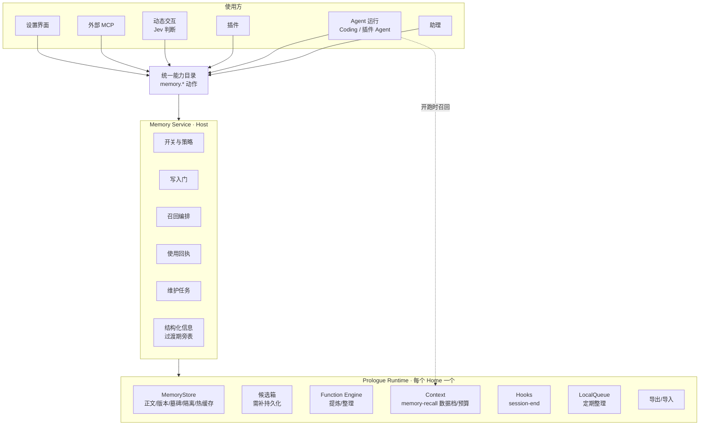

# 平台记忆系统：综合设计

> 状态：开工（2026-09-30）。分支 `feature/memory-system`，基于 `feature/system-assistant` 2e837e8f。目标与推进方式见 [goal-prompt.md](goal-prompt.md)。
> 关系：独立目标。承接[系统级助理 spec 第 12 节](../system-assistant/spec.md)的记忆要求，以及助理分支 P8 已做的第一版（[implementation.md](../system-assistant/implementation.md) 第 13 节）。动态交互目标（另一会话，分支 `feature/contextual-interaction`）通过本系统的读取动作使用记忆，并把界面行为信号交给本系统。

## 0. 一句话

把现在“属于助理”的记忆升级为平台能力：**正文、版本、删除和隔离交给 Prologue Memory**，Molis Host 负责策略、授权、结构化信息和界面。助理、Agent 运行、插件、Jev 判断和外部 MCP 共用同一套记忆和同一组开关。记忆可以自动形成，每次自动形成都看得见、撤得回；用户在设置里能看、能改、能停、能删。

## 1. 用户拍板（2026-09-30）

| 编号 | 决定 |
| --- | --- |
| D1 | 第一批做**个人**和**项目**两层。角色沿用 Characters，以后再用 SDK 的 character 作用域；会话只做短期，不进设置。 |
| D2 | **允许自动写入**（低风险类别，事后可撤销）。这修改了助理 spec 12.2“从行为推断的长期偏好只能是待认可候选”的一部分；与 Prologue“模型不能自己批准自己”的硬边界如何共存见 §6.3。 |
| D3 | 记忆作为独立平台目标，与动态交互分开；动态交互只使用本系统的接口。 |
| D4 | 尽量使用 Prologue 平台能力。缺的能力补进 SDK，不在 Molis 另建一套记忆运行系统。 |

## 2. 现状（均已对照代码核对）

### 2.1 已经有的

- **助理分支第一版（`feature/system-assistant`，尚未进 main）**
  - Prologue 增加了 `project` 作用域（`~/code/prologue-assistant` 提交 `ac4d1135`，只改类型；vendored 包 `prologue-sdk-0.0.0-rc.1-assistant-memory.tgz`）。
  - Agent Host 提供 `AgentMemoryCapability`（按作用域和归属者 list / write / update / remove / recall，见 `packages/contracts/src/services/agent-host.ts`）。
  - 助理有 `remember`、`list-memories`、`forget-memory`、`suggest-memory` 四个工具。每轮开始按本轮请求召回，关键词取中文两字片段和英文词，每个作用域最多 12 条，作为“记住的偏好与背景”材料注入。
  - 设置“助理 → 记忆与偏好”：允许形成、使用个人、使用项目三项开关，加上两项“提出建议”开关（默认关）；可逐条修改、停用、删除。
  - 开关、停用名单和候选都存在助理自己的库里（`assistant-store.ts`：`memory_prefs`、`memory_disabled`、`assistant_memory_candidates`）。
  - 另有测试 `tests/assistant-memory.test.ts`，以及用 MiniMax-M3 在隔离 Home 做的真实验证。
- **项目说明（Project Guidance）**：项目级，分背景、要求、约束等类别，有修订历史，只在用户确认后写入。它作为 `layer: "project"` 的指令层整份注入 Agent 运行（`apps/local-host/src/agent-host-composition.ts` 的 `projectPrompts`）。
- **Prologue Runtime**：一个 Home 只有一个（`appId: io.molis.work`，`agent-host-composition.ts`）。记忆落在它的 registry-store（kind `memories`）。
- **Alchemist 插件**内部有一套自己的研究校准记忆（`plugins/native/alchemist/src/studio/server/db/memory-repository.ts`），不对外。

#### 2.1.1 第一版记忆的代码落点（助理会话 [a806f0] 2026-09-30 提供，均在 2e837e8f）

- 服务 `apps/local-host/src/assistant/assistant-service.ts`：`memoryTools(work)`、`recallFor(work, request)`（每轮召回，写成“记住的偏好与背景”材料）、`memories()` / `changeMemory()` / `memoryPrefs()` / `saveMemoryPrefs()`、经验候选（`acceptMemoryCandidate` 等）；“允许记住”关掉时本轮材料写明不能长期记住（搜 `memory-off`）。
- 存储 `assistant-store.ts`：memory prefs、disabled memories、memory candidates 三张表；记忆本体在 Prologue Memory（user / project 作用域；project 作用域是补进 SDK 的 `ac4d1135`，已在现用合成包 `c63ea1a1` 里）。
- Agent Host：`horizontal/agent-host` 的 memory 能力，以及网关的 `remember` / `list-memories` / `forget-memory` / `suggest-memory` 工具（`prologue-action-gateway.ts`）。`prologue-node.ts` 的 `memoryRounds`：没有真实调用却声称记住或忘掉时挡回一次；记忆被关掉时同样挡回（`MEMORY_OFF_HELD`，`announce-guard.ts`）。
- 界面：`apps/workbench/src/settings-assistant.ts` 的“记忆与偏好”一节；工作面板里的经验建议在 island 里，归面板改版会话 [3c6203]。
- 接口：`/api/assistant/memories`、`memory-prefs`、`memory-candidates`（`assistant-http.ts`）。
- 测试 `tests/assistant-memory.test.ts`；决定与证据见 `specs/system-assistant/implementation.md` 第 13 节、2.1（已定“不另设 Character 维度的记忆库”），§16 有 AC34 实测。
- 迁移注意：本目标允许按规则自动写入，和第一版“只记明确要求 + 待认可建议”不同，`assistant-agent.ts` 里基础 Prompt 的记忆一节要跟着改。
- 助理会话的承诺：从 2026-09-30 起不再改记忆相关代码，等本线来约定三件事。#98 还没合，它在跑最后一次全量回归，之后会有文档提交和面板改版的快进合并；本线要基于新提交时，它会告知提交号。

### 2.2 缺口

1. **记忆只属于助理。** 开关、停用和候选都在助理库里。Coding、插件 Agent、插件创作台和 Jev 判断都用不上：现有三个场景包都声明 `memory: { scope: "session", write: "deny" }`，而 Agent 角色没有设置 `memoryPolicy`，SDK 默认召回和写入都是关。
2. **条目没有结构。** 只有正文、出处和标签；没有类别、适用情境、依据、有效期和状态。“停用”只是助理的一张名单。
3. **SDK 召回用不了。** 运行时的召回只查 `app` 作用域，而且按空格切词（`composition/core/runtime.ts` 的 `gatherMaterial`），中文等于没切。所以助理自己做了召回，其他 Agent 运行没有统一召回。
4. **SDK 候选箱不够用。** 候选只存在进程内存里，不区分作用域，也没有“按策略晋升”。
5. **设置入口不在平台层。** 记忆挂在“助理”下面，项目设置里只有项目说明。
6. **没有维护。** 重复、冲突和过期没人处理，也看不到“这条最近用在哪”。

## 3. 目标与非目标

**目标（内部完整）**：
- 个人和项目记忆成为平台能力，经统一能力目录提供，所有 AI 使用方按授权和开关使用。
- 记忆有五条形成路径：明确要求、工作中提炼、界面信号、手动编辑、导入。自动写入经过确定性的门，可见、可撤销。
- 召回统一：Agent 运行以 Prologue 的 `memory-recall`（数据档）注入，有预算、有出处，能回答“用了哪几条”。
- 维护：去重、冲突处理、过期、依据失效和版本历史。
- 全局设置和项目设置里各有记忆页，助理设置改为摘要加跳转。

**非目标**：
- 团队共享记忆，等协作能力定型后再说。
- 把业务数据（Goal、Pages 正文等）复制进记忆，记忆只保存引用。
- 向量检索：先把中文关键词召回做好，向量槽位留着。
- 改变项目说明的确认语义。
- 交互规则的执行（仍归助理的规则引擎，见 §4.3）。

## 4. 概念模型

### 4.1 一条记忆

一句可以单独理解的话，加上四个维度和若干事实：

| 维度 | 取值 | 作用 |
| --- | --- | --- |
| **归属**（谁的） | 个人 `user`（归属者＝这个人）· 项目 `project`（归属者＝项目）· 角色 `character`（以后）· 会话 `session`（短期） | 对应 Prologue `MemoryScope`，隔离由 SDK 保证 |
| **类别**（是什么） | 偏好 `preference` · 约定 `convention` · 背景事实 `fact` · 经验 `experience` | 决定能否自动写、召回权重、谁能读 |
| **适用**（什么时候用） | 全部 · 某插件 · 某对象类型 · 某 Goal · 某类任务（短描述）· 时间窗 | 召回时确定性过滤，不靠模型猜 |
| **使用方**（谁能读） | 助理 · Agent 工作 · 插件（按授权）· 界面推荐（Jev 判断）· 外部 AI 客户端 | 设置里按使用方开关 |

每条记忆还带以下事实：
- **来源**：你说的 / 你认可的 / 自动记住 / 导入 / 手动添加；
- **依据**：原话摘录，或对象引用（带版本）；
- **状态**：生效 / 停用 / 已删；
- 有效期、版本历史、最近使用。

### 4.2 项目说明与项目记忆

| | 项目说明（已有） | 项目记忆（本系统） |
| --- | --- | --- |
| 性质 | 规矩，必须遵守 | 知识与习惯，相关时参考 |
| 进入 Prompt | 每次整份注入，指令档 | 按相关性召回，数据档，不能提权 |
| 写入 | 只经用户确认 | 明确要求、用户认可或自动写入 |
| 关系 | — | 可“升级为项目说明”，走说明原有的确认流程；说明永不自动写入 |

### 4.3 不归本系统拥有的

- **交互规则**，例如“写方案时别打断，除非失败”。它由助理规则引擎（`AssistantRule`）持有，并确定性地执行。记忆页只汇总展示并跳转，不复制一份。
- **即时工作状态**，例如当前选区、正在编辑的内容。它属于动态交互和界面，不写入长期记忆。
- **会话与任务上下文**：它属于 Prologue Session，由压缩和历史机制负责。

## 5. 架构



### 5.1 唯一事实来源

| 事实 | 主人 |
| --- | --- |
| 记忆正文、版本、墓碑、作用域隔离 | Prologue MemoryStore |
| 类别、适用、依据、有效期、停用状态 | 目标：SDK 条目元数据（§8.2 S3）；过渡期：Host 旁表，按 memory ref + version 关联 |
| 候选 | 目标：SDK 持久候选箱（S4）；过渡期：Host 表（由助理的候选表迁移） |
| 开关与策略 | Host Memory Service（按人、按项目） |
| 使用记录 | 每次运行的 `ContextPack.items` / `omitted`（带 origin），Host 汇总成“最近使用” |
| 交互规则 | 助理规则引擎 |
| 项目说明 | Goals 模块的 guidance |

### 5.2 代码落点

- `horizontal/memory`（新服务包，做法同 `horizontal/search`）：策略、写入门、召回编排、维护逻辑，不依赖 Workbench。
- `apps/local-host/src/memory/`：装配（Prologue Runtime、存储、授权）、动作注册、HTTP。
- `packages/contracts/src/services/memory.ts`：服务合同；动作定义走 platform/actions。
- Workbench：`settings-memory.ts`（全局），项目设置新增“项目记忆”页。
- 助理改为调用 Memory Service。它的三张存储（开关、停用名单、候选）一次性迁移，迁移后删除旧读写。

## 6. 写入：记忆怎么形成和更新

### 6.1 五条来源

1. **明确要求**（“记住……”“以后都……”）：直接写入，来源是“你说的”，回复里说明生效范围。沿用 P8，不再二次确认。
2. **工作中提炼**：一次助理工作或 Agent 会话结束时，Prologue `session-end` 钩子触发（用 `forSession` 钉住会话）。随后运行“记忆提炼”有限函数（`createFunctionEngine`）：
   - 输入：本次会话里用户的原话和纠正、结果摘要、已有的相关记忆；
   - 输出：候选数组 `{ text, kind, scope, applies_when, basis: explicit | repeated | inferred, evidence[], supersedes? }`；
   - 输出不合形状就不算成功，取消后不留半份。模型只负责“提”，不负责“批”。
3. **界面行为信号**（来自动态交互与建议卡）：采纳、忽略、改写、撤销。只做确定性计数，按“类别 × 情境”聚合，不保存原文。达到门槛才生成候选，依据记为 `inferred`。**单次行为永远不会形成长期记忆。**
4. **手动**：用户在设置里新增或修改。
5. **导入**：用 Prologue `importMemories`，逐条走唯一写入口；版本不认识就拒绝，不做半导入。

### 6.2 写入门（确定性，由 Host 执行）

每条候选依次经过：

1. **开关**：该作用域“允许记住”是否打开、该来源是否打开。关着就直接丢弃，不留候选。
2. **安全**：
   - 形似凭据或秘密：拒绝；
   - `redactText` 后内容有变化，或 `screenInbound` 判为 `hold`（像是在下指令）：不自动写入，只进候选，并提示原因。
3. **范围合法**：
   - 个人记忆的出处不得带入项目内容（P8 修过的泄漏）；
   - 个人工作不能写项目记忆；
   - 插件只能写入自己的命名空间，并且需要 `memory:write` 授权。
4. **去重与冲突**：与同作用域、同类别的现有记忆比对。
   - 完全重复：丢弃；
   - 冲突且新的是明确要求：替换旧条，旧版本留在历史；
   - 冲突且新的只是推断、旧的是明确要求：不覆盖，只进候选。
5. **决定**：

| 类别 \ 依据 | 你说的 | 反复表现（至少 2 次明确要求，且来自不同工作） | 仅推断 |
| --- | --- | --- | --- |
| 偏好 | 直接写入 | **自动写入**（可撤销） | 进候选 |
| 约定（项目） | 直接写入 | **自动写入**（可撤销） | 进候选 |
| 经验 | 直接写入 | **自动写入**（可撤销） | 进候选 |
| 背景事实 | 直接写入 | 进候选（事实以原数据为准，自动写入容易过时） | 不提 |
| 交互规则 | 交给助理规则引擎，按它的规则处理 | 进候选 | 不提 |

“自动写入”一列只在用户的“自动记住”开关打开时生效（D2：默认开，可关；关掉后这一列一律改为进候选）。

### 6.3 自动写入与 Prologue 硬边界

Prologue 的约束：
- 场景包的写入策略闭集里没有“默认自动记”这一档；
- 提炼默认关；
- **模型不能自己批准自己**；
- 自动晋升只能经“硬门闩”（memory/extract.md 的“应有”一节）。

本设计的对应做法：
- 需要写记忆的场景包显式声明 `memory.write = "policy-governed"`（助理、Coding）。插件创作台和动作工具维持 `deny`。
- 用户在设置里打开的“自动记住”，就是这份常设授权。
- **批准者是 §6.2 的确定性写入门，不是模型。** 门的规则版本写进每条记忆的来源，例如“自动记住 · 规则 v1 · 依据：你两次这样要求”。
- 每次自动写入都会出现在“最近变动”里，并且可以一键撤销（§6.5）。
- 需要 SDK 补上“按策略晋升”接口（§8.2 S4），把“谁批准的（人 / 策略 vN）”记在条目上，Host 不假装是人点了接受。

### 6.4 维护：让记忆不过时

由 Prologue LocalQueue 持久队列驱动（每天一次，或变动累计到一定条数时），运行“记忆整理”有限函数，再加确定性规则：

- **重复**：自动写入的条目之间可以自动合并，保留全部来源；只要涉及“你说的”，就只提合并建议。
- **冲突**：两条并列展示，请用户选择。
- **过期**：带有效期的到期后停用。自动写入且 90 天未被使用的也停用，可以恢复。**从不自动物理删除。**
- **依据失效**：记忆引用的对象被删除或撤权后，暂停召回，并标注“依据已不存在”（助理 spec 12.2）。
- 所有整理结果都进入“最近变动”，可以撤销。

### 6.5 版本与撤销

- 每次修改都是 Prologue 条目的新版本，设置里可以查看历史、回到某一版。
- 撤销的对应关系：
  - 自动写入 → 删除（`remove` + `purge`）；
  - 自动替换 → 恢复旧版本；
  - 自动停用 → 重新启用。
- 撤销入口有两处：出现时的提示，以及设置里的“最近变动”。

## 7. 使用：召回、注入与“为什么”

### 7.1 召回编排

- **输入**：请求方身份（使用方、受众、授权）、作用域集合（本人 + 当前项目，以后加角色）、情境（插件、对象类型、Goal、任务描述）、查询文本、预算。
- **过滤**：状态为生效、未过期、适用情境匹配、该使用方的开关打开、授权允许。
- **排序**：关键词得分 × 类别权重 × 新近度 × 来源强度（你说的 > 你认可的 > 自动记住）。关键词用中文两字片段和英文词；S2 完成后改用 SDK 自带召回。
- **冲突**：同时命中互相冲突的条目时，只取较新的明确要求，另一条标注出来。
- **预算**：用 Prologue `toContextItems` / `packContext`。放不下的非必需条目进入 `omitted`，并在回执里记录。

### 7.2 注入

- **Agent 运行与助理**：以 `source: "memory-recall"` 进入 Prologue 上下文。它属于数据档，不能提权，排在指令之后。Character 或场景包的 `memoryPolicy` 是上限，每次开跑只能收窄（SDK 已有 `narrowMemory`）。助理改用这条路径，不再自行拼接材料。
- **插件与 Jev 判断**：通过 `memory.recall` 动作拿到有界的条目列表（正文、类别、出处），不给整库；在判断输入里作为有界字段。
- 与本轮用户的话冲突时以本轮为准（沿用 P8 规则）。

### 7.3 使用回执与“为什么”

- 每次运行的 `ContextPack.items` / `omitted` 都带 origin（即 memory ref）。Host 据此记录“哪条记忆在哪次工作里用过，哪条因预算被裁掉”。
- 设置里每条记忆显示“最近用在：工作「…」· 日期”，助理的回答可以展开“用到的记忆”。
- 用户问“你记住了我什么”“为什么这样做”时，用 list 加使用回执如实回答。

## 8. Prologue 能力映射

### 8.1 直接使用（无需改 SDK）

| 能力 | SDK 接口 | 在本系统的用途 |
| --- | --- | --- |
| 条目存储、版本、墓碑、隔离、热缓存失效 | `runtime.memory`：`write` / `get` / `list` / `update` / `remove` / `purge` / `hydrate` | 所有记忆正文的唯一存储 |
| 按范围删除：先预览，再按指纹确认 | `previewScope` / `removeScope` | 设置里“清空个人 / 项目记忆” |
| 导出和导入：带版本、脱敏、归属重映射、不半导入 | `exportMemories` / `importMemories` | 设置里的导出与迁移 |
| 注入与信任分级 | `contextItem`（`memory-recall` 数据档）、`packContext` 预算、`omitted` | 统一注入和使用回执 |
| 入站筛查 | `screenInbound` | 写入门：像指令的文字不自动写入 |
| 秘密脱敏 | `redactText` | 写入门、导出 |
| 有限函数 | `createFunctionEngine` / `createFunctionRegistry` | 提炼、整理两个函数：类型化输出，非法输入不发请求，取消不留半份，幂等 |
| 钩子 | `session-end`（配合 `forSession`） | 工作结束时触发提炼 |
| 持久队列 | LocalQueue（助理分支已接为 `AgentScheduleCapability`） | 定期整理，重启不丢 |
| 读写上限 | Character `memoryPolicy`、`start.memory` 只能收窄、`ScenarioPack.memory { scope, write }` | 各使用方的上限声明 |
| 用量记录 | usage ledger | 提炼和整理的成本单独记账，设置里可查 |
| 模型调用经 Prologue（含 Jev / TypeSafe） | 已有 | 提炼用当前模型；需要时用 Jev 做“值不值得记”“是否冲突”这类选择判断 |

### 8.2 需要补进 SDK（按优先级）

| # | 缺口 | 证据 | 建议改法 | 过渡办法 |
| --- | --- | --- | --- | --- |
| S1 | 没有 project 作用域 | `MemoryScope` 闭集 | 已在 `prologue-assistant` 的 `ac4d1135` 实现（只改类型），需要合入上游 | 用 `assistant-memory.tgz` |
| S2 | 运行时召回只查 `app`，并按空格切词 | `gatherMaterial` 里写死 `scope: "app"` 和 `split(/\s+/)` | `start.memory` 增加作用域列表；增加召回分词槽，内置中文两字片段；回执写明用了哪种召回方式 | Host 自己召回；App 能否直接以 `memory-recall` 数据档注入，开工时确认，不能则沿用助理的材料方式 |
| S3 | 条目没有元数据和“暂停”状态 | `MemoryEntry` 只有 text / origin / tags | 增加有界 `meta`（kind、applies_when、basis、evidence refs、expires_at）和 `paused` 状态；recall 支持按标签和状态过滤 | Host 旁表，按 ref + version 关联 |
| S4 | 候选箱只在内存、不分作用域、没有策略晋升 | `createExtractionInbox` 用内存 Map，`accept` 只能由人调用 | 候选落 registry-store，带 scope 和 owner；新增 `promote({ by: { policy, version } })`，与人的 `accept` 区分并记在条目上 | Host 候选表（由助理的表迁移） |
| S5 | 召回没有按条目的使用回执 | `toContextItems` 只返回 text / origin | 在 Run 事实里记录注入和裁掉的 memory ref | Host 从 ContextPack 的 origin 解析 |

SDK 改动沿用现有做法：在 prologue 工作树提交，打成 vendored tgz。推到上游需要用户同意。

## 9. 统一能力目录里的动作

| 动作 | 作用域 | 受众 | 权限 | 说明 |
| --- | --- | --- | --- | --- |
| `memory.list` | home（个人）/ project | user, agent | `memory:read` | 按作用域、类别、状态列出 |
| `memory.recall` | home / project | user, agent, plugin, workflow | `memory:recall` | 有界、带出处；插件只能拿到被授权的类别 |
| `memory.write` | home / project | user, agent | `memory:write` | 走写入门；Agent 调用时必须附上用户原话 |
| `memory.update` / `disable` / `enable` / `remove` | 同上 | user；agent 仅在用户本人要求时 | `memory:write` | |
| `memory.candidates.list` / `accept` / `discard` | 同上 | user | `memory:write` | |
| `memory.changes.list` / `undo` | 同上 | user | `memory:write` | 最近变动与撤销 |
| `memory.prefs.read` / `write` | 同上 | user | `memory:configure` | 开关只有本人能改 |
| `memory.export` / `import` | 同上 | user | `memory:export` | |
| `memory.scope.preview` / `clear` | 同上 | user | `memory:configure` | 按指纹确认 |

外部 MCP：默认不开放个人记忆；项目记忆随项目授权开放，只读。

## 10. 设置里的呈现

### 10.1 全局设置：新增分组“个人”→“记忆”

```
记忆
个人记忆 18 条 · 本周自动记住 3 条 · 2 条等你认可

最近变动
  自动记住「周报用要点列表，每条一句」· 9/29 · 依据：你两次这样要求   [撤销]
等你认可
  「写英文邮件时语气正式一些」· 依据：工作「…」里的修改                [记住] [不用]
我的记忆        [全部 ▾] [来源 ▾] [状态 ▾]  搜索
  回答用要点列表…    偏好 · 你说的 9/28 · 适用：所有工作 · 最近用于：工作「季度复盘」
                                                          [修改] [停用] [⋯]
                                          ⋯ 改为项目记忆 · 历史版本 · 删除
怎么形成
  允许记住（总开关）
  明确要求时记住              总是
  自动记住低风险的偏好与经验  开（关掉则都先问我）
  从工作里提出建议            开
  从界面操作里学习            开
谁可以用
  助理 · Agent 工作 · 界面推荐 · 插件（按插件列出例外）· 外部 AI 客户端（默认关）
数据
  导出 · 导入 · 清空个人记忆（先预览再确认）
```

### 10.2 项目设置：“项目记忆”（排在“项目说明”之后）

结构与个人页相同，作用域是本项目，另外多一个“升级为项目说明”。

### 10.3 其他入口

- 助理设置里的“记忆与偏好”改为摘要加跳转。开关迁到平台，数据迁移，一条不丢。
- 工作面板：自动记住时显示一行“已记住……· 撤销”；回答可以展开“用到的记忆”。
- 角色设置：以后显示角色记忆。
- 视觉与动效沿用 craft-finish 的设计门禁。

## 11. 隐私与安全

- 凭据和秘密不进入长期记忆：写入门拒绝，导出前脱敏。
- 召回来的记忆一律是数据档，不能改变授权、工具或网络范围。
- 个人记忆不因参与项目而共享；个人记忆的出处不带项目内容。
- 插件和外部 MCP 只能按授权和使用方开关读取；插件写入限定在自己的命名空间。
- 停用是保留但不召回，删除是墓碑加物理清除。删除后热缓存、整理结果和子代理返回都不能再带出该条；整理产生的合并条目保留来源 ref，删除会随之传递。
- 原资料撤权或删除后，相关记忆暂停召回，不能借记忆绕过限制。
- 本次说“不要记”时，该会话不产生任何候选或自动写入；这不等于删除会话记录，界面上如实说明。

## 12. 与其他工作的关系

- **助理**：第一版记忆在助理分支上，本目标以它为基础，迁移它的表和开关。开工前与助理会话约定文件边界：`apps/local-host/src/assistant/` 内只改调用处。
- **动态交互**：通过 `memory.recall` 取得偏好和约定，作为判断输入；界面行为信号交给本系统计数（§6.1 第 3 条）。
- **项目说明**：语义不变，只增加“升级为项目说明”的入口。
- **Alchemist 内部记忆**：暂不合并，列为后续评估。
- **系统搜索**：记忆不进入全局搜索；设置页有自己的筛选和搜索。

## 13. 分期

| 期 | 内容 | 完成时能证明 |
| --- | --- | --- |
| M1 平台化与迁移 | Memory Service、`memory.*` 动作、全局和项目记忆页、助理改用服务、数据迁移 | 助理原有行为不退化；设置里两个页面能增删改停；迁移前后条目、开关、候选一致 |
| M2 结构与召回统一 | S3 元数据、S2 召回；Coding 和插件 Agent 按上限接入；使用回执 | 同一条记忆在助理和 Coding 里都被召回；中文查询能命中；“最近用于”准确 |
| M3 自动形成 | 提炼函数、写入门、最近变动和撤销、界面信号计数、S4 策略晋升 | 反复出现的明确要求被自动记住并可撤销；单次行为不形成记忆；敏感或像指令的文字只进候选 |
| M4 维护与可解释 | 整理队列、冲突、过期、依据失效、“为什么”、导出导入、按范围清空 | 重启后整理照常进行；删除后任何路径都不再召回；导出包里没有秘密和绝对路径 |
| M5 更多维度 | 角色作用域、插件命名空间、Goal 适用情境 | 换角色、换插件时召回范围正确，禁用规则不失效 |

## 14. 验收标准

- **AC-M01**：个人记忆在所有项目可用，项目记忆只在本项目可用；换项目、换角色、委托子任务都不越界（用 SDK 隔离测试加真实运行证明）。
- **AC-M02**：助理、Coding 和插件 Agent 用的是同一条记忆和同一组开关。某使用方的开关关掉后，它这一轮拿不到记忆。
- **AC-M03**：明确要求立即生效，回复里说明范围；设置里显示来源“你说的”和原话。
- **AC-M04**：同一偏好在两个不同工作里各明确出现一次后被自动记住。“最近变动”里有这一条，撤销后存储里就没有了，之后也不再召回。
- **AC-M05**：只出现一次的行为、只靠推断的偏好、背景事实都不会被自动写入。
- **AC-M06**：含秘密形状的文字不会写入；像指令的文字只进候选，并说明原因。
- **AC-M07**：停用后不再召回，恢复后又能召回；删除后存储、热缓存和整理结果都不再带出该条（包括重启之后）。
- **AC-M08**：冲突时，新的明确要求替换旧条，旧版本可以查看和恢复；推断不能覆盖明确要求。
- **AC-M09**：引用的对象被删除后，相关记忆暂停召回并标注原因。
- **AC-M10**：每条记忆显示最近使用的工作；助理回答能列出用到了哪几条，因预算被裁掉的也如实说明。
- **AC-M11**：清空个人或项目记忆时先预览数量；预览之后有新写入的，确认会被拒绝。
- **AC-M12**：导出包带版本、无秘密和绝对路径；导入两次不产生重复；包损坏时一条也不写入。
- **AC-M13**：插件只能读到被授权的类别，外部 MCP 默认读不到个人记忆。
- **AC-M14**：助理原有的记忆测试和真实场景全部照常通过，迁移不丢数据。
- **AC-M15**：设置页在 1440、1024、800、390 宽度和深色模式下，都经过真实浏览器操作验证。
- **AC-M16**：工程验证、真实场景验证（MiniMax-M3 与真实 Jev）和用户本人验收分别记录。

## 15. 待定与风险

- **开工基线**：建议从 `feature/system-assistant` 另开工作树，因为第一版只在那条分支上；另一个选择是等它合入 main 再开。
- **SDK 改动推到上游**（S1–S5）需要用户同意推送 prologue。
- **自动写入默认开**（按 D2）。如果实测误记较多，改为默认“先问我”，并记入决策记录。
- **多人协作项目**里项目记忆的可见性：目前是本机单人，等协作上线后再定。
- **提炼成本**：每次会话结束都要调用一次模型。先只在“有用户纠正或明确表态”的会话上运行，用量单独记账。

## 16. 决策记录

| 日期 | 决定 | 来源 |
| --- | --- | --- |
| 2026-09-30 | D1–D4（见第 1 节） | 用户 |
| 2026-09-30 | 记忆系统与动态交互分成两条支线、两个会话并行推进；本线基于 `feature/system-assistant`，动态交互线从 main 开 | 用户（“按你建议”） |
| 2026-09-30 | SDK 改动只由本线负责；与侧栏线的 SDK 补丁按顺序叠加，后落地的一方负责变基 | 用户（同上） |
| 2026-09-30 | **与助理会话 [a806f0] 的边界**：`apps/local-host/src/assistant/` 只改记忆调用处（service 的记忆方法转调平台服务、http 的三组记忆路由保留路径内部转发、store 的三张旧表只读供迁移、`assistant-agent.ts` 记忆一节随规则升版）；agent-host 的 `AgentMemoryCapability` / `AgentMemoryTools` 可加字段，`announce-guard` 与 `memoryRounds` 挡回保留，但“记忆关着＝本轮没给记忆工具”的含义改动时要对齐；“记忆设置”那段（`memory-off`）换注入方式后保留等价说明；`tests/assistant-memory.test.ts` 的断言迁到新形态，角色轮次那一项不删。迁移：启动时从 `<Home>/assistant/assistant.db` 一次性读三张表，按人记迁移标记、可重复执行；候选的 14 天过期、每项工作最多 3 条、拒绝过的同文不再提这三条规则保留。合并节奏：它有新提交或 #98 合入时告知提交号；两条 SDK 补丁都以 `c63ea1a1` 为父，后合的一方负责叠成一个合成包 | 助理会话回复 |
| 2026-09-30 | **与页面动线会话 [47c510] 的边界**：等它合入后我再加挂载：`settings-sections.ts` 的 `HOST_SECTIONS` 加 `{ id: "memory", label: "记忆", group: "个人", order: 15 }`（图标不用 book）；`plugin-settings-catalog.ts` 的 `isHostGlobalSettingsSection` 加 `memory`；`settings-renderer.ts` 与 `web-catalog.ts` 只加分支；页面脚本写成可重复绑定的 `globalThis.molisWorkBindMemorySettings(root)`，并在 `scripts/client/settings-directory.ts` 的 `bindEmbed` 加一行；项目设置在“项目说明”后加 `memory`；`settings-assistant.ts` 的“记忆与偏好”改成摘要＋跳转（用它的 `molis-work:open-settings-section` 事件）。合入前页面组件放在自己的新文件里 | 页面动线会话回复 |
| 2026-09-30 | **与面板改版会话 [3c6203] 的边界**：数据归本线、渲染归它。工作视图加 `memory_changes`（`MemoryChange` 形状，撤销后 `state:"undone"`、`undoable:false`、正文清空）放左栏“成果”里的“记住的事”；每个 round 加 `memories_used: { used, omitted }`，在回答下面折叠显示“用到 N 条记忆”；撤销调 `POST /api/memory/changes/<id>/undo`；候选仍在“还等你处理”，路由 `/api/assistant/memory-candidates/<id>/accept|discard` 不变 | 面板会话回复 |
| 2026-09-30 | **动态交互合同**：`memory.recall` 与 `memory.signals.report` 以 `packages/contracts/src/services/memory.ts` 为准，已发给动态交互会话 [fe3191]，它先用替身、只经动作目录调用。它的用法：每次判断前 recall 一次（kinds 偏好与约定、limit 5、budget 800）；信号只在明确操作时报，“看见了没点”不算忽略 | 本线定，对方确认 |
| 2026-09-30 | **使用方身份从调用上下文来**：audience `user`→界面推荐、`agent`/`workflow`→Agent 工作、`plugin`→插件、`mcp`→外部客户端；助理和 Coding 在 Host 进程内直接调服务并写明使用方。输入里没有“我是谁”字段。理由：可信身份不从输入读（AGENTS.md 硬约束），而且这样说谎也拿不到别的使用方的开关 | 推荐 |
| 2026-09-30 | **界面信号门槛**：同一“建议能力 × 情境 × 信号”累计至少 3 次、且来自至少 2 个不同 occurrence，才生成待认可的候选（依据 inferred）；从不自动写入。理由：单次永不形成记忆（§6.1），两个不同场合才算“反复” | 推荐 |
| 2026-09-30 | **开关按范围存**：个人一份；项目各一份，没有单独设过的项目用“项目默认”。助理旧的全局开关迁移为：`form`→个人与项目默认的“允许记住”，`use_personal`→个人的“助理可以用”，`use_project`→项目默认的“助理可以用”，`learn_personal`/`learn_project`→个人/项目默认的“从工作里提出建议”；用户没改过的旧开关用新默认值。理由：项目页有自己的“怎么形成 / 谁可以用”（§10.2），旧开关又是全局的 | 推荐 |
| 2026-09-30 | **版本历史在 Host 旁表**：Prologue 的存储有意只留一行（删除才删得干净），所以每次修改前的正文由 Host 记在历史表；删除一条时连历史、使用记录一起清掉，最近变动里的正文清空。理由：满足“查看历史、回到某一版”，又不破坏“删除后任何路径都不再带出” | 推荐 |
| 2026-09-30 | **M1 用 Host 旁表放结构化信息，M2 做 S3 后迁进 SDK 条目**（spec §5.1 的过渡办法）。旁表只按 memory ref 关联类别、来源、依据、状态等；正文、版本号、墓碑与隔离仍只在 Prologue Memory，召回的候选也从 Prologue 读，所以不是第二套记忆运行系统 | 推荐 |

范围清楚、可以撤回的取舍按推荐直接做，并追加到本表，写明理由。

## 17. 进度与证据

按分期记录已做内容、工程验证、真实场景验证和用户验收，三者分开写；未实现、模拟或未验证的部分如实写明。

### 17.1 M1 平台化与迁移（2026-09-30，提交 bce9f5f3、11c2b5c3、28b85d03）

**已做**
- 合同 `packages/contracts/src/services/memory.ts`：`memory.recall` / `list` / `write` / `change` / `history` / `candidates.*` / `changes.*` / `prefs.*` / `signals.report`（另定义了 `scope.preview/clear`、`export`、`import`，M4 注册）；旁表端口 `MemoryLedgerPort`。
- 服务 `horizontal/memory`（`MemoryService`）：开关与使用方权限、写入门、召回编排、候选（同句只提一次、每项工作最多 3 条、14 天过期）、最近变动与撤销、版本历史、界面信号计数与门槛、第一版迁移。
- 旁表 `packages/storage` 的 `openMemoryLedger`（`<Home>/memory/memory.db`，卸载 `--purge` 覆盖）。
- Host 装配 `apps/local-host/src/memory/memory-host.ts`：随 Agent 服务注册 `system.memory` 提供方、`/api/memory/*`（页面经动作目录以本人身份调用）、启动时从 `<Home>/assistant/assistant.db` 一次性迁移。
- 助理：记忆方法全部转调平台服务；`/api/assistant/memories|memory-prefs|memory-candidates` 保留路径、内部转发；`remember` 经写入门（加 `kind`、`replaces`，网关包 2.4.0）。
- 设置页 `apps/workbench/src/settings-memory.ts`：全局“个人 → 记忆”、项目设置“项目记忆”（最近变动可撤销、等你认可、逐条修改/停用/历史与回到某版/改范围/删除、怎么形成、谁可以用）；项目记忆可“升级为项目说明”（打开项目说明原有确认编辑器并预填）。挂载先按旧导航结构加了最少几行，页面动线合入后按 §16 约定挪到它的分类表。
- 工作视图 `memory_changes`、每轮 `memories_used`（面板会话已按字段渲染，提交 5825fa00…22513b2c，在它的分支上）。

**工程验证**
- `tests/memory-service.test.ts`（真实 Prologue Memory）：写入门（明确要求、秘密拒绝、像指令只进候选、重复、替换与历史、推断不能覆盖明确要求、个人工作不能写项目）；自动写入决定表与撤销后存储和旁表都没有；召回的范围隔离、类别与适用、停用与到期、使用方开关、插件类别、MCP 不读个人、预算裁剪与使用回执；删除后存储、旁表、最近变动、使用记录、重启后都不再带出；改范围不带项目出处；候选规则；界面信号门槛；第一版迁移只做一次。
- `tests/memory-actions.test.ts`：13 个动作经共同目录注册，Agent 只看得到 list/recall/write，管理动作只有本人；从助理库迁移开关与候选。
- `tests/assistant-memory.test.ts` 原 4 项迁到新形态后全过；默认值按 §10.1 改为“从工作里提出建议：开”（测试先显式关掉再验“关着不提供”）。
- 设计门禁 `soft-workbench-refinement`、设置类测试通过；`plugin-global-settings` 的 Shelf 一项在基线（2e837e8f）上同样失败，与本线无关。

**真实浏览器（隔离 Home，launch `memory-dev` 4296）**：个人页添加、筛选、界面信号生成的候选显示；项目页正常；1440 与 390 深色走查过一轮，修了筛选下拉被撑满、标题字号不一致、首次读取前开关显示为关。四宽度完整验收放在页面齐全后（AC-M15）。

**未做 / 待定**：助理设置“记忆与偏好”改为摘要＋跳转（等页面动线合入）；工作台设置覆盖层里的绑定（`bindEmbed`，等页面动线合入）。

### 17.2 M2 结构与召回统一（进行中，提交 8816bc84）

**已做**
- SDK（`~/code/prologue-memory` 分支 `feat/molis-memory-platform`，提交 `f80130ab`，未推送）：S3 条目 meta/暂停/时间；S2 中文两字召回、`kinds`、按时刻判到期、开跑 `memory.pinned/scopes/budgetChars`；S5 `memory-recalled` 事件（只有引用与版本）；S4 持久候选箱（`accept` 人 / `promote` 策略+版本）。vendored `prologue-sdk-0.0.0-rc.1-memory-platform.tgz`。
- 平台服务把类别、来源、依据、适用、到期、批准者写在 Prologue 条目上，停用＝条目暂停；M1 旁表与第一版条目首次读取时迁入，旁表不再存这些事实（只存历史正文、变动、开关、信号、使用、迁移标记）。
- Agent 运行统一注入：`AgentStartAuthority.memory(task)` 由 Host 按使用方开关召回 → 冻进角色 → 适配器解析成精确引用、给本轮角色开“只读记忆”上限 → 运行时重读并以 `memory-recall` 数据档注入。助理（使用方“助理”）与 Coding/插件 Agent（使用方“Agent 工作”）都走这一条；助理不再自拼材料。每轮 `memories_used` 取自运行时事件，并据此校正使用回执。

**工程验证**
- SDK `test/memory-platform.live.test.ts` 6 项与记忆、开始覆盖、源码规则共 85 项通过；SDK 全量与 `c63ea1a1` 基线比对，见 vendor README。
- `tests/memory-agent-runs.test.ts`：Host 选的记忆原样冻进角色、召回失败不拦运行；同一条记忆对助理与 Agent 工作都召回，关掉“Agent 工作”后 Agent 运行拿不到、助理照常；停用后都拿不到。
- `tests/memory-service.test.ts` 新增“事实在条目上、停用即暂停、旁表时期的事实迁入”；assistant-*/prologue-*/agent-host* 230 项 0 失败。

**未做**：定时任务（Schedule）的 Agent 运行还没接记忆；Coding 真实运行里的召回尚未用 MiniMax 实测；召回排序仍在 Host（策略权重、适用、使用方），SDK 负责存储过滤与注入回执。
