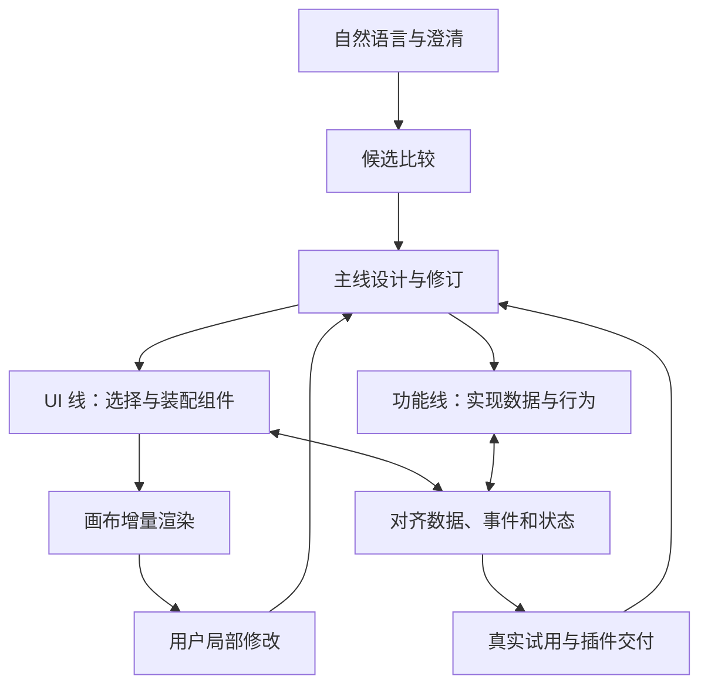

# 插件创作工作台：主线设计驱动 UI 与功能协同构建

状态：2026-09-23 已实现本地数据插件的正式闭环，使用 Host AgentHost 的 Prologue 角色、PluginPlatform 和隔离的 SQLite 私有存储。定向工程与浏览器验证通过；真实模型/Jev 联调和最终用户验收未完成，尚不声明内部完整。当前实现边界与证据见 [Prologue 执行需求](work-items/prologue-runtime/spec.md)。下文保留完整产品方向；多页面、任意代码、外部分发仍未实现。

规划阶段历史：新建 `codex/plugin-builder-plan` 分支并形成方案。本次在隔离分支 `codex/plugin-builder-ui` 落地[高保真演示](ui/README.md)，产品完整范围保持不变。代码核对基线为 `721e13198611e220b91461699c52be0e755b91f6`。本文是本功能的需求与验收依据；实现接缝见 [技术设计](design.md)。方案中的“采用”“需要”表示拟议决定，不表示现有能力。

## 1. 要做成什么

用户用自然语言描述想要的插件，在对话和候选方案中逐步明确需求；工作台依据一份主线设计，分别推进 UI 与功能两条线。UI 从组件池逐步选择、配置、装配，画布同步呈现；功能线实现相应的数据和行为。两条线持续对齐，最后交付能独立打开、完成真实任务、继续修改的 Molis Work 插件。

用户已经明确的产品约束：

- 零件指前端 UI 组件和控件，例如输入框、按钮、列表、表格、容器、弹窗。采集新闻、AI 评分、保存数据不是 UI 零件。
- 创建插件的 Build Workflow 与生成插件自身的运行流程分开。
- 先有统筹用户旅程的主线设计，再分别设计 UI 和功能；两边可以并行，也可以相互反馈。
- Jev 等选择模型参与判断下一步用什么 UI 零件；组件装配过程可实时渲染。
- 自然语言澄清、设计候选、画布共创和完整功能交付都属于目标，不能最终收缩成静态页面生成器。

元插件暂用名“插件创作工作台”（Plugin Builder）。名字不影响实现。

### 2026-09-22 交互修订 · V3

用户已批准 [视觉基准图](ui/design/approved-comp.png)：“可以，这个路子对了，按这个出高保真”。以下作为当前交互约束，产品完整范围保持不变：

- 整体左右分栏：左侧连续呈现协同对话、需求与设计依据、三张方案小样及共享主线，右侧始终为实际插件预览；摄影素材进入真实卡片，不用整张概念图代替页面。
- 候选前可见需求解析、使用过程、范围与设计依据的摘要；据此产出少量在交互和必要行为上不同的方案。真实模型接入后展示可检查的决策摘要，不暴露内部推理。
- UI Agent 先逐个放入界面零件，功能 Agent 根据已经出现的 UI 跟进数据和行为；两者仍可重叠工作并反馈依赖。
- 两个 Agent 在画布上表现为具名鼠标：移动到对应元素、执行操作，界面随之更新。功能接通后在相关元素旁打勾；双轨进度条不作为主要反馈。
- 动画必须对应实际装配或接通状态，未接通仍明确标注。完成判据仍是完整旅程和真实数据试用，不能以动画播完代替。

当前 `ui/` 默认在第 8 步暂停展示已批准的构建现场，可从空画布重播 13 步。模型解析、Jev 选择与 Agent 调度为 Mock，保存、筛选和 CSV 导出是实际本地行为；V3 草稿、使用版本与素材使用独立存储键。有效桌面图、当前实操记录及未验证项见 [演示说明](ui/README.md)。这段描述仅针对 ui/ 演示。正式实现已另行接入 Prologue 与独立插件；真实模型和 Jev 调用仍待本机模型配置后的验证。

## 2. 用户实际如何使用

首个建议验证场景：用户说“帮我做一个素材整理插件，可以录入标题、链接、备注，按标签筛选，选中后导出”。这是为了验证一次完整构建，非将产品限定成素材管理器。选择这个场景是因为本地数据就能验收 UI、交互、保存和重新打开，不必先等待外部账号接通。

1. **表达与澄清。** 工作台先形成可编辑的需求摘要：谁使用、输入什么、完成什么、结果保存在哪里。只追问影响行为或范围的缺口；用户可以口述、修改摘要或给参考。
2. **比较候选。** 展示少量有实质区别的方向，例如列表加详情、表格内编辑、卡片浏览；解释分别适合什么操作。差异同时体现在交互布局和必要的功能行为上，不仅换颜色。
3. **形成主线设计。** 用户选取或混合候选后，保存当前设计版本：录入 → 浏览 → 筛选 → 选择 → 导出，以及对应的数据、交互、失败反馈和验收结果。
4. **双线构建。** UI 线逐步放入容器、表单、列表、筛选控件和按钮，功能线同时实现读写、过滤、选中项与导出。已完成的界面立即显示；未接通的操作明确显示“功能待连接”。
5. **边看边改。** 用户选中表格说“换成卡片，仍保留批量选择”，系统局部调整界面，复用兼容的数据与行为。若改成“多人同时编辑”，先说明新增范围和影响，不当作简单换控件。
6. **试用与修正。** 进入试用模式，录入实际素材、筛选、导出，检查结果；异常在对应操作位置展示，支持修正后继续。
7. **生成与使用。** 生成可在工作台外独立打开的插件实例。关闭创作工作台、重启应用后，插件仍能打开且数据保留。再次编辑产生新草稿，不直接改坏正在使用的版本。

候选在左侧以小样比较，右侧画布始终承载当前方案的实际可交互页面。组件树、属性与绑定信息按需展开，普通用户不必通过连线编辑器配置每个行为。

## 3. 主线如何统筹两条线

主线设计是双方共享的目标和约束，不是一份写完后失效的说明。它包含用户旅程、页面与状态、数据含义、关键动作、成功标准及明确不做的事项。

| 责任 | 负责的决定 | 不代替谁 |
| --- | --- | --- |
| 主线设计 / Build Workflow | 澄清诉求、组织候选、记录当前设计、安排依赖、处理变更、检查完整性 | 不包办每次组件选择和每个功能实现 |
| UI 线 | 组件类型、布局、属性、交互反馈、响应式、组件与数据/事件的绑定 | 不凭控件外观推断业务规则 |
| 功能线 | 数据模型、查询与变更、校验、AI/工具调用、持久化、错误与恢复 | 不擅自改变用户操作流程和界面方案 |
| Host | 提供已授权能力、运行与安装边界、项目身份、凭据 | 不持有创作工作台自己的设计状态 |
| 用户 | 目标、方案偏好、范围变化及最终体验验收 | 不必逐个批准可逆的组件装配 |

并行是产品工作流的能力，不强制每次启动多个 Agent。先确保每条工作的输入输出独立、可恢复，再按运行资源并行。

### 两线对接的最小单位

以“保存素材”为例，先约定输入 `title/url/tags/note`、输出 `material_id`、字段校验错误及保存失败，再分别完成保存按钮和保存操作。按钮绑定操作标识，不直接嵌入数据库逻辑。

- UI 可先用显式标记的示例数据完成展示，但示例数据不能成为“保存成功”的证据。
- 功能可先通过服务层调用验证，再接到真实按钮；服务层通过不等于界面已可用。
- 主线变更后标记受影响的组件、绑定和验证；其他区域保持不动。
- 两线基于同一设计版本工作。旧版本结果不能覆盖新决定，冲突交回主线重新协调。

## 4. UI 构建循环与实时呈现

每一轮围绕当前旅程中的一个界面需求，例如“为标签提供筛选入口”，而不是盲目预测页面上接下来放什么。

1. 根据主线、当前页面、放置位置和组件规则，筛出合法候选。
2. 候选具有用途、适用条件、属性、可接收的数据、可发出的事件和可见示例。Jev 在这个候选集合中选择组件。
3. 默认值、规则或生成模型补齐属性与布局。选择、配置、定位分开校验，不假定 Jev 一次返回完整组件代码。
4. 形成带目标版本的局部修改，校验后应用到规格板，保存成功后向画布推送变更。
5. 渲染器更新对应区域，保持用户输入、焦点和画布视角；下一轮使用更新后的状态。

“实时”指有效修改逐步可见，不承诺模型无等待。需要分别测量模型选择耗时、修改保存耗时、画布可见反馈耗时。首阶段暂定本地合法修改至可见反馈 P95 ≤ 200ms（100 个组件的代表页面，记录设备与采样方法）；模型端延迟单独报告，指标可根据首轮实测调整但不能隐藏超标。

补充规则：

- 选择失败、候选为空或没有合适组件时，保留当前页面，进入补充配置、人工选择或缺失组件处理；不放入最接近但不成立的组件。
- 一个候选可由规则直接确定，须记录“规则选择”；模型选择与规则选择不能混报。
- 同时保留全页设计约束，例如层级、密度、一致性与移动端行为，避免局部选择都合理、整体无法使用。
- 允许停止、继续、撤销和替换。判断是否完成由旅程覆盖和检查决定，不仅依赖模型说“完成”。

## 5. 当前可以复用什么

以下为 2026-09-22 对基线代码的静态核对，不代表本次运行验证。

| 能力 | 已核对的事实 | 本功能仍需补齐 |
| --- | --- | --- |
| UI 原语 | `packages/design-system/src/primitives/` 已有表单、布局、表格、反馈、导航等 HTML renderer，并有 Catalog | 面向生成的组件描述、属性校验、组合约束、规格板和增量渲染 |
| Jev / TypeSafe | `modules/functions/src/provider.ts` 已按 state + questions 调用 Provider 并解析 Choice；Functions 有草稿/试跑/发布流程 | 构建现场动态候选的 Host 端选择接缝；不能每放一个控件就创建并发布一个用户函数 |
| Agent 执行 | `horizontal/agent-host/src/index.ts` 导出 AgentHost 与 Prologue 适配入口 | 主线设计、功能生成任务与 Build Workflow 的产品编排和恢复 |
| 插件运行 | `apps/local-host/src/coding-surface.ts` 已调用 `createPluginPlatform` 启动 Coding 等插件 | 自动生成插件的注册、独立入口、持久身份、数据与升级验证 |
| UI Host | `packages/contracts/src/platform/ui.ts` 的 contribution 返回 HTML | 从规格板到组件树的解释、客户端事件与功能操作桥接 |
| 插件开发 | SDK、开发运行、私有存储、打包签名已有独立入口 | 把创作产物转换为实际可运行插件，并在产品入口完整验证 |

注意：`docs/platform/PLUGIN-PLATFORM.md` 中“生产尚未调用 createPluginPlatform”的描述与当前 Coding 调用点不一致。此方案按已读代码描述调用事实；不扩展为“任意生成插件已可安装”，也不顺手修改其他文档。

## 6. 复杂度审查与拟议取舍

### 当前必须

- **一份带修订的构建文档**：主线、UI、功能和绑定引用放在一起，否则两条线容易用不同版本互相覆盖。先用单一写入入口与版本检查，不引入协同编辑服务。
- **现有组件的生成描述与规格渲染器**：现有 HTML helper 无法直接回答“该选哪个、放哪里、如何绑定”。给已有组件补元信息，不另建视觉系统。
- **功能合同与绑定检查**：解决按钮已出现但行为缺失、字段不匹配、异步状态不一致的问题。
- **构建进度、暂停恢复与局部撤销**：模型调用可能慢或失败，用户也会中途改主意。复用 Agent Run 事实，仅保存必要构建步骤和修订。
- **生成插件的实际打开路径**：编辑器预览不足以证明插件产出；首个完整切片必须包含独立入口和重启。

### 可以延后，但保留在完整方向中

- 自由位置画布、复杂嵌套拖拽、无限缩放和第三方组件市场。首轮先支持候选并排、页面切换、选中组件、属性调整、容器内重排；在真实场景无法表达布局时扩展。
- 自动生成池外 UI 组件。先报告缺失并允许补充受控组件；等现有组件覆盖成为实际瓶颈再开放自动扩池。
- 任意自定义功能代码的自动装载。首轮完整切片使用既有能力和明确的功能操作；第二轮验证受控代码生成、构建、执行与恢复，不能长期把功能线收缩为固定模板。
- 远程市场、分发签名体验和多人同时共创。先验证本地独立插件闭环；有共享/分发需求后扩展。

### 应当删除的复杂度

- 新造通用 Agent Runtime、通用工作流平台、全局事件总线或第二套密钥系统。
- 把所有数据、每次选择和每步构建都转成 Artifact。
- 为 UI 和功能各做一套可独立修改主线事实的数据库。
- 把评分、抓取、保存等业务能力混进 UI 零件池。

## 7. 实施顺序与阶段验收

这是完整目标下的分阶段路线。P1 只是机制验证，P2 是有限能力范围内的完整插件，P3 验证可扩展功能；不能在 P1/P2 结束时宣布“各种插件生成完成”。

| 阶段 | 工作与依赖 | 可检查的退出条件 |
| --- | --- | --- |
| P0：明确接缝 | 固定首个旅程、最小组件集、UI/功能合同，探查动态候选与生成插件注册路径 | 有一份代表性构建文档；确认 Host 接缝需要改哪些文件；不依赖伪造运行结果 |
| P1：跑通 UI 构建循环 | 依赖 P0；组件描述、规格板、真实 Jev 选择、增量应用、画布和局部修改 | 自然语言界面目标形成逐步可见的页面；能替换组件、撤销、暂停恢复；记录选择与可见延迟，功能未接通明确标记 |
| P2：首个完整插件 | 依赖 P0 合同；功能操作和绑定可以与 P1 分别开发，合流后完成试用、注册与独立打开 | 素材录入/编辑/筛选/批量导出真实可用；关闭创作工作台并重启后保留数据；再编辑 UI 不破坏保存能力 |
| P3：验证可扩展性 | 依赖 P2；第二个不同旅程，例如 CSV 导入后按用户规则统计；加入一项现有操作无法直接表达的自定义功能 | 功能线能生成并验证新行为；UI 仍从组件池构建；产物可独立运行，失败不破坏已启用版本；全过程无场景专用硬编码 |
| P4：持续修改与交付 | 依赖 P2/P3；多页面/多状态、候选差异化、数据兼容与版本恢复补齐 | 修改已使用插件的字段和功能后，明确兼容影响；旧版本可继续用，恢复版本不误称恢复数据；用户完成代表旅程验收 |

P0 必须及早验证安装接缝，避免做完漂亮画布才发现产物无法作为插件使用。先串通一条链，再扩大组件覆盖与视觉操作，不先铺满所有控件。

## 8. 验收清单

### 工程验证

- 规格校验拒绝未知组件、非法属性、循环嵌套、失效引用和不匹配绑定。
- 过期模型结果不能覆盖用户最新修改；停止后的晚到结果不继续落板。
- Jev 超时、无效选择、候选为空可恢复，不清空画布、不静默换模型。
- 预览数据、草稿与正式插件数据分开；独立插件的身份和版本可追踪。
- 未连接功能不能显示伪造成功；功能失败能返回字段错误或操作错误。
- 部分刷新保留输入、焦点和滚动；重启能恢复设计和正式插件数据。
- 相关包构建、类型检查、边界检查与定向回归通过。具体命令见技术设计。

### 产品实操

- 从一句需求开始，经过澄清、至少两个有实质差异的候选、选择、逐步构建、试用、独立打开，走完主流程。
- 用代表性真实素材验证保存、筛选、导出内容；不能只验证空页面和示例数据。
- 中途将列表换成卡片，保留行为；再调整一个会影响功能的需求，观察两线同步变化。
- 模拟模型失败和功能失败各一次，完成恢复；检查已有数据和其他插件不受影响。
- 观察构建期间是否闪屏、焦点丢失、输入被覆盖、重复点击、交互卡住；工具重试耗时计入实操记录。
- P3 用第二种任务验证通用性，不能只把素材插件换标题。

### 用户验收

用户本人认可候选质量、共创节奏、最终界面和完整功能。中文 IME 候选窗、主观手感与审美在真人确认前标为 `UNVERIFIED`。工程验证与产品实操均不能替代用户验收。

## 9. 范围与回滚

2026-09-22 规划阶段仅新增方案目录。2026-09-23 实现阶段新增创作插件包、Host/Workbench 装配与测试；未提交或推送。其他任务已有的未提交内容保留。

后续实现局限本仓库：新增创作插件及必要的 Host 装配、共享合同和现有能力接缝；不迁移全部 Native 插件，不修改 Prologue 仓库，不重构其他产品状态。

拟议回滚：关闭创作入口和生成插件注册接缝即可停止新构建；保留设计草稿与插件数据。插件更新先形成新版本，启用失败保留原版本。对数据结构的迁移必须另列兼容与恢复办法，代码回退不代表数据已经回退。

## 10. 假设与尚待实证的问题

- 默认先服务当前用户的本地 Molis Work；草稿按当前项目归属，组件池共享，生成插件数据按安装实例隔离。跨项目共享后续再明确。
- 首个验证场景是方案建议，可替换为用户更迫切的场景；完整目标不随示例改变。
- 先沿用 Molis Work 设计系统。Impeccable 提供候选设计与评审的方法，构建正确性由规格校验和功能实操保证。
- 动态候选的真实 Jev 质量与延迟尚未测量；现有 Functions 有输入和候选限制，不能把整个项目无差别塞入每次选择。
- 生成插件注册、事件桥接和自定义功能代码的运行边界需 P0/P3 分别实证。当前进程内执行器不是任意代码沙箱。
- 本方案不固定模型版本、预算或后台并发规模；实现使用用户已选配置并记录实际返回模型，不通过静默换模型绕过故障。
