# 前端质感与动线走查（W2-18，系统整理要求 §9）

状态：走查记录，**§9 的检查只做了一部分**（2026-10-09，main `11878059`）；逐条做到哪一步见 §6，没做的另排一片；本文只读代码、不改代码。图都是这次在真实页面上操作截的，放在 [evidence/flow-walk/](evidence/flow-walk/)，下面用「截图 NN」指它们。

任务要求：`docs/prompts/repository-systematic-review.md` §9（以真实页面和操作判断，不以「能打开、能点击」为完成标准；按用户路径验证：找到功能、理解用途、完成前置条件、开始操作、确认结果、继续下一步；检查首次引导、空状态、配置或授权完成后能否回到原任务；跨页面保留项目、选择与草稿；加载、空、失败、部分成功、无权限、离线；闪烁、跳动、输入丢失、重复提交；窄屏、长文本、焦点、键盘、基本可访问性）。判断依据是 `DESIGN.md`（本文引它的几条：Plugin stage、Toasts, alerts and empty states、Focus and accessibility 三节）。路线上的位置见 [roadmap-2026-10-07.md](roadmap-2026-10-07.md) 的 W2-18 与「覆盖缺口」一节（「其余页面的质感审查待做」是 [spec.md](spec.md) §9.2 的原话）。同一片的另外两份产出：[逐插件结论](plugin-conclusions.md)、[AI 入口清单](ai-entry-inventory.md)。

## 0. 方法与范围

- **环境**：`tests/fixtures/goal-browser.ts` 的 `openGoalBrowser`：一个隔离的临时 Home、本机 Chrome 无头、1440×900；窄屏用 390×844 的移动模拟（`Emulation.setDeviceMetricsOverride`，`mobile: true`）。项目用「seeded」模式（项目插件全加上、种子目标树）；另用示例项目一次（截图 23）。**没有配置任何模型、任何连接**；没有碰真实 Home（`/Users/yijunwang/.molis-work` 一个字节都没读写）。
- **做了什么**：26 个插件页面逐个用 `?openPlugin=<id>` 打开，记录脚本错误、横向溢出、加载失败、卡在加载；关键路径用真实点击与输入操作（§2）；窄屏看 8 个页面，度量触控目标；同一个夹具里做了重复提交的行为探针。
- **怎么判断**：每个问题给事实（截图或度量）、对照的规则（`DESIGN.md` 的哪一条或哪个常识）、严重度和去向。严重度：中 = 用户会卡住或丢东西；低 = 质感、一致性、清理。
- **没做的**见 §6，主要是有真实模型的路径、键盘与读屏、暗色与英文界面、离线与多窗口。

## 1. 结论

1. **26 个插件页面全部加载成功**：没有脚本错误（`window.onerror`、未处理的 rejection、`console.error` 都是 0）、没有横向溢出、没有 `data-ui-client-state="failed"` 或卡在 `loading` 的面板。唯一一个「打不开」是 `?openPlugin=characters`：它回到项目首页，因为角色是设置里的一节，入口是「设置 › 角色」（探索时看到，没有收进截图）。[已确认，U]
2. **没有模型时的路径整体设计得好，几乎每个入口都有出路**：助理说清原因并给「打开模型设置」、输入保留（截图 14）；Pages 的 17 项写作命令灰着并写原因（截图 11）；Cognia 横幅写明「导入、搜索和阅读仍可使用」（截图 07）；工作流程在衔接处写「还没有可用的文字模型」（截图 19）；插件创作台顶栏有模型选择和设置链接（截图 29）；图片首次使用写「先连接一个生图服务」并给按钮（截图 20）。差的两处：炼金术士提交后才失败并露出原码（截图 18，E-7）、定时任务创建时不检查就绪（截图 17，K-2）。
3. **但是出路的终点是一张空表**：所有「去设置」都落到「模型设置」，那里是一行字「还没有配置供应商」和「添加供应商」，点开是要自己填名称、Base URL、API 格式、密钥、模型列表的空表，没有预设供应商或示例（截图 15、16，V-1）。第一次使用的人在这里最容易放弃；体检报告 §3.3 的模型行已经写了「首次使用前必须填 Key，onboarding 得把这一步做顺」，`c-end-readiness.md` 把它归为产品引导、不在防腐范围；本片只给截图证据。
4. **空状态用了两套**：多数插件用共用的 `mw-empty` 块（图标、标题、说明、主操作），Sessions、成果、设置里的供应商列表是一行裸字（E-5、E-6）；`DESIGN.md` 要求的是前者。Diff 与 Text Stats 的整页版式也不是「插件舞台」（E-14）。
5. **外壳的触控目标小于 `DESIGN.md` 的下限**（桌面至少 32px、手机至少 44px）：桌面上标题栏的标签条控件是 22–26px 高，手机上标签、底栏图标、助理输入框是 26–40px 高（V-2，度量在 §4）。这个问题在每个页面都有，因为它在外壳里。
6. **同一个事件循环里连点两次「新建文档」会建两篇；人手速度的连点（间隔 120ms）只建一篇**；待办与 Goal 的创建两种情形都只建一条。「新建」会立刻落库一条空的「未命名文档」，点完马上返回、刷新后仍在（E-9）。[已确认，U]
7. **输入没有丢**：助理发送失败后输入与引用标签原样保留，并且跟着人跳转页面（截图 17、18 的底栏）；Pages 的草稿刷新后还在；定时任务创建对话框的 e2e 用例守着「草稿稳定、失败可重试、只打开一次」。

## 2. 关键路径

每条写：路径、看到了什么、好的地方、问题。问题编号 **E-** 指 [逐插件结论](plugin-conclusions.md) §2，**K-** 同表，**V-** 指本文 §5。

### 2.1 到达与选项目（截图 01、02）

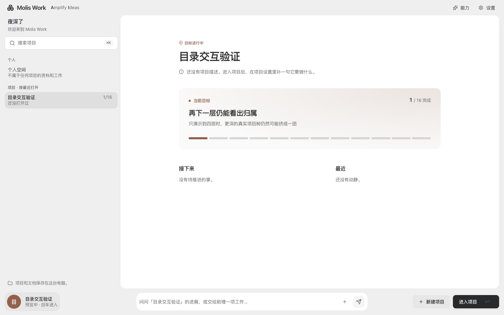

选择页：左边个人空间与按最近打开排序的项目，右边是所选项目的简介卡（「目标进行中」、一句描述缺失时写「还没有项目描述。进入项目后，在项目设置里补一句它要做什么」）、当前目标和进度条、「接下来」「最近」；底部「进入项目 ↵」「新建项目」，输入框可以直接问进展。项目首页（截图 02）是「今天的工作」：本周日条、焦点 Goal 卡「继续这个目标」、快捷入口（Goals、Inbox、Feed）、「推进一个目标 / 写一份文档 / 记下一点灵感 / 浏览更多工具」四个起点。

好：一屏放下、主操作唯一、空的地方都用一句话说明。没发现问题。

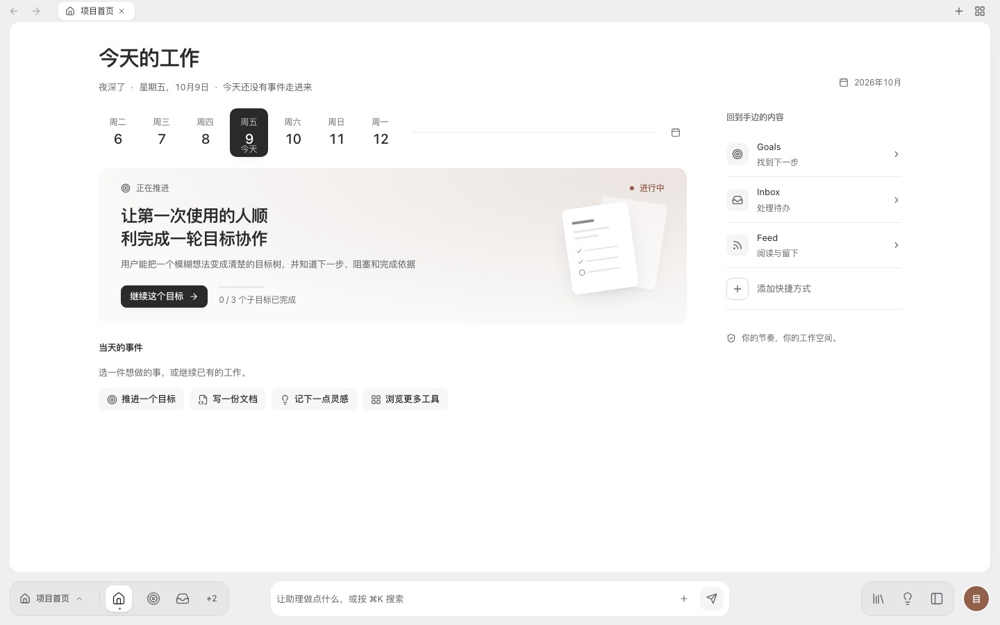

### 2.2 找到并加入一个插件（截图 03）

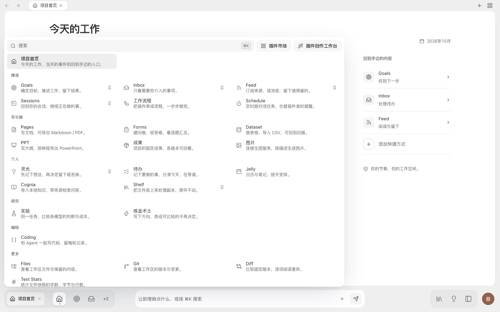

底栏左边的插件选择器：顶上是搜索、插件市场与创作台，下面按「推进、写与做、个人、研究、编码、更多」六组列出 24 个插件，每个一句话说明，右边是「常驻 Dock」和「移除」。

好：分组与说明足够找到「我要写文档用哪个」。问题：（1）选择器里 13 个个人插件也显示「移除」，但移除只是隐藏、动作仍可用（K-1，已登记 BL-088）；（2）名字中英混用（逐插件结论 H-6）；（3）创作台在这里叫「插件创作工作台」，打开后底栏写 `plugin-builder`（K-3，截图 29）。

### 2.3 新建一个 Goal（截图 04）

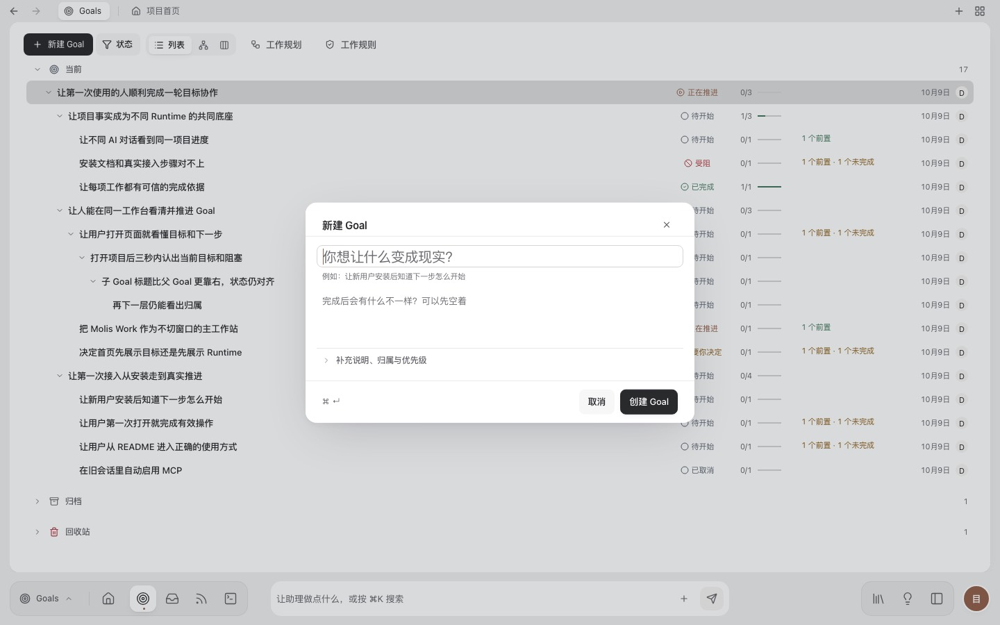

对话框只有一个必填：「你想让什么变成现实？」，说明与「补充说明、归属与优先级」折叠，右下角「创建 Goal」，左下角给出 ⌘↵。同一个 Goal 连点两次创建按钮只建一条。好；没发现问题。

### 2.4 记一件待办（截图 09）

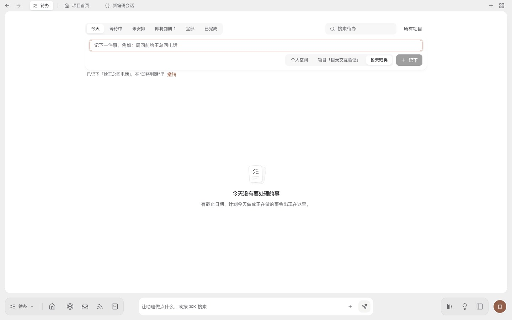

输入「明天前给王总回电话」，输入时就显示「截止 明天」（不靠模型），点「记下」，提示条写「已记下「给王总回电话」，在“即将到期”里 [撤销]」，「即将到期」页签出现计数 1。好：有撤销、位置有交代、双击不重复。问题（V-3）：记下之后停在「今天」视图的空状态（「今天没有要处理的事」），新条目在另一个页签，提示条没有「去看」的一步；第一次用的人会先以为没记上。

### 2.5 写一份文稿，存成成果，再搜到它（截图 10–13）

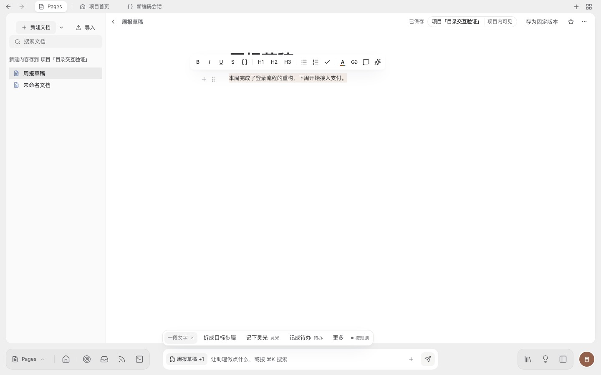

新建文档、写标题与一句话、全选：选区上方是格式条（B、I、U、S、代码、H1–H3、列表、清单、颜色、链接、评论、AI），底部是情境条「拆成目标步骤（Goals）/ 记下灵光 / 记成待办 / 更多 / 按规则」。点「更多」：

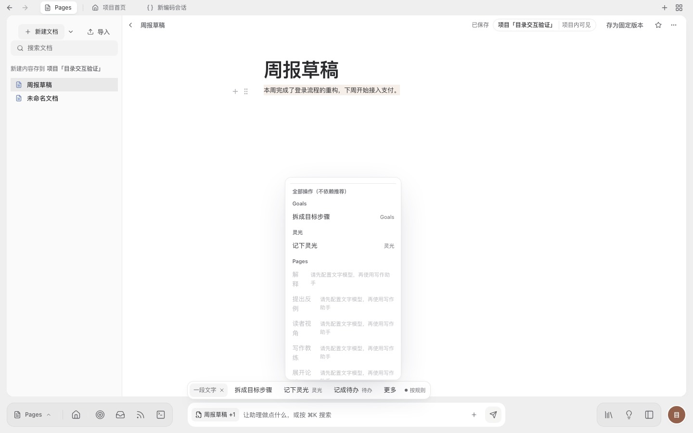

「全部操作」里 Goals 与灵光的动作可点，Pages 的 17 个写作命令灰着，每一条都写「请先配置文字模型，再使用写作助手」。好：看得见、点不了、说得清原因。问题：灰色项的标签被原因文字挤成逐字换行（「解/释」「提出反/例」）（E-10）；左栏还留着我之前「新建」后马上返回留下的「未命名文档」（E-9）。点「存为固定版本」后：

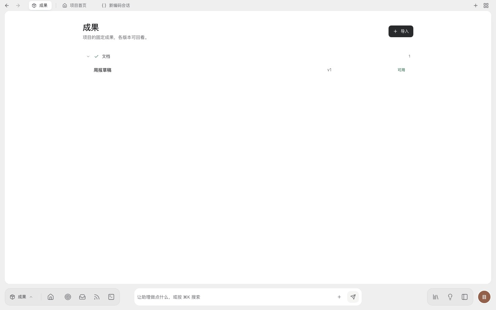

成果里出现「文档 · 周报草稿 v1 可用」。再用 ⌘K 搜「周报」：

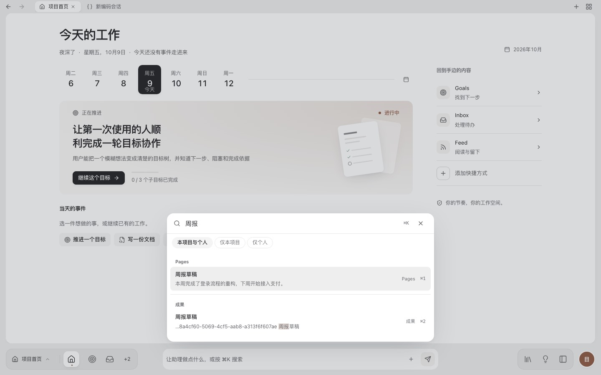

两个结果，Pages 的摘要是正文，成果的摘要是「…8a4cf60-5069-4cf5-aab8-a313f6f607ae 周报草稿」，露出了内部 id（E-4）。动线本身通：写、固定、被搜到、在成果里。

### 2.6 没有模型的助理，以及去配模型（截图 14–16）

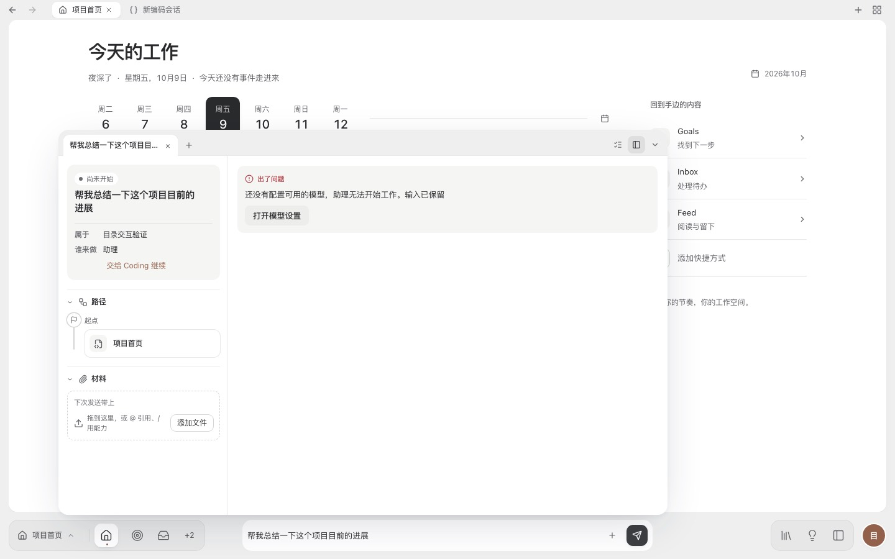

发送「帮我总结一下这个项目目前的进展」：助理面板打开，卡片「尚未开始」，右侧「出了问题：还没有配置可用的模型，助理无法开始工作。输入已保留」，按钮「打开模型设置」；底栏的输入原样保留。好：原因具体、输入不丢、出路一步。

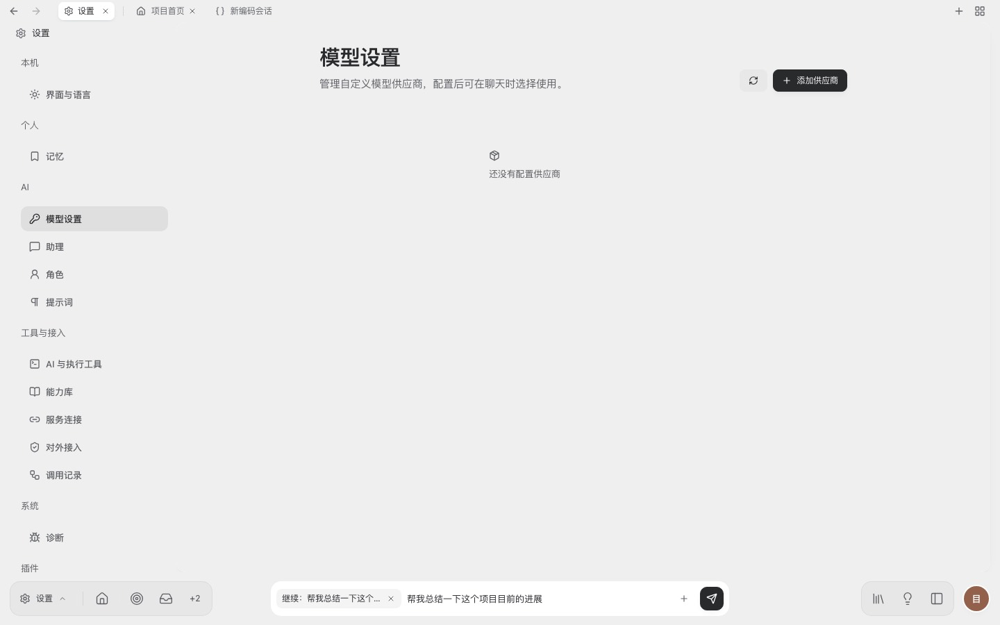

设置的「模型设置」：说明「管理自定义模型供应商，配置后可在聊天时选择使用」，列表只有一行「还没有配置供应商」，右上「添加供应商」。

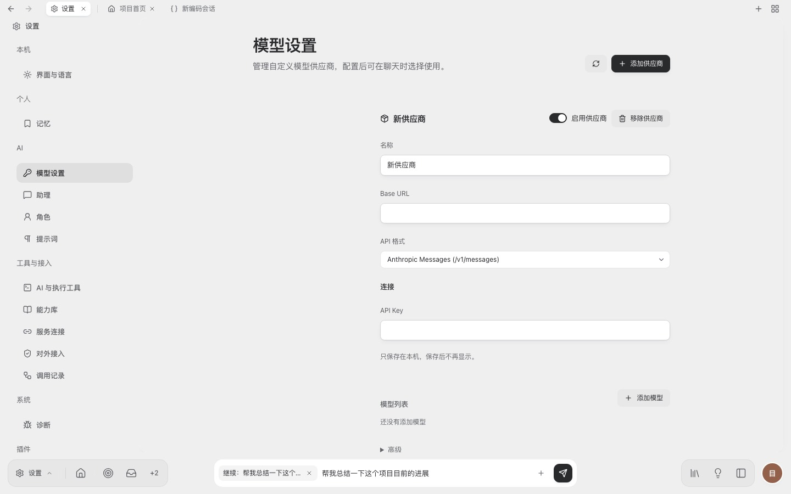

点开是空表：名称、Base URL、API 格式（默认 Anthropic Messages）、连接、API Key（「只保存在本机，保存后不再显示」）、模型列表（「还没有添加模型」）、保存配置。没有预设、没有示例、没有「测试连通」。V-1：这是 §1 第 3 条。另外「配置完成后能否回到原任务」没有走通：我没有真实密钥可填 [未验证]；助理的输入保留与「打开模型设置」链接是对的，回来后是否自动续上没有测。

### 2.7 建一个定时任务（截图 17）

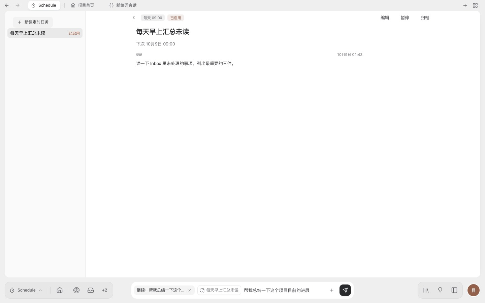

对话框三个字段：标题、说明（「到点后 Agent 会读这段说明，然后在这条对话里回复。默认只读。要改文件会进现有审核队列」）、每天几点（「按这台电脑的本地时间。本地服务没开时闹钟不响」）。创建后任务显示「已启用 · 每天 09:00 · 下次 10月9日 09:00」。好：诚实地写了「服务没开不响」。问题（K-2）：没有模型、项目没绑定工作区，创建仍然成功并显示已启用，缺什么到点才暴露（`schedule-task-runner.ts:33`、`:38`）；也没有「立即跑一次」来验证。底栏上还留着助理失败后保留的那句话和芯片，跟着人到了这个页面。

### 2.8 炼金术士：没有模型时（截图 18）

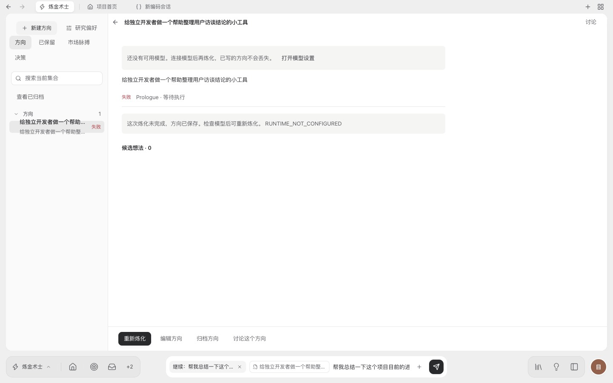

新建方向「给独立开发者做一个帮助整理用户访谈结论的小工具」，点「保存并炼化」：方向保存，卡片显示「失败 · Prologue · 等待执行」，下面一条「这次炼化未完成，方向已保存。检查模型后可重新炼化。RUNTIME_NOT_CONFIGURED」，顶部另有写得好的「还没有可用模型。连接模型后再炼化，已写的方向不会丢失。[打开模型设置]」。好：方向没丢。问题（E-7）：卡片里露出内部名与原码，提交前按钮没有任何「没有模型」的预告。

### 2.9 工作流程：从示例开始（截图 19）

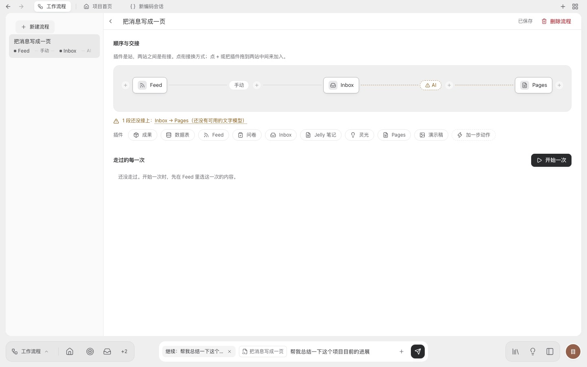

空状态给了一条示例链「Feed — 手动 — Inbox — AI — Pages」和「用这个例子新建」；建好后编辑器列出九个可串的插件，衔接处写「1 段还没接上：Inbox → Pages（还没有可用的文字模型）」，「开始一次」点开后写「Feed 里还没有可以开始的内容」并把「开始」置灰。好：每个阻塞都说在哪、为什么。

### 2.10 图片：第一次使用（截图 20）

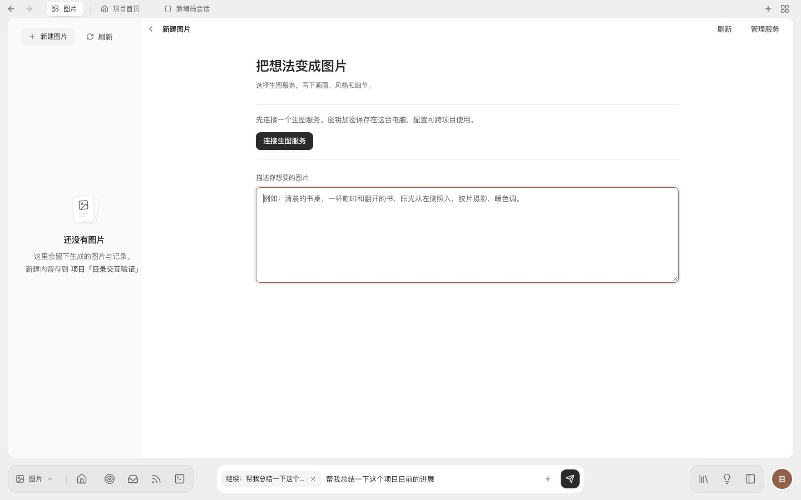

「把想法变成图片」页：「先连接一个生图服务。密钥加密保存在这台电脑，配置可跨项目使用。」和「连接生图服务」。好；真实厂商生成没测（BL-046）。

### 2.11 示例项目的 Feed（截图 23）

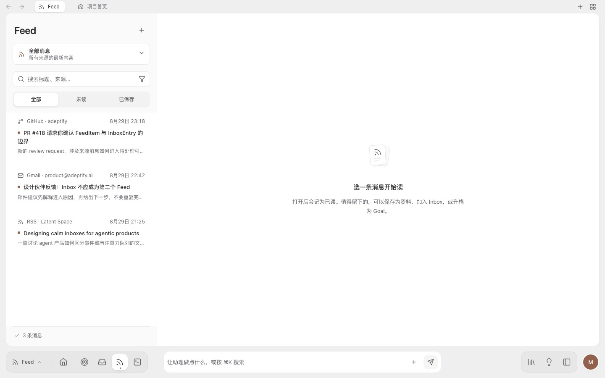

示例项目的 Feed 本来有种子写好的真实消息；我把消息清掉之后，页面凭空补出三条（「GitHub · adeptify」「Gmail · product@adeptify.ai」「RSS · Latent Space」，日期是 8 月 29 日），每条详情里有一句「演示动作只改变当前页面状态，不会连接账号、写入数据库或启动后台任务」。这是 E-3：客户端里的演示前端。普通用户项目走不到；示例项目走不走得到取决于有没有消息。

### 2.12 窄屏（截图 21、22）

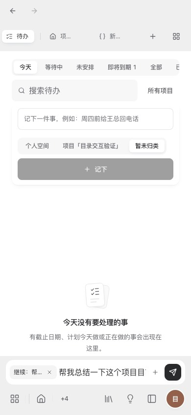

390 宽，8 个页面（首页、待办、Pages、Goals、Inbox、Feed、Schedule、Shelf）都没有页面级横向滚动。问题（V-4）：待办的视图页签最后一个被裁成「已完」；

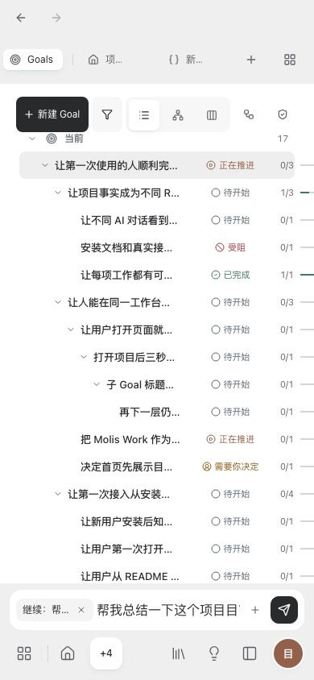

Goals 列表的标题被截断可以接受，但每行右侧的进度条被视口右缘切掉，像是溢出的线。触控目标度量见 §4。

## 3. 逐页健康与空状态

按插件列出：空状态的写法、有没有主操作、有模型时才有的入口没有模型时的表现。「无截图」的是探索时看过、没有收进定稿集的页面。

| 页面 | 空状态 | 主操作 | 无模型时 | 截图 |
| --- | --- | --- | --- | --- |
| Goals | 种子目标树；画布另有「还没有 Goal」空状态（读码） | 新建 Goal | 不用模型 | 04 |
| 待办 | 共用块「今天没有要处理的事」 | 上方的记下输入 | 界面没有 AI 入口 | 09 |
| Pages | 共用块 + 「从模板新建」「导入已有文档」 | 新建文档 | 写作命令灰着并写原因 | 27、11 |
| Inbox | 分区短句「现在没有需要你介入的事项」（有意） | 整理材料到 Pages | 同 Pages | 24 |
| Feed | 共用块「添加一个来源，开始收集消息」 | 添加来源 | 判断规则需要判断连接 | 25 |
| Schedule | 共用块「还没有定时任务」 | 新建定时任务 | 创建不检查（K-2） | 26 |
| Sessions | **一行字**「这个项目还没有 Session」 | 右上「新建 Session」 | 不用模型 | 05 |
| 成果 | **一行字**「还没有成果」 | 右上「导入」 | 不用模型 | 06 |
| 工作流程 | 共用块 + 示例链 | 用这个例子新建 | 衔接处写明 | 19 |
| Form、Dataset、PPT | 共用块 + 主操作 | 新建问卷 / 数据表 / 演示稿 | AI 按钮灰着并写原因（读码） | 无截图 |
| 图片 | 共用块；新建页有连接引导 | 新建图片 | 不用文字模型，要图像连接 | 20 |
| 灵光 | 共用块 | 记下第一条灵光 | 对话动作不可用 | 无截图 |
| Jelly | 空月历（无行动提示，日历如此） | 新建事项 | AI 拆解不可用、手工拆解可用 | 无截图 |
| Cognia | 共用块 + 无模型横幅 | 导入知识库 / 添加材料 | 横幅 + 打开模型设置 | 07 |
| Shelf | 首次自动放一份「试用示例.pdf」（E-12）；生成结果、剪贴板历史各有一句空话 | 添加材料 | `shelf.jobs.generate` 不可用 | 无截图 |
| Characters | 设置里的角色列表，15 个系统与插件角色 | 新建角色 / 从本机导入 | 不用模型 | 无截图 |
| 实验 | 共用块 | 新建实验 | Jev 参试者要判断连接 | 无截图 |
| 炼金术士 | 共用块「这里还是空的」 | 新建方向 | 提交后才失败（E-7） | 18 |
| Coding | 共用块「和 Agent 一起写代码」；新会话页有四个示例任务 | 开始新会话 | 输入框下「还没有模型」 | 08 |
| Files、Git | 左栏写「请在项目设置的工作目录中选择可用浏览目录」，右栏共用块 | 左上「工作目录设置」 | 不用模型 | 28 |
| Diff、Text Stats | **一行小字**（版式也偏离，E-14） | 右上「刷新」「打开 Files」 | 不用模型 | 30、31 |
| 插件创作台 | 引导与三个示例，右栏「这里会出现你的插件」 | 输入框 | 顶栏选模型 + 打开设置 | 29 |

## 4. 度量

**脚本错误、溢出、加载**：26 个页面在 1440 宽逐个打开，等 4.5 秒后读：`window.__errs`（注入的 `onerror`、`unhandledrejection`、`console.error` 收集器）为空 26/26；`documentElement.scrollWidth > innerWidth` 为假 26/26；`[data-ui-client-state="failed"]` 与 `="loading"` 都是 0 个 26/26。[已确认]

**触控目标**（`button, a[href], [role=tab], input, select, textarea, summary` 里可见的，取宽高中小的一个）：

| 视口 | 页面 | 可交互元素 | 小于下限的 | 例子（宽×高 px） |
| --- | --- | --- | --- | --- |
| 桌面 1440，下限 28（紧凑）或 32（标准） | 首页 / 待办 / Pages / Goals / Inbox / Feed / Schedule / Shelf | 40 / 38 / 31 / 73 / 31 / 35 / 25 / 29 | 小于 28 的：6 / 17 / 9 / 17 / 7 / 7 / 7 / 7 | 上一步、下一步 32×26；标签 26 高；关闭标签 22×22；打开插件、布局与分屏 26×26（每页都有） |
| 手机 390，下限 44 | 首页 / 待办 / Pages / Goals / Inbox / Feed / Schedule / Shelf / Jelly / 灵光 | 38 / 35 / 28 / 70 / 28 / 32 / 23 / 26 / 107 / 26 | 小于 44 的：19 / 26 / 18 / 63 / 19 / 24 / 16 / 20 / 98 / 16 | 标签 26 高；底栏图标 40×40；助理输入框 278×28；添加附件 30×28；发送 34×34（每页都有） |

`DESIGN.md` 的 Focus and accessibility 一节写：「Every interactive target is at least 32px on desktop (28px compact) and 44px on phones and coarse pointers」。外壳（标题栏标签条、底栏、助理输入）达不到；Goals 与 Jelly 的数字高是因为树行与日历格也算。V-2 要决定：改控件，还是在 `DESIGN.md` 里为标题栏与底栏写一条有范围的例外。

**重复提交**：待办「记下」与 Goal「创建」在同一个事件循环里点两次，各只建一条；Pages「新建文档」同一个事件循环里点两次建了两篇（两个不同的 id），人手速度（120ms 间隔）点两次只建一篇。[已确认]

## 5. 发现

| # | 严重度 | 发现 | 证据 | 去向 |
| --- | --- | --- | --- | --- |
| V-1 | 中 | **没有模型的第一次使用，出路的终点是一张空表**：「打开模型设置」落到只有一行字的页，「添加供应商」是要手填 Base URL、API 格式、密钥、模型列表的空表，没有预设供应商或示例、没有连通性自检 | 截图 14、15、16。已登记：体检报告 `docs/prompts/code-health-report-2026-09-30.md` §3.3 模型行「首次使用前必须填 Key，onboarding 得把这一步做顺」；[c-end-readiness.md](c-end-readiness.md) 第 320 行把「BYOK 首次引导」归为产品引导、不在防腐范围 | 属产品决定，先问：推荐给几家常用供应商（含 Prologue 已支持的两种协议）做一键模板，保存时做一次连通性自检，并在保存后回到触发它的那个页面。**W2-18 待决 4**（[spec.md](spec.md) §1） |
| V-2 | 低 | **外壳控件小于 `DESIGN.md` 的触控下限**：桌面标题栏的标签条 22–26px；手机上标签 26 高、底栏图标 40、助理输入 28 高 | §4 度量；`DESIGN.md` Focus and accessibility | 决定：达标，或在 `DESIGN.md` 写有范围的例外；推荐手机上先把助理输入框与发送、附件做到 44。**W2-18 待决 10**（[spec.md](spec.md) §1） |
| V-3 | 低 | **待办记下后停在「今天」的空状态**，新条目在另一个页签，提示条没有一键跳过去 | 截图 09 | 提示条加「查看」，或按所属视图自动切过去 |
| V-4 | 低 | **窄屏：待办视图页签被裁；Goals 行右侧进度条被视口边缘切断** | 截图 21、22 | 页签横向滚动并露出被裁的半个；行右侧列在窄屏收起 |
| V-5 | 低 | **助理输入与引用标签跟着人跳到每个页面**（失败后「输入已保留」是有意的）：截图 17、18 底栏有一条已经与当前页面无关的旧句子，清除要点芯片的 × 与清空输入两处 | 截图 17、18 | 观察，不是缺陷；可考虑只在回到原工作时才带出 |
| E-3 至 E-14 | 见 [逐插件结论](plugin-conclusions.md) §2 | 示例项目的演示前端（E-3）、成果搜索摘要露出 id（E-4）、成果与 Sessions 的空状态（E-5、E-6）、炼金术士原码（E-7）、Pages 的残留与新建（E-8、E-9、E-10）、Shelf 兼容入口与首次示例（E-11、E-12）、Text Stats 与 Diff（E-13、E-14） | 截图 05、06、11、13、18、23、30、31 | 各见原表 |

## 6. 对照任务书 §9：做了什么，没覆盖什么

`docs/prompts/repository-systematic-review.md` §9 的每条检查，做到哪一步。「做了」是在真实页面上操作并留了证据；「部分」是只看了一部分页面或只做了一半；「没做」是没有核。

| §9 的检查 | 程度 | 依据或缺口 |
| --- | --- | --- |
| 信息层级、布局、字体、间距、色彩、图标是否协调；有无重复卡片、过多边框、无效留白 | 做了（对照 `DESIGN.md`） | 26 个页面的逐页度量与 31 张截图；发现 E-10、E-14、V-4 |
| 动效 | 没做 | 静态截图与度量看不出，需要录屏或逐帧 |
| 简约而不隐藏必要信息；信息密度 | 部分 | 靠截图判断；`tests/dense-workspace.e2e.test.ts` 守着一部分，本片没有跑 |
| 主次操作和危险操作是否明确 | 部分 | 新建 Goal、定时任务、Pages 命令条走过（§2.3、§2.5、§2.7）；危险操作（删除、清空、移除插件）没有逐个操作，只在读码时看到待办的删除先确认（逐插件结论 §4.14） |
| 页面、组件、术语及交互是否一致 | 做了 | 逐插件结论 H-3（空状态两套）、H-6（中英混用）、E-5、E-6、E-14 |
| 弹窗、抽屉、标签页和独立页面是否使用合理 | 部分 | 对话框（新建 Goal、定时任务）与右侧情境条看了；独立页面由 `tests/shell-page-gate.test.ts` 守着，本片没有重跑 |
| 窄屏 | 做了（8 个页面） | §2.12、§4 |
| 长文本、滚动 | 没做 | 没有造长标题和大数据；`tests/long-content-viewport.e2e.test.ts` 守着一部分 |
| **键盘与焦点、基本可访问性** | **没做** | 没有逐页过 Tab 顺序、焦点环、Esc 与焦点归还；读屏与中文输入法已登记为 BL-016（要真机）；触控目标尺寸量了（V-2） |
| 加载、空状态 | 做了 | 26 页等 4.5 秒后无卡在加载的面板；空状态逐页表见 §3 |
| **失败、部分成功、权限不足、离线** | **没做** | 没有造网络或服务故障；`DESIGN.md` 要求的 `mw-empty--error` 失败块没有触发过 |
| 输入丢失、重复提交 | 做了 | 助理失败后输入保留；Pages 草稿刷新后还在；待办、Goal、Pages 的双击探针（§4） |
| 闪烁、布局跳动 | 没做 | 没有逐帧或布局偏移度量 |
| 用户路径：找到功能、理解用途、完成前置条件、开始操作、确认结果、继续下一步 | 部分 | 10 条路径（§2.1 至 §2.10）；其余插件只看了空状态与首次入口 |
| 首次引导、示例、默认值、空状态行动提示 | 做了 | §2.1、§2.9、§2.10、§3 |
| 配置或授权完成后能否返回原任务并保留上下文 | 没做 | 没有真实密钥可填；助理的输入保留与「打开模型设置」链接是对的，回来后是否自动续上没有测（§2.6） |
| 跨页面、跨插件时项目、账号、选择和草稿是否保留；返回、取消、关闭、撤销、再次进入 | 部分 | 助理输入跟着人跳页（V-5）、Pages 草稿刷新后在、E-9 的「返回再刷新」、待办的撤销入口；多项目切换时选择是否保留、取消与关闭的统一性没有系统走 |
| 熟练用户的快捷路径 | 部分 | 用到了 ⌘K、⌘↵、↵，没有系统检查 |
| **前后端状态一致；「请求已接受」「执行中」「完成」「产物已发布」是否分得清** | **没做** | 只在炼金术士失败卡（E-7）、图片任务这类零星处看到状态文案，没有按四个状态逐个核 |
| **乐观更新失败、多窗口、事件重连** | **没做** | 刷新做了（Pages 草稿）；其余没有造 |
| **暗色主题、英文界面、紧凑密度** | **没做** | 只看了默认的浅色、中文、标准密度 |
| 有真实模型的路径 | 没做 | 没有模型凭据，也不动真实 Home；所有 AI 路径只看了「没有模型」这一半 |

表里加粗的是任务书点名、本次完全没碰的。路线里没有片承接这些，已写进 [spec.md](spec.md) §10「第 2 波产出」的遗留，建议另开一片「前端质感走查第二轮」，需要键盘与读屏的部分要真机。

### 6.1 没覆盖的细节

- **有真实模型的路径**：没有模型凭据，也不动真实 Home；所有 AI 路径只看了「没有模型」这一半。
- **键盘与读屏**：没有逐页过 Tab 顺序、焦点环、Esc 与焦点归还；读屏与中文输入法已登记为 BL-016（要真机）。
- **暗色主题、英文界面、紧凑密度**：只看了默认的浅色、中文、标准密度。
- **加载慢、失败、离线、多窗口、事件重连、乐观更新失败**：没有造网络或服务故障；`DESIGN.md` 要求的 `mw-empty--error` 失败块没有触发过。
- **长文本与大数据量**：没有造长标题、几百条记录；`tests/long-content-viewport.e2e.test.ts`、`tests/dense-workspace.e2e.test.ts` 守着一部分。
- **示例项目之外的真实内容**：Goals 的空项目、Feed 真实来源、Form 真实填写、Coding 真实仓库。

## 7. 复现

在 `tests/` 下临时放一个测试文件，`openGoalBrowser(t, "seeded")`（或 `true` 取示例项目），用夹具给的 `command("Page.captureScreenshot", …)` 截图、`evaluate` 读 DOM、`click` 点按钮；输入用 `Input.insertText`，快捷键用 `Input.dispatchKeyEvent`（⌘K 是 `modifiers: 4`）。起页面前注入收集器：`Page.addScriptToEvaluateOnNewDocument` 写 `window.__errs`。导航偶尔在机器负载高时超时，换成直接 `Page.navigate` 加固定等待。窄屏与触控度量见 §4 的选择器与阈值。截图用 `sips -s format jpeg -s formatOptions 72` 转成 JPEG 放进 `evidence/flow-walk/`。夹具自己起 Chrome 与临时 Home，用完删。
