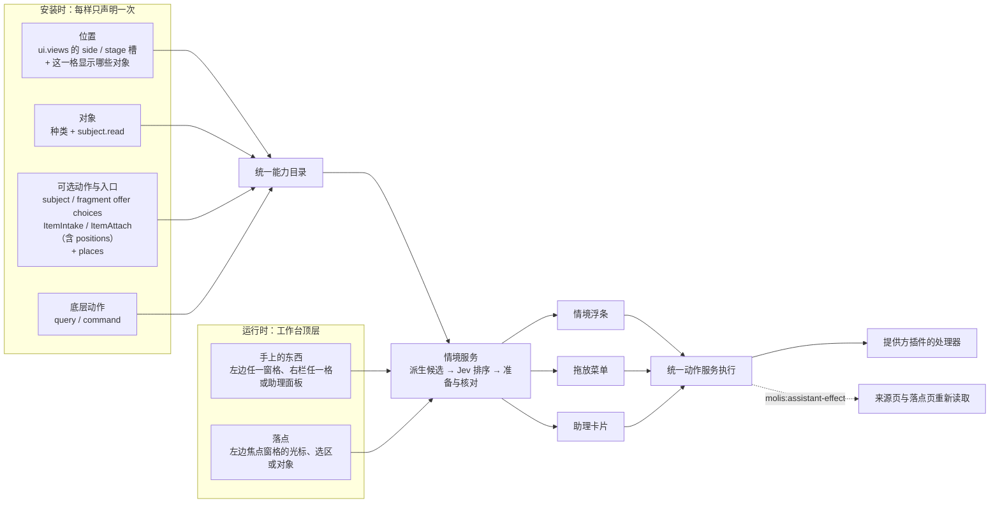

# 右栏里的 Shelf：左右互动与同一个动作池

状态：需求书草稿（2026-10-01），等用户审阅，未动代码；架构见第 4 节。2026-10-02 起与 context-toolbar、quick-create 合并设计，交叉的部分（浮条、候选、追加与放进、执行规则、分期）以[情境动作总纲](../context-program/spec.md)为准。2026-10-02 起与 context-toolbar、quick-create、总纲同在分支 `feature/context-toolbar`（工作树 `.claude/worktrees/context-toolbar`），一个 PR。

相关的已归档需求：[平台侧栏](../archive/side-panel/spec.md)（右栏本身）、[情境驱动的动态交互](../archive/contextual-interaction/spec.md)（动作池、Jev 判断、底栏动作条）、[Shelf](../archive/shelf-plugin/spec.md)（DropAgent 复刻）、[craft-finish](../craft-finish/spec.md)（底栏）。

## 1. 用户原话与已定的事

原话（2026-10-01）：

> shelf准备放右边（侧边栏）去，不当插件了，然后右边的内容，包括灵光，文件，浏览器内容，群聊可以和左边互动。侧边不止是群聊里。这个侧边栏，右边里面的内容可以发送到左边，会有一整套动作。jev选择动态生成，shelf不作为右边的插件了。

追问后用户定下的：

| # | 问题 | 用户的决定 |
| --- | --- | --- |
| U1 | 原 Shelf 的功能去哪 | 原样保留，成为右栏里的一格。DropAgent 的材料、结果、剪贴板、动作栏、终端、拖出、设置都不变 |
| U2 | 左右单向还是双向 | 双向，先做右→左 |
| U3 | 「Jev 选择、动态生成」 | Jev 从统一能力目录里挑选和排序，不现场编造动作 |
| U4 | 动作栏 | 动作栏不只管「发送」，背后是同一个动作池（和以前的做法一样，用同一份动作列表），要细化每个动作的可用范围；由 Jev 这类判断模型统一从候选里选 |
| U5 | 动作栏放在哪里 | 底栏动作条跟着手上的东西走。拖放时弹出同一份列表（2026-10-02 起「底栏」改为情境浮条贴着手上的东西，见 3.3 与总纲第 10 节） |
| U6 | Shelf 格里 DropAgent 自己的动作栏 | 界面不动，这些动作同时登记进动作池 |
| U7 | 下一步 | 先写需求书，用户看过再动代码 |

## 2. 现状（已对照代码核对）

| 部分 | 事实 | 对本需求的意义 |
| --- | --- | --- |
| 右栏 | `apps/workbench/src/side-panel.ts`：讨论、浏览器、文件三格是平台自带的；插件声明 `slot: "side"` 的视图也成为一格，现在只有灵光声明了（`plugins/native/lingguang/src/manifest.ts`）。各格隐藏后不销毁，`molis:side-open` 负责打开 | Shelf 可以按同样的方式进来，不用另造一个面板 |
| 右栏的群聊痕迹 | 面板 id 还叫 `dock-window-im`，开关按钮是 `data-dock-toggle="im"`，第一次打开默认在讨论格 | 「侧边不止是群聊里」：命名、默认格都要改 |
| 底栏右侧 | `immersive-shell.ts` 的 `BAR_RESIDENT_IDS = ["shelf", "lingguang"]`：两个图标按钮，点了把左边主区切换到该插件；旁边是侧栏按钮，再往右是项目圆钮 | 两个按钮要并进侧栏按钮 |
| Shelf | 普通插件（`plugins/native/shelf`），只有 `navigator` 视图，在左边主区占一整页；数据是个人的，在 `<home>/shelf`；已经由 Runtime 装配，但 HTTP 仍有旧路径文件 `apps/local-host/src/shelf-native-plugin-http.ts`（在冻结名单里，只许减少） | 改动在视图和入口，动作和存储不用改；本任务不新增旧路径文件 |
| Shelf 的桌面入口 | 全局热键、菜单栏、轮盘都调用 `globalThis.molisWorkOpenShelf`（`apps/desktop/src/shell.ts`），实现方式是点插件列表里 Shelf 那一行；轮盘的 `over_shelf_panel` 判断鼠标是否在 Shelf 面板上 | 都要改成打开右栏的 Shelf 格 |
| Shelf 的文件来源 | `shelf.files.entries`（`plugins/native/shelf/src/search.ts`）让 Shelf 的材料也出现在右栏「文件」格 | Shelf 有了自己的格之后，会出现两份清单 |
| 动作池 | 统一能力目录，加上插件声明的可选动作。整个对象用 `subject_offer_choices`，选中一部分用 `fragment_offer_choices`，后者带意图、效果、提示句、粒度、内容角色、`requires: ["goal"]`。现有约 40 条：Pages 约 20、Feed 10、Inbox 5、Goals 4、灵光 2、Todo 2；灵光「记下」、Todo「记成待办」、Goals 声明的是 `FRAGMENT_ANY_OBJECT`（任何对象都适用） | 这就是用户说的「同一份动作列表」 |
| 候选与判断 | `packages/kernel/src/contextual.ts` 按手上的东西挑出候选，`apps/local-host/src/contextual/` 负责准备参数、执行前核对、调用 Jev（两个问题：`next` 和 `surface`）。Jev 失败时按规则排列 | 本需求复用这一条链，不另起一套 |
| 底栏动作条 | `apps/workbench/src/scripts/client/context-actions.ts`：页面发出 `molis:surface-focus`，动作条显示候选；点了之后交给拥有该对象的页面，页面先预览、确认后才写入。分屏窗格是 iframe，会把焦点转发到顶层 | 右栏各格也按这个方式把焦点转发上来 |
| 情境里没有「落点」 | `SurfaceFocus` 只描述手上的东西（`plugin_id`、对象、粒度、选中的几段）。可选动作的范围也只描述手上的东西，没有「东西在哪」，也没有「放到哪」 | 要补的就是这两样（第 4、5 节） |
| 右栏各格能否声明手上的东西 | Shelf、灵光已经用 `data-assistant-context` 声明当前对象（情境交互 §2.1 的逐插件检查）；文件格的预览、浏览器（画面是 canvas，选区要经 `/api/browser/capture` 取）、讨论（im iframe）都还没有声明 | 第 6 节逐格补 |

## 3. 目标形态

### 3.1 右栏

- 右栏是平台的侧栏，不附属于群聊。格的顺序：**Shelf · 灵光 · 文件 · 浏览器 · 讨论**，后面是其他插件声明的侧栏视图。
- 停在哪一格：第一次打开在 Shelf 格；之后主动点侧栏按钮，回到上次那一格；某件事需要右栏时，打开相关的那一格（现有的有：助理浏览时打开浏览器，对话里点文件时打开「文件」；本任务新增：放上架时打开 Shelf）。
- 底栏右侧只留一个侧栏按钮，提示写「侧栏：Shelf、灵光、文件、浏览器与讨论」。原来的 Shelf、灵光两个按钮取消。项目圆钮不变。
- 宽度、拖动调宽、窄屏上下分屏、Escape 等，沿用平台侧栏的现行做法。

### 3.2 Shelf 成为右栏的一格

- **在产品上，Shelf 不再是插件**：不出现在插件列表、插件市场、「常驻在 Dock」的选择、项目插件管理里；不能从项目里移除；不在左边主区打开。
- **格里的内容原样保留（U1）**：材料、生成结果、剪贴板三组，动作栏与确认运行、终端、拖出、⌘V、设置。颜色、行、纸面按钮、动效都按 DropAgent 不变。
- **只改版式，适应右栏宽度（360px 到窗口宽的 55%）**：目录占满全宽，点一行进入预览，预览上方有返回；放得下两栏时（容器宽度 ≥ 640px）恢复 213pt 左栏加预览。
- **旧入口都改为打开右栏的 Shelf 格**：桌面全局热键、菜单栏、轮盘放入之后，搜索结果里的 Shelf 材料，旧地址 `?plugin=shelf`。
- **Shelf 的全局设置位置不变**。

### 3.3 左右互动

- **右→左（第一期）**：在右栏或助理面板选中一样东西（Shelf 的材料或结果、一条灵光、一个文件、网页里的一段、群聊里的一条消息、助理给出的结果或材料），浮条就贴着这一样东西出现，显示它的动作。其中「放进左边」的那一类，落点是左边当前打开的对象：光标处、选区或整个对象。把这样东西从右栏拖到左边松手，在松手处弹出同一份列表，落点按松手的位置算。
- **左→右（第二期）**：左边选中的内容可以「放上 Shelf」或「记成灵光」，也可以直接拖到右栏的 Shelf 格。这些动作也在同一个池里。
- **动作栏只有一条（U5，2026-10-02 按总纲调整）**：底部动作条取消，改为情境浮条贴着手上的东西出现：左边选区旁、右栏选中的条目或选区旁、助理面板的结果旁。浮条最前面标出落点（例如「→ Pages · 第 3 段光标处」），不再需要标来源。右边的东西取消选中或侧栏收起后，浮条随之收起。

## 4. 架构

### 4.1 先说结论

- **不新建注册表。** 你说的「动作注册表」，就是现有的统一能力目录（Kernel registry）。action-architecture §3 的基本合同规定了三条：能力注册一次、各处自动发现；插件只靠自己的声明和实现接入；宿主不另写名单。左右打通要做的，是在这个目录里**多声明三种关系**（4.3），关系由声明推导出来，而不是另建一张手工维护的关系表。
- **分三层。**
  - 声明：安装时就能检查；
  - 情境：运行时在界面里，即「手上的东西」和「落点」；
  - 执行：都走统一动作服务，不论从哪里发起，结果都一样。
- **分三种通道，互不替代。**
  - 界面事件只说「人手上有什么、要放到哪」；
  - 插件事件（`publishes / subscribes`）只说「数据变了」；
  - 助理消息只说「要告诉助理什么」。
- **助理不用另行登记。** 放置和处理动作登记进目录后，助理按受众 `agent` 自然能用。要补的是两件事：把「手上 + 落点」作为情境交给助理；让助理也用同一份候选和同一套准备核对（4.7）。

### 4.2 全局示意



### 4.3 目录里的三种关系

| 关系 | 回答的问题 | 由什么声明 | 现状 |
| --- | --- | --- | --- |
| 插件 ↔ 右栏 | 哪个插件在右栏有一格，那一格里能拿起什么 | `ui.views` 的 `slot: "side"`；新增 `objects`，写明这一格显示哪些对象种类 | `side` 槽已有（灵光在用）；`objects` 是新增的 |
| 东西 ↔ 动作 | 拿着这样东西能做什么 | 可选动作的对象种类、粒度、角色；新增 `places` | 前三项已有，`places` 是新增的 |
| 右栏 ↔ 左边 | 东西能放进左边哪里、怎么放 | `ItemAttach` 的 `positions`（总纲 3.4，与 F2 追加合成一个声明）；对应的底层写入动作带版本条件（`expected_version`） | 新增 |

**平台自带的格也按同样的方式登记。** 讨论、浏览器、文件三格属于外壳，不是插件，但宿主用同样的形状登记它们。网页（`web.page`）由浏览器服务登记，群聊消息（`im.message`）由 IM 服务登记，各带读取动作。这样五个格在目录看来是同一种东西，候选派生、准备核对、助理都不用为某一格写特例。

**关系由声明推导，再加检查和展示，不靠人维护。**
- **关系视图（只读）**：按对象种类列出三件事：它出现在哪些位置、哪些动作接受它、它能放进哪些落点。给插件开发者看（规格板和「能力」页），测试也用它。
- **目录检查**：在现有的 Manifest 检查和 `pnpm boundary:check` 之外，加一组检查：
  1. side 视图在 `objects` 里写的每个种类，都有读取器 `subject.read`；
  2. `ItemAttach` 只能指向提供方自己的对象种类；
  3. 带光标或选区位置的 `ItemAttach`，指向的底层动作必须是 command、带版本条件、不是不可撤回的；
  4. 选项键唯一，长度 ≤ 64。

### 4.4 插件开发要登记什么

| 想做的事 | 要声明的 | 页面要做到的 |
| --- | --- | --- |
| 在右栏有一格 | `ui.views` 加 `slot: "side"` 和 `objects` | 渲染这一格；用 `data-assistant-context` 声明当前对象 |
| 自己的东西能被拿起、发到别处 | 对象种类 + `<plugin>.subject.read`（大多已经有了） | 选中时报告「手上的东西」 |
| 接受别处的东西，成为落点 | `ItemAttach`（带 `positions`）+ 底层写入动作 | 报告落点；收到放进落点的选择时在落点处的面板槽预览，确认后经底层动作写入 |
| 对东西提供处理动作 | `fragment_offer_choices` 或 `subject_offer_choices`，需要时用 `places` 收窄 | 只读结果由平台显示；会写的一律先确认 |
| 被放上 Shelf、记成灵光 | 不用声明，由 Shelf 和灵光提供 | — |

- 用已有扩展合同的插件，不改宿主。
- 插件 SDK 新增页面端的辅助：`reportHand`、`reportLanding`、`onPlaceChosen`。现在 `@molis-ai/molis-work-plugin-sdk` 只有动作定义，没有页面端的东西。这三个函数把跨 iframe 转发、冻结、事件名都封装起来，插件不手写 `postMessage`。
- 插件创作台生成的插件，本期能声明 side 视图和 `objects`，暂不能声明带 `positions` 的 `ItemAttach`。这沿用侧栏 D19 对协议型动作的限制，以后再放开。

### 4.5 运行时：手上的东西与落点

- **情境中枢。** 工作台顶层文档里的一个客户端模块，由现有的 `context-actions.ts` 扩展而来。它持有两样东西：
  - **手上的东西**：人最后一次选中的东西，来自左边任一窗格、右栏任一格或助理面板。记录它在哪（`main:<窗格>`、`side:<格>` 或 `assistant`）、是什么对象、粒度、选中的是哪几段。
  - **落点**：左边焦点窗格此刻的落点，即光标、选区或当前对象。只有能当落点的页面才报告。
  - `context_id` 由两样东西一起决定，任一变化，旧的判断就作废。
- **宿主不保存界面状态。** 每次请求时，把「手上 + 落点」一起发给情境服务，与现在的做法一致。
- **点击或松手时，两样一起冻结。** `FrozenFocus` 扩展为同时冻结落点。预览和执行都用冻结时的版本。写入带 `expected_version`，左边在这期间变了就拒绝写入。
- **由谁执行。**
  - 放进落点的（`ItemAttach` 的光标或选区位置），交给**落点的主人**页面去预览和写入；
  - 其他效果交给**手上东西的主人**页面，或由平台直接显示结果。
- 右栏的东西取消选中、或右栏收起后，「手上的东西」回到左边当前的焦点。

### 4.6 事件与消息

**三种通道，各管一件事：**

| 通道 | 管什么 | 例子 |
| --- | --- | --- |
| 界面事件：同一窗口内用 `CustomEvent`；iframe 用同源 `postMessage`，由顶层转发 | 人手上有什么、要放到哪、打开哪一格 | `molis:surface-focus`、`molis:side-open` |
| 插件事件：宿主的 `publishes / subscribes`；`molis.`、`host.` 命名空间归宿主 | 数据变了 | 桌面轮盘往 Shelf 放进了一份新材料 |
| 助理消息：`molis:assistant-message` 与助理自己的工作流 | 告诉助理什么、助理改了什么 | `background`、`suggest`、`molis:assistant-effect` |

**界面事件清单**（大多是扩展现有事件，新增的很少）：

| 事件 | 新增 / 修改 | 内容 |
| --- | --- | --- |
| `molis:surface-focus` | 修改 | 增加 `place`；右栏各格也发 |
| `molis:surface-landing` | 新增 | 左边页面报告落点 `{ pane_id, plugin_id, object, position, anchor?, version }`，节流发送 |
| `molis:landing-at` | 新增 | 拖放松手时，顶层问落点页面：`{ x, y }` 这一点的落点是什么 |
| `molis:assistant-context-actions`、`molis:assistant-context-action-chosen` | 修改 | 选择里带上冻结的落点；放进落点的交给落点的主人 |
| `molis:side-open / -close / -toggle / -shown` | 不变 | 格的 id 由格的登记决定，不写死 |
| `molis:assistant-effect` | 修改 | 写入之后，同时通知落点页和来源页重新读取 |

**转发规则只有一条**：iframe 往上发，顶层分派；需要某个 iframe 处理时，顶层只往下发给拥有它的那一个。顶层只接受同源消息。

**拖放。**
- 应用内拖动用自有的数据类型 `application/x-molis-hand+json`，只带对象引用和有长度上限的文字。
- 桌面版 Shelf 的行现在走 AppKit 原生拖出（拖到 Finder），两者要分开：拖到窗口内的左边，算应用内放置；拖出窗口，走原生拖出。
- 这是第 4 期（拖放）的技术风险，切片阶段先验证。

### 4.7 助理怎样打通

1. **不另行登记。** 放置和处理动作在目录里，受众含 `agent` 的，助理自然能用（`assistantAuthority` 的筛选方式不变）。你为助理关掉的动作，照样关掉。
2. **把情境交给助理。** 现在助理在发送时读当前页面的 `data-assistant-context` 和选中的文字。改为从情境中枢取「手上 + 落点」，在输入框上方显示为看得见、删得掉的情境条；和现在一样，不会自动发送。这样你说「把这段放到我光标那里」，助理知道「这段」和「那里」各指什么。
3. **助理用同一份候选。** 助理要放置或处理东西时，不自己拼参数，而是经情境服务取候选、做准备，走的是浮条同一条链；结果做成卡片（`AssistantPreparedCard`）给你确认。浮条、拖放时弹出的列表、助理三处，看到的是同一份候选，经过的是同一次准备核对。
4. **确认规则沿用现有的。** 助理的写入，确认之前都会停下；只有可撤回、且你没要求每次确认的，才可以直接执行（`directEligible`）。放进落点是例外：一律先预览再确认，因为改的是你眼前正在编辑的东西。
5. **助理面板也是一个位置，第一期就做（用户 2026-10-01 已定）。** 助理面板里的结果和材料也可以是「手上的东西」（`place: assistant`），浮条贴着它出现，发到左边或放上 Shelf。
6. **助理的界面动作不进目录。** 打开右栏某一格、预览某个文件，属于本地展示（action-architecture：界面导航是本地展示能力）。这些继续由助理面板派发 `molis:side-open`，不登记成业务动作，也不对 MCP 开放。

### 4.8 工作流与 MCP

- 底层动作是普通能力，例如 Pages 在指定位置插入（带版本条件）。工作流和 MCP 按现有合同使用，参数要显式给出。
- 需要界面落点的可选动作，只在有界面情境时才产生候选。外部客户端没有「光标」，所以不提供这类动作，也不替它们模拟落点。

## 5. 动作池细则

### 5.1 原则

架构上的取舍见第 4 节，这里只写动作池本身。

1. **动作只来自同一个池**：统一能力目录，加上插件声明的可选动作（U3、U4）。Jev 只负责挑选、排序、突出重点、决定助手要不要参与，不新造动作。Jev 失败或超时时按规则排列。
2. **一个动作只登记一次**：情境浮条、拖放时弹出的列表、开场建议、首页和 Dock 用的是同一个候选和同一套准备核对（`contextual-service.ts`）。
3. **可用范围由声明决定**：哪些动作出现在哪里，按声明的字段判断，不按宿主里写死的名单。

### 5.2 可用范围要补的（合同草案，2026-10-02 按总纲修订）

现有字段继续有效：对象种类、粒度、内容角色、`requires: ["goal"]`、意图、效果。要补的：

```ts
// 可选动作（FragmentOfferChoice、SubjectOfferChoice）与创建入口（ItemIntake）都可以带
readonly places?: readonly ("main" | "side" | "assistant")[];
// 手上的东西在哪：左边主区、右栏还是助理面板。缺省是哪里都可以，所以现有动作的行为不变。只用来收窄范围。

// 「放进左边」不再挂在可选动作上，由 ItemAttach 承担（总纲 3.4，与 F2 追加到已有 Item 合成一个声明）：
//   positions?: ("cursor" | "selection" | "end")[]
//   目标是落点（左边当前打开的编辑器）时才用 positions；find 找到的目标一律放末尾或建关联。
```

情境与准备也要相应补上：

- `SurfaceFocus` 增加 `place: "main" | "side" | "assistant"`、右栏所在的格 `side_tab`，以及 context-toolbar 的 `anchor`。
- 东西在右栏或助理面板时，再带上左边当前的落点 `landing: { plugin_id, object, position, targets?, anchor? }`。落点变了，`context_id` 也跟着变，旧的判断随之作废。
- 准备 `ItemAttach` 时把落点交给提供方，提供方按它准备完整参数。
- 点击时把手上的东西和落点一起冻结，预览和执行都用冻结时的版本。

### 5.3 规则

- **落点动作只能由落点对象的主人提供**：例如「插入到光标处」由 Pages 用 `ItemAttach` 声明，目标只能是 Pages 自己的对象种类。Manifest 检查（`inspectActionDeclarations`）当场拒绝不符合的声明。插件不能借这个动作写别的插件的对象。
- **手上的东西可以是任何对象**：落点动作的查询一般声明 `FRAGMENT_ANY_OBJECT`。正文由平台按对象读取器（`<plugin>.subject.read`）取，或者用选中的文字。
- **左边没有落点时不出现落点动作**：例如左边是项目首页，或者当前插件没有声明对象。其他动作照常出现。
- **会写东西的动作一律走确认**：沿用情境交互的规则，只读动作可以直接出结果，其余一律先确认；不可撤回的动作不在推荐里提供。
- **停用和撤权即时生效**：插件停用或被撤权后，它的动作和落点动作立刻从池里消失；准备期间失效的，按现有的 `offer_changed` 处理。

### 5.4 第一批动作（推荐，审阅时可调整）

| 提供方 | 动作 | 范围 | 效果 |
| --- | --- | --- | --- |
| Pages | 插入到光标处、替换选中的内容、作为引用插入、整理成要点后插入 | `ItemAttach`，落点是 Pages 文档的光标或选区；手上的东西不限 | 放进落点，先预览（整理类先调用模型生成） |
| Goals | 作为依据附到当前 Goal、拆成子目标 | `ItemAttach`（落点是 Goal 对象）/ 创建入口 | 放进落点 / 提案卡片 |
| Coding | 作为材料交给当前会话 | `ItemAttach`，落点是 Coding 会话（只许本机本人） | 放进落点，先预览（复用现有的 Shelf 材料到 Coding 的通路） |
| Shelf | 整合、提取文字、快捷动作、各 Agent 动作（U6） | 手上是 Shelf 材料，或者手上的文件是 Shelf 认得的类型 | result / record（Agent 动作沿用 Shelf 原有的确认页） |
| Shelf | 放上 Shelf（第二期） | `places: ["main"]`，手上的东西不限 | record |
| 灵光、Todo、Goals、搜索 | 记下、记成待办、推进、查找（已有） | 不变；右栏的东西也适用 | 不变 |

### 5.5 Jev 怎样判断

- 仍然是一次请求、两个问题（`next` 和 `surface`），选项键沿用 ≤64 字符的固定键。
- 给 Jev 的情境多两句：手上的东西在哪一格；落点是什么（插件、对象标题、位置及附近的文字）。
- 加一组左右互动的标注情境再做评估，方法沿用情境交互 §5.4。指标：首位命中、前三命中、p95 延迟。达不到门槛（首位 ≥ 80%、前三 ≥ 95%、p95 ≤ 2 秒，用户 2026-10-01 已定）时，这部分按规则排列，并在浮条的状态点上说明。
- 记忆和信号沿用情境交互的接线（`memory.recall` 与采纳、忽略信号）。

## 6. 右栏各格怎样声明手上的东西

| 格 | 手上的东西 | 要做的 |
| --- | --- | --- |
| Shelf | 选中的材料或结果（多选时粒度是 `objects`）；预览里选中的文字 | 已经声明了对象；格是 iframe，要把焦点转发到顶层，转发方式与分屏窗格相同 |
| 灵光 | 当前这条灵光，或其中选中的文字 | 已经声明了对象；同样要转发焦点 |
| 文件 | 正在预览的文件（对象种类取自文件来源条目），或预览里选中的文字 | 预览区补上 `data-assistant-context` |
| 浏览器 | 当前页面，或页面里选中的一段 | 画面是 canvas，没有 DOM 选区。选中时经 `/api/browser/capture` 取选中文字或可读正文，作为平台对象种类 `web.page`（名字待定），带地址和时间 |
| 讨论 | 选中的一条或几条消息 | im-ui 给消息补上对象声明（`im.message`，名字待定），并转发焦点 |

左边的各插件还要报告**落点**（光标、选区或当前对象）。现在左边只在有选区时才报焦点。第一批先补 Pages（编辑器知道光标位置）、Goals（当前 Goal）、Coding（当前会话）。

## 7. 存量接入与清理

| 存量 | 处理 |
| --- | --- |
| 底栏的 `BAR_RESIDENT_IDS` 和两个按钮 | 删掉，只留侧栏按钮；`dock-window-im`、`data-dock-toggle="im"` 改用通用名字，不留兼容别名 |
| 右栏格的顺序 | 平台自带的格也给一个 `order`，与插件侧栏视图放在一起排序，不在宿主里写死 Shelf 排第一 |
| Shelf 的 manifest | `navigator` 视图改为 `side` 视图；内置目录里标为「平台自带」：始终启用，不进插件列表（用通用字段，名字审阅时定） |
| Shelf 在插件分组里（`immersive-shell.ts` 的「个人」组）、插件选择、市场、项目插件管理 | 撤下 |
| 桌面的 `molisWorkOpenShelf` 和轮盘的 `over_shelf_panel` | 改成发 `molis:side-open` 打开 Shelf 格；轮盘的命中判断改用右栏的位置 |
| 搜索与 placement 中打开 Shelf 材料 | 打开右栏的 Shelf 格，并选中那一行 |
| Shelf 的文件来源 `shelf.files.entries` | 保留：Shelf 的材料继续出现在「文件」格（只能看），也在 Shelf 格（能加工） |
| 灵光 `island` 视图 | 底栏按钮取消后，确认是否还有入口在用；没有就删 |
| 文档 | 更新 PRODUCT.md（内置插件数与「界面」一句）、DESIGN.md、craft-finish 底栏一节、Shelf README、`skills/molis-plugin-dev`（新的范围字段）、动作手册 |
| 测试 | 修改量底栏几何与常驻按钮的 e2e、`shelf-plugin.e2e`、侧栏平台测试、`plugin-global-settings` 中 Shelf 那条；新增合同、派生、准备核对、落点冻结、右→左与拖放的测试 |

## 8. 分期

2026-10-02 起以[总纲第 9 节](../context-program/spec.md)的合并分期（W0–W7）为准；下表保留作对照：P0→W0、P1→W2'、P2→W1、P3→W3、P4→W5、P5 与 P6→W6、P7→收尾。

| 期 | 交付 | 验证 |
| --- | --- | --- |
| P0 | 本需求书与架构（第 4 节）定稿；可点的高保真切片（右栏、动作条跟随、拖放，并验证应用内拖放与桌面原生拖出能否分开）；Jev 左右互动的离线评估 | 用户审阅；评估记入本文 |
| P1 右栏改版 | Shelf 进右栏、底栏按钮合一、格的顺序与命名、旧入口改道、窄宽度版式 | 1440、1024、800、390 宽度和深色下截图自查；Shelf 原有测试不退化 |
| P2 合同与派生 | `objects`、`places`、`landing`、`place` 效果；平台三格（讨论、浏览器、文件）按同样形状登记，`web.page`、`im.message` 的读取动作；kernel 派生；Host 准备与核对（同时冻结落点）；目录检查与关系视图；插件 SDK 页面端辅助；界面事件扩展；Jev 的输入 | 合同与派生单测、目录检查单测、对照测试 |
| P3 右→左 | 右栏五格与助理面板声明手上的东西并转发焦点；动作条跟随并标出来源与落点；Pages、Goals、Coding 的落点动作；助理读取「手上 + 落点」、经同一份候选出卡片 | 真实工作台加真实 Jev；助理真实模型 |
| P4 拖放 | 从右栏拖到左边、松手处弹出列表、按松手位置算落点 | e2e |
| P5 Shelf 动作进池 | DropAgent 的动作登记为 Shelf 的可选动作 | 在别的格拿着文件时能挑到提取文字等动作 |
| P6 左→右 | 放上 Shelf、记成灵光、拖到 Shelf 格 | e2e |
| P7 收尾 | 走查、读屏、全量回归对照基线、文档、PR | 验收清单 |

## 9. 验收

| # | 验收 |
| --- | --- |
| AC-S01 | 底栏右侧只有一个侧栏按钮；右栏的格依次是 Shelf、灵光、文件、浏览器、讨论；第一次打开在 Shelf 格，之后记住上次的格 |
| AC-S02 | 插件列表、市场、Dock 常驻选择、项目插件管理里都没有 Shelf；桌面热键、菜单栏、轮盘、搜索结果、旧地址都打开右栏的 Shelf 格 |
| AC-S03 | Shelf 格里 DropAgent 的功能与外观不变；在 360px 宽和最宽时都能完成：放入、选中、预览、运行动作、拖出、打开终端 |
| AC-S04 | 在右栏任一格选中一样东西，浮条贴着它出现，显示它的动作，并标出落点；回到左边选中时浮条随之到左边；右栏收起时浮条收起 |
| AC-S05 | 左边是 Pages 且有光标时，右边网页里选中的一段会出现「插入到光标处」等动作；预览后确认才写入；等待期间左边的文档变了，就不写入，提示重新选择 |
| AC-S06 | 左边没有落点时，不出现「放进落点」的动作，其他动作照常 |
| AC-S07 | 把右栏的一样东西拖到左边松手，在松手处弹出同一份列表；落点按松手的位置 |
| AC-S08 | Shelf 的整合、提取文字、快捷动作、Agent 动作可以被 Jev 挑到；Shelf 格内原有的动作栏不变 |
| AC-S09 | 动作只来自池；Jev 未配置、失败、超时时按规则排列，浮条可用；不可撤回的动作不出现；插件停用后它的动作立即消失 |
| AC-S10 | 落点动作只能写落点主人自己的对象；违规声明在 Manifest 检查时被拒 |
| AC-S11 | （第二期）左边选中的内容可以放上 Shelf、记成灵光，也可以拖到 Shelf 格 |
| AC-S13 | 助理输入框上方显示「手上 + 落点」的情境条（可删）；让助理「放到左边」时，它给出的卡片与浮条同一份候选、同一次准备，确认前不写入 |
| AC-S15 | 助理面板里的一个结果或材料可以拿起：浮条贴着它出现，能发到左边落点或放上 Shelf |
| AC-S14 | 新插件只靠声明就能在右栏有一格、让自己的东西被拿起、成为落点；关系视图里能看到它；违反 4.3 检查的声明当场报错 |
| AC-S12 | Jev 左右互动评估的结果记入本文；工程验证、真实场景验证、用户本人验收分开记录，模拟和未验证的部分如实写明 |

## 10. 待审阅时确认

1. ~~格的顺序与停在哪一格~~：已定（2026-10-01），见 3.1。
2. ~~Shelf 格在窄宽度下的版式~~：已定（2026-10-01），窄时上下叠放，宽时两栏。
3. ~~「文件」格与 Shelf 的分工~~：已定（2026-10-01），两个独立功能，分开；Shelf 的材料两边都出现。
4. 第一批落点动作（5.4）够不够、多不多？
5. ~~Jev 评估的门槛~~：已定（2026-10-01），首位 ≥ 80%、前三 ≥ 95%、p95 ≤ 2 秒。
6. 浏览器页面和群聊消息的对象种类叫什么（`web.page`、`im.message`）？
7. ~~架构四问~~：已定（2026-10-01），见第 11 节。

## 11. 决策记录

| 日期 | 决定 | 依据 |
| --- | --- | --- |
| 2026-10-01 | U1–U7（第 1 节） | 用户 |
| 2026-10-01 | 底栏的 Shelf、灵光两个按钮并进侧栏按钮 | 我默认的处理，已告诉用户，用户没有反对 |
| 2026-10-01 | Shelf 在产品上不是插件；在实现上仍是 Runtime 装配的动作提供方，加一个侧栏视图，用通用声明标为「平台自带」，不在右栏里写死 | 遵守「能力注册一次、不另写名单或宿主分支」；动作与存储不用迁移 |
| 2026-10-01 | Shelf 格窄时上下叠放（目录全宽、点一行进入预览），容器 ≥ 640px 时恢复两栏；Jev 左右互动评估门槛：首位 ≥ 80%、前三 ≥ 95%、p95 ≤ 2 秒 | 用户 |
| 2026-10-01 | 格的顺序是 Shelf · 灵光 · 文件 · 浏览器 · 讨论；第一次打开在 Shelf，之后回到上次那一格，某件事需要右栏时打开相关的那一格 | 用户 |
| 2026-10-01 | 「文件」格与 Shelf 是两个独立功能，不合并：「文件」格是只读窗口，汇总项目里各插件已有的文件；Shelf 是个人的收件和加工台。Shelf 的材料两边都出现 | 用户 |
| 2026-10-02 | 材料篮（F8）就用 Shelf；Shelf 格里 DropAgent 动作栏管 Shelf 自己的动作，浮条只显示去别处的动作（通用声明，不按插件分支）；四份文档合到一个分支、一个 PR | 用户（推荐项） |
| 2026-10-02 | 与 context-toolbar、quick-create 合并设计；U5 的「底栏动作条」改为「浮条贴着手上的东西」；可选动作上的 `landing` 并入 `ItemAttach.positions`（用户已定）；删掉 `molis:hand-clear`，沿用 `surface-focus` 的 `null` | 用户要求一并纳入；context-toolbar 已定取消底部动作条（详见总纲第 10 节） |
| 2026-10-01 | 先设计架构再做切片 | 用户 |
| 2026-10-01 | 左右关系登记在统一能力目录里，由声明推导，加检查与只读的关系视图，不另建手工维护的注册表 | 用户（依据 action-architecture §3 基本合同：注册一次、自动发现、不另写名单） |
| 2026-10-01 | 助理默认带上「手上 + 落点」，显示在输入框上方，可删；助理把东西放进左边落点时一律先预览确认；助理面板是一个位置（`place: assistant`），第一期就做 | 用户 |
| 2026-10-01 | 新增的范围字段缺省为「两边都可以」 | 现有约 40 条动作不用改声明 |
| 2026-10-01 | 落点动作只由落点对象的主人提供 | 插件不能写别的插件的对象，这是现有边界规则 |
