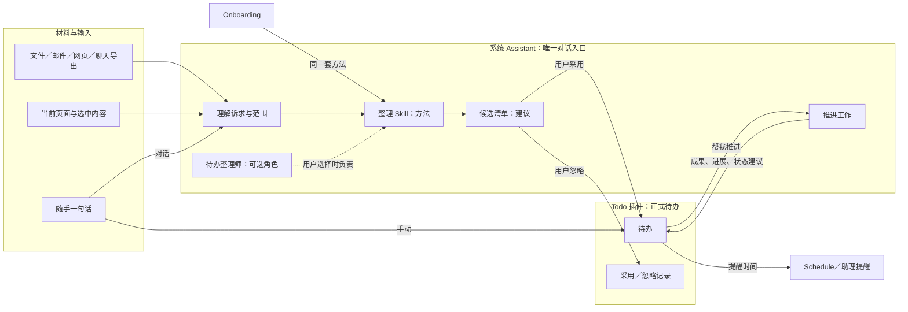
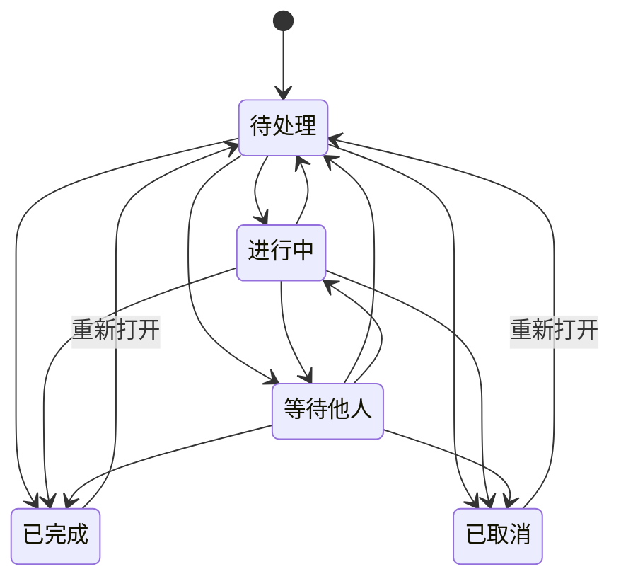

# Todo 插件、待办整理师、系统 Assistant 与 Onboarding：产品需求说明

日期：2026-09-28。状态：用户 2026-09-28 授权“后续按最推荐的方式做，开始执行”：第 13 节各项按“建议”列定下（标“按推荐（用户授权）”，可随时改回），正文的〔建议〕作为实施依据；标注保留，便于追溯哪些是用户原话。实现方案与进度见 [implementation.md](./implementation.md)。

本文只讨论需要什么、用户如何使用、各部分如何配合、应达到什么效果。不涉及技术选型、接口、数据结构和工程拆分。

助理的通用行为以[系统级个人工作助理需求说明](../system-assistant/spec.md)为准，包括上下文理解、授权、可直接操作的建议、注意力规则、记忆、连续工作，以及 Character／Prompt 的登记。main 上的是较早版本，最新版和实现进度在 `feature/system-assistant` 分支。本文不重复定义这些内容，只写 Todo 场景下的具体要求和由此产生的依赖。

## 0. 怎么读

| 标注 | 含义 |
| --- | --- |
| 〔需求 Uxx〕 | 用户在本次需求中明确提出的，编号见 1.3 |
| 〔建议〕 | 我根据现有产品和目标补充的，**未经用户确认，不能当作已定** |
| 〔假设〕 | 写作时依据的前提，需要确认 |
| 〔待决 Dxx〕 | 需要用户拍板的问题，第 13 节列出选项和建议 |
| 〔现状〕 | 写作时对仓库和分支的观察，不是承诺 |

表格用“性质”一列标注。没有标注的句子是对上一条的解释，不增加新要求。

---

## 1. 目标与范围

### 1.1 产品目标 〔需求 U01〕

个人工作用户能从文件、邮件、网页、聊天记录和日常输入中整理出真正需要处理的事项，并持续管理、跟进和推进。

两种用法并存：

- 手动使用 Todo；
- 直接对 Assistant 说：“帮我整理这些材料里需要我做的事。”“看看最近有没有遗漏的待办。”“这封邮件会影响哪些已有安排？”“帮我推进这件事。”

用户不需要先理解 Character、Skill、插件或 Agent 的工作原理。

### 1.2 怎样算做到了 〔建议〕

效果体现在用户少做的事上：

- **少解释**：同一件事第二次让助理处理，不需要重新贴材料或复述背景。
- **少搬运**：从材料到待办、从待办到推进，不需要复制粘贴或重新描述。
- **少维护**：重复导入不产生重复项；处理过的事不会回来；日期变了会被发现并提出更新。
- **真推进**：事项在现实中有进展（邮件发出、文档交付、等的人有了回复），而不只是清单变长。

生成条数、模型调用次数、Agent 数量都不能当作价值指标。编造日期、把参考信息当待办、擅自宣布完成、覆盖用户手动修改，这些错误不能被“平均体验不错”抵消。

### 1.3 用户明确提出的要求

| 编号 | 要求 | 位置 |
| --- | --- | --- |
| U01 | 从多种材料中整理真正要处理的事，持续管理、跟进、推进；手动与对话两种用法；不要求理解内部概念 | 1.1、2 |
| U02 | Todo 是正式待办的管理位置：查看、创建、编辑、安排、完成、归档；不依赖 AI；不因对话结束、角色切换、Agent 停止而消失 | 4.1、5 |
| U03 | Assistant 是统一的自然语言入口和协调者：结合当前页面、所选材料、已有事项和明确诉求；组织整理、呈现建议、接受修改、在授权范围内推进；接住补充、纠正和状态变化 | 4.2、6、7 |
| U04 | 待办整理师是可选专业角色：可随 Todo 预装，可选择、定制、停用；明确选择时实际影响工作方式；不选也能用基本整理 | 4.3 |
| U05 | 整理 Skill 是可复用的方法，默认 Assistant 和 Character 都能用，切换角色不产生多套清单 | 4.4 |
| U06 | AI 能力沿用 Prologue；提醒、资料、成果沿用现有产品能力；本文不讨论接线 | 4.6 |
| U07 | 支持个人待办和项目待办；先记录，后决定是否关联项目；不强制项目或 Goal | 5.4 |
| U08 | 快速记录与补充说明；明确的状态；修改、延期、取消、归档、重新打开；三种日期分清含义；关联项目、Goal、材料、相关事项和成果；看得到来源与形成原因；搜索、筛选、批量；容易辨认现在要做的、在等的和没安排的 | 5 |
| U09 | 分清 Todo、Goal、Agent 执行步骤、定时任务；模型回复结束或某个步骤完成，不能宣布事项完成 | 3 |
| U10 | 从明确选择或已授权的材料中识别五类信息 | 6.1、6.2 |
| U11 | 每项候选尽量说明七项内容 | 6.3 |
| U12 | 不编造责任人、日期、优先级、完成状态；推测和原文事实分开 | 6.4 |
| U13 | 结合已有待办：合并来源、提出更新、尊重手动修改、处理过的不再冒出来、冲突和疑似完成要说明依据 | 6.5 |
| U14 | “请周五前发新版方案，预算等小李确认”的示例要求 | 6.6 |
| U15 | 候选清单能勾选、修改、调整归属、合并或更新、查看依据、忽略、批量采用；分得清建议、已保存、正在执行；按钮写清实际效果；不需要复制后重新描述 | 7.1–7.3 |
| U16 | 明确且信息完整时不机械确认；关键歧义、额外权限、范围变化时要提出 | 7.4 |
| U17 | 保存后可以说“帮我推进这件事”：围绕原事项工作，看得见进展、阻塞和成果；分清“生成草稿”“完成某个动作”“整个事项完成” | 7.6 |
| U18 | 提醒与跟进尊重用户约定，支持稍后、暂停、忽略、关闭，不重复打扰 | 7.7 |
| U19 | Onboarding 读取材料后同时给出工作概览和待办草稿；草稿独立于“建议下一步”，不能只挑几条展示用的建议 | 8.1 |
| U20 | 材料涉及多个项目或个人事务时可以分别归属，也可以暂不归类 | 8.2 |
| U21 | 采用后：概览成为可编辑文档，待办进入 Todo，资料可追溯，可以立即开始其中一件 | 8.3 |
| U22 | 没有模型、没有资料、只读成部分、用户跳过时都有可继续的路径 | 8.4 |
| U23 | 先有 Assistant 的基本协调与能力使用体验，再接入 Todo 和整理角色；说明必要前提、Todo 可独立使用的部分、后续完善的主动能力、如何用 Todo 场景验证 Assistant | 10 |
| U24 | 不在 Todo 里另建割裂的助理入口或另一套工作记录 | 4.2、10.6 |
| U25 | 分开写明需求、建议和假设；停留在需求与产品方案层面 | 0、13–15 |

### 1.4 范围

- 〔需求 U25〕只写需求与产品方案。
- 〔建议〕本期不包括：把事项指派给别人并跟踪对方清单的团队协作；与飞书任务、Todoist、Apple 提醒事项等外部任务系统双向同步；跨设备同步；甘特图、工时等项目管理功能。目标用户是个人工作者，先把个人闭环做实。
- 〔建议〕不把所有信息都变成待办，这与现有 Feed／Inbox 的设计原则一致。
- 〔假设〕用户一个人在本机使用 Molis Work。

---

## 2. 目标用户与核心场景

### 2.1 目标用户 〔假设〕

同时处理几个项目和个人事务的知识工作者，例如项目或产品负责人、顾问、创业者、研究者。他们通常有这些特点：

- 事项散落在邮件、文件、聊天、网页和脑子里，很多是别人随口一句话；
- 既有自己要做的，也有在等别人给的；
- 时间碎，不愿意维护复杂的清单系统；
- 希望 AI 帮忙整理，但不希望 AI 替自己做决定、替自己答应别人，或者把清单搞乱；
- 多数人没有用过 Character、Skill 这些概念，少数熟练用户会想定制整理方式。

这是根据“个人工作用户”推定的画像。如果有更具体的首发人群，验收材料和默认设置应随之调整。

### 2.2 核心场景

| 编号 | 场景 | 用户说或做 | 做成了是什么样 | 性质 |
| --- | --- | --- | --- | --- |
| C1 | 随手记 | 在 Todo 里，或对底部 Assistant 说“记一下：周四前给王总回电话” | 马上记下，“周四前”识别成截止日期并且可以改；没有模型也能记 | 需求 U08；识别方式为建议 |
| C2 | 整理一批材料 | 选中几封邮件、一份会议纪要或一段聊天导出，说“帮我整理这些材料里需要我做的事” | 得到分组的候选清单，每项都有依据；勾选、改几项后一次加入；已有事项显示为合并或更新，不重复新建 | 需求 U01、U10–U15 |
| C3 | 查漏 | “看看最近有没有遗漏的待办” | 说清看了哪些来源、哪段时间；只列新发现的和需要更新的；没有就直说没有 | 需求 U01；范围规则为建议 |
| C4 | 新消息的影响 | 打开一封邮件问“这封邮件会影响哪些已有安排？” | 列出受影响的事项和具体变化（日期提前、要求变了、可以取消、等待已解除），给出更新建议，不自动改 | 需求 U01、U13 |
| C5 | 推进一件事 | 在一件待办上，或在底栏说“帮我推进这件事” | 助理围绕这件事准备下一步（起草回复、整理材料、拆分、安排时间），过程和成果挂在这件事上；是否完成由用户定 | 需求 U17 |
| C6 | 今天做什么 | 早上打开 Todo | 一眼看到今天计划做的、逾期或今天截止的、进行中的、在等别人的、还没安排的 | 需求 U08；视图划分为建议 |
| C7 | 等别人 | 有一件“等小李确认预算” | 按约定时间提醒跟进；可以让助理起草催问 | 需求 U18；自动发现对方回复属于后续（10.4） |
| C8 | 首次使用 | Onboarding 里选了下载目录和最近 7 天的邮件 | 同时得到工作概览和完整的待办草稿，分别归到项目、个人或未归类；采用后马上从一件事开始 | 需求 U19–U22 |
| C9 | 专业整理 | 选择待办整理师，说“把这周的事帮我理一遍，排个计划” | 角色按它的方法工作，结果能看出差异（见 4.3）；结果仍然进同一个 Todo | 需求 U04、U05 |

---

## 3. 概念与边界

### 3.1 几种对象的区别

| 对象 | 是什么 | 由谁创建 | 什么时候算完成 | 与 Todo 的关系 | 性质 |
| --- | --- | --- | --- | --- | --- |
| Todo（待办） | 用户需要推进的一件事 | 用户手动创建，或用户采用 AI 候选 | 用户标记完成（或按用户明确授权的规则，见 3.2） | — | 需求 U09 |
| Goal | 希望达成的业务结果 | 用户，或用户采纳助理的提议 | 按业务结果验收 | 待办可以关联 Goal。待办全部完成不等于 Goal 达成；Goal 达成也不自动完成剩下的待办，而是提出如何处理 | 需求 U09；后半句为建议 |
| Agent 执行步骤 | AI 为完成一次委托安排的过程，例如助理的步骤清单、TaskBoard 节点、子任务 | Agent | 步骤跑完 | 推进某件待办时产生，归在这件待办的推进记录下。步骤完成不等于待办完成，也不出现在待办清单里 | 需求 U09 |
| 定时任务 | 在约定时间触发的工作或提醒，例如 Schedule 定时任务、助理的定时跟进 | 用户，或经用户确认 | 到点执行 | 待办的提醒时间可以产生提醒；定时任务执行过，不代表待办完成 | 需求 U09 |
| 候选事项 | AI 整理出来、还没成为正式待办的建议 | 助理（默认，或由待办整理师负责） | 被采用、忽略或失效 | 采用后成为待办，或更新已有待办；没采用的不出现在 Todo 的日常视图 | 建议 |
| 概览里的“建议下一步” | 工作概览中展示性的几条建议 | Onboarding 或助理 | — | 不等于待办草稿；用户想做，可以转成候选 | 需求 U19；转候选为建议 |
| Inbox 注意事项 | 需要你看一眼或做判断的信息引用（现有） | Feed、Goals 等插件 | 处理或忽略 | 可以转成待办〔待决 D02〕；处理了 Inbox 条目不等于完成待办 | 现状＋建议 |
| Jelly 日历事项 | 个人日历上的事项，其中包括可完成的任务（现有） | 用户，或经确认的助理 | 用户勾选完成 | 与待办有重叠；各自独立，Jelly 保留自己的任务与无日期清单〔D01：用户定 A〕 | 现状 |
| 灵光 | 临时想法（现有） | 用户 | — | 想法不是待办；用户可以主动把某个想法转成待办 | 建议 |

### 3.2 “完成”由谁说了算

- 〔需求 U09〕模型回复结束、某个执行步骤完成，都不能宣布用户的事项已完成。
- 〔需求 U17〕推进时分三层：
  - **生成了草稿**，例如回复草稿、方案初稿；
  - **完成了某个动作**，例如邮件已发出、文档已共享；
  - **整个事项完成**，也就是用户认为这件事做完了。

  只有第三层会把待办改成“已完成”。
- 〔建议〕助理可以说“这件事可能已经完成”，例如看到对方回信“方案收到”，但必须附上依据，由用户确认，不自动改状态。
- 〔建议〕例外：用户对某件事明确说“发出去以后帮我标记完成”，这是针对这件事的明确授权，可以照做，并在结果里说明、允许撤销〔待决 D07〕。
- 〔建议〕每次状态变化都能查到由谁改（用户本人，或用户确认过的助理操作）、什么时候改、依据是什么。

### 3.3 与现有产品模块的关系

| 模块 | 与 Todo 的关系 | 性质 |
| --- | --- | --- |
| Pages | 保存 Onboarding 的工作概览，以及推进时产生的文稿；这些文稿作为成果挂在待办上 | 需求 U06、U21 |
| 资料（文件、邮件、网页、聊天导出、已导入资料） | 作为待办的来源。待办只保存引用，能打开原文并定位 | 需求 U06 |
| Schedule 与助理提醒 | 负责按时间触发和送达提醒；Todo 不另建一套闹钟 | 需求 U06 |
| Inbox | Inbox 管“有信息需要你看或判断”，Todo 管“有事需要你推进”；Inbox 条目可以转成待办 | 建议〔待决 D02〕 |
| Jelly 日历 | 〔现状〕Jelly 已有可完成的日历任务，助理的实测中也把“个人事项”写进了 Jelly 日历。Todo 上线后两边各自保留任务。用户 2026-09-29 定：每个插件都能独立运作，Jelly 保留自己的任务和无日期清单，不迁移、不互相依赖；助理按用户的说法选写到哪里（见 D01） | 已定 D01（A） |
| Goals | 待办可关联 Goal；两者的完成各自判断 | 需求 U09 |
| 首页 | 今天要做的待办可以作为首页事项出现。沿用首页“说明理由，不堆数字”的方向，例如写“周五截止的方案还在等小李确认预算”，而不是只显示“12 条待办” | 建议 |
| 灵光 | 想法可转为待办，不自动转 | 建议 |

### 3.4 各部分如何配合（示意）

---

## 4. 各部分职责与边界

### 4.1 Todo 插件

〔需求 U02〕Todo 是正式待办的管理位置，用户在这里查看、创建、编辑、安排、完成和归档。它不依赖 AI 也能正常使用，待办不会因对话结束、角色切换或 Agent 停止而消失。

〔建议〕此外还负责：

- 保存候选的最终去向（加入、合并、更新、忽略），这样重复导入时处理过的内容不会再冒出来〔待决 D03〕；
- 让助理能读取事项内容、状态、来源和修改记录，并在用户授权下修改。对助理开放的操作，含义与手动界面完全一致；
- 在事项上显示关联的助理工作、成果和进展，读的是助理的工作记录，不另记一份；
- 提供“交给助理推进”入口。这个入口打开的是底部的同一个 Assistant，并带上这件事。

〔建议〕Todo 不做这些事：

- 不内置聊天框或独立的 AI 助手；
- 不自己调用模型做整理，整理由 Assistant 加整理 Skill 经 Prologue 完成；
- 不保存 Agent 执行步骤；
- 不复制材料正文，只保存引用。

### 4.2 系统 Assistant

〔需求 U03〕Assistant 是统一的自然语言入口和工作协调者。

〔建议〕在 Todo 场景下它具体负责：

- 判断这句话属于哪种请求：记一件事、整理材料、查漏、影响分析、推进、查询（例如“下周有什么要交？”）或修改（例如“把方案那件改到下周一”）。
- 决定是否使用整理 Skill。用户选择了待办整理师时，由这个角色负责。
- 读取已有待办做比对，呈现候选，并把用户的勾选和修改准确落到 Todo 上。
- 推进时协调其他能力，例如 Pages 起草、邮件草稿、交给 Coding；再把成果和进展关联回这件事。
- 让待办提醒和其他提醒遵守同一套注意力规则（勿扰、暂停、合并）。
- 在同一项工作里记住用户的纠正，例如“负责人不是小李，是老王”，后续轮次按纠正后的理解处理。这类纠正只有在用户明确要求时才成为长期规则，与助理规格的记忆要求一致。

〔需求 U24〕Todo 里不另建独立的助理入口或另一套工作记录。

### 4.3 待办整理师 Character

〔需求 U04〕它是可选的专业角色，提供整理事项、发现遗漏、区分责任、安排工作的方法。它可以随 Todo 预装，用户可以选择、定制或停用。用户明确选择时，它要实际影响这次的工作方式；普通用户不选它，也能用基本的 AI 整理。

〔建议〕“实际影响”要在结果上看得出来。下表是建议的差异，最终由角色设计确定：

| 方面 | 默认 Assistant（使用整理 Skill） | 待办整理师 |
| --- | --- | --- |
| 识别 | 识别五类信息并给出依据 | 同上，并额外检查容易漏掉的：别人对你的隐含期待（“你看下”）、你在回复里随口的承诺（“我明天发你”）、会议纪要里没指派人的行动项。这些都标为“需要你确认” |
| 责任 | 标出是否确定与你有关 | 分得更细：你负责、你参与、等别人、只是知会你。“我们”“大家”这类模糊主语会主动问 |
| 安排 | 只保留原文里的日期 | 在原文日期之外给出计划处理日期的建议（标为建议）；同一天事情太多时提醒 |
| 追问 | 只问影响结果的歧义 | 原则相同，另外在结尾集中列出“需要你确认的几件事” |
| 回顾 | — | 支持回顾：逾期、等了很久、一直没安排的事，逐件建议怎么处理 |

〔建议〕选择与使用：

- 可以在底栏的角色选择里选它，也可以在 Todo 的“整理”入口选“由待办整理师处理”。选择从这项工作的下一轮开始生效，正在进行的一轮不受影响（沿用助理规格）。
- 用户第一次发出整理类请求时，助理可以轻轻提示一次“可以选择待办整理师，整理得更细”，之后不反复推荐〔待决 D05〕。
- 定制：在 Character 设置里修改它的说明（沿用助理规格 9.1：插件带来的 Character 可见、可改）。Todo 升级不覆盖用户的修改，新默认与用户版本的差异可以查看。
- 停用：停用后不能再选；已有待办和历史工作不受影响。正由它负责的工作，下一轮如实说明它不可用，不能悄悄换成默认助理却仍显示它的名字（沿用助理规格第 9 节）。
- 选它不会扩大权限：不会因此读取更多资料，也不会跳过确认直接改待办。

〔现状〕目前助理只允许在项目工作中选择 Character，个人工作不能选。待办大量是个人事项，所以这个限制需要解除，见 10.2 的前提 P6 和〔待决 D04〕。

### 4.4 整理 Skill

〔需求 U05〕整理 Skill 提供可复用的待办整理方法。默认 Assistant 和专业 Character 都能用，切换角色不会产生彼此独立、各自维护的清单。

〔建议〕方法包含：

- 五类信息的识别标准；
- 每项候选必须说明的内容；
- 区分原文事实与推测的规则；
- 日期换算规则：相对日期按材料的时间换算，年份或时区不明时标注；
- 与已有待办比对的规则：同一事项、需要更新、冲突、疑似完成；
- 不编造的规则；
- 分组和数量控制。

〔建议〕Skill 只提供方法，不持有任何清单。无论谁在用，结果都写进同一个 Todo，采用和忽略的记录也只有一份。

〔建议〕用户能看到这次整理用的是哪个角色、哪个版本的方法。Skill 与 Prompt 一样应该可以查看和修改〔待决 D12〕。

〔建议〕Onboarding 的待办草稿使用同一套方法，这样第一次整理和以后的整理结果一致。

### 4.5 Onboarding

〔需求 U19–U22〕见第 8 节。

〔建议〕Onboarding 不自己管理待办，它只是首次使用时的一次整理。草稿采用后进入 Todo；没处理完的草稿之后还能在 Todo 或助理里找回。

### 4.6 沿用的产品能力 〔需求 U06〕

| 需要 | 沿用 |
| --- | --- |
| AI 理解、整理、角色与方法 | Prologue（经 Agent Host）；Character、Prompt、Skill 统一登记 |
| 提醒与定时 | Schedule 与助理的提醒和注意力规则 |
| 资料 | 现有的文件、已连接邮箱、网页正文粘贴、聊天导出、已导入资料 |
| 成果 | Pages 文档、Artifacts |
| 连续工作与关联 | 助理的工作记录与对象关系（助理规格 10.4） |
| 今天的事项露出 | 首页事项 |

本文不讨论这些能力的具体接线。

### 4.7 分工一览 〔建议〕

| 能力 | Todo | Assistant | 整理 Skill | 待办整理师 | Onboarding |
| --- | --- | --- | --- | --- | --- |
| 保存正式待办 | 负责 | — | — | — | — |
| 手动增删改查、视图、批量 | 负责 | — | — | — | — |
| 自然语言入口 | 提供跳转入口 | 负责 | — | — | — |
| 读取材料 | — | 负责（在授权范围内） | — | — | 首次读取 |
| 识别与整理的方法 | — | 使用 | 提供 | 使用，并加上自己的方法 | 使用 |
| 候选呈现与采用 | 保存去向 | 呈现、执行用户的选择 | — | — | 呈现草稿 |
| 与已有待办比对 | 提供已有事项与忽略记录 | 执行比对 | 提供比对规则 | — | 同左 |
| 推进 | 显示进展与成果 | 协调 | — | 可负责 | 采用后可立即发起 |
| 提醒 | 保存提醒约定 | 统一送达与勿扰 | — | — | — |

---

## 5. Todo 本身的需求

### 5.1 一件待办包含什么

| 内容 | 说明 | 性质 |
| --- | --- | --- |
| 标题 | 一句话说清要做什么 | 需求 U08 |
| 说明 | 补充细节和背景，可以随时追加 | 需求 U08 |
| 状态 | 见 5.2 | 需求 U08 |
| 截止日期、计划处理日期、提醒时间 | 都是可选的，含义见 5.3 | 需求 U08 |
| 归属 | 个人、某个项目，或暂未归类 | 需求 U07 |
| 关联 | 项目、Goal、材料、相关事项、执行成果 | 需求 U08 |
| 来源与形成原因 | 手动创建，或来自哪份材料的哪一段；为什么算一件待办 | 需求 U08 |
| 等待对象 | 状态为“等待他人”时写明：等谁、等什么、打算什么时候跟进 | 建议 |
| 是否确定与你有关 | 来自 AI 候选时保留这项判断及依据 | 建议（来自 U11） |
| 重要标记 | 只能由用户手动设置，AI 不设置 | 建议〔待决 D10〕 |
| 修改记录 | 哪些内容由你手动改过，哪些是你确认的助理修改 | 建议（支撑 U13 的“尊重手动修改”） |

### 5.2 状态

〔需求 U08〕需要待处理、进行中、等待他人、已完成等明确状态，并支持修改、延期、取消、归档和重新打开。

〔建议〕各状态的含义：

| 状态 | 含义 | 常见的进入方式 | 离开方式 |
| --- | --- | --- | --- |
| 待处理 | 要做，还没开始 | 新建、采用候选、重新打开 | 开始做、转为等待、完成、取消 |
| 进行中 | 正在做 | 用户标记 | 转为等待、完成、取消，或退回待处理 |
| 等待他人 | 自己这边暂时做不了，在等别人 | 用户标记，或采用“等待他人”类候选 | 对方有了结果，回到待处理或进行中，或者直接完成 |
| 已完成 | 用户确认做完了 | 用户标记，或按用户明确授权的规则（3.2） | 重新打开 |
| 已取消 | 不需要做了 | 用户标记；助理可以附依据提出建议，例如邮件说会议取消 | 重新打开 |

〔建议〕几项相关的规则：

- **延期**是改计划日期或截止日期，不是一种状态。反复延期的事项在回顾时会被提出来。
- **归档**只是把事项从日常视图里收起来，不改变状态。建议只对已完成、已取消的事项开放；不想做又不确定要不要取消的事，用延期或取消。归档后仍能搜索和恢复。
- **重新打开**回到待处理，保留全部历史。
- **助理正在处理**不是待办状态，而是单独的标识（见 7.6）。助理在推进一件事时，不自动把它改成“进行中”。
- 不改变状态的提示标记包括：已逾期、临近截止、很久没动、助理正在处理、有待你确认的更新、来源有变化。

### 5.3 三种日期

〔需求 U08〕截止日期、计划处理日期、提醒时间都是可选的，而且要分清含义。

〔建议〕

| 日期 | 回答的问题 | 从哪里来 | 到了会怎样 |
| --- | --- | --- | --- |
| 截止日期 | 最晚什么时候必须完成，通常是别人或外部的要求 | 原文明确写出的要求，或用户自己设定 | 临近和逾期时提示；不会自动改状态 |
| 计划处理日期 | 我打算哪天做 | 用户安排；AI 只能提建议 | 当天出现在“今天”；过期未完成时进入“需要重新安排” |
| 提醒时间 | 什么时候提醒我 | 用户设定，或用户接受的建议 | 到时提醒一次，遵守勿扰规则；可以稍后或关闭 |

〔建议〕规则：

- 三种日期互不影响，都可以为空。没有截止日期的事项不会被标成紧急。
- 设了截止日期不会自动产生提醒；是否提醒看用户的默认设置〔待决 D09〕。
- “周五”“下周一”“月底”这类相对日期，按材料发出的时间换算成具体日期，同时保留原文说法。材料时间不明、跨年、或“这周五／下周五”有歧义时，标为“日期不确定”，不猜。
- 只有日期没有时间时按全天处理，不擅自补一个“18:00”。
- 〔假设〕时区用设备时区。原文用了其他时区时，显示换算依据。

### 5.4 个人与项目

- 〔需求 U07〕支持个人待办和项目待办；可以先记录再决定是否关联项目；不强制创建项目或 Goal。
- 〔建议〕归属有三种：个人、某个项目、暂未归类。“暂未归类”是正常状态，不是错误。列表里有专门的入口，让用户有空时再归类，不催。
- 〔建议〕可以在个人与项目之间、项目与项目之间移动，来源和历史都保留。移进项目意味着它成为这个项目的一部分，这个项目里的助理工作可以看到它。来源材料如果属于另一个范围（例如个人邮箱），移动后仍然只保存引用，不把原文复制进项目。
- 〔建议〕“我的全部待办”视图跨个人和所有项目，只给用户本人看。助理在某个项目的工作里，只读这个项目和个人范围的待办，不读其他项目的；这与助理规格的作用域规则一致。
- 〔假设〕项目目前一个人用。多人共享项目时个人待办是否可见，另行决定〔待决 D15〕。

### 5.5 关联

〔需求 U08〕待办可以关联项目、Goal、材料、相关事项和执行成果。

〔建议〕细节：

- **材料**：能打开原文并定位到依据所在的段落或消息。原文被删除或无权访问时显示相应状态，待办本身保留。
- **相关事项**：关系分为“依赖／被阻塞”“拆分自”“与之合并”“同一主题”。例如“发送新版方案”依赖“等待小李确认预算”。
- **执行成果**：推进中产生的文档、草稿、已发送的邮件、生成的资料，分“草稿”和“已完成的动作”两类显示。
- **助理工作**：推进这件事的助理工作（可能不止一次），显示进展和最近结果，点开回到那项工作。

### 5.6 来源与形成原因

〔需求 U08〕每件待办都能看到来源和形成原因。

〔建议〕具体要能回答“它从哪来、为什么是一件待办”：

- 手动创建：显示“你在某处创建”。
- 来自材料：显示来源（邮件主题、发件人和时间，文件名，网页，聊天片段），作为依据的原文片段，以及形成原因，例如“原文要求你周五前发送”。
- 来自多个来源（合并过）：列出所有来源和各自的时间，并说明哪个来源改了什么。
- 来自 Onboarding、助理对话或 Inbox：标明入口。
- 修改记录：你手动改过哪些内容。之后的 AI 整理会保护这些内容（见 6.5）。

### 5.7 视图、搜索、筛选与批量

〔需求 U08〕用户要能很容易辨认现在要做的、在等的和还没安排的事。

〔建议〕默认视图：

| 视图 | 包含 | 回答的问题 |
| --- | --- | --- |
| 今天 | 计划今天做的；逾期未完成的；今天截止的；进行中的 | 现在做什么 |
| 等待中 | 所有等待他人的，按等了多久和跟进时间排 | 我在等谁 |
| 未安排 | 待处理，但既没有计划日期也没有截止日期的 | 还有什么没排 |
| 即将到期 | 未来 7 天内截止的 | 接下来要注意什么 |
| 全部／按项目 | 按归属分组 | 整体管理 |
| 待你确认 | 助理提出的更新、疑似完成、冲突，以及还没处理完的候选 | AI 提了什么，等我决定 |
| 已完成与已取消 | 可搜索，可重新打开，可归档 | 做过什么 |

- 〔建议〕视图里用文字说明情况，不只堆数字，例如“3 件今天截止，其中 1 件还在等小李”。
- 〔需求 U08〕支持搜索、筛选、批量处理。
- 〔建议〕搜索覆盖标题、说明和来源摘要。筛选可以按状态、归属、日期类型和范围、来源类型、是否有关联的助理工作。
- 〔建议〕批量操作包括改状态、改日期（例如“全部推后一天”）、改归属、归档。操作前显示影响几件，操作后可以撤销。

### 5.8 快速记录与手动体验

- 〔需求 U08〕快速记录，随时补充说明。
- 〔建议〕一行输入就能创建。“周五前”“明天下午 3 点提醒我”这类常见日期说法，不调用模型也能识别；保存前以可修改的标签显示识别结果。识别不了的就留在标题里，不猜。
- 〔建议〕在 Todo 之外也能记：对底部助理说“记一下：周四前给王总回电话”，助理直接创建，回复里显示结果和“撤销”（与确认规则的关系见 7.4；D08 已由用户定为直接写入、事后可撤销）。
- 〔建议〕支持键盘操作。中文输入法组字时按回车不提交。窄窗口、明暗主题都可用（沿用全局交互规则）。
- 〔建议〕批量修改、完成、改日期等修改都可以撤销。删除需要确认，确认后不可撤销（实现决定，见 implementation.md 2.4）。
- 〔建议〕删除、取消和归档含义不同：删除是真正移除，需要确认，并说明会影响哪些关联；取消会保留记录；归档只是收起。

### 5.9 不依赖 AI 〔需求 U02〕

〔建议〕没有配置模型、模型出错或用户关闭 AI 时，5.1 到 5.8 的功能全部照常可用。需要 AI 的入口（整理、推进）显示原因和下一步，例如“配置模型后可以让助理整理”。已有待办照常显示，提醒照常工作。

### 5.10 持久 〔需求 U02〕

- 待办不会因为对话结束、角色切换、Agent 停止或助理工作被删除而消失或改变状态。
- 〔建议〕删除一项助理工作，只会让待办上的“推进记录”显示这项工作已被删除；待办本身和已经产出的成果都保留。
- 〔建议〕停用或卸载待办整理师，不影响任何待办。停用 Todo 插件时数据保留，重新启用后恢复；停用期间助理不能读写待办，并如实告诉用户，不改写到别处（例如 Jelly）来绕过。〔假设〕卸载时的数据保留沿用插件平台的现有规则。

---

## 6. AI 整理

### 6.1 可以读的材料

- 〔需求 U10〕只读用户明确选择或已经授权的材料。
- 〔建议〕材料的来路：在底栏附加文件；粘贴文本或网页正文；引用已有资料；在当前页面选中的内容；从 Feed、Inbox、Pages、文件里“交给助理整理”；Onboarding 中选择的来源。
- 〔现状〕聊天记录目前以用户导出或粘贴的文本为主，实时聊天连接还没接入，入口要如实说明。
- 〔建议〕“看看最近有没有遗漏”这类没有指明材料的请求，助理先说明打算看的范围，例如“最近 7 天已同步的邮件和本项目新增的资料”。范围只来自用户已授权的来源；没连接的来源要说明没有查〔待决 D06〕。
- 〔建议〕每次都说清：读了什么、哪些没读成及原因、有没有截断。

### 6.2 识别五类信息 〔需求 U10〕

| 类别 | 怎么判断 | 在候选清单里怎么处理 |
| --- | --- | --- |
| 明确要求你处理的 | 原文把你当作执行者提出要求：“请你…”“麻烦…”“@你” | 候选待办；负责人：你（原文写明） |
| 你已经承诺的 | 你自己说过要做：“我周三发你”“好的我来跟” | 候选待办，标“你的承诺”，附上你的原话 |
| 等待他人处理的 | 别人承诺或被要求去做，而你要用到结果 | “等待他人”类候选，写明等谁、等什么 |
| 可以考虑的行动建议 | 原文没有要求，但做了有助于推进，例如跟进、提前准备 | 标“建议”，默认不勾选，写明理由 |
| 仅供参考 | 通知、背景、结论、与你无关的讨论 | 不进候选清单；可以展开查看“哪些内容没列入、为什么” |

〔建议〕判断时要看说话人和对象。同一句“请周五前发新版方案”，别人对你说，是你的待办；你对别人说，就是在等别人。说话人判断不了时，标为“不确定是谁的事”。

### 6.3 每项候选要说明什么

〔需求 U11〕每项候选尽量说明以下内容：

| 内容 | 例子 |
| --- | --- |
| 需要做什么 | 发送新版方案 |
| 为什么要做 | 张总要求周五前收到 |
| 谁负责，是否确定与你有关 | 你（原文写明，邮件发给你） |
| 有没有明确日期 | 截止 10 月 2 日（原文“周五前”） |
| 属于哪个项目或主题 | 建议归入“Q4 方案”项目（推测，可改） |
| 依据来自哪里 | 张总 9 月 28 日的邮件，第 2 段 |
| 哪些还不确定 | 发给谁没写明，推测是张总 |

- 〔需求 U12〕原文写明的事实和推测要区分开。
- 〔建议〕每个值都标明是“原文写明”还是“推测／建议”，两者在界面上看得出区别；推测要附一句理由。
- 〔建议〕同时说明与已有待办的关系：新建；与“X”是同一件事（补充来源）；会更新“X”的日期或要求；与“X”冲突；“X”可能已经完成。

### 6.4 不编造

- 〔需求 U12〕不编造责任人、日期、优先级和完成状态。
- 〔建议〕原文没有日期就留空。可以另外给一个“建议的计划日期”，标为建议。
- 〔建议〕不从语气推断优先级。“尽快”就按原文记为“尽快”，不转成“高优先级”。
- 〔建议〕不把自动通知、营销内容和系统告警当成用户的承诺（与现有 Onboarding 概览的规则一致）。
- 〔建议〕不把过去的要求当成今天的待办。旧邮件里的“请周五回复”，要换算成那封邮件对应的周五；日期已经过去的，标“可能已过期”，由用户判断还要不要做（与 Onboarding 设计方案一致）。
- 〔建议〕拿不准就说拿不准，不在两种理解里随便挑一个。

### 6.5 与已有待办结合

| 情况 | 期望行为 | 性质 |
| --- | --- | --- |
| 同一件事再次出现 | 补充来源，不新建。候选显示“已存在：X，将补充来源”；用户认为不是同一件事时可以拆开 | 需求 U13；拆开为建议 |
| 新消息改变了要求或日期 | 提议更新，显示原值、新值和依据，不直接改 | 需求 U13 |
| 用户手动改过 | 你改过的内容，AI 不覆盖。新材料与你的修改冲突时列出冲突让你选，默认保留你的版本。例如你已经和对方沟通，把截止日期从周五改到下周一，再导入同一封邮件时，不会再提议改回周五 | 需求 U13；细则为建议 |
| 已完成、已取消、已忽略的 | 重复导入同一份材料时不再出现 | 需求 U13 |
| 同上，但新材料带来新要求（例如“方案要再改一版”） | 作为新事项出现，或提议“重新打开 X”，并说明依据 | 建议 |
| 有冲突或疑似已完成 | 说明依据（例如“小李 9 月 30 日邮件：预算已确认”），提议“标为完成”或“解除等待”，不直接改状态 | 需求 U13 |
| 判断“同一件事”的理由 | 理由要看得到，例如同一邮件线程、同一交付物、同一对象。用户拆开过的两件，之后不再自动合并 | 建议 |
| 忽略过的内容 | 忽略的是“这份来源里的这一项”：同一来源再次导入时不再出现；不同来源出现类似内容仍会列出，并注明“你曾忽略过类似的事” | 建议〔待决 D13〕 |

### 6.6 示例：“请周五前发新版方案，预算等小李确认。”

〔需求 U14〕要识别出“发送新版方案”与“等待小李确认预算”的关系，不能把“今天催小李”当成用户已经承诺的任务。

〔建议〕下面按两个前提完整走一遍。前提一：这是张总 2026 年 9 月 28 日（周一）只发给你一人的邮件。前提二：Todo 里还没有相关事项。

| # | 候选 | 类别 | 负责 | 日期 | 关系 | 依据与不确定之处 |
| --- | --- | --- | --- | --- | --- | --- |
| 1 | 发送新版方案 | 明确要求你处理 | 你（原文写明，邮件只发给你） | 截止 10 月 2 日（原文“周五前”） | 预算部分依赖 #2（推测） | 发给谁没写，推测是张总；10 月 2 日在国庆假期内，对方是否指节后，原文没说，标为“日期待确认” |
| 2 | 等待小李确认预算 | 等待他人 | 小李 | 原文没有日期 | 阻塞 #1 的预算部分 | 小李是否已经知道这件事，原文没说 |

不列为待办的：

- **今天催小李**：原文没要求你去催，你也没承诺过。它可以作为“可以考虑的建议”出现，默认不勾选，理由是“预算确认会影响周五交付”；但不能当成你已承诺的任务，也不能自动设一个今天的提醒。

同一句话在其他情况下：

- 这句话是**你**发给同事的：#1 变成“等待同事发送新版方案”，属于等待他人。
- 邮件同时发给了几个人：#1 的负责人标为“不确定是否由你负责”。
- Todo 里已经有“新版方案”：#1 显示为“补充来源，截止日期设为 10 月 2 日”（如果你还没设过截止日期）。如果你手动设过别的日期，就显示为冲突，让你选。
- 几天后小李来信说“预算已确认”：助理提议把 #2 标为完成，并提示 #1 的阻塞已经解除，不自动改。

### 6.7 数量与组织 〔建议〕

- 按项目或主题分组，每组先列把握最大的。
- 同一件事的几个零碎步骤合并成一件，步骤写进说明；也可以建议拆开，由用户决定。
- 候选很多时（例如 Onboarding 读了几十封邮件），先展示“要你处理的”和“你的承诺”，把“建议”和“等待他人”收起来，“仅供参考”不列出。清单末尾注明“另有 N 条仅供参考，未列入”，可以展开。
- 不设固定上限，但也不为凑数制造候选。没有发现就直说“没有发现新的待办”。

### 6.8 典型请求的期望行为 〔建议〕

| 用户说 | 助理做什么 | 用户得到什么 |
| --- | --- | --- |
| “帮我整理这些材料里需要我做的事” | 读所附或选中的材料，按 6.2–6.5 整理 | 候选清单和依据；已有事项的合并或更新建议 |
| “看看最近有没有遗漏的待办” | 先说明查看范围，读范围内的材料，与已有待办比对 | 只列新发现的和需要更新的；说明查了什么、没查什么 |
| “这封邮件会影响哪些已有安排？” | 读当前这封邮件，在已有待办里找相关的（Todo 只比对待办；日历上的安排由助理另用 Jelly 自己的能力查看，两者各自独立，见 D01） | 受影响的事项和具体变化（日期、要求、负责人、可以取消、等待已解除），附更新建议；可能新增的事项；没有影响就直说 |
| “帮我推进这件事” | 见 7.6 | — |
| “把方案那件改到下周一” | 找到对应事项，有多件匹配时让用户选；明确且完整时直接改 | 改了什么，以及撤销入口 |
| “下周有什么要交的？” | 只读查询 | 按截止日期列出 |

---

## 7. 查看、采用与推进

### 7.1 候选清单的操作

〔需求 U15〕可以勾选要保留的事项，修改名称、描述和日期，调整项目归属，合并或更新已有待办，查看依据，忽略不相关的内容，批量采用。按钮要写清实际效果，例如“加入所选 3 项待办”“更新这 2 项日期”。用户不应需要复制建议再重新描述一遍。

〔建议〕细节：

- 默认勾选：要你处理的、你的承诺、等待他人。默认不勾选：建议。
- 每项都能展开编辑。编辑本身不会提交。
- 依据可以打开原文并定位。
- 忽略时可以选填原因（“不是我的事”“已经处理了”“不重要”）。原因只影响这次整理的后续轮次，不会自动变成长期规则。
- 合并：选择“与已有的 X 合并”。更新：逐项勾选接受哪些变化。
- 可以一次改多项的归属，例如“这 5 项都放到 A 项目”。
- 同时有几种操作时，按钮分开写清楚，例如“加入 3 项、更新 2 项、忽略 1 项”。数字随勾选实时变化，按钮只做它写的事。

### 7.2 分清建议、已保存和正在执行

〔需求 U15〕用户要能分清哪些是建议、哪些已保存、哪些正在执行。

〔建议〕它们的外观和文字要明显不同：

| 状态 | 在哪里 | 怎么表现 |
| --- | --- | --- |
| 建议（未保存） | 只在候选清单里 | 标“建议”，不出现在 Todo 的日常视图，可以忽略 |
| 已保存 | Todo 里 | 候选清单中这项变为“已加入”“已合并到 X”或“已更新 X”，可以点开 |
| 正在执行 | 待办上 | 显示“助理正在处理”及当前在做什么，与待办状态分开 |
| 已失效 | 候选清单里 | 候选生成后，来源或相关事项又变了，标“已过期，需要重新整理” |

### 7.3 候选清单放在哪里

〔建议〕〔待决 D03〕

- 候选清单是一份可以反复打开的“整理结果”。底部 Assistant 显示摘要和主要操作；需要完整审阅时展开，可以在助理的展开工作视图里打开，也可以在 Todo 的“待你确认”视图里打开。两处打开的是同一份，一处采用，另一处马上可见。关闭对话、刷新或重启后都还在。
- Todo 的“待你确认”只是这份整理结果的列表视图，不在 Todo 里另开聊天。

### 7.4 什么时候直接做，什么时候先问

〔需求 U16〕用户已有明确执行要求且信息完整时，不机械地重复确认；遇到影响结果的关键歧义、额外权限或范围变化时，要明确提出。

〔建议〕例子：

| 用户说 | 助理怎么做 | 原因 |
| --- | --- | --- |
| “记一下：周四前给王总回电话” | 直接创建，显示结果和撤销 | 意图明确，内容完整 |
| 针对刚展示的候选说“这三件加进待办，放 A 项目” | 直接加入 | 明确授权，参数都已知 |
| 在候选清单上点“加入所选 3 项待办” | 直接加入，不再弹第二次确认 | 点击本身就是确认 |
| “帮我整理这些邮件” | 整理后给出候选清单，不直接写入 | “整理”不等于授权写入 |
| “整理一下直接加进待办” | 把握大的直接加入；负责人不明、日期有歧义的列出来问 | 授权了写入，但歧义会影响结果 |
| “把方案那件改到下周一”，而相关的有两件 | 问是哪一件 | 指代不清 |
| 推进时需要发邮件 | 准备好草稿，“发送”单独确认 | 对外发送是额外的效果 |
| 需要读还没授权的来源 | 说明需要哪项授权 | 额外权限 |
| 让整理“这封邮件”，发现同一线程还有 12 封 | 说明情况，问要不要一起整理 | 范围变化 |

〔现状〕与现有规则的冲突：助理在 2026-09-28 由用户拍板的授权规则是“读取直接用；写入执行前把准确参数交给用户确认”。照这条规则，“记一下”也会弹出确认卡，与 U16 冲突。需要决定 Todo 的写入是否适用“明确要求时直接执行、事后可撤销”。〔D08 用户 2026-09-29 定：适用——“可以直接写，后续撤销”；删除与对外发送仍逐次确认〕

### 7.5 采用之后 〔建议〕

- 结果反馈：列出加入了哪些（可以点开）、更新了哪些（原值和新值）、忽略了哪些。可以整批撤销，也可以逐项撤销。
- 部分失败时：成功的保留，失败的说明原因并可以重试；重试不会重复创建已经成功的。
- 候选清单保留每一项的去向，之后回看能知道每项去了哪里。
- 采用后助理可以问一句“要从哪件开始？”，但不会自己开始推进。

### 7.6 推进：“帮我推进这件事”

〔需求 U17〕保存后用户可以说“帮我推进这件事”。Assistant 围绕原事项工作，让用户看到进展、阻塞和成果，并分清“生成草稿”“完成某个动作”和“整个事项完成”。

〔建议〕过程：

1. **确定是哪件事**：从当前打开的待办、选中的事项或对话上下文确定；不确定就让用户选。
2. **带上背景**：事项内容、来源原文、相关事项、之前的推进记录和成果。用户不用复述。
3. **开始推进**：按事情的性质起草回复或邮件、准备文档、整理资料、拆成几件相关事项、安排计划日期，或交给专业角色（例如 Coding）。用户说得明确就直接开始；几种做法差别很大时，先给选项。
4. **过程看得见**：待办上显示“助理正在处理”、正在做什么、是否在等你确认。受阻时写清原因：缺信息、在等别人，还是权限不够。
5. **成果回到事项上**：草稿、文档、发送记录都挂在事项的成果里，标明是“草稿”还是“已完成的动作”。
6. **状态只提建议**：动作完成后，助理可以提议下一步状态，例如邮件发出后提议“改为等待张总回复”，或问“这件事可以标为完成了吗？”。用户确认后才改。
7. **多次推进仍是同一件事**：第二天说“继续推进方案那件事”，接着上次的工作做，不从头开始。
8. **从 Todo 发起**：待办上的“交给助理推进”打开的是底部同一个 Assistant，并带上这件事，推进记录也记在同一处。

| 层次 | 例子 | 待办上显示 | 待办状态 |
| --- | --- | --- | --- |
| 生成草稿 | 回复张总的邮件草稿写好了 | 成果：草稿（未发送） | 不变 |
| 完成某个动作 | 邮件已发给张总 | 成果：已发送（时间、收件人） | 不变；助理提议改为“等待他人”或“已完成” |
| 整个事项完成 | 你确认方案已经交付 | — | 由你标为已完成 |

### 7.7 提醒与持续跟进

〔需求 U18〕提醒和持续跟进要尊重用户的约定，支持稍后、暂停、忽略和关闭，避免重复打扰。

〔建议〕提醒只有三个来源：

- 用户设置的提醒时间；
- 用户接受的跟进约定，例如“周三问我小李回了没有”；
- 用户打开的默认规则，例如“截止前一天提醒”。

助理不会自己给事项加提醒。

〔建议〕提醒送达：以应用内（底栏提醒）为主，是否使用系统通知见〔待决 D09〕。提醒遵守助理的勿扰规则，例如写文档时不提醒。被规则压住的提醒会保留，条件结束后再出现。

〔建议〕各操作的含义：

| 操作 | 效果 |
| --- | --- |
| 稍后 | 这一次推迟到选定时间（15 分钟、1 小时、今晚、明早或自选），只影响这一次 |
| 暂停 | 暂停这件事的所有提醒，或暂停全部待办提醒，到某个时间为止 |
| 忽略 | 这次不处理，不改变待办和以后的提醒 |
| 关闭 | 这件事不再提醒（清空提醒时间），待办保留 |
| 完成、改期 | 直接在提醒上操作，提醒随之撤下 |

〔建议〕避免重复打扰：

- 同一件事的同一个时间点只提醒一次，几件同时到期就合成一条。
- 应用关闭期间错过的提醒，打开后合成一条“错过的提醒”；过期太久的不再补发（沿用助理规格的做法）。
- 事项完成、取消或改期后，相关提醒自动撤下。

〔建议〕等待他人的跟进：到约定时间提醒“要不要问问小李？”，可以一键让助理起草催问。在已授权的资料里自动发现对方已经回复，属于后续能力（10.4）。

〔现状〕Schedule 目前只在本地服务运行时才会响。〔假设〕提醒依赖 Molis Work 在本机运行，应用关闭时不会按时提醒。设置提醒时要如实告诉用户这一点〔待决 D09〕。

---

## 8. 与 Onboarding 的关系

### 8.1 同时给出两样东西

- 〔需求 U19〕读完用户选定的材料后，同时给出：
  - **工作概览**：可读、可编辑的文档，包括背景、进展、主题、待确认的信息和建议下一步；
  - **待办草稿**：用整理 Skill 从同一批材料里完整识别，标准同 6.2–6.4，不受“建议下一步”条数的限制。
- 〔现状〕目前 Onboarding 的概览要求“下一步最多 3 项，并标明是建议”，没有待办草稿。
- 〔建议〕两者的关系：概览里的“建议下一步”可以指向草稿中的具体事项，点击即可定位，但不能代替草稿。草稿中被采用的事项，在概览里显示为链接。

### 8.2 归属

- 〔需求 U20〕材料可能涉及多个项目或个人事务，要允许分别归属，也允许暂不归类，不强迫全部放进一个项目。
- 〔建议〕草稿按建议归属分组：已有项目、建议新建的项目（有建议名称，确认后才创建）、个人、未归类。用户可以拖动，或一次改多项的归属。
- 〔现状〕目前 Onboarding 一轮只形成一个项目建议，自动分成多个项目只停留在设计原型里。〔建议〕待办草稿的多种归属不应被这个限制卡住：即使这一轮只建一个项目，也能把个人事务放进个人、把不确定的放进未归类。一轮能不能建议多个新项目，见〔待决 D11〕。

### 8.3 采用之后

- 〔需求 U21〕概览保存为可编辑的文档（沿用 Pages）。
- 〔需求 U21〕被采用的草稿进入 Todo，成为正式待办。
- 〔需求 U21〕原始资料与待办可以互相追溯。〔建议〕从待办能打开依据的原文，从资料能看到由它形成的待办。
- 〔需求 U21〕可以马上从其中一件事开始。〔建议〕采用完成后显示“从哪件开始？”，列出今天要做和临近截止的几件；点“开始”即在底部 Assistant 中推进这件事，也可以直接打开这件待办。
- 〔建议〕没采用也没忽略的草稿，留在 Todo 的“待你确认”里，之后可以继续处理。Onboarding 结束不等于丢弃草稿。
- 〔建议〕重试或刷新不会重复创建待办和文档（沿用 Onboarding 现有的采用要求）。

### 8.4 其他路径

〔需求 U22〕没有模型、没有资料、只成功读取部分材料，或用户暂时跳过时，也要有自然、可继续的使用路径。

〔建议〕

| 情况 | 体验 |
| --- | --- |
| 没有模型 | 保存资料，开始工作（现有能力）。进入 Todo 后可以手动记录。提示“配置模型后，可以让助理从这些资料里整理待办”；资料一直保留，之后整理不用重新选 |
| 没有资料 | 空白开始，在 Todo 里直接快速记录。不往用户的正式清单里塞示例待办 |
| 只读成了一部分 | 基于读成的部分给出概览和草稿，列出没读成的材料和原因。补读成功后只增加新发现的内容，已采用或忽略的不重复出现 |
| 用户跳过 | 直接进入产品。之后随时可以在 Todo 或底部 Assistant 说“整理我在开始时选的那些资料”，之前选的资料还在 |
| 整理到一半中断（关闭、重启、超时） | 已经读完和已经整理的部分都保留，回来后接着做（沿用 Onboarding 现有的恢复能力），待办草稿一起恢复 |
| 草稿太多 | 按 6.7 组织，可以先采用一部分，其余以后再处理 |

---

## 9. 出错时的体验 〔建议，落实需求 U13、U22 和助理规格第 14 节〕

| 类别 | 情况 | 用户看到什么，怎么继续 |
| --- | --- | --- |
| 来源不完整 | 材料太长被截断 | 说明读到哪里，剩下的怎么处理（分批继续），不假装读完了 |
| | 附件、图片或扫描件没读成 | 列出没读成的内容和原因；依据其他内容得出的候选标“可能不完整” |
| | 来源无权访问或已失效 | 说明是哪个来源、怎么恢复；已有待办不受影响，待办上的来源链接显示“无法访问” |
| | 只看到对话片段，缺上下文 | 候选标“上下文不足”，列出不确定的地方 |
| 判断错误 | 负责人错了 | 直接改；这次整理的后续轮次按纠正后的理解处理；只有用户明确说“以后都这样”才成为长期规则 |
| | 日期错了 | 直接改；显示原文说法，方便核对换算 |
| | 把参考信息当成待办 | 忽略（可选原因）；同一来源不再出现 |
| | 漏了 | 用户说“还有 X 没列出来”，助理补上，能解释为什么漏的就解释 |
| | 采用后才发现错 | 在 Todo 里改或删；来源保留，改过的内容之后受保护 |
| 重复 | 同一件事来自多个来源 | 合成一件，补充来源 |
| | 同一批材料又导入一次 | 不重复出现，并提示“这批材料之前整理过，下面只列新的变化” |
| | 用户早就手动建过 | 认出这件事已存在 |
| | 误判为重复 | 用户拆开，之后不再自动合并这两件 |
| 部分失败 | 部分材料读取失败 | 读成的部分照常整理 |
| | 模型中途失败 | 已完成的部分保留，可以继续；不会出现只有一半内容的候选 |
| | 批量采用只成功一部分 | 见 7.5 |
| | 推进中的动作失败，例如邮件没发出去 | 显示失败，草稿保留，不标成“已发送” |
| | 超时，结果不明 | 先核对到底发生了没有，不盲目重试（沿用助理规格） |
| 中断与恢复 | 关闭对话、收起助理、切换页面 | 候选清单和推进中的工作都还在，可以从 Todo 或助理打开 |
| | 重启 | 同上；做到一半的采用不会重复执行 |
| | 隔天回来 | 候选依据的材料或事项如果变了，标“需要重新整理”；没变的照常可以采用 |
| 并发与冲突 | 用户正在编辑待办，助理提出了更新 | 不覆盖；更新建议保留，等编辑保存后重新判断是否还适用 |
| | 两个入口同时采用同一项候选 | 只生效一次 |
| | 用户手动改了待办，之前的更新建议已不适用 | 建议自动失效，并说明原因 |
| 权限与生命周期 | 待办整理师被停用或修改 | 见 4.3 |
| | Todo 插件被停用 | 见 5.10 |
| | 用户在助理设置里关掉了 Todo 相关能力 | 助理如实说明不能读写待办，不换别的能力（例如 Jelly）去做同一件事 |
| 没有模型 | 模型不可用 | 手动路径完整可用（5.9） |

---

## 10. 与系统 Assistant 的依赖和顺序

〔需求 U23〕总体方向是先让系统 Assistant 具备基本的协调和能力使用体验，再接入 Todo 和整理角色；不要求等 Assistant 的所有远期能力都完成。

### 10.1 助理当前的相关能力 〔现状〕

以下观察自 `feature/system-assistant` 分支 2026-09-28 的实现记录。这些能力还没合进 main，也没经过用户验收。

| 能力 | 状态 |
| --- | --- |
| 统一入口与“工作”（多轮、可恢复、个人与项目两种范围） | 主链路已用真实模型走通 |
| 能力发现、只读直接用、写入逐次确认 | 已走通 |
| 材料输入：选区、文本和 PDF 附件、页面对象声明 | 部分走通；引用已有资料要等系统级搜索合入；声明当前页面对象的只有 Pages、Coding；能按统一方式读取的对象已覆盖 Goals、Inbox、Feed、Artifacts 等，Jelly 等其余官方插件还要补 |
| 可直接操作的建议卡：生成、调整参数、只执行一次、失效后重新准备 | 已走通（单项建议） |
| 连续工作与对象关系：助理工作和对象互相可见，能察觉手动修改 | 部分走通 |
| 选择 Character | 已完成，但只限项目工作 |
| 插件贡献的 Skill 在助理轮次中生效 | 没接通（助理的运行方式目前不接受 Skill） |
| 插件带来的 Character 和 Prompt 随安装登记、可见可改 | 工程与真实场景通过，待验收 |
| 提醒与勿扰规则，定时跟进 | 已实测 |
| 插件在后台主动推送 | 没做 |

### 10.2 接入 Todo 的必要前提 〔建议〕

| 编号 | 前提 | Todo 为什么需要 | 当前状态 | 需要的阶段 |
| --- | --- | --- | --- | --- |
| P1 | 统一入口与“工作”：同一件事可以持续多轮，可以恢复 | 整理、补充纠正、推进都要接在同一件事上 | 进行中 | 阶段 2 |
| P2 | 能力发现与按效果授权：助理能读 Todo，并按规则写入 | 比对已有待办、采用候选、改日期 | 已具备；Todo 需要按约定开放能力 | 阶段 2 |
| P3 | 材料输入：附件、粘贴、选区、当前页面对象、引用已有资料 | “整理这些材料”“这封邮件” | 部分具备；邮件等插件要补当前对象的声明；引用要等搜索合入 | 阶段 2 基本够用，阶段 3 需要完整 |
| P4 | 多项可编辑的建议：勾选列表、逐项编辑、混合操作、按钮上的数量准确、只执行一次、会失效 | 候选清单的核心交互 | 单项建议已具备；多项勾选、逐项编辑和混合操作需要补 | 阶段 3 |
| P5 | 连续工作与对象关系：助理工作与待办互相可见，能察觉手动修改 | “推进这件事”“尊重手动修改” | 部分具备；Todo 需要提供对象读取和版本 | 阶段 2 |
| P6 | 个人工作中也能选择 Character | 大量待办是个人事项 | 只限项目工作，需要补 | 阶段 4 |
| P7 | Skill 在助理轮次中生效，默认助理与 Character 共用 | 整理 Skill 的前提 | 没接通，需要补 | 阶段 3 |
| P8 | 插件带来的 Character、Prompt、Skill 随安装登记，可见可改 | 待办整理师随 Todo 预装，可以定制 | Character 和 Prompt 已具备（待验收）；Skill 的可见可改待定 | 阶段 4 |
| P9 | 写入授权可以按“明确要求时直接执行、事后可撤销”处理 | 满足 U16“不机械确认” | 用户 2026-09-29 定 D08：可以直接写，后续撤销；由助理会话落实 | 阶段 2 |

### 10.3 Todo 可以独立使用的部分 〔建议〕

以下能力不依赖 Assistant，可以在 Assistant 就绪之前交付并单独验收：

- 第 5 节的全部手动管理：三种日期、状态、视图、搜索、筛选、批量、撤销。
- 提醒：经 Schedule 按时提醒。〔建议〕接入 Assistant 后改由统一的提醒和勿扰规则送达，过渡期间不能出现两处重复提醒。
- 手动给待办附上材料链接。
- 今天的待办出现在首页。
- 从 Inbox 或灵光手动“转为待办”，不需要 AI〔待决 D02〕。
- Onboarding 没有模型时的“先保存资料”路径，以及之后在 Todo 里手动记录。

### 10.4 适合后续完善的主动跟进能力 〔建议〕

- **自动查漏**：新资料到达时主动发现可能的待办。需要插件后台推送和主动协助规则都成熟。
- **自动核对等待**：在已授权的资料中发现对方已经回复，提议解除等待。
- **定期回顾**：每天收工或每周回顾，基于助理的定时跟进。
- **重新安排的建议**：针对逾期或某天事情太多。
- **截止日期变化的主动提示**：新邮件改了日期时主动提出来。
- **应用关闭时的提醒送达**〔待决 D09〕。

原则：主动能力先以“用户问了才做”的形式验证准确率，误报可以接受之后再开放主动提示。

### 10.5 建议的推进顺序 〔建议〕

| 阶段 | 内容 | 依赖 | 可以单独验收的结果 |
| --- | --- | --- | --- |
| 0 | 助理基础（进行中） | — | 助理规格中对应的验收项 |
| 1 | Todo 手动版：第 5 节、提醒、首页露出 | 无，可与阶段 0 并行；D01 已定（各自独立） | 不用 AI 也能完整管理待办（AC-T01–T05、T24） |
| 2 | 助理接入 Todo：读写待办、自然语言查询和修改、“记一下”、推进的基本形态（关联工作与成果） | 阶段 0、1；P1、P2、P3 基本部分、P5、P9 | AC-T18、T21–T23 |
| 3 | AI 整理：整理 Skill、候选清单、合并与更新、查漏、影响分析（都由用户发起），以及 Onboarding 的待办草稿 | 阶段 2；P4、P7；〔D03〕 | AC-T06–T17、T19、T20、T27–T30 |
| 4 | 待办整理师：随 Todo 预装、选择、定制、停用 | 阶段 3；P6、P8；〔D05〕 | AC-T31–T33 |
| 5 | 主动跟进（10.4） | 阶段 3；助理的主动协助和插件推送 | 另定 |

### 10.6 避免割裂 〔需求 U24，细则为建议〕

- Todo 里所有 AI 入口（整理、推进、问问助理）都打开底部同一个 Assistant 并带上当前内容。Todo 页面不嵌第二个对话框。
- 推进记录只在助理的工作记录里保存一份，Todo 上显示的是它的摘要和链接。
- 候选清单只有一份，助理和 Todo 两处看到的是同一份。
- 提醒只有一个出口，即助理的提醒和勿扰规则（阶段 1 的过渡安排见 10.3）。
- 待办整理师是助理可以调用的角色，不是 Todo 里的另一个机器人。

### 10.7 用 Todo 场景验证 Assistant 能持续完成真实工作 〔建议〕

用一份跨几天的验证剧本，使用已授权且没有隐私顾虑的真实材料：

| 时间 | 过程 |
| --- | --- |
| 第 1 天 | Onboarding 选一批资料，得到概览和草稿，采用其中若干项；从一件开始推进，生成草稿 |
| 第 2 天 | 新邮件改了某件事的截止日期。用户问“这封邮件影响什么”，助理提议更新，用户采纳一部分；用户又手动改了另一件 |
| 第 3 天 | 再导入同一批资料：不产生重复，手动修改被保留。说“帮我推进方案那件事”，接上第 1 天的工作；发送前确认，发出后提议改为“等待回复” |
| 第 4 天 | 对方回复。用户问“有没有遗漏”，助理发现回复里的新要求并列为新候选；对疑似完成的事项提议完成，用户确认 |
| 穿插进行 | 重启应用；从默认助理切换到待办整理师；断开模型再恢复；在勿扰时段内有提醒到期 |

观察指标，与用户手动完成同样的工作对比：

- 用户重复解释背景的次数；
- 复制、搬运材料的次数；
- 重复待办数、编造的字段数、被覆盖的手动修改数，这三项都应为 0；
- 误报和漏报，与人工标注的“真实待办”核对；
- 无意义的提醒次数；
- 事项在现实中完成的数量和耗时。

生成候选的条数、调用次数不作为指标。

这份剧本同时覆盖助理规格里连续工作、可直接操作的建议、手动操作感知、提醒与恢复等验收项（AC35–AC41、AC46–AC51），可以作为助理真实场景验收的一部分。

---

## 11. 关键交互状态汇总 〔建议〕

| 对象 | 状态 |
| --- | --- |
| 待办 | 待处理、进行中、等待他人、已完成、已取消；另有归档，以及不改变状态的提示标记（5.2） |
| 候选 | 待审阅、已修改、已加入、已合并到 X、已更新 X、已忽略、已过期、加入失败 |
| 整理过程 | 正在读材料（x／y）、部分没读成、整理中、等你回答、已完成、已停止、出错（可继续） |
| 推进（显示在待办上） | 无、助理正在处理、等你确认、有草稿待查看、动作已完成、受阻（原因）、失败 |
| 提醒 | 已安排、已送达、稍后到某时、暂停到某时、已关闭、被勿扰规则暂时压住、错过 |
| 空状态与首次使用 | 没有待办、没有模型、没有项目、助理的 Todo 能力被关闭、Todo 插件被停用 |

每种状态都要有文字说明和下一步可做的事，不能只靠颜色或图标表达。

---

## 12. 验收标准（用户可观察）

完成等级沿用助理规格：**工程通过**、**真实场景通过**（真实 Host、Prologue、模型和材料）、**内部完整**、**用户验收**（只能由用户本人给出）。各项分开记录，不能互相代替。

| 编号 | 场景 | 通过条件 | 对应 |
| --- | --- | --- | --- |
| **手动管理** | | | |
| AC-T01 | 没有模型时，快速记录、编辑、设置三种日期、完成、取消、归档、重新打开 | 全部可用；三种日期分开显示，含义清楚；需要 AI 的入口说明原因，不打断手动操作 | U02、U08 |
| AC-T02 | 先记录，之后再归属；在个人与项目之间移动 | 不强制项目或 Goal；移动后来源和历史保留；助理在某项目的工作里读不到其他项目的待办 | U07 |
| AC-T03 | 打开 Todo | 不用筛选就能分辨今天要做的、在等的、没安排的；情况用文字说明 | U08 |
| AC-T04 | 搜索、筛选、批量改期后撤销 | 批量操作前显示影响几件；撤销后完全恢复 | U08 |
| AC-T05 | 对话结束、切换角色、停止 Agent、删除助理工作 | 待办都在，状态不变 | U02 |
| **AI 整理** | | | |
| AC-T06 | 整理“请周五前发新版方案，预算等小李确认。” | 识别出两项及其依赖关系；日期换算正确并保留原文说法；“催小李”不作为你的承诺；没有编造负责人或优先级 | U12、U14 |
| AC-T07 | 整理混有通知、营销和他人讨论的材料 | 参考信息不进清单；五类区分正确；判断说话人 | U10 |
| AC-T08 | 查看任意一项候选 | 七项内容尽量齐全；原文事实与推测看得出区别 | U11、U12 |
| AC-T09 | 同一件事出现在三份材料里 | 只有一件，补充了三个来源 | U13 |
| AC-T10 | 新消息改了日期 | 提议更新，显示原值、新值和依据；不直接改 | U13 |
| AC-T11 | 手动改过截止日期后，再导入原邮件 | 手动修改没被覆盖，也不再提议改回 | U13 |
| AC-T12 | 完成、取消、忽略后，重复导入同一份材料 | 不再冒出来；如果有新要求，以新事项或“重新打开”的提议出现，并附依据 | U13 |
| AC-T13 | 材料显示某事可能已经完成 | 只提议并附依据，状态不变 | U09、U13 |
| AC-T14 | “看看最近有没有遗漏的待办” | 说明查了哪些来源和时间段；只列新发现的和需要更新的；没有就直说 | U01 |
| AC-T15 | “这封邮件会影响哪些已有安排？” | 列出受影响的事项和具体变化，附更新建议；没有影响就直说 | U01 |
| **采用** | | | |
| AC-T16 | 勾选、编辑、改归属、合并、忽略之后批量采用 | 按钮上的数量和说明与实际结果一致；点一次只生效一次；不用复制重述 | U15 |
| AC-T17 | 同一时刻存在建议、已保存和正在执行的事项 | 三者一眼可分辨 | U15 |
| AC-T18 | 明确且完整的请求；有歧义、需要额外权限或范围变大的请求 | 前者直接执行并可以撤销；后者提出具体问题，只问真正缺的 | U16 |
| AC-T19 | 双击、两个入口同时点、刷新后再点“加入” | 不重复创建 | U15 |
| AC-T20 | 批量采用只成功一部分 | 成功的保留，失败的说明原因；重试不重复创建 | U22 |
| **推进** | | | |
| AC-T21 | 分别从 Todo 和底栏说“帮我推进这件事” | 是同一项工作；带上了背景，不用复述；进展、阻塞和成果都显示在待办上 | U17、U24 |
| AC-T22 | 推进中依次出现草稿、已完成的动作、事项完成 | 草稿不改状态；动作完成后只提议；用户确认后才标为完成 | U09、U17 |
| AC-T23 | 隔天说“继续推进那件事” | 接上原来的工作 | U17 |
| **提醒** | | | |
| AC-T24 | 提醒到期后分别点稍后、暂停、忽略、关闭 | 各自效果正确；事项完成或改期后提醒撤下；同一件事不重复提醒 | U18 |
| AC-T25 | 在勿扰规则生效时有提醒到期 | 被压住的提醒在条件结束后出现；多条合成一条 | U18 |
| AC-T26 | 应用关闭期间到了提醒时间 | 设置时已如实告知；打开后合成一条，不补发过期太久的 | U18 |
| **Onboarding** | | | |
| AC-T27 | 选完材料后 | 同时有概览和待办草稿；草稿不受 3 条限制；两者可以互相定位 | U19 |
| AC-T28 | 材料涉及多个项目和个人事务 | 可以分别归属，也可以暂不归类；不强迫放进一个项目 | U20 |
| AC-T29 | 采用之后 | 概览文档可以编辑；待办在 Todo 里；来源可以追溯；能马上开始其中一件 | U21 |
| AC-T30 | 没有模型、没有资料、只读成部分、跳过、中途中断 | 每种情况都有可继续的路径；补读后不重复 | U22 |
| **角色与方法** | | | |
| AC-T31 | 同一批材料，分别由默认助理和待办整理师整理 | 结果有 4.3 所述的可观察差异；都进同一个 Todo；能查到这次用的角色和版本 | U04、U05 |
| AC-T32 | 定制和停用待办整理师；升级 Todo 插件 | 用户的修改保留；停用后如实说明；待办不受影响 | U04 |
| AC-T33 | 在个人待办上选择待办整理师 | 可以使用（依赖前提 P6） | U04、U07 |
| **不割裂** | | | |
| AC-T34 | 在 Todo 里找 AI 入口 | 没有独立的聊天框；所有入口都通向同一个助理；推进记录只有一份 | U24 |
| AC-T35 | 材料被截断、来源失效、模型中断、重启 | 表现符合第 9 节 | U22 |
| **效果** | | | |
| AC-T36 | 走完 10.7 的剧本 | 与手动完成相比，搬运和重复解释明显减少；编造字段、覆盖手动修改、重复的对外动作都为 0 | 1.2 |

---

## 13. 需要决定的问题

**2026-09-28 已定：用户授权全部按“建议”列执行（按推荐（用户授权））。** D08 会改动助理此前“写入逐次确认”的规则，由助理会话按此落实；其余各项由本需求的实施落实。之后用户改变任一项，改这里和正文对应位置。

**2026-09-29 用户亲自定：**
- D08：“我认为可以直接写，后续撤销。”——按 B：用户明确要求时助理直接写入 Todo 并给出撤销；删除（不可撤销）、对外发送仍逐次确认。
- D01：“我认为每个插件都可以独立运作，所以 Jelly 可以保留这个。”——改为 **A 各管各的**：Jelly 保留自己的日历任务和无日期清单，不迁移进 Todo，也不要求 Jelly 显示待办；两个插件都不依赖对方。跨插件的便利（例如在日历上看到有日期的待办）以后如要做，只能是可选组合，不改变各自独立。

| 编号 | 问题 | 选项 | 建议 | 不决定的影响 | 最晚在 |
| --- | --- | --- | --- | --- | --- |
| D01 | Todo 与 Jelly 日历任务的关系 | A 各管各的；B Todo 是唯一的正式待办，Jelly 日历显示有计划日期或截止日期的待办，在日历上完成就是在 Todo 完成，Jelly 原有的任务提供一次迁移；C 合并进 Jelly | 原建议 B。**用户 2026-09-29 定 A**：每个插件都能独立运作，Jelly 保留自己的任务与无日期清单 | 两处都能记，助理按用户说法选（点名哪个插件就用哪个；要推进的事默认进 Todo，定在某个时间的安排进 Jelly） | 已定 |
| D02 | Inbox 与 Todo 的关系 | A 两者无关；B Inbox 条目可以“转为待办”（保留引用），待办提醒不进 Inbox；C 待办也进 Inbox | **B** | 用户在 Inbox 处理完却忘了建待办，或者两边重复提醒 | 阶段 1 |
| D03 | 候选清单归谁保存、在哪里显示 | A 只在助理的建议卡里；B 只在 Todo 的“待你确认”里；C 同一份内容两处可见，采用和忽略记录由 Todo 保存 | **C** | A 关掉对话就不好找，也难以记住忽略过什么；B 在 Todo 里形成割裂的 AI 体验 | 阶段 3 前 |
| D04 | 个人工作能否选择 Character | A 维持只限项目工作；B 放开，至少对插件预装的待办整理师开放 | **B** | 待办整理师用不到个人事项上 | 阶段 4 前 |
| D05 | 待办整理师的默认状态 | A 预装且默认使用；B 预装但不默认使用，第一次整理时轻提示一次；C 不预装，用户自己添加 | **B**，兼顾“不要求理解角色”和“可以被发现” | 用户可能永远不知道有这个角色，或者被迫使用 | 阶段 4 |
| D06 | “最近”的默认范围，以及查漏看哪些来源 | 3 天、7 天、14 天，或每次问 | **最近 7 天，所有已授权来源**，先说明范围，可以改 | 每次都要问，或者范围不透明 | 阶段 3 |
| D07 | 助理能不能改待办状态 | A 永远不能；B 只能提议，用户对单件事明确授权时可以执行（例如“发出后标完成”）；C 按规则自动改 | **B**，结果可以撤销 | — | 阶段 2 |
| D08 | 助理写入 Todo 时要不要逐次确认。目前的规则是写入逐次确认，与 U16 冲突 | A 维持逐次确认；B 可撤销且只影响自己的写入（新增、改日期、改归属），在用户明确要求时直接执行并给出撤销；删除、对外发送仍逐次确认；候选清单上的点击本身就算确认 | **B**。**用户 2026-09-29 亲自定**：“可以直接写，后续撤销” | “记一下”也要确认，违背 U16 | 已定 |
| D09 | 提醒送达方式，以及应用关闭时怎么办；截止日期是否默认提醒 | 送达：A 只在应用内；B 应用内加系统通知（应用运行时）；C 装系统级后台，关了应用也提醒。截止日期：默认不提醒，或默认截止前一天提醒 | 送达用 **B**，并如实说明关闭时不提醒；是否要做 C 取决于你对可靠性的要求，这是个人待办的关键体验缺口。截止日期**默认不自动提醒**，当天出现在“今天”里；设置里可以打开“截止前一天提醒” | 用户误以为关了应用也会提醒 | 阶段 1 |
| D10 | 要不要优先级 | A 多级优先级；B 只有一个用户手动的“重要”标记；C 不要，按日期和状态排 | **B**，AI 不设置 | — | 阶段 1 |
| D11 | Onboarding 一轮能否建议多个新项目 | A 维持一轮一个项目，草稿可以归到已有项目、个人或未归类；B 可以建议多个新项目，每个需确认才创建 | 先 **A**，**B** 放后续 | 材料跨多个新项目时，用户要自己建项目再归类 | 阶段 3 |
| D12 | 整理 Skill 用户能否查看和修改 | A 不能；B 与 Prompt 一样可以查看、修改、恢复默认 | **B**，与助理规格 U17 一致 | 用户改了待办整理师，却改不了底层方法 | 阶段 3 |
| D13 | 忽略记多宽 | A 只记“这份来源里的这一项”；B 类似内容一律不再出现 | **A**，类似内容出现时注明曾经忽略过 | B 容易误伤真正的新事 | 阶段 3 |
| D14 | 重复性待办（例如每周五交周报） | 首期做或放后续 | **放后续**；到时说清它与定时任务的区别 | 用户用定时任务凑合，造成混淆 | 后续 |
| D15 | 共享项目中的个人待办与指派 | — | 本期**不做指派**；共享项目中个人待办默认不可见 | — | 出现团队使用场景时 |
| D16 | 外部任务系统同步 | — | 本期**不做** | — | 后续 |

阶段 1 开始前要先定的是 D01、D09、D10；阶段 2 前要定 D07、D08；阶段 3 前要定 D03、D06、D11、D12、D13；阶段 4 前要定 D04、D05。

---

## 14. 假设清单

| 编号 | 假设 | 如果不成立 |
| --- | --- | --- |
| H01 | 一个人在本机使用 | 需要补可见性、指派和共享规则（D15） |
| H02 | 目标用户是 2.1 的画像 | 默认视图、提醒默认值和验收材料要调整 |
| H03 | AI 经 Prologue 使用用户配置的模型（目前实测用的是 MiniMax-M3）。整理质量取决于模型，需要用真实材料评估 | 换模型后要重新跑 10.7 的剧本 |
| H04 | 邮件来自已连接的邮箱；聊天记录以导出或粘贴为主；网页以粘贴正文和网址为主 | 接入实时聊天或网页自动捕获后，6.1 的来源要扩充 |
| H05 | 时区用设备时区；按中文习惯，一周从周一开始 | 日期换算规则要调整 |
| H06 | 助理的通用行为以助理规格为准；本文依据的助理能力状态是 2026-09-28 分支上的观察 | 前提 P1–P9 的状态要重新核对 |
| H07 | 提醒只在应用运行时送达 | 见 D09 |
| H08 | 插件卸载时的数据保留沿用插件平台的现有规则 | 5.10 要补充 |
| H09 | “Todo”是插件的工作名，正式中文名称（例如“待办”）另定 | — |

---

## 15. 补充建议汇总

以下是我补充的主要建议，都**未经确认**。确认或否决后应改动正文对应的位置，不在别处另记一份。

| 编号 | 建议 | 位置 | 理由 |
| --- | --- | --- | --- |
| S01 | 以少解释、少搬运、少维护、真推进作为判断标准 | 1.2 | 防止用条数或调用量衡量价值 |
| S02 | 引入“候选事项”这个明确对象，它与待办、概览里的建议下一步都不同 | 3.1、7.2 | 这是分清“建议”和“已保存”的前提 |
| S03 | 分清“生成草稿、完成动作、事项完成”三层，只有最后一层改变状态 | 3.2、7.6 | 把 U09、U17 落到可以验收的规则上 |
| S04 | 待办整理师与默认助理的具体差异 | 4.3 | 让“实际影响工作方式”可以观察和验收 |
| S05 | Todo 保存候选的去向，Skill 不持有任何清单 | 4.1、4.4 | 保证切换角色时只有一套清单，忽略过的内容不复现 |
| S06 | 五种状态的含义；延期不是状态；归档只是收起；“助理正在处理”是单独的标识 | 5.2 | 状态由用户掌握，AI 的过程不混进状态 |
| S07 | 三种日期各自的来源和到期效果；相对日期的换算规则 | 5.3、6.4 | 把 U08 的“区分含义”落到行为上 |
| S08 | 三种归属，“暂未归类”是正常状态；跨项目视图只给用户本人看 | 5.4 | 满足“先记录后归属”，同时守住作用域 |
| S09 | 默认视图，包括“待你确认”；视图用文字说明情况 | 5.7 | 满足“容易辨认”，与首页的设计方向一致 |
| S10 | 不用模型也能识别常见日期说法 | 5.8 | 手动记录不依赖 AI |
| S11 | 判断说话人，确定是谁的事 | 6.2、6.6 | 同一句话，谁说的决定了是待办还是在等别人 |
| S12 | 每个值标明“原文写明”或“推测”；不从语气推断优先级 | 6.3、6.4 | 落实 U12 |
| S13 | 判断“同一件事”的理由可见；拆开过的不再自动合并；忽略只记这一项 | 6.5 | 可纠正的去重，不误伤新事 |
| S14 | 候选清单同一份内容两处可见 | 7.3 | 避免在 Todo 里形成割裂的助理入口 |
| S15 | “直接做或先问”的例子表；候选清单上的点击本身就算确认 | 7.4 | 落实 U16，并暴露与现有授权规则的冲突 |
| S16 | 提醒只有三个来源，以及稍后、暂停、忽略、关闭各自的含义 | 7.7 | 落实 U18，避免 AI 自行打扰 |
| S17 | Onboarding 的草稿与概览可以互相定位；没处理完的草稿不丢 | 8.1、8.3 | 落实 U19、U21 |
| S18 | 前提 P1–P9 与分阶段顺序 | 10.2、10.5 | 回答 U23 |
| S19 | 主动能力先以“用户问了才做”的形式验证准确率 | 10.4 | 降低误报造成的打扰 |
| S20 | 跨几天的验证剧本和观察指标 | 10.7 | 用 Todo 场景证明助理能持续完成真实工作 |

---

## 16. 依据

| 参照 | 用途 |
| --- | --- |
| [系统级个人工作助理需求说明](../system-assistant/spec.md)；`feature/system-assistant` 分支上的 `specs/system-assistant/spec.md` 与 `implementation.md` | 助理的通用要求；10.1 的能力现状；写入逐次确认的授权规则；Character 只限项目工作；Skill 没接通；提醒与定时跟进 |
| [Onboarding：来源清单、OAuth 与有内容的项目](../molis-work-context-onboarding/spec.md) | Onboarding 现状：一轮一个项目建议；没有模型时的路径；中断恢复；采用时不重复创建 |
| `apps/local-host/src/context-onboarding-service.ts` 的概览生成要求 | “下一步最多 3 项，并标明是建议” |
| [Jelly 插件](../jelly-plugin/spec.md)、[对照矩阵](../jelly-plugin/parity.md) | Jelly 已有可完成的日历任务，以及“拆解并安排” |
| [Inbox／Feed 拆分](../inbox-feed-plugin-split/spec.md)、[Inbox 插件说明](../../plugins/native/inbox/README.md) | Inbox 管注意力，Feed 是事实流，二者各有处理状态 |
| [Schedule 插件说明](../../plugins/native/schedule/README.md) | 本地服务没开时闹钟不响 |
| [Onboarding 设计方案](../../docs/design/molis-work-onboarding/proposal.md) | 旧邮件的“请周五回复”不能直接变成今天的待办 |
| [界面改版共识](../../docs/design/ui-renewal-2026-09-21/design-consensus.md)、[首页开页](../home-open-page/spec.md) | 不把所有信息都变成待办；说明理由，不堆数字 |
